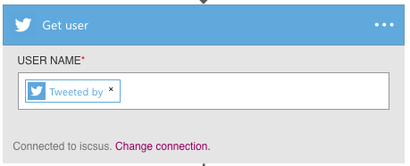

<properties 
	pageTitle="Use Logic App features | Microsoft Azure" 
	description="Learn how to use the advanced features of logic apps." 
	authors="stepsic-microsoft-com" 
	manager="erikre" 
	editor="" 
	services="app-service\logic" 
	documentationCenter=""/>

<tags
	ms.service="logic-apps"
	ms.workload="integration"
	ms.tgt_pltfrm="na"
	ms.devlang="na"
	ms.topic="article"
	ms.date="03/28/2016"
	ms.author="stepsic"/> 
	
# Use Logic Apps features

In the [previous topic](app-service-logic-create-a-logic-app.md), you created your first logic app. Now we will show you how to build a more complete process using App Services Logic Apps. This topic introduces the following new Logic Apps concepts:

- Conditional logic, which executes an action only when a certain condition is met.
- Code view to edit an existing logic app.
- Options for starting a workflow.

Before you complete this topic, you should complete the steps in [Create a new logic app](app-service-logic-create-a-logic-app.md). In the [Azure portal], browse to your logic app and click **Triggers and Actions** in the summary to edit the logic app definition.

## Reference material

You may find the following documents useful:

- [Management and runtime REST APIs](https://msdn.microsoft.com/library/azure/mt643787.aspx) - including how to invoke Logic apps directly
- [Language reference](https://msdn.microsoft.com/library/azure/mt643789.aspx) - a comprehensive list of all supported functions/expressions
- [Trigger and action types](https://msdn.microsoft.com/library/azure/mt643939.aspx) - the different types of actions and the inputs they take
- [Overview of App Service](../app-service/app-service-value-prop-what-is.md) - description of what components to choose when to build a solution

## Adding conditional logic

Although the original flow works, there are some areas that could be improved. 

### Conditional
This logic app may result in you getting a lot of emails. The following steps add logic to make sure that you only receive an email when the tweet comes from someone with a certain number of followers. 

1. Click the plus and find the action *Get User* for Twitter.

2. Pass in the **Tweeted by** field from the trigger to get the information about the Twitter user.

	

3. Click the plus again, but this time select **Add Condition**

4. In the first box, click the **...** underneath **Get User** to find the **Followers count** field.

5. In the dropdown, select **Greater than**

6. In the second box type the number of followers you want users to have.

	

7.  Finally, drag-and-drop the email box into the **If Yes** box. This will mean you'll only get emails when the follower count is met.

## Repeating over a list with forEach

The forEach loop specifies an array to repeat an action over. If it is not an array the flow fails. As an example, if you have action1 that outputs an array of messages, and you want to send each message, you can include this forEach statement in the properties of your action: forEach : "@action('action1').outputs.messages"
 

## Using the code view to edit a Logic App

In addition to the designer, you can directly edit the code that defines a logic app, as follows. 

1. Click on the **Code view** button in the command bar. 

	This opens a full editor that shows the definition you just edited.

	

    By using the text editor, you can copy and paste any number of actions within the same logic app or between logic apps. You can also easily add or remove entire sections from the definition, and you can also share definitions with others.

2. After you make your changes in code view, simply click **Save**. 

### Parameters
There are some capabilities of Logic Apps that can only be used in the code view. One example of these is parameters. Parameters make it easy to re-use values throughout your logic app. For example, if you have an email address that you want use in several actions, you should define it as a parameter.

The following updates your existing logic app to use parameters for the query term.

1. In the code view, locate the `parameters : {}` object and insert the following topic object:

	    "topic" : {
		    "type" : "string",
		    "defaultValue" : "MicrosoftAzure"
	    }
    
2. Scroll to the `twitterconnector` action, locate the query value, and replace it with `#@{parameters('topic')}`.
	You could also use the  **concat** function to join together two or more strings, for example: `@concat('#',parameters('topic'))` is identical to the above. 
 
Parameters are a good way to pull out values that you are likely to change a lot. They are especially useful when you need to override parameters in different environments. For more information on how to override parameters based on environment, see our [REST API documentation](https://msdn.microsoft.com/library/mt643787.aspx).

Now, when you click **Save**, every hour you get any new tweets that have more than 5 retweets delivered to a folder called **tweets** in your Dropbox.

To learn more about Logic App definitions, see [author Logic App definitions](app-service-logic-author-definitions.md).

## Starting a logic app workflow
There are several different options for starting the workflow defined in you logic app. A workflow can always be started on-demand in the [Azure portal].

### Recurrence triggers
A recurrence trigger runs at an interval that you specify. When the trigger has conditional logic, the trigger determines whether or not the workflow needs to run. A trigger indicates it should run by returning a `200` status code. When it does not need to run, it returns a `202` status code.

### Callback using REST APIs
Services can call a logic app endpoint to start a workflow. See [Logic apps as callable endpoints](app-service-logic-connector-http.md) for more information. To start that kind of logic app on-demand, click the **Run now** button on the command bar. 

<!-- Shared links -->
[Azure portal]: https://portal.azure.com 