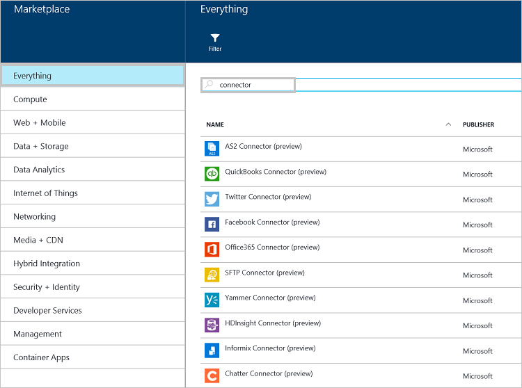

<properties 
	pageTitle="What are Connectors and BizTalk API Apps" 
	description="Learn about API Apps, Connectors and BizTalk API Apps" 
	services="app-service\logic" 
	documentationCenter="" 
	authors="MandiOhlinger" 
	manager="erikre" 
	editor=""/>

<tags 
	ms.service="logic-apps" 
	ms.workload="integration" 
	ms.tgt_pltfrm="na" 
	ms.devlang="na" 
	ms.topic="get-started-article" 
	ms.date="07/28/2016" 
	ms.author="mandia"/>

# What are Connectors and BizTalk API Apps

[AZURE.INCLUDE [app-service-logic-version-message](../../includes/app-service-logic-version-message.md)]

A *Connector* is a type of API App that focuses on connectivity. Connectors, like any other API App, are used from Web Apps, Mobile Apps, and Logic Apps. Connectors make it easy to connect to existing services and help manage authentication, provide monitoring, analytics, and more.

Any developer can create their own API Apps and deploy them privately. In the future, developers can share and monetize their custom-created API Apps through the marketplace. 

To accelerate developers building solutions, the Azure team added a number of connectors to the marketplace to satisfy many common scenarios. Furthermore, to extend the reach to complex and advanced integration scenarios, a number of Premium and BizTalk capabilities are also available.

There are different Service "Tiers" available. All Tiers include all the connectors and API Apps, including their full functionality.  

[App Service Pricing](https://azure.microsoft.com/pricing/details/app-service/) describes these Services Tiers and also lists what is included in these tiers. The following sections describe the various categories of BizTalk API Apps and Connectors.

## Hybrid Connectors 
The hybrid connectors extend the reach further into the enterprise with connectivity to [SAP](app-service-logic-connector-sap.md), [Oracle](app-service-logic-connector-oracle.md), [DB2](app-service-logic-connector-db2.md), [Informix](app-service-logic-connector-informix.md), and WebSphere MQ. 

## EAI and EDI Services
Building business critical apps require more than just connectivity. Based on the foundation of Microsoft's industry leading integration platform - BizTalk Server - the BizTalk API Apps provide advanced integration capabilities that can be snapped into your Web, Mobile and Logic Apps with ease. Some of these integration capabilities include [Validate](app-service-logic-xml-validator.md), [Extract](app-service-logic-xpath-extract.md), [Transform](app-service-logic-transform-xml-documents.md), [Encoders](app-service-logic-connector-jsonencoder.md), [Trading Partner Management](app-service-logic-connector-tpm.md) and support for EDI formats like [X12](app-service-logic-connector-x12.md), [EDIFACT](app-service-logic-connector-edifact.md), and [AS2](app-service-logic-connector-as2.md).

Additional resources:
[Business-to-business connectors and API apps](app-service-logic-b2b-connectors.md)  
[Create a B2B process](app-service-logic-create-a-b2b-process.md)  
[Create a trading partner agreement](app-service-logic-create-a-trading-partner-agreement.md)  
[Track your B2B messages](app-service-logic-track-b2b-messages.md)  

## Rules
Business rules encapsulates the policies and decisions that control business processes. Typically, rules are dynamic and change over time for different reasons, including business plans, regulations, and many other reasons. [BizTalk Rules](app-service-logic-use-biztalk-rules.md) lets you to decouple these policies from your application code and make the change process simpler and faster.

## Connector and API App list
See [Connectors and API Apps List](app-service-logic-connectors-list.md) for a complete list of connectors and API Apps included in each category, including the Standard Connectors, BizTalk EAI, Premium Connectors, and so on.
 
