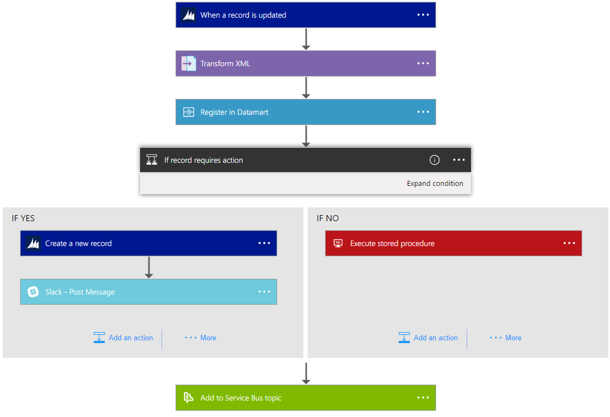

<properties 
	pageTitle="What are Logic Apps?" 
	description="Learn more about App Service Logic Apps" 
	authors="kevinlam1" 
	manager="dwrede" 
	editor="" 
	services="app-service\logic" 
	documentationCenter=""/>

<tags
	ms.service="app-service-logic"
	ms.workload="na"
	ms.tgt_pltfrm="na"
	ms.devlang="na"
	ms.topic="hero-article" 
	ms.date="07/12/2016"
	ms.author="klam"/>

#What are Logic Apps?

| Quick Reference |
| --------------- |
| [Logic Apps Definition Language](https://msdn.microsoft.com/library/azure/mt643789.aspx) |
| [Logic Apps Connector Documentation](../connectors/apis-list.md) |
| [Logic Apps Forum](https://social.msdn.microsoft.com/Forums/en-US/home?forum=azurelogicapps) |

Logic Apps provide a way to simplify and implement complex business processes. It provides a visual designer to model and automate your business process as a series of steps known as a workflow. You can design workflows so that they start from a trigger and are then execute each of your steps. Each step invokes an API, while securely taking care of authentication and best practices, such as checkpointing and durable execution.

The advantages of using Logic Apps include the following:  

- Saving time by designing complex processes using easy to understand design tools
- Implementing tasks easily, that would otherwise be difficult to implement in code
- Getting started quickly from templates
- Customizing your Logic App using APIs
- Connecting disparate systems
- Monetizing your Logic App in the marketplace
- Starting easy and grow as you need

Logic Apps is a fully managed iPaaS (integration Platform as a Service) allowing developers not to have to worry about doing extra work to handle hosting, scalability, availability and management. 

Most importantly, Logic Apps can be combined with built-in [Managed Connectors][managedapis] to help solve even tricky integration scenarios with ease: 

As mentioned, with Logic Apps, you can automate business processes. Here are a couple examples:  
 
* You can automatically replicate new records in your SQL DB and then send mail to the front desk.   
* Automatically find negative tweets and send them to a slack channel.
* When a file is created on an FTP server, parse the file, add new records to Dynamics CRM, and create an item in a SharePoint list. 

Scenarios such as these can be configured all from the visual designer and without writing a single line of code. Get started [building your logic app now][create].

## Why Logic Apps?

If you want to automate any business process (e.g. find negative tweets and post to your internal slack channel or replicate new customer records from SQL, as they arrive, into your CRM system), Logic Apps makes it easy to integrate disparate data sources, from cloud to on-premises. Check out our [managed connectors][managedapis] for more inspiration and [get started][create] now to see what you can do. 

Additionally, with our [Enterprise Integration Account][biztalk] you can scale to mature integration scenarios with the power of a [XML messaging][xml], [trading partner management][tpm], and more.

- **Easy to use design tools** - Logic Apps can be designed end-to-end in the browser. Start with a trigger - from a simple schedule to whenever a tweet appears about your company. Then orchestrate any number of actions using the rich gallery of connectors.

- **Compose SaaS easily** - Even composition tasks that are easy to describe are difficult to implement in code. Logic Apps makes it easy to connect disparate systems. Want to create a task in your CRM software that is based on the activity from your Facebook or Twitter accounts? Want to connect your cloud marketing solution to your on-premises billing system? Logic apps are the fastest, most reliable way to deliver solutions to these problems.

- **Get started quickly from templates** - To help you get started we've provided a [gallery of templates][templates] that allow you to rapidly create some common solutions. From advanced BizTalk solutions to simple SaaS connectivity, and even a few that are just 'for fun' - the gallery is the fastest way to understand the power of Logic Apps.

- **Extensibility baked-in** - Don't see the connector you need? Logic Apps is designed to work with API apps; you can easily create your own API app to use as a custom API. Build a new app just for you, or share and monetize in the marketplace.

- **Real integration horsepower** - Start easy and grow as you need. Logic Apps can easily leverage the power of BizTalk, Microsoft's industry leading integration solution to enable integration professionals to build the solutions they need. Find out more about the [Enterprise Integration Pack](./app-service-logic-enterprise-integration-overview.md).

## Logic App Concepts

The following are some of the key pieces that comprise the Logic Apps experience. 

- **Workflow** - Logic Apps provides a graphical way to model your business processes as a series of steps or a workflow.
- **Managed Connectors** - Your logic apps need access to data and services. Managed connectors are created specifically to aid you when you are connecting to and working with your data. See the list of connectors available now in [managed connectors][managedapis].
- **Triggers** - Some Managed Connectors can also act as a trigger. A trigger starts a new instance of a workflow based on a specific event, like the arrival of an e-mail or a change in your Azure Storage account.
-  **Actions** - Each step after the trigger in a workflow is called an action. Each action typically maps to an operation on your managed connector or custom API apps.
- **Enterprise Integration Pack** - For more advanced integration scenarios, Logic Apps includes capabilities from BizTalk. BizTalk is Microsoft's industry leading integration platform. The Enterprise Integration Pack connectors allow you to easily include validation, transformation, and more in to your Logic App workflows.

## Getting Started  

 - To get started with Logic Apps, follow the [create a Logic App][create] tutorial.  
 - [View common examples and scenarios](app-service-logic-examples-and-scenarios.md)
 - [You can automate business processes with Logic Apps](http://channel9.msdn.com/Events/Build/2016/T694) 
 - [Learn How to Integrate your systems with Logic Apps](http://channel9.msdn.com/Events/Build/2016/P462)
- For more information on Azure App Service platform, see [Azure App Service][appservice].

[biztalk]: app-service-logic-enterprise-integration-accounts.md
[appservice]: ../app-service/app-service-value-prop-what-is.md
[create]: app-service-logic-create-a-logic-app.md
[managedapis]: ../connectors/apis-list.md
[tpm]: app-service-logic-enterprise-integration-accounts.md
[xml]: app-service-logic-enterprise-integration-b2b.md
[templates]: app-service-logic-use-logic-app-templates.md
