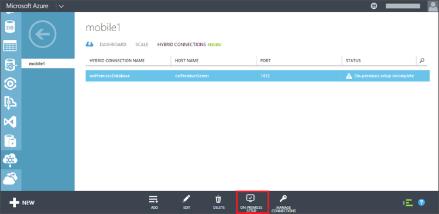

<properties 
	pageTitle="Connect your Azure Mobile App to an on-premises SQL Server using Hybrid Connections" 
	description="Learn how to connect to an on-premises SQL Server from a App Service Mobile App using Hybrid Connections" 
	services="app-service\mobile" 
	documentationCenter="" 
	authors="ggailey777" 
	manager="dwrede" 
	editor=""/>

<tags 
	ms.service="app-service-mobile" 
	ms.workload="mobile" 
	ms.tgt_pltfrm="na" 
	ms.devlang="multiple" 
	ms.topic="article" 
	ms.date="05/24/2015" 
	ms.author="glenga"/>

  
# Connect to an on-premises SQL Server from Mobile Apps using Hybrid Connections 

When your enterprise transitions to the cloud, you might not be able to migrate all of your assets to Azure right away. Hybrid connections lets Azure App Service Mobile Apps securely connect to your on-premises assets, to expose your on-premises data to your mobile clients. Supported assets include any resource that runs on a static TCP port, including Microsoft SQL Server, MySQL, HTTP Web APIs, and most custom web services. Hybrid Connections use Shared Access Signature (SAS) authorization to secure the connections from your Mobile App and the on-premises Hybrid Connection Manager to the Hybrid Connection. For more information, see [Hybrid Connections Overview](integration-hybrid-connection-overview.md).

In this tutorial, you will learn how to modify a Mobile App to use a local on-premises SQL Server database instead of the default Azure SQL Database provisioned with your Mobile App. 

##Prerequisites##
This tutorial requires you to have the following: 

- **An existing Mobile App**  Follow the tutorial [Create a Mobile App] to create and download a new Mobile App from the [Azure Management Portal].

[AZURE.INCLUDE [hybrid-connections-prerequisites](../includes/hybrid-connections-prerequisites.md)]

## Install SQL Server Express, enable TCP/IP, and create a SQL Server database on-premises

[AZURE.INCLUDE [hybrid-connections-create-on-premises-database](../includes/hybrid-connections-create-on-premises-database.md)]

## Create a Hybrid Connection

1. On the on-premises machine, log on to the [Azure Management Portal].

2. At the bottom of the navigation pane, select **+NEW** and then select **App Services**, **BizTalk Service**, and then **Custom Create**

3. Provide a **BizTalk Service Name** and select an **Edition**. 

	This tutorial uses **mobile1**. You will need to supply a unique name for your new BizTalk Service.

4. Once the BizTalk Service has been created, select the **Hybrid Connections** tab, then click **Add**.

	![Add Hybrid Connection][AddHC]

	This creates a new hybrid connection.

5. Provide a **Name** and **Host Name** for your hybrid connection and set **Port** to `1433`. 
  
	![Configure Hybrid Connection][ConfigureHC]

	The host name is the name of the on-premises server. This configures the hybrid connection to access SQL Server running on port 1433. If you are using a named SQL Server instance, instead use the static port you defined earlier.

6. After the new connection is created, the status of the of the new connection shows **On-premises setup incomplete**.

Next, we need to install the Hybrid Connection Manager on the on-premises computer.

## Install the on-premises Hybrid Connection Manager to complete the connection

The Hybrid Connection Manager enables your on-premises machine to connect to Azure and relay TCP traffic. You must  install the manager an on-premises computer, but it doesn't need to be the computer running your SQL Server instance.

1. Select the connection you just created (its **Status** should be **On-premesis setup incomplete**) click **On-premises Setup**.

	

4. Click **Install and Configure**.

	This installs a customized instance of the Connection Manager, which is already pre-configured to work with the hybrid connection you just created.

3. Complete the rest of the setup steps for the Connection Manager.

	After the installation is complete, the hybrid connection status will change to **1 Instance Connected**. You may need to refresh the browser and wait a few minutes. 

The on-premises setup is now complete.

## Modify a Mobile Service to use the hybrid connection

Finally, you must update your mobile service to use the new hybrid connection to store data in the new database in the on-premises server.

### Associate hybrid connection with service

1. In the **Mobile Services** tab of the portal, select an existing .NET backend mobile service, or create a new one. 

	>[AZURE.NOTE]Be sure to either select a service that was created using the .NET Backend or create a new .NET backend mobile service. To learn how to create a new .NET backend mobile service, see [Get started with Mobile Services]. 

2. On the **Configure** tab for your mobile service, find the **Hybrid Connections** section and click **Add Hybrid Connection**.

3. Select your service from **BizTalk Services** and the **Hybrid Connection** you just created, then click **OK**. 

The mobile service is now associated with the new hybrid connection.

### Update the service to use the on-premises connection string
Finally, we need to create an app setting to store the value of the connection string to our on-premises SQL Server. We then need to modify the mobile service to use the new connection string. 

1. On the **Configure** tab in **Connection Strings**, add an new connection string named `OnPremisesDatabase` with a value like `Server=onPremisesServer,1433;Database=OnPremisesDB;User ID=sa;Password={password}`.

	![Connection string for on-premises database][ConnectionString]

	Replace `{password}` with the secure password for your on-premises database.

2. Press **Save** to save the hybrid connection and connection string we just created.

3. In Visual Studio 2013, open the project that defines your .NET-based mobile service. 

	To learn how to download your .NET backend project, see [Get started with Mobile Services](mobile-services-dotnet-backend-windows-store-dotnet-get-started.md) .
 
4. In Solution Explorer, expand the **Models** folder and open the data model file, which ends in *Context.cs*.

6. Modify the **DbContext** instance constructor to make it similar to the following snippet:

        public class hybridService1Context : DbContext
        {
            public hybridService1Context()
                : base("OnPremisesDatabase")
            {
            }
        
            // snipped
        }

	The service will now use the new hybrid connection string defined in Azure.

5. Publish your changes and use a client app connected to your mobile service to invoke some operations to generate database changes. 

6. In SQL Server Management Studio, connect to your SQL Server instance, open the Object Explorer, expand the **OnPremisesDB** database and expand **Tables**. 

9. Right-click the **hybridService1.TodoItems** table and choose **Select Top 1000 Rows** to view the results.

	![SQL Management Studio][SMS]

Note that changes generated in your app have been saved by your mobile service to your on-premises database using the hybrid connection.

##See Also##
 
+ [Hybrid Connections overview](integration-hybrid-connection-overview.md)
+ [BizTalk Services: Dashboard, Monitor, Scale, Configure, and Hybrid Connection tabs](biztalk-dashboard-monitor-scale-tabs.md)

<!-- IMAGES -->
 
[CreateBTS]: ./media/mobile-services-dotnet-backend-hybrid-connections-get-started/1.png
[ConfigureBTS]: ./media/mobile-services-dotnet-backend-hybrid-connections-get-started/2.png
[AddHC]:./media/mobile-services-dotnet-backend-hybrid-connections-get-started/3.png
[ConfigureHC]:./media/mobile-services-dotnet-backend-hybrid-connections-get-started/4.png
[HCCreated]:./media/mobile-services-dotnet-backend-hybrid-connections-get-started/5.png
[InstallHCM]:./media/mobile-services-dotnet-backend-hybrid-connections-get-started/6.png
[HCMSetup]:./media/mobile-services-dotnet-backend-hybrid-connections-get-started/7.png
[HCConnected]:./media/mobile-services-dotnet-backend-hybrid-connections-get-started/8.png
[AssociateHC]:./media/mobile-services-dotnet-backend-hybrid-connections-get-started/9.png
[PickHC]:./media/mobile-services-dotnet-backend-hybrid-connections-get-started/10.png
[ConnectionString]:./media/mobile-services-dotnet-backend-hybrid-connections-get-started/11.png
[SMS]:./media/mobile-services-dotnet-backend-hybrid-connections-get-started/12.png
[DownloadHCM]:./media/mobile-services-dotnet-backend-hybrid-connections-get-started/5-1.png

<!-- Links -->
[Azure Management Portal]: http://go.microsoft.com/fwlink/p/?linkid=213885
[Create a Mobile App]: app-service-mobile-dotnet-backend-xamarin-android-get-started-preview.md