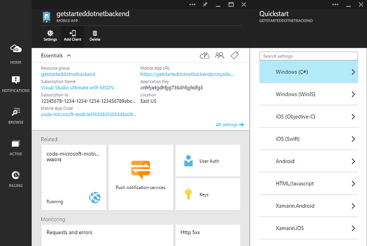

<properties
	pageTitle="Build an app with a mobile and web client"
	description="Build a multi-channel app with both a website and mobile client"
	services="app-service-mobile"
	authors="lindydonna"
	manager="dwrede"
	editor=""/>

<tags
	ms.service="app-service-mobile"
	ms.workload="mobile"
	ms.tgt_pltfrm=""
	ms.devlang="dotnet"
	ms.topic="article"
	ms.date="2/24/2015"
	ms.author="donnam"/>

# Build an app with a mobile and web client

This topic shows you how to create an app with both a mobile and web client. You will create a Mobile App and a Web App and use the same underlying database for both.

First you will create both a new mobile app backend and a simple *To do list* app that stores app data in the new mobile app backend. The mobile app that you will create uses the supported .NET languages using Visual Studio for server-side business logic and to manage the mobile app backend.

Then, you will create a Web App, using the same database as your mobile app. At the end of the tutorial, you will have a web client and a mobile client that work with the same data.

To complete this tutorial, you need the following:

* An active Azure account. If you don't have an account, you can sign up for an Azure trial and get up to 10 free mobile apps that you can keep using even after your trial ends. For details, see [Azure Free Trial](http://www.windowsazure.com/en-us/pricing/free-trial/?WT.mc_id=A0E0E5C02&amp;returnurl=http%3A%2F%2Fazure.microsoft.com%2Fen-us%2Fdocumentation%2Farticles%2Fapp-service-mobile-dotnet-backend-windows-store-dotnet-get-started-preview%2F).
* <a href="https://go.microsoft.com/fwLink/p/?LinkID=257546" target="_blank">Visual Studio Professional 2013</a>.

## Create a new mobile app backend

[AZURE.INCLUDE [app-service-mobile-dotnet-backend-create-new-service-preview](../includes/app-service-mobile-dotnet-backend-create-new-service-preview.md)]

## Create a new mobile client

Once you have created your mobile app backend, you can follow an easy quickstart in the Azure Portal to either create a new app or modify an existing app to connect to your mobile app backend.

In this section you will create a mobile client that is connected to your mobile app backend.

1. In the Azure Portal, click **Mobile App**, and then click the mobile app that you just created.

2. At the top of the blade, click **Add Client** and select a mobile platform, such as Windows, iOS, Xamarin.Android or Xamarin.iOS.

  	

 This displays the three easy steps to create a mobile client app connected to your mobile app backend.

3. Under **Download and run your app and service locally**, click **Download**.

  	This downloads a solution contains projects for both the mobile app backend and for the sample _To do list_ application that is connected to your mobile app backend. Save the compressed project file to your local computer, and make a note of where you save it.

## Publish your mobile app backend

[AZURE.INCLUDE [app-service-mobile-dotnet-backend-publish-service-preview](../includes/app-service-mobile-dotnet-backend-publish-service-preview.md)]

## Create a TodoList website

In this section, you will create a new Web App using a sample application. You will modify the sample to use the same database schema name and the same connection string as the mobile app.

1. In the Azure Portal, create a new Web App, using the same Resource Group as your mobile app.

2. Download the sample project [MultiChannelToDo] and open in Visual Studio. 

3. Edit MultiChannelToDoContext.cs. In `OnModelCreating`, update the schema name to be the same as your mobile app name:

		modelBuilder.HasDefaultSchema("your_mobile_app"); // your service name, replacing dashes with underscore

4. Next we will get the mobile app connection string from the Azure Portal:

	- Select your mobile app in the portal and click the part labeled **User Code**. 

	- In the blade that opens, select **All Settings**, then **Application Settings**. 
	
	- Under **Connection Strings** click **Show Connection Strings**. Copy the value for the setting **MS_TableConnectionString**. This is the connection string used by your mobile app to connect to the SQL Database.

5. In Visual Studio, right click the Web App and select publish. Select Azure Websites as the publish target, and select the Web App you created above. Click **Next** until you get to the **Settings** section of the Publish Web wizard.

6. In the **Databases** section, paste the mobile app connection string as the value for **MultiChannelToDoContext**. Select just the checkbox **Use this connection string at runtime**.

7. Once your Web App has been successfully published, you will see a confirmation page.

## Test the mobile app against the hosted mobile app backend 

Now that the mobile app backend is published and the client is connected to the remote mobile app backend hosted in Azure, we can run the app using Azure for item storage. 

Open the mobile app project in the IDE for your client type (e.g., Visual Studio, Android Studio, Xcode, Xamarin Studio). 

If you created a Windows client, follow the steps below.

[AZURE.INCLUDE [app-service-mobile-windows-universal-test-app-preview](../includes/app-service-mobile-windows-universal-test-app-preview.md)]

## Test the website against the hosted web app backed

Open a web browser and connect to your web app backend. You can change todo items and you will see the same items reflected in the mobile app.

## Next Steps

In this sample we showed how to use the same underlying database for an app that has both a website and a mobile client. Here, we did not have any business logic in the backend that we wanted to reuse across the two clients, so it was sufficient to simply share the same database. In the next tutorial, you will learn how to add business logic to your website backend (using ASP.NET Web API) and reuse that logic in your mobile backend.

<!-- Images -->

[MultiChannelToDo]: https://github.com/Azure/mobile-services-samples/tree/web-mobile/MultiChannelToDo