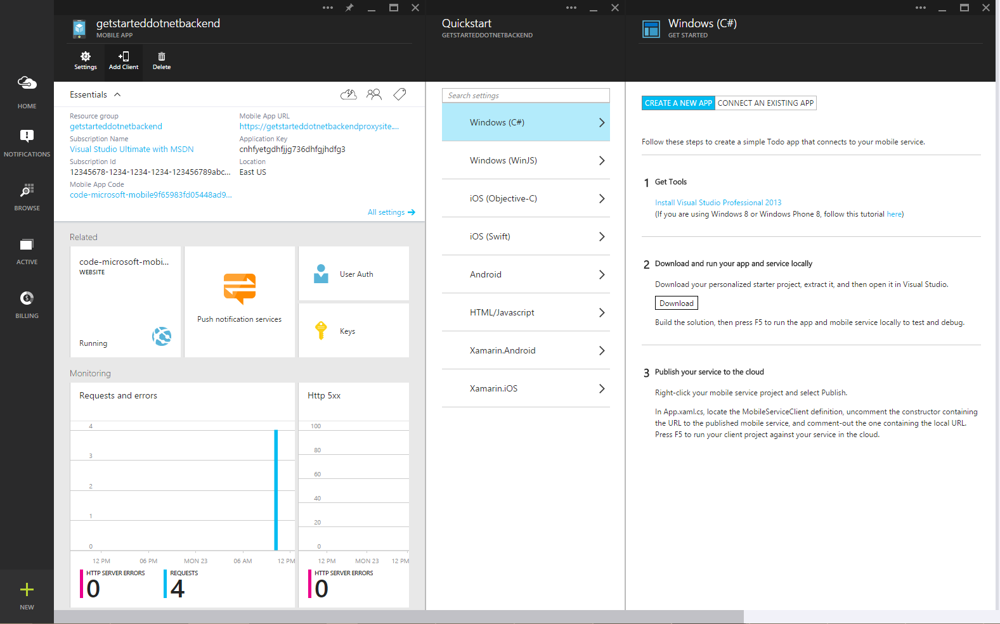

<properties
	pageTitle="Get Started with mobile app backends for Windows Store apps | Mobile Dev Center"
	description="Follow this tutorial to get started using Azure mobile app backends for Windows Store development in C#, VB, or JavaScript."
	services="app-service\mobile"
	documentationCenter="windows"
	authors="christopheranderson"
	manager="dwrede"
	editor=""/>

<tags
	ms.service="app-service-mobile"
	ms.workload="mobile"
	ms.tgt_pltfrm="mobile-windows"
	ms.devlang="dotnet"
	ms.topic="hero-article"
	ms.date="02/24/2015"
	ms.author="chrande"/>

# Create a Windows app

[AZURE.INCLUDE [app-service-mobile-selector-get-started-preview](../includes/app-service-mobile-selector-get-started-preview.md)]

This tutorial shows you how to add a cloud-based backend service to a universal Windows app using an Azure mobile app backend. Universal Windows app solutions include projects for both Windows Store 8.1 and Windows Phone Store 8.1 apps and a common shared project.

[AZURE.INCLUDE [app-service-mobile-windows-universal-get-started-preview](../includes/app-service-mobile-windows-universal-get-started-preview.md)]

To complete this tutorial, you need the following:

* An active Azure account. If you don't have an account, you can sign up for an Azure trial and get up to 10 free mobile apps that you can keep using even after your trial ends. For details, see [Azure Free Trial](http://azure.microsoft.com/pricing/free-trial/).
* <a href="https://go.microsoft.com/fwLink/p/?LinkID=257546" target="_blank">Visual Studio Professional 2013</a>.

>[AZURE.NOTE] If you want to get started with Azure App Service before signing up for an Azure account, go to [Try App Service](http://go.microsoft.com/fwlink/?LinkId=523751&appServiceName=mobile), where you can immediately create a short-lived starter mobile app in App Service. No credit cards required; no commitments.

## Create a new mobile app backend

[AZURE.INCLUDE [app-service-mobile-dotnet-backend-create-new-service-preview](../includes/app-service-mobile-dotnet-backend-create-new-service-preview.md)]

## Create a new universal Windows app

Once you have created your mobile app backend, you can follow an easy quickstart in the Azure Portal to either create a new app or modify an existing app to connect to your mobile app backend.

In this section you will create a new universal Windows app that is connected to your mobile app backend.

1. In the Azure Portal, click **Mobile App**, and then click the mobile app that you just created.

2. At the top of the blade, click **Add Client** and expand **Windows (C#)**.

   

   This displays the three easy steps to create a Windows Store app connected to your mobile app backend.

3. If you haven't already done so, download and install <a href="https://go.microsoft.com/fwLink/p/?LinkID=257546" target="_blank">Visual Studio Professional 2013</a> on your local computer or virtual machine.

4. Under **Download and run your app and service locally**, select a language for your Windows Store app, then click **Download**.

   This downloads a solution contains projects for both the mobile app backend and for the sample _To do list_ application that is connected to your mobile app backend. Save the compressed project file to your local computer, and make a note of where you save it.

## Test the mobile app

[AZURE.INCLUDE [app-service-mobile-dotnet-backend-test-local-service-preview](../includes/app-service-mobile-dotnet-backend-test-local-service-preview.md)]

## Publish your mobile app backend

[AZURE.INCLUDE [app-service-mobile-dotnet-backend-publish-service-preview](../includes/app-service-mobile-dotnet-backend-publish-service-preview.md)]

## Run the Windows app

Now that the mobile app backend is published and the client is connected to the remote mobile app backend hosted in Azure, we can run the app using Azure for item storage.

[AZURE.INCLUDE [app-service-mobile-windows-universal-test-app-preview](../includes/app-service-mobile-windows-universal-test-app-preview.md)]

<!-- Anchors. -->

[Getting started with mobile app backends]:#getting-started
[Create a new mobile app backend]:#create-new-service
[Define the mobile app backend instance]:#define-mobile-app-backend-instance
[Next Steps]:#next-steps

<!-- Images. -->

<!-- URLs. -->
[Get started with authentication]: app-service-mobile-dotnet-backend-windows-store-dotnet-get-started-users-preview.md
[Visual Studio Professional 2013]: https://go.microsoft.com/fwLink/p/?LinkID=257546
[Mobile App SDK]: http://go.microsoft.com/fwlink/?LinkId=257545
[Azure Portal]: https://portal.azure.com/
