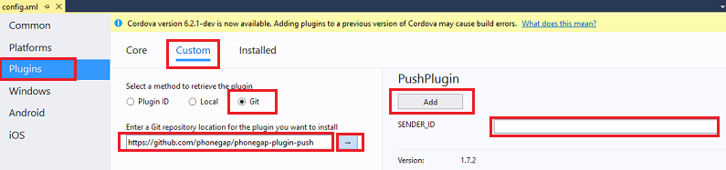

<properties
	pageTitle="Add Push Notifications to Apache Cordova App with Azure Mobile Apps | Azure App Service"
	description="Learn how to use Azure Mobile Apps to send push notifications to your Apache Cordova app."
	services="app-service\mobile"
	documentationCenter="javascript"
	manager="ggailey777"
	editor=""
	authors="adrianhall"/>

<tags
	ms.service="app-service-mobile"
	ms.workload="mobile"
	ms.tgt_pltfrm="mobile-html"
	ms.devlang="javascript"
	ms.topic="article"
	ms.date="05/02/2016"
	ms.author="glenga"/>

# Add push notifications to your Apache Cordova app

[AZURE.INCLUDE [app-service-mobile-selector-get-started-push](../../includes/app-service-mobile-selector-get-started-push.md)]

## Overview

In this tutorial, you add push notifications to the [Apache Cordova quick start] project so that every time a record is inserted, a push notification is sent. This tutorial is based on the [Apache Cordova quick start] tutorial, which you must complete first. If you have an ASP.NET backend and do not use the downloaded quick start server project, you must add the push notification extension package to your project. For more information about server extension packages, see [Work with the .NET backend server SDK for Azure Mobile Apps].

##Prerequisites

This tutorial covers an Apache Cordova application being developed within Visual Studio 2015 and being run on the Google Android Emulator, an Android device, a Windows device, and an iOS device.

To complete this tutorial, you need the following:

* A PC with [Visual Studio Community 2015] or newer.
* [Visual Studio Tools for Apache Cordova].
* An [active Azure account](https://azure.microsoft.com/pricing/free-trial/).
* A completed [Apache Cordova quick start] project.  Completing other tutorials (like [authentication]) can happen first, but is not required.
* (Android) A [Google account] with a verified email address and an Android device.
* (iOS) An Apple Developer Program membership and an iOS device (iOS Simulator does not support push)
* (Windows) A Windows Store Developer Account and a Windows 10 device

Although push notifications are supported on Android Emulators, we have found them to be unstable and do not recommend that you test push notifications on emulators.

##Create a notification hub

[AZURE.INCLUDE [app-service-mobile-create-notification-hub](../../includes/app-service-mobile-create-notification-hub.md)]

[Watch a video showing similar steps](https://channel9.msdn.com/series/Azure-connected-services-with-Cordova/Azure-connected-services-task-3-Create-azure-notification-hub)

##Update the server project to send push notifications

[AZURE.INCLUDE [app-service-mobile-update-server-project-for-push-template](../../includes/app-service-mobile-update-server-project-for-push-template.md)]

##Modify your Cordova app to receive push notifications

You must make sure that your Apache Cordova app project is ready to handle push notifications. You must install the Cordova push plugin, plus any platform-specific push services.

#### Update the Cordova version in your project.

We recommended that you update the client project to Cordova 6.1.1 if your project is configured using an older version. To update the project, right-click config.xml to open the configuration designer. Select the Platforms tab and choose 6.1.1 in the **Cordova CLI** text box.

Choose **Build**, then **Build Solution** to update the project.

#### Install the push plugin

Apache Cordova applications do not natively handle device or network capabilities.  These capabilities are provided
by plugins that are published either on [npm](https://www.npmjs.com/) or on GitHub.  The `phonegap-plugin-push` plugin is used to handle network push notifications.

You can install the push plugin in one of these ways:

**From the command-prompt:**

Execute the following command:

    cordova plugin add phonegap-plugin-push

**From within Visual Studio:**

1.  In Solution Explorer, open the `config.xml` file click **Plugins** > **Custom**, select **Git** as the installation source, then enter `https://github.com/phonegap/phonegap-plugin-push` as the source.

	

2.  Click on the arrow next to the installation source.

3. In **SENDER_ID**, if you already have a numeric project ID for the Google Developer Console project, you can add it here. Otherwise, enter a placeholder value, like 777777, and if you are targeting Android you can update this value in config.xml later.

4. Click **Add**.

The push plugin is now installed.

####Install the device plugin

Follow the same procedure you used to install the push plugin, but you will find the Device plugin in the Core plugins list (click **Plugins** > **Core** to find it). You need this plugin to obtain the platform name (`device.platform`).

#### Register your device for push on start-up

Initially, we will include some minimal code for Android. Later, we will make some small modifications to run on iOS or Windows 10.

1. Add a call to **registerForPushNotifications** during the callback for the login process, or at the bottom of the **onDeviceReady** method:

		// Login to the service.
		client.login('google')
		    .then(function () {
		        // Create a table reference
		        todoItemTable = client.getTable('todoitem');

		        // Refresh the todoItems
		        refreshDisplay();

		        // Wire up the UI Event Handler for the Add Item
		        $('#add-item').submit(addItemHandler);
		        $('#refresh').on('click', refreshDisplay);

				    // Added to register for push notifications.
		        registerForPushNotifications();

		    }, handleError);

	This example shows calling **registerForPushNotifications** after authentication succeeds, which is recommended when using both push notifications and authentication in your app.

2. Add the new **registerForPushNotifications** method as follows:

		// Register for Push Notifications. Requires that phonegap-plugin-push be installed.
		var pushRegistration = null;
		function registerForPushNotifications() {
		  pushRegistration = PushNotification.init({
		      android: { senderID: 'Your_Project_ID' },
		      ios: { alert: 'true', badge: 'true', sound: 'true' },
		      wns: {}
		  });

		// Handle the registration event.
		pushRegistration.on('registration', function (data) {
		  // Get the native platform of the device.
		  var platform = device.platform;
		  // Get the handle returned during registration.
		  var handle = data.registrationId;
		  // Set the device-specific message template.
		  if (platform == 'android' || platform == 'Android') {
		      // Register for GCM notifications.
		      client.push.register('gcm', handle, {
		          mytemplate: { body: { data: { message: "{$(messageParam)}" } } }
		      });
		  } else if (device.platform === 'iOS') {
		      // Register for notifications.            
		      client.push.register('apns', handle, {
		          mytemplate: { body: { aps: { alert: "{$(messageParam)}" } } }
		      });
		  } else if (device.platform === 'windows') {
		      // Register for WNS notifications.
		      client.push.register('wns', handle, {
		          myTemplate: {
		              body: '<toast><visual><binding template="ToastText01"><text id="1">$(messageParam)</text></binding></visual></toast>',
		              headers: { 'X-WNS-Type': 'wns/toast' } }
		      });
		  }
		});

		pushRegistration.on('notification', function (data, d2) {
		  alert('Push Received: ' + data.message);
		});

		pushRegistration.on('error', handleError);
		}

3. (Android) In the above code, replace `Your_Project_ID` with the numeric project ID for your app from the [Google Developer Console].

## (Optional) Configure and run the app on Android

Complete this section to enable push notifications for Android.

####Enable Google Cloud Messaging

Since we are targeting the Google Android platform initially, you must enable Google Cloud Messaging.  Similarly, if you were targeting Microsoft Windows devices, you would enable WNS support.

[AZURE.INCLUDE [mobile-services-enable-google-cloud-messaging](../../includes/mobile-services-enable-google-cloud-messaging.md)]

[Watch a video showing similar steps](https://channel9.msdn.com/series/Azure-connected-services-with-Cordova/Azure-connected-services-task-4-Set-up-gcm-for-push)

####Configure the Mobile App backend to send push requests using GCM

[AZURE.INCLUDE [app-service-mobile-android-configure-push](../../includes/app-service-mobile-android-configure-push.md)]

####Configure your Cordova app for Android

In your Cordova app, open config.xml and replace `Your_Project_ID` with the numeric project ID for your app from the [Google Developer Console].

		<plugin name="phonegap-plugin-push" version="1.7.1" src="https://github.com/phonegap/phonegap-plugin-push.git">
			<variable name="SENDER_ID" value="Your_Project_ID" />
		</plugin>

Open index.js and update the code to use your numeric project ID.

		pushRegistration = PushNotification.init({
			android: { senderID: 'Your_Project_ID' },
			ios: { alert: 'true', badge: 'true', sound: 'true' },
			wns: {}
		});

####Configure your Android device for USB debugging

Before you can deploy your application to your Android Device, you need to enable USB Debugging.  Perform the following steps on your Android phone:

1. Go to **Settings** > **About phone**, then tap the **Build number** until developer mode is enabled (about 7 times).

2. Back in **Settings** > **Developer Options** enable **USB debugging**, then connect your Android phone to your development PC with a USB Cable.

We tested this using a Google Nexus 5X device running Android 6.0 (Marshmallow).  However, the techniques are common across any modern Android release.

#### Install Google Play Services

The push plugin relies on Android Google Play Services for push notifications.  

1.  In **Visual Studio**,  click **Tools** > **Android** > **Android SDK Manager**, expand the **Extras** folder and check the box to make sure that each of the following SDKs is installed.    
    * Android Support Repository version 20 or greater
    * Google Play Services version 27 or greater
    * Google Repository version 22 or greater

2.  Click on **Install Packages** and wait for the installation to complete.

The current required libraries are listed in the [phonegap-plugin-push installation documentation].

#### Test push notifications in the app on Android

You can now test push notifications by running the app and inserting items in the TodoItem table. You can do this from the same device or from a second device, as long as you are using the same backend. Test your Cordova app on the Android platform in one of the following ways:

- **On a physical device:**  
Attach your Android device to your development computer with a USB cable.  Instead of **Google Android Emulator**, select **Device**. Visual Studio will deploy the application to the device and run it.  You can then interact with the application on the device.  
Improve your development experience.  Screen sharing applications such as [Mobizen] can assist you in developing an Android application by projecting your Android screen on to a web browser on your PC.

- **On an an Android emulator:**  
There are additional configuration steps required when running on an emulator.

	Make sure that you are deploying to or debugging on a virtual device that has Google APIs set as the target, as shown below in the Android Virtual Device (AVD) manager.

	

	If you want to use a faster x86 emulator, you [install the the HAXM driver](https://taco.visualstudio.com/en-us/docs/run-app-apache/#HAXM) and configure the emulator use it.

	Add a Google account to the Android device by clicking **Apps** > **Settings** > **Add account**, then follow the prompts to add an existing Google account to the device (we recommend using an existing account rather than creating a new one).

	

	Run the todolist app as before and insert a new todo item. This time, a notification icon is displayed in the notification area. You can open the notification drawer to view the full text of the notification.

	

##(Optional) Configure and run on iOS

This section is for running the Cordova project on iOS devices. You can skip this section if you are not working with iOS devices.

####Install and run the iOS remotebuild agent on a Mac or cloud service

Before you can run a Cordova app on iOS using Visual Studio, go through the steps in the [iOS Setup Guide](http://taco.visualstudio.com/en-us/docs/ios-guide/) to install and run the remotebuild agent.

Make sure you can build the app for iOS. The steps in the setup guide are required to build for iOS from Visual Studio. If you do not have a Mac, you can build for iOS using the remotebuild agent on a service like MacInCloud. For more info, see [Run your iOS app in the cloud](http://taco.visualstudio.com/en-us/docs/build_ios_cloud/).

####Find the ID to use as your App ID

Before you register your app for push notifications, open config.xml in your Cordova app, find the `id` attribute value in the widget element, and copy it for later use. In the following XML, the ID is `io.cordova.myapp7777777`.

		<widget defaultlocale="en-US" id="io.cordova.myapp7777777"
  		version="1.0.0" windows-packageVersion="1.1.0.0" xmlns="http://www.w3.org/ns/widgets"
			xmlns:cdv="http://cordova.apache.org/ns/1.0" xmlns:vs="http://schemas.microsoft.com/appx/2014/htmlapps">

Later, use this identifier when you create an App ID on Apple's developer portal. (If you create a different App ID on the developer portal and want to use that, you will need to take a few extra steps later in this tutorial to change this ID in config.xml. The ID in the widget element must match the App ID on the developer portal.)

####Register the app for push notifications on Apple's developer portal

[AZURE.INCLUDE [Notification Hubs Xamarin Enable Apple Push Notifications](../../includes/notification-hubs-xamarin-enable-apple-push-notifications.md)]

[Watch a video showing similar steps](https://channel9.msdn.com/series/Azure-connected-services-with-Cordova/Azure-connected-services-task-5-Set-up-apns-for-push)

####Configure Azure to send push notifications

1. Log into the [Azure portal](https://portal.azure.com/). Click **Browse** > **Mobile Apps** > your Mobile App > **Settings** > **Push** > **Apple (APNS)** > **Upload Certificate**. Upload the .p12 push certificate file you exported earlier.  Make sure to select **Sandbox** if you created a development push certificate for development and testing.  Otherwise, choose **Production**. Your service is now configured to work with push notifications for iOS.

	

####Verify that your App ID matches your Cordova app

If the App ID you created in your Apple Developer Account already matches the ID of the widget element in config.xml, you can skip this step. However, if the IDs don't match, take the following steps:

1. Delete the platforms folder from your project.

2. Delete the plugins folder from your project.

3. Delete the node_modules folder from your project.

4. Update the id attribute of the widget element in config.xml to use the App ID that you created in your Apple Developer Account.

5. Rebuild your project.

#####Test push notifications in your iOS app

1. In Visual Studio, make sure that **iOS** is selected as the deployment target, and then choose **Device** to run on your connected iOS device.

	You can run on an iOS device connected to your PC using iTunes. The iOS Simulator does not support push notifications.

2. Press the **Run** button or **F5** in Visual Studio to build the project and start the app in an iOS device, then click **OK** to accept push notifications.

	>[AZURE.NOTE] You must explicitly accept push notifications from your app. This request only occurs the first time that the app runs.

3. In the app, type a task, and then click the plus (+) icon.

4. Verify that a notification is received, then click OK to dismiss the notification.

##(Optional) Configure and run on Windows

This section is for running the Apache Cordova app project on Windows 10 devices (the PhoneGap push plugin is supported on Windows 10). You can skip this section if you are not working with Windows devices.

####Register your Windows app for push notifications with WNS

To use the Store options in Visual Studio, select a Windows target from the Solution Platforms list, like **Windows-x64** or **Windows-x86** (avoid **Windows-AnyCPU** for push notifications).

[AZURE.INCLUDE [app-service-mobile-register-wns](../../includes/app-service-mobile-register-wns.md)]

[Watch a video showing similar steps](https://channel9.msdn.com/series/Azure-connected-services-with-Cordova/Azure-connected-services-task-6-Set-up-wns-for-push)

####Configure the notification hub for WNS

[AZURE.INCLUDE [app-service-mobile-configure-wns](../../includes/app-service-mobile-configure-wns.md)]

####Configure your Cordova app to support Windows push notifications

Open the configuration designer (right-click on config.xml and select **View Designer**), select the **Windows** tab, and choose **Windows 10** under **Windows Target Version**.

	>[AZURE.NOTE] If you are using a Cordova version prior to Cordova 5.1.1 (6.1.1 recommended), you must also set the Toast Capable flag to true in config.xml.

To support push notifications in your default (debug) builds, open build.json file. Copy the "release" configuration to your debug configuration.

		"windows": {
			"release": {
				"packageCertificateKeyFile": "res\\native\\windows\\CordovaApp.pfx",
				"publisherId": "CN=yourpublisherID"
			}
		}

After the update, the preceding code should look like this.

	"windows": {
		"release": {
			"packageCertificateKeyFile": "res\\native\\windows\\CordovaApp.pfx",
			"publisherId": "CN=yourpublisherID"
			},
		"debug": {
			"packageCertificateKeyFile": "res\\native\\windows\\CordovaApp.pfx",
			"publisherId": "CN=yourpublisherID"
			}
		}

Build the app and verify that you have no errors. You client app should now register for the notifications from the Mobile App backend. Repeat this section for every Windows project in your solution.

####Test push notifications in your Windows app

In Visual Studio, make sure that a Windows platform is selected as the deployment target, such as **Windows-x64** or **Windows-x86**. To run the app on a Windows 10 PC hosting Visual Studio, choose **Local Machine**.

Press the Run button to build the project and start the app.

In the app, type a name for a new todoitem, and then click the plus (+) icon to add it.

Verify that a notification is received when the item is added.

##Next Steps

* Read about [Notification Hubs] to learn about push notifications.
* If you have not already done so, continue the tutorial by [Adding Authentication] to your Apache Cordova app.

Learn how to use the SDKs.

* [Apache Cordova SDK]
* [ASP.NET Server SDK]
* [Node.js Server SDK]

<!-- URLs -->
[Adding Authentication]: app-service-mobile-cordova-get-started-users.md
[Apache Cordova quick start]: app-service-mobile-cordova-get-started.md
[authentication]: app-service-mobile-cordova-get-started-users.md
[Work with the .NET backend server SDK for Azure Mobile Apps]: app-service-mobile-dotnet-backend-how-to-use-server-sdk.md
[Google account]: http://go.microsoft.com/fwlink/p/?LinkId=268302
[Google Developer Console]: https://console.developers.google.com/home/dashboard
[phonegap-plugin-push installation documentation]: https://github.com/phonegap/phonegap-plugin-push/blob/master/docs/INSTALLATION.md
[Mobizen]: https://www.mobizen.com/
[Visual Studio Community 2015]: http://www.visualstudio.com/
[Visual Studio Tools for Apache Cordova]: https://www.visualstudio.com/en-us/features/cordova-vs.aspx
[Notification Hubs]: ../notification-hubs/notification-hubs-overview.md
[Apache Cordova SDK]: app-service-mobile-cordova-how-to-use-client-library.md
[ASP.NET Server SDK]: app-service-mobile-dotnet-backend-how-to-use-server-sdk.md
[Node.js Server SDK]: app-service-mobile-node-backend-how-to-use-server-sdk.md
