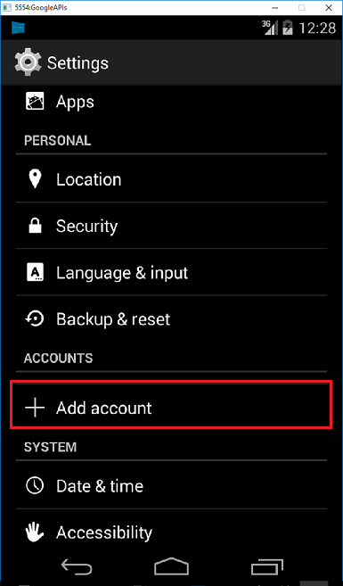

# Add push notifications to your Apache Cordova app

[!INCLUDE [app-service-mobile-selector-get-started-push](../../includes/app-service-mobile-selector-get-started-push.md)]

## Overview

In this tutorial, you add push notifications to the [Apache Cordova quickstart][5] project so that a push
notification is sent to the device every time a record is inserted.

If you do not use the downloaded quickstart server project, you need the push notification extension
package. For more information, see [Work with the .NET back-end server SDK for Mobile Apps][1].

## <a name="prerequisites"></a>Prerequisites

This tutorial assumes that you have an Apache Cordova application that was developed with Visual Studio 2015. This device should run on Google Android Emulator, an Android device, a Windows device, or an iOS device.

To complete this tutorial, you need:

* A PC with [Visual Studio Community 2015][2] or later
* [Visual Studio Tools for Apache Cordova][4]
* An [active Azure account][3]
* A completed [Apache Cordova quickstart][5] project
* (Android) A [Google account][6] with a verified email address
* (iOS) An [Apple Developer Program membership][7] and an iOS device (iOS Simulator does not support push notifications)
* (Windows) A [Microsoft Store Developer Account][8] and a Windows 10 device

## <a name="configure-hub"></a>Configure a notification hub

[!INCLUDE [app-service-mobile-configure-notification-hub](../../includes/app-service-mobile-configure-notification-hub.md)]

[Watch a video showing steps in this section][9].

## Update the server project

[!INCLUDE [app-service-mobile-update-server-project-for-push-template](../../includes/app-service-mobile-update-server-project-for-push-template.md)]

## <a name="add-push-to-app"></a>Modify your Cordova app

To ensure that your Apache Cordova app project is ready to handle push notifications, install the Cordova push plugin plus any platform-specific push services.

#### Update the Cordova version in your project.

If your project uses a version of Apache Cordova that's earlier than version 6.1.1, update the client project. To update
the project, take the following steps:

* To open the configuration designer, right-click `config.xml`.
* Select the **Platforms** tab.
* In the **Cordova CLI** text box, select **6.1.1**. 
* To update the project, select **Build**, and then select **Build Solution**.

#### Install the push plugin

Apache Cordova applications do not natively handle device or network capabilities.  These capabilities
are provided by plugins that are published either on [npm][10] or on GitHub. The `phonegap-plugin-push`
plugin handles network push notifications.

You can install the push plugin in one of the following ways:

**From the command-prompt:**

Run the following command:

    cordova plugin add phonegap-plugin-push

**From within Visual Studio:**

1. In Solution Explorer, open the `config.xml` file. Next, select **Plugins** > **Custom**. Then select **Git** as the installation source.

2. Enter `https://github.com/phonegap/phonegap-plugin-push` as the source.

    ![Open the config.xml file in Solution Explorer][img1]

3. Select the arrow next to the installation source.

4. In **SENDER_ID**, if you already have a numeric project ID for the Google Developer Console project, you can
    add it here. Otherwise, enter a placeholder value, such as 777777. If you are targeting Android, you can update
    this value in the config.xml file later.

    >[!NOTE]
    >As of version 2.0.0, google-services.json needs to be installed in the root folder of your project to configure the sender ID. For more information, see the [installation documentation.](https://github.com/phonegap/phonegap-plugin-push/blob/master/docs/INSTALLATION.md)

5. Select **Add**.

The push plugin is now installed.

#### Install the device plugin

Follow the same procedure you used to install the push plugin. Add the Device plugin from the Core
plugins list. (To find it, select **Plugins** > **Core**.) You need this plugin to obtain the platform
name.

#### Register your device when the application starts 

Initially, we include some minimal code for Android. Later you can modify the app to run on iOS or Windows 10.

1. Add a call to **registerForPushNotifications** during the callback for the sign-in process. Alternatively, you can add it at the bottom of the **onDeviceReady** method:

    ```javascript
    // Log in to the service.
    client.login('google')
        .then(function () {
            // Create a table reference.
            todoItemTable = client.getTable('todoitem');

            // Refresh the todoItems.
            refreshDisplay();

            // Wire up the UI Event Handler for the Add Item.
            $('#add-item').submit(addItemHandler);
            $('#refresh').on('click', refreshDisplay);

                // Added to register for push notifications.
            registerForPushNotifications();

        }, handleError);
    ```

    This example shows calling **registerForPushNotifications** after authentication succeeds. You can
    call `registerForPushNotifications()` as often as is required.

2. Add the new **registerForPushNotifications** method as follows:

    ```javascript
    // Register for push notifications. Requires that phonegap-plugin-push be installed.
    var pushRegistration = null;
    function registerForPushNotifications() {
        pushRegistration = PushNotification.init({
            android: { senderID: 'Your_Project_ID' },
            ios: { alert: 'true', badge: 'true', sound: 'true' },
            wns: {}
        });

    // Handle the registration event.
    pushRegistration.on('registration', function (data) {
        // Get the native platform of the device.
        var platform = device.platform;
        // Get the handle returned during registration.
        var handle = data.registrationId;
        // Set the device-specific message template.
        if (platform == 'android' || platform == 'Android') {
            // Register for GCM notifications.
            client.push.register('gcm', handle, {
                mytemplate: { body: { data: { message: "{$(messageParam)}" } } }
            });
        } else if (device.platform === 'iOS') {
            // Register for notifications.
            client.push.register('apns', handle, {
                mytemplate: { body: { aps: { alert: "{$(messageParam)}" } } }
            });
        } else if (device.platform === 'windows') {
            // Register for WNS notifications.
            client.push.register('wns', handle, {
                myTemplate: {
                    body: '<toast><visual><binding template="ToastText01"><text id="1">$(messageParam)</text></binding></visual></toast>',
                    headers: { 'X-WNS-Type': 'wns/toast' } }
            });
        }
    });

    pushRegistration.on('notification', function (data, d2) {
        alert('Push Received: ' + data.message);
    });

    pushRegistration.on('error', handleError);
    }
    ```
3. (Android) In the preceding code, replace `Your_Project_ID` with the numeric project ID for your app from the
    [Google Developer Console][18].

## (Optional) Configure and run the app on Android

Complete this section to enable push notifications for Android.

#### <a name="enable-gcm"></a>Enable Firebase Cloud Messaging

Since you are targeting the Google Android platform initially, you must enable Firebase Cloud Messaging.

[!INCLUDE [notification-hubs-enable-firebase-cloud-messaging](../../includes/notification-hubs-enable-firebase-cloud-messaging.md)]

#### <a name="configure-backend"></a>Configure the Mobile App back end to send push requests using FCM

[!INCLUDE [app-service-mobile-android-configure-push](../../includes/app-service-mobile-android-configure-push.md)]

#### Configure your Cordova app for Android

In your Cordova app, open **config.xml**. Then replace `Your_Project_ID` with the numeric project ID for your app from
the [Google Developer Console][18].

```xml
<plugin name="phonegap-plugin-push" version="1.7.1" src="https://github.com/phonegap/phonegap-plugin-push.git">
    <variable name="SENDER_ID" value="Your_Project_ID" />
</plugin>
```

Open **index.js**. Then update the code to use your numeric project ID.

```javascript
pushRegistration = PushNotification.init({
    android: { senderID: 'Your_Project_ID' },
    ios: { alert: 'true', badge: 'true', sound: 'true' },
    wns: {}
});
```

#### <a name="configure-device"></a>Configure your Android device for USB debugging

Before you can deploy your application to your Android Device, you need to enable USB debugging. Take the
following steps on your Android phone:

1. Go to **Settings** > **About phone**. Then tap the **Build number** until developer mode is enabled
    (about seven times).
2. Back in **Settings** > **Developer Options**, enable **USB debugging**. Then connect your Android phone
    to your development PC with a USB cable.

We tested this using a Google Nexus 5X device running Android 6.0 (Marshmallow). However, the techniques are
common across any modern Android release.

#### Install Google Play Services

The push plugin relies on Android Google Play Services for push notifications.

1. In Visual Studio, select **Tools** > **Android** > **Android SDK Manager**. Then expand the **Extras** folder. Check the appropriate boxes to ensure that each of the following SDKs is installed:

   * Android 2.3 or higher
   * Google Repository revision 27 or higher
   * Google Play Services 9.0.2 or higher

2. Select **Install Packages**. Then wait for the installation to finish.

The current required libraries are listed in the [phonegap-plugin-push installation documentation][19].

#### Test push notifications in the app on Android

You can now test push notifications by running the app and inserting items in the TodoItem table. You can test
from the same device or from a second device, as long as you are using the same back end. Test your Cordova
app on the Android platform in one of the following ways:

* *On a physical device:* Attach your Android device to your development computer with a USB cable.  Instead of **Google Android Emulator**, select **Device**. Visual Studio deploys the application to the device and runs the application. You can then
 interact with the application on the device.

  Screen-sharing applications such as [Mobizen][20] can assist you in developing Android applications. Mobizen projects your Android screen to a web browser on your PC.

* *On an Android emulator:* There are additional configuration steps that are required when you're using an emulator.

    Make sure you are deploying to a virtual device that has Google APIs set as the target, as shown in the Android Virtual Device (AVD) manager.

    

    If you want to use a faster x86 emulator, [install the HAXM driver][11], and then configure the emulator to use it.

    Add a Google account to the Android device by selecting **Apps** > **Settings** > **Add account**. Then follow the prompts.

    

    Run the todolist app as before and insert a new todo item. This time, a notification icon is displayed in the notification area. You can open the notification drawer to view the full text of the notification.

    

## (Optional) Configure and run on iOS

This section is for running the Cordova project on iOS devices. If you aren't working with iOS devices, you
can skip this section.

#### Install and run the iOS remote build agent on a Mac or cloud service

Before you can run a Cordova app on iOS using Visual Studio, go through the steps in the [iOS setup guide][12]
to install and run the remote build agent.

Make sure you can build the app for iOS. The steps in the setup guide are required for building the app for iOS from Visual
Studio. If you do not have a Mac, you can build for iOS by using the remote build agent on a service like
MacInCloud. For more information, see [Run your iOS app in the cloud][21].

> [!NOTE]
> Xcode 7 or greater is required to use the push plugin on iOS.

#### Find the ID to use as your App ID

Before you register your app for push notifications, open config.xml in your Cordova app, find the `id`
attribute value in the widget element, and then copy it for later use. In the following XML, the ID is
`io.cordova.myapp7777777`.

```xml
<widget defaultlocale="en-US" id="io.cordova.myapp7777777"
    version="1.0.0" windows-packageVersion="1.1.0.0" xmlns="http://www.w3.org/ns/widgets"
    xmlns:cdv="http://cordova.apache.org/ns/1.0" xmlns:vs="http://schemas.microsoft.com/appx/2014/htmlapps">
```

Later, use this identifier when you create an App ID on Apple's developer portal. If you create a different
App ID on the developer portal, you must take a few extra steps later in this tutorial. The ID in the
widget element must match the App ID on the developer portal.

#### Register the app for push notifications on Apple's developer portal

[!INCLUDE [Enable Apple Push Notifications](../../includes/enable-apple-push-notifications.md)]

[Watch a video showing similar steps](https://channel9.msdn.com/series/Azure-connected-services-with-Cordova/Azure-connected-services-task-5-Set-up-apns-for-push)

#### Configure Azure to send push notifications

[!INCLUDE [app-service-mobile-apns-configure-push](../../includes/app-service-mobile-apns-configure-push.md)]

#### Verify that your App ID matches your Cordova app

If the App ID that you created in your Apple Developer Account already matches the ID of the widget element in
the config.xml file, you can skip this step. However, if the IDs don't match, take the following steps:

1. Delete the platforms folder from your project.
2. Delete the plugins folder from your project.
3. Delete the node_modules folder from your project.
4. Update the id attribute of the widget element in the config.xml file to use the app ID that you created in your
    Apple developer account.
5. Rebuild your project.

##### Test push notifications in your iOS app

1. In Visual Studio, make sure that **iOS** is selected as the deployment target. Then select **Device**
    to run the push notifications on your connected iOS device.

    You can run the push notifications on an iOS device that's connected to your PC with iTunes. The iOS Simulator does not support push
    notifications.

2. Select the **Run** button or **F5** in Visual Studio to build the project and start the app in an iOS
    device. Then select **OK** to accept push notifications.

   > [!NOTE]
   > The app requests confirmation for push notifications during the first run.

3. In the app, type a task, and then select the plus **(+)** icon.
4. Verify that a notification was received. Then select **OK** to dismiss the notification.

## (Optional) Configure and run on Windows

This section describes how to run the Apache Cordova app project on Windows 10 devices (the PhoneGap push plugin is
supported on Windows 10). If you are not working with Windows devices, you can skip this section.

#### Register your Windows app for push notifications with WNS

To use the Store options in Visual Studio, select a Windows target from the Solution Platforms list, such as
**Windows-x64** or **Windows-x86**. (Avoid **Windows-AnyCPU** for push notifications.)

[!INCLUDE [app-service-mobile-register-wns](../../includes/app-service-mobile-register-wns.md)]

[Watch a video showing similar steps][13]

#### Configure the notification hub for WNS

[!INCLUDE [app-service-mobile-configure-wns](../../includes/app-service-mobile-configure-wns.md)]

#### Configure your Cordova app to support Windows push notifications

Open the configuration designer by right-clicking **config.xml**. Then select **View Designer**. Next, select the **Windows**
tab, and then select **Windows 10** under **Windows Target Version**.

To support push notifications in your default (debug) builds, open the **build.json** file. Then copy the
"release" configuration to your debug configuration.

```json
"windows": {
    "release": {
        "packageCertificateKeyFile": "res\\native\\windows\\CordovaApp.pfx",
        "publisherId": "CN=yourpublisherID"
    }
}
```

After the update, the **build.json** file should contain the following code:

```json
"windows": {
    "release": {
        "packageCertificateKeyFile": "res\\native\\windows\\CordovaApp.pfx",
        "publisherId": "CN=yourpublisherID"
        },
    "debug": {
        "packageCertificateKeyFile": "res\\native\\windows\\CordovaApp.pfx",
        "publisherId": "CN=yourpublisherID"
        }
    }
```

Build the app and verify that you have no errors. Your client app should now register for the notifications
from the Mobile Apps back end. Repeat this section for every Windows project in your solution.

#### Test push notifications in your Windows app

In Visual Studio, make sure that a Windows platform is selected as the deployment target, such as
**Windows-x64** or **Windows-x86**. To run the app on a Windows 10 PC that's hosting Visual Studio, choose
**Local Machine**.

1. Select the **Run** button to build the project and start the app.

2. In the app, type a name for a new todoitem, and then select the plus **(+)** icon to add it.

Verify that a notification is received when the item is added.

## <a name="next-steps"></a>Next steps

* Read about [Notification Hubs][17] to learn about push notifications.
* If you have not already done so, continue the tutorial by [adding authentication][14] to your Apache Cordova app.

Learn how to use the following SDKs:

* [Apache Cordova SDK][15]
* [ASP.NET Server SDK][1]
* [Node.js Server SDK][16]

<!-- Images -->
[img1]: ./media/app-service-mobile-cordova-get-started-push/add-push-plugin.png

<!-- URLs -->
[1]: app-service-mobile-dotnet-backend-how-to-use-server-sdk.md
[2]: http://www.visualstudio.com/
[3]: https://azure.microsoft.com/pricing/free-trial/
[4]: https://www.visualstudio.com/en-us/features/cordova-vs.aspx
[5]: app-service-mobile-cordova-get-started.md
[6]: http://go.microsoft.com/fwlink/p/?LinkId=268302
[7]: https://developer.apple.com/programs/
[8]: https://developer.microsoft.com/en-us/store/register
[9]: https://channel9.msdn.com/series/Azure-connected-services-with-Cordova/Azure-connected-services-task-3-Create-azure-notification-hub
[10]: https://www.npmjs.com/
[11]: https://taco.visualstudio.com/en-us/docs/run-app-apache/#HAXM
[12]: http://taco.visualstudio.com/en-us/docs/ios-guide/
[13]: https://channel9.msdn.com/series/Azure-connected-services-with-Cordova/Azure-connected-services-task-6-Set-up-wns-for-push
[14]: app-service-mobile-cordova-get-started-users.md
[15]: app-service-mobile-cordova-how-to-use-client-library.md
[16]: app-service-mobile-node-backend-how-to-use-server-sdk.md
[17]: ../notification-hubs/notification-hubs-push-notification-overview.md
[18]: https://console.developers.google.com/home/dashboard
[19]: https://github.com/phonegap/phonegap-plugin-push/blob/master/docs/INSTALLATION.md
[20]: https://www.mobizen.com/
[21]: http://taco.visualstudio.com/en-us/docs/build_ios_cloud/
