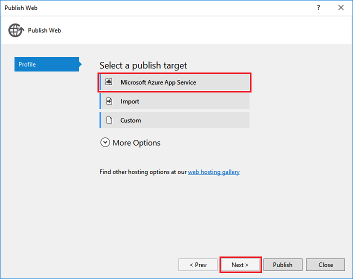
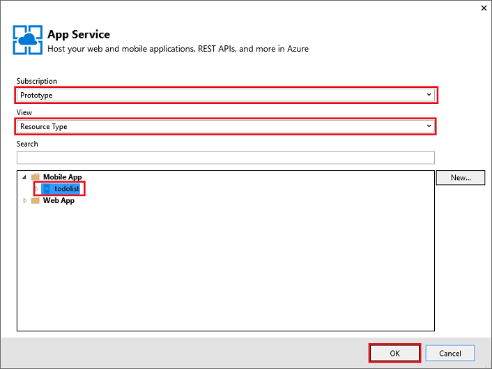
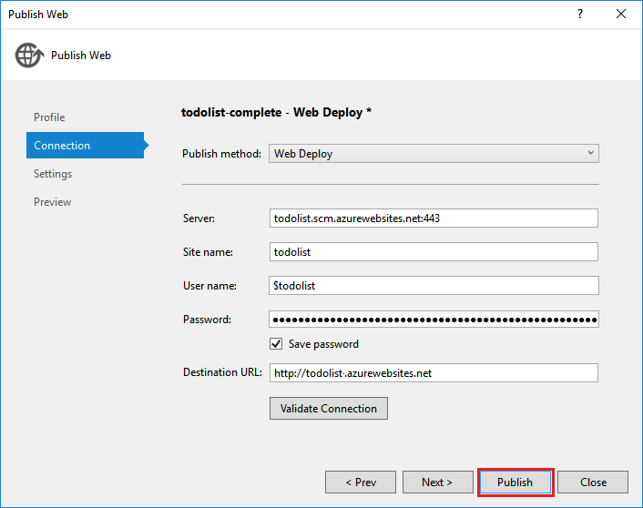

<properties
	pageTitle="How to work with the .NET backend server SDK for Mobile Apps | Azure App Service"
	description="Learn how to work with the .NET backend server SDK for Azure App Service Mobile Apps."
	keywords="app service, azure app service, mobile app, mobile service, scale, scalable, app deployment, azure app deployment"
	services="app-service\mobile"
	documentationCenter=""
	authors="ggailey777"
	manager="erikre"
	editor=""/>

<tags
	ms.service="app-service-mobile"
	ms.workload="mobile"
	ms.tgt_pltfrm="mobile-multiple"
	ms.devlang="dotnet"
	ms.topic="article"
	ms.date="08/02/2016"
	ms.author="glenga"/>

# Work with the .NET backend server SDK for Azure Mobile Apps

[AZURE.INCLUDE [app-service-mobile-selector-server-sdk](../../includes/app-service-mobile-selector-server-sdk.md)]

This topic shows you how to use the .NET backend server SDK in key Azure App Service Mobile Apps scenarios. The Azure Mobile Apps SDK helps you work with mobile clients from your ASP.NET application.

>[AZURE.TIP] The [.NET server SDK for Azure Mobile Apps](https://github.com/Azure/azure-mobile-apps-net-server) is open source on GitHub. The repository contains the entire server SDK unit test suite as well as some sample projects.

## Reference documentation

The reference documentation for the server SDK is located here: [Azure Mobile Apps .NET Reference](https://msdn.microsoft.com/library/azure/dn961176.aspx).

## How to: Create a .NET Mobile App backend

If you are starting a new project, you can create an App Service application using either the [Azure portal] or Visual Studio. This section will help you use one of these to create a new mobile application backend which hosts a simple todo list API. You can run this locally or publish the project to your cloud-based App Service mobile app.

If you are adding mobile capabilities to an existing project, see the [Download and initialize the SDK](#install-sdk) section below.

### Create a .NET backend using the Azure portal

You can create a new Mobile App backend right in the [Azure portal]. 

You can either follow the steps below, or create a new client and server together by following the [Create a mobile app](app-service-mobile-ios-get-started.md) tutorial. The tutorial contains a simplified version of these instructions and is best for proof of concept projects; the tutorial can create only a Node.js backend.

[AZURE.INCLUDE [app-service-mobile-dotnet-backend-create-new-service-classic](../../includes/app-service-mobile-dotnet-backend-create-new-service-classic.md)]

Back in the _Get started_ blade, under **Create a table API**, choose **C#** as your **Backend language**. Click **Download**, extract the compressed project files to your local computer, and open the solution in Visual Studio.

### Create a .NET backend using Visual Studio 2013 and Visual Studio 2015

In order to create a Mobile Apps project in Visual Studio, you will need to install the [Azure SDK for .NET](https://azure.microsoft.com/downloads/), version 2.8.1 or later. Once you have installed the SDK, create a new ASP.NET application:

1. Open the **New Project** dialog (from *File* > **New** > **Project...**).

2. Expand **Templates** > **Visual C#**, and select **Web**.

3. Select **ASP.NET Web Application**.

4. Fill in the project name. Then click **OK**.

5. Under _ASP.NET 4.5.2 Templates_, select **Azure Mobile App**. Check **Host in the cloud** to create a new mobile app in the cloud to which you can publish this project.

6. Click **OK**. Your application will be created and appear in the Solution Explorer.

## How to: Download and initialize the SDK

The SDK is available on [NuGet.org]. This package includes the base functionality required to get started using the SDK. To initialize the SDK, you need to perform actions on the **HttpConfiguration** object.

###Install the SDK

To install the SDK, right-click on the server project in Visual Studio, select **Manage NuGet Packages**, search for the [Microsoft.Azure.Mobile.Server](http://www.nuget.org/packages/Microsoft.Azure.Mobile.Server/) package, then click **Install**.

### Initialize the server project

A .NET backend server project is initialized similar to other ASP.NET projects, by including an OWIN startup class. Ensure that you have referenced the NuGet package `Microsoft.Owin.Host.SystemWeb`. To add this class in Visual Studio, right-click on your server project and select **Add** > **New Item**, then **Web** > **General** > **OWIN Startup class**.

This will generate a class with the following attribute:

    [assembly: OwinStartup(typeof(YourServiceName.YourStartupClassName))]

In the `Configuration()` method of your OWIN startup class, set up the server project using an **HttpConfiguration** object which represents the configuration options for the service. The following example initialize the server project, with no added features:

	// in OWIN startup class
	public void Configuration(IAppBuilder app)
	{
	    HttpConfiguration config = new HttpConfiguration();

	    new MobileAppConfiguration()
	        // no added features
	        .ApplyTo(config);

	    app.UseWebApi(config);
	}

To enable individual features, you must call extension methods on the **MobileAppConfiguration** object before calling **ApplyTo**. For example, the following code adds the default routes to all API controllers that have the attribute `[MobileAppController]` during initialization:

	new MobileAppConfiguration()
	    .MapApiControllers()
	    .ApplyTo(config);

Note that `MapApiControllers` only maps controllers with the attribute `[MobileAppController]`. To map other controllers, use the [MapHttpAttributeRoutes] method. 

Many of the feature extension methods are available via additional NuGet packages you can include, which are described in the section below.

The server quickstart from the Azure portal calls **UseDefaultConfiguration()**. This equivalent to the following setup:

		new MobileAppConfiguration()
			.AddMobileAppHomeController()             // from the Home package
			.MapApiControllers()
			.AddTables(                               // from the Tables package
				new MobileAppTableConfiguration()
					.MapTableControllers()
					.AddEntityFramework()             // from the Entity package
				)
			.AddPushNotifications()                   // from the Notifications package
			.MapLegacyCrossDomainController()         // from the CrossDomain package
			.ApplyTo(config);

### SDK extensions

The following NuGet-based extension packages provide various mobile features that can be used by your application. You enable extensions during initialization by using the **MobileAppConfiguration** object.

- [Microsoft.Azure.Mobile.Server.Quickstart]
	 Supports the basic Mobile Apps setup. Added to the configuration by calling the **UseDefaultConfiguration** extension method during initialization. This extension includes following extensions: Notifications, Authentication, Entity, Tables, Crossdomain and Home packages. This is equivalent to the quickstart server project that you download from the Azure portal.

- [Microsoft.Azure.Mobile.Server.Home](http://www.nuget.org/packages/Microsoft.Azure.Mobile.Server.Home/)
	Implements the default *this mobile app is up and running page* for the web site root. Add to the configuration by calling the **AddMobileAppHomeController** extension method.

- [Microsoft.Azure.Mobile.Server.Tables](http://www.nuget.org/packages/Microsoft.Azure.Mobile.Server.Tables/)
	includes classes for working with data and sets-up the data pipeline. Add to the configuration by calling the **AddTables** extension method.

- [Microsoft.Azure.Mobile.Server.Entity](http://www.nuget.org/packages/Microsoft.Azure.Mobile.Server.Entity/)
	Enables the Entity Framework to access data in the SQL Database. Add to the configuration by calling the **AddTablesWithEntityFramework** extension method.

- [Microsoft.Azure.Mobile.Server.Authentication]
	Enables authentication and sets-up the OWIN middleware used to validate tokens. Add to the configuration by calling the **AddAppServiceAuthentication** and **IAppBuilder**.**UseAppServiceAuthentication** extension methods.

- [Microsoft.Azure.Mobile.Server.Notifications]
	Enables push notifications and defines a push registration endpoint. Add to the configuration by calling the **AddPushNotifications** extension method.

- [Microsoft.Azure.Mobile.Server.CrossDomain](http://www.nuget.org/packages/Microsoft.Azure.Mobile.Server.CrossDomain/)
	Creates a controller that serves data to legacy web browsers from your Mobile App. Add to the configuration by calling the **MapLegacyCrossDomainController** extension method.

- [Microsoft.Azure.Mobile.Server.Login]
	 Provides support for custom authentication via the AppServiceLoginHandler.CreateToken() method. This is a static method and does not need to be enabled in the configuration.

## How to: Publish the server project

This section shows you how to publish your .NET backend project from Visual Studio. You can also deploy your backend project using Git or any of the other methods covered in the [Azure App Service deployment documentation](../app-service-web/web-sites-deploy.md).

1. In Visual Studio, rebuild the project to restore NuGet packages.

2. In Solution Explorer, right-click the project, click **Publish**. The first time you publish, you will need to define a publishing profile. When you already have a profile defined, you can just select it and click **Publish**.

2. If asked to select a publish target, click **Microsoft Azure App Service** > **Next**, then (if needed) sign-in with your Azure credentials. Visual Studio downloads and securely stores your publish settings directly from Azure.

	

3. Choose your **Subscription**, select **Resource Type** from **View**, expand **Mobile App** and click your Mobile App backend, then click **OK**.

	

4. Verify the publish profile information and click **Publish**.

	

	When your Mobile App backend has published successfully, you will see a landing page indicating success.

	

## How to: Define a table controller

A table controller provides access to entity data in a table-based data store, such as SQL Database or Azure Table storage. Table controllers inherit from the **TableController** generic class, where the generic type is an entity in the model that represents the table schema, as follows:

	public class TodoItemController : TableController<TodoItem>
    {
		//...
	}

Table controllers are initialized by using the **AddTables** extension method. This adds routes under `/tables/` for all subclasses of `TableController`.

The following example initializes a table controller that uses Entity Framework for data access:

    new MobileAppConfiguration().AddTables(
        new MobileAppTableConfiguration()
        .MapTableControllers()
        .AddEntityFramework()).ApplyTo(config);

For an example of a table controller that uses Entity Framework to access data from an Azure SQL Database, see the **TodoItemController** class in the quickstart server project download from the Azure portal.

### How to: Adjust the table paging size

By default, Azure Mobile Apps returns 50 records per request.  This ensures that the client does not tie up their UI thread nor the server for too long, ensuring a good user experience. You must increase the server side "allowed query size" and the client side page size to effect a change in the table paging size. To increase the paging size, adjust your table controller with this line:

    [EnableQuery(PageSize = 500)]

Ensure the PageSize is the same or bigger than the size that will be requested by the client.  Refer to the specific client HOWTO documentation for details on changing the client page size.

## How to: Define a custom API controller

The custom API controller provides the most basic functionality to your Mobile App backend by exposing an endpoint. You can register a mobile-specific API controller using the [MobileAppController] attribute. This attribute registers the route, sets up the Mobile Apps JSON serializer, and turns on [client version checking](app-service-mobile-client-and-server-versioning.md).

1. In Visual Studio, right-click the Controllers folder, then click **Add** > **Controller**, select **Web API 2 Controller&mdash;Empty** and click **Add**.

2. Supply a **Controller name**, such as `CustomController`, and click **Add**. This creates a new **CustomController** class that inherits from **ApiController**.

3. In the new controller class file, add the following using statement:

		using Microsoft.Azure.Mobile.Server.Config;

4. Apply the **[MobileAppController]** attribute to the API controller class definition, as in the following example:

		[MobileAppController]
		public class CustomController : ApiController
		{
		      //...
		}

4. In App_Start/Startup.MobileApp.cs file, add a call to the  **MapApiControllers** extension method, as in the following example:

		new MobileAppConfiguration()
		    .MapApiControllers()
		    .ApplyTo(config);

	Note that you do not need to call **MapApiControllers** if you instead call **UseDefaultConfiguration**, which initializes all features.

Any controller that does not have **MobileAppControllerAttribute** applied can still be accessed by clients, but it may not be correctly consumed by clients using any Mobile App client SDK.

## How to: Work with authentication

Mobile Apps uses the facilities of App Service authentication and ASP.NET to simply the process of enabling authentication for your apps. This section shows you how to perform the following authentication-related tasks in your .NET backend server project:

+ [How to: Add authentication to a server project](#add-auth)
+ [How to: Use custom authentication for your application](#custom-auth)
+ [How to: Retrieve authenticated user information](#user-info)
+ [How to: Restrict data access for authorized users](#authorize)

### How to: Add authentication to a server project

You can add authentication to your server project by extending the **MobileAppConfiguration** object and configuring OWIN middleware. When you install the [Microsoft.Azure.Mobile.Server.Quickstart] package and call the **UseDefaultConfiguration** extension method, you can skip to step 3.

1. In Visual Studio, install the [Microsoft.Azure.Mobile.Server.Authentication] package.

2. In the Startup.cs project file, add the following line of code at the beginning of the **Configuration** method:

		app.UseAppServiceAuthentication(config);

	This adds the OWIN middleware component that enables your Azure Mobile App to validate tokens issued by the associated App Service gateway.

3. Add the `[Authorize]` attribute to any controller or method that requires authentication. Users must now be authenticated to access that endpoint or specific APIs.

To learn about how to authenticate clients to your Mobile Apps backend, see [Add authentication to your app](app-service-mobile-ios-get-started-users.md).

### How to: Use custom authentication for your application

You can choose to provide your own login system if you do not wish to use one of the App Service Authentication/Authorization providers. To do so, install the [Microsoft.Azure.Mobile.Server.Login] package.

You will need to provide your own logic for determining if a user should be signed in. For example, you might check against salted and hashed passwords in a database. In the example below, the `isValidAssertion()` method is responsible for these checks and is defined elsewhere.

The custom authentication is exposed by creating a new ApiController and exposing register and login actions like the one below. The client can attempt login by collecting the relevant information from the user and submitting an HTTPS POST to the API with the user information in the body. Once the server validates the assertion, a token can be issued using the `AppServiceLoginHandler.CreateToken()` method.

Note that this ApiController **should not** use the `[MobileAppController]` attribute, as that will cause client login requests to fail. The `[MobileAppController]` attribute requires the request header [ZUMO-API-VERSION](app-service-mobile-client-and-server-versioning.md) and this header is **not** sent by the client SDK for login routes. 

An example login action might be:

		public IHttpActionResult Post([FromBody] JObject assertion)
		{
			if (isValidAssertion(assertion)) // user-defined function, checks against a database
			{
				JwtSecurityToken token = AppServiceLoginHandler.CreateToken(new Claim[] { new Claim(JwtRegisteredClaimNames.Sub, assertion["username"]) },
					mySigningKey,
					myAppURL,
					myAppURL,
					TimeSpan.FromHours(24) );
				return Ok(new LoginResult()
				{
					AuthenticationToken = token.RawData,
					User = new LoginResultUser() { UserId = userName.ToString() }
				});
			}
			else // user assertion was not valid
			{
				return this.Request.CreateUnauthorizedResponse();
			}
		}

In the above, LoginResult and LoginResultUser are just simple objects exposing the properties shown. The client expects login responses to come back as JSON objects of the form:

		{
			"authenticationToken": "<token>",
			"user": {
				"userId": "<userId>"
			}
		}

The `AppServiceLoginHandler.CreateToken()` method includes an _audience_ and an _issuer_ parameter. Both of these are typically set to the URL of your application root, using the HTTPS scheme. Similarly you should set _secretKey_ to be the value of your application's signing key. This is a sensitive value that should never be shared or included in a client. You can obtain this value while hosted in App Service by referencing the _WEBSITE_AUTH_SIGNING_KEY_ environment variable. If needed in a local debugging context, follow the instructions in the [Local debugging with authentication](#local-debug) section to retrieve the key and store it as an application setting.

You also need to provide a lifetime for the issued token, as well as any claims you would like included. It is required that you provide a subject claim, as shown in the example code.

You can also simplify the client code to use the `loginAsync()` method (naming may vary across platforms) instead of a manual HTTP POST. You would use the overload which takes an additional token parameter, which correlates to the assertion object you would POST. The provider in this case should be a custom name of your choosing. Then on the server, your login action should be on the _/.auth/login/{customProviderName}_ path which includes this custom name. To put your controller on this path, add a route to your HttpConfiguration before applying your MobileAppConfiguration.

		config.Routes.MapHttpRoute("CustomAuth", ".auth/login/CustomAuth", new { controller = "CustomAuth" });

Replace the string "CustomAuth" above with the name of the controller hosting your login action.

>[AZURE.TIP] Using the loginAsync() approach ensures that the authentication token is attached to every subsequent call to the service.

###How to: Retrieve authenticated user information

When a user is authenticated by App Service, you can access the assigned user ID and other information in your .NET backend code. This is useful for making authorization decisions for a given user in the backend, such as whether a specific user can access a table row or other resource. The following code shows how to obtain the
user ID for a logged-in user:

    // Get the SID of the current user.
    var claimsPrincipal = this.User as ClaimsPrincipal;
    string sid = claimsPrincipal.FindFirst(ClaimTypes.NameIdentifier).Value;

The SID is derived from the provider-specific user ID and is static for a given user and login provider. When a user accesses an endpoint anonymously, the User property returns null.

App Service also lets you request specific claims from your login provider. This lets you request more information from the provider, such as by using the Facebook Graph APIs. You can specify claims in the provider blade in the portal. Some claims require additional configuration with the provider.

The following code calls the **GetAppServiceIdentityAsync** extension method to get the login credentials, which include the access token needed to make requests against the Facebook Graph API:

    // Get the credentials for the logged-in user.
    var credentials =
        await this.User
        .GetAppServiceIdentityAsync<FacebookCredentials>(this.Request);

    if (credentials.Provider == "Facebook")
    {
        // Create a query string with the Facebook access token.
        var fbRequestUrl = "https://graph.facebook.com/me/feed?access_token="
            + credentials.AccessToken;

        // Create an HttpClient request.
        var client = new System.Net.Http.HttpClient();

        // Request the current user info from Facebook.
        var resp = await client.GetAsync(fbRequestUrl);
        resp.EnsureSuccessStatusCode();

        // Do something here with the Facebook user information.
        var fbInfo = await resp.Content.ReadAsStringAsync();
    }

Note that you must add a using statement for `System.Security.Principal` to make the **GetAppServiceIdentityAsync** extension method  work.

### How to: Restrict data access for authorized users

In the previous section, we showed how to retrieve the user ID of an authenticated user. You can restrict access to data and other resources based on this value. For example, adding a userId column to tables and filtering a user's query results by the user ID is a simple way to limit returned data only to authorized users. The following code returns data rows only when the ID of the current user matches the value in the UserId column on the TodoItem table:

    // Get the SID of the current user.
    var claimsPrincipal = this.User as ClaimsPrincipal;
    string sid = claimsPrincipal.FindFirst(ClaimTypes.NameIdentifier).Value;

    // Only return data rows that belong to the current user.
    return Query().Where(t => t.UserId == sid);

Depending on your specific scenario, you might also want to create Users or Roles tables to track more detailed user authorization information, such as which endpoints a given user is permitted to access.

## How to: Add push notifications to a server project

You can add push notifications to your server project by extending the **MobileAppConfiguration** object and creating a Notification Hubs client. When you install the [Microsoft.Azure.Mobile.Server.Quickstart] package and call the **UseDefaultConfiguration** extension method, you can skip down to step 3.

1. In Visual Studio, right-click the server project and click **Manage NuGet Packages**, search for Microsoft.Azure.Mobile.Server.Notifications`, then click **Install**. This installs the [Microsoft.Azure.Mobile.Server.Notifications] package.

3. Repeat this step to install the `Microsoft.Azure.NotificationHubs` package, which includes the Notification Hubs client library.

2. In App_Start/Startup.MobileApp.cs, and add a call to the **AddPushNotifications** extension method during initialization, which looks like the following:

		new MobileAppConfiguration()
			// other features...
			.AddPushNotifications()
			.ApplyTo(config);

	This creates the push notification registration endpoint in your server project. This endpoint is used by clients to register with the associated notification hub. Now you need to add the Notification Hub client that is used to send notifications.

3. In a controller from which you want to send push notifications, add the following using statement:

		using System.Collections.Generic;
		using Microsoft.Azure.NotificationHubs;

4. Add the following code that creates a Notification Hubs client:

        // Get the settings for the server project.
        HttpConfiguration config = this.Configuration;
        MobileAppSettingsDictionary settings =
            config.GetMobileAppSettingsProvider().GetMobileAppSettings();

        // Get the Notification Hubs credentials for the Mobile App.
        string notificationHubName = settings.NotificationHubName;
        string notificationHubConnection = settings
            .Connections[MobileAppSettingsKeys.NotificationHubConnectionString].ConnectionString;

        // Create a new Notification Hub client.
        NotificationHubClient hub = NotificationHubClient
        .CreateClientFromConnectionString(notificationHubConnection, notificationHubName);

At this point, you can use the Notification Hubs client to send push notifications to registered devices. For more information, see [Add push notifications to your app](app-service-mobile-ios-get-started-push.md). To learn more about all that you can do with Notification Hubs, see [Notification Hubs Overview](../notification-hubs/notification-hubs-overview.md).

##How to: Add tags to a device installation to enable targeted push

Notification Hubs lets you send targeted notifications to specific registrations by using tags. One tag that gets created automatically is the installation ID, which is specific to an instance of the app on a given device. A registration with an installation ID is also called an *installation*. You can use the installation ID to manage installation, such as for adding tags. The installation ID can be accessed  from the **installationId** property on the **MobileServiceClient**.

The following example shows how to use an installation ID to add a tag to a specific installation in Notification Hubs:

	hub.PatchInstallation("my-installation-id", new[]
	{
	    new PartialUpdateOperation
	    {
	        Operation = UpdateOperationType.Add,
	        Path = "/tags",
	        Value = "{my-tag}"
	    }
	});

Note that any tags supplied by the client during push notification registration are ignored by the backend when creating the installation. To enable a client to add tags to the installation, you must create a new custom API that adds tags using the pattern above. For an example of a custom API controller that lets clients add tags to an installation, see [Client-added push notification tags](https://github.com/Azure-Samples/app-service-mobile-dotnet-backend-quickstart/blob/master/README.md#client-added-push-notification-tags) in the App Service Mobile Apps completed quickstart sample for .NET backend.

##How to: Send push notifications to an authenticated user

When an authenticated user registers for push notifications, a user ID tag is automatically added to the registration. By using this tag, you can send push notifications to all devices registered by a specific user. The following code gets the SID of user making the request and sends a template push notification to every device registration for that user:

    // Get the current user SID and create a tag for the current user.
    var claimsPrincipal = this.User as ClaimsPrincipal;
    string sid = claimsPrincipal.FindFirst(ClaimTypes.NameIdentifier).Value;
    string userTag = "_UserId:" + sid;

    // Build a dictionary for the template with the item message text.
    var notification = new Dictionary<string, string> { { "message", item.Text } };

    // Send a template notification to the user ID.
    await hub.SendTemplateNotificationAsync(notification, userTag);

When registering for push notifications from an authenticated client, make sure that authentication is complete before attempting registration. For more information, see [Push to users](https://github.com/Azure-Samples/app-service-mobile-dotnet-backend-quickstart/blob/master/README.md#push-to-users) in the App Service Mobile Apps completed quickstart sample for .NET backend.

## How to: Debug and troubleshoot the .NET Server SDK

Azure App Service provides several debugging and troubleshooting techniques for ASP.NET applications:

- [Monitoring an Azure App Service](../app-service-web/web-sites-monitor.md)
- [Enable Diagnostic Logging in Azure App Service](../app-service-web/web-sites-enable-diagnostic-log.md)
- [Toubleshoot an Azure App Service in Visual Studio](../app-service-web/web-sites-dotnet-troubleshoot-visual-studio.md)

### Logging

You can write to App Service diagnostic logs by using the standard ASP.NET trace writing. Before you can write to the logs, you must enable diagnostics in your Mobile App backend.

To enable enable diagnostics and write to the logs:

1. Follow the steps in [How to enable diagnostics](../app-service-web/web-sites-enable-diagnostic-log.md#enablediag).

2. Add the following using statement in your code file:

		using System.Web.Http.Tracing;

3. Create a trace writer to write from the .NET backend to the diagnostic logs, as follows:

		ITraceWriter traceWriter = this.Configuration.Services.GetTraceWriter();
		traceWriter.Info("Hello, World");

4. Republish your server project, and access the Mobile App backend to execute the code path with the logging.

5. Download and evaluate the logs, as described in [How to: Download logs](../app-service-web/web-sites-enable-diagnostic-log.md#download).

### Local debugging with authentication

You can run your application locally to test changes before publishing them to the cloud. For many apps, this is just a matter of pressing *F5* while in Visual Studio. However, there are some additional considerations when using authentication.

You must have a cloud-based mobile app with App Service Authentication/Authorization configured, and your client must have the cloud endpoint specified as the alternate login host. Please see the documentation for your chosen client platform ([iOS](app-service-mobile-ios-how-to-use-client-library.md), [Windows/Xamarin](app-service-mobile-dotnet-how-to-use-client-library.md)) for the specific steps required.

Ensure that your application has [Microsoft.Azure.Mobile.Server.Authentication] installed. Then, in your application's OWIN startup class, add the following, after `MobileAppConfiguration` has been applied to your `HttpConfiguration`:

		app.UseAppServiceAuthentication(new AppServiceAuthenticationOptions()
		{
			SigningKey = ConfigurationManager.AppSettings["authSigningKey"],
			ValidAudiences = new[] { ConfigurationManager.AppSettings["authAudience"] },
			ValidIssuers = new[] { ConfigurationManager.AppSettings["authIssuer"] },
			TokenHandler = config.GetAppServiceTokenHandler()
		});

In the above example, you should configure the _authAudience_ and _authIssuer_ application settings within your Web.config file to each be the URL of your application root, using the HTTPS scheme. Similarly you should set _authSigningKey_ to be the value of your application's signing key. This is a sensitive value that should never be shared or included in a client. To obtain it, navigate to your app within the [Azure portal] and click **Tools**. Then select **Kudu** and click **Go**. This will take you to the Kudu management endpoint for your site. Click **Environment** and find the value under _WEBSITE_AUTH_SIGNING_KEY_. This is the value you should use for _authSigningKey_ in your local app config.

Your locally-running server is now equipped to validate tokens which the client obtains from the cloud-based endpoint.

[Azure portal]: https://portal.azure.com
[NuGet.org]: http://www.nuget.org/
[Microsoft.Azure.Mobile.Server.Quickstart]: http://www.nuget.org/packages/Microsoft.Azure.Mobile.Server.Quickstart/
[Microsoft.Azure.Mobile.Server.Authentication]: http://www.nuget.org/packages/Microsoft.Azure.Mobile.Server.Authentication/
[Microsoft.Azure.Mobile.Server.Login]: http://www.nuget.org/packages/Microsoft.Azure.Mobile.Server.Login/
[Microsoft.Azure.Mobile.Server.Notifications]: http://www.nuget.org/packages/Microsoft.Azure.Mobile.Server.Notifications/
[MapHttpAttributeRoutes]: https://msdn.microsoft.com/library/dn479134(v=vs.118).aspx
