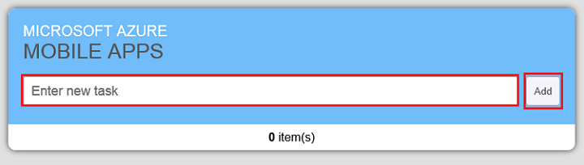

<properties
	pageTitle="Get Started with mobile app backends for HTML/JavaScript apps | Azure App Service Mobile Apps"
	description="Follow this tutorial to get started using Azure mobile app backends for web app development in HTML5 and JavaScript."
	services="app-service\mobile"
	documentationCenter=""
	authors="ggailey777"
	manager="dwrede"
	editor=""/>

<tags
	ms.service="app-service-mobile"
	ms.workload="mobile"
	ms.tgt_pltfrm="mobile-html5"
	ms.devlang="javascript"
	ms.topic="get-started-article"
	ms.date="09/24/2015"
	ms.author="glenga"/>

#Create an HTML app

[AZURE.INCLUDE [app-service-mobile-selector-get-started-preview](../../includes/app-service-mobile-selector-get-started-preview.md)]
&nbsp;  
[AZURE.INCLUDE [app-service-mobile-note-mobile-services-preview](../../includes/app-service-mobile-note-mobile-services-preview.md)]

##Overview

This tutorial shows you how to add a cloud-based backend service to an HTML5/JavaScript web app using an Azure Mobile App backend. You will create both a new Mobile App backend and a simple *To do list* web app that stores app data in Azure.

A screenshot from the completed app is below:

Completing this tutorial is a prerequisite for all other Mobile Apps tutorials for HTML apps. 

##Prerequisites

To complete this tutorial, you need the following:

* An active Azure account. If you don't have an account, you can sign up for an Azure trial and get up to 10 free Mobile Apps that you can keep using even after your trial ends. For details, see [Azure Free Trial](http://azure.microsoft.com/pricing/free-trial/).

* [Visual Studio Community 2013] or a later version.

>[AZURE.NOTE] If you want to get started with Azure App Service before signing up for an Azure account, go to [Try App Service](http://go.microsoft.com/fwlink/?LinkId=523751&appServiceName=mobile), where you can immediately create a short-lived starter Mobile App in App Service. No credit cards required; no commitments.

##Create a new Mobile App backend

[AZURE.INCLUDE [app-service-mobile-dotnet-backend-create-new-service-preview](../../includes/app-service-mobile-dotnet-backend-create-new-service-preview.md)]

## Download the server project

1. In the [Azure Portal], click **Browse All** > **Web Apps**, then click the Mobile App backend that you just created. 

2. In the Mobile App backend, click **All settings** and under **Mobile App** click **Quickstart** > **HTML/JavaScript**.

3. Under **Download and run your server project** in **Create a new app**, click **Download**, extract the compressed project files to your local computer, and open the solution in Visual Studio.

4. Build the project to restore the NuGet packages.

##Enable CORS in the server project

Cross-origin resource sharing (CORS) is a way for your web-based app to indicate from which domains requests are safe and should be permitted by the browser. You must add a CORS entry for every web site that will access your Mobile App backend. You control your CORS settings by using the standard ASP.NET Web API behaviors. For more information, see [Enabling Cross-Origin Requests in ASP.NET Web API](http://www.asp.net/web-api/overview/security/enabling-cross-origin-requests-in-web-api#enable-cors).

By default, the client quickstart project that you will download from the portal runs on localhost on port 8000. Because of this, you will next enable CORS for `http://localhost:8000` in the server project.  

1. In Visual Studio in the Tools menu, click **NuGet Package Manager** > **Package Manager Console**, select Nuget.org as the **Package source** and execute the following command in the console window:
 
		Install-Package Microsoft.AspNet.WebApi.Cors  

2. Open the App_Start/Startup.MobileApp.cs project file and add the following using statement:

		using System.Web.Http.Cors;

3. Next, add the following code to the **Startup.ConfigureMobileApp** method after the **HttpConfiguration** (*config*) is created:

        // Enable CORS support for localhost port 8000, all headers and methods.
        var cors = new EnableCorsAttribute("http://localhost:8000", "*", "*");
        config.EnableCors(cors);

4. Save your updates.

Next, you will deploy your CORS-enabled project to Azure.

##Publish the server project to Azure

[AZURE.INCLUDE [app-service-mobile-dotnet-backend-publish-service-preview](../../includes/app-service-mobile-dotnet-backend-publish-service-preview.md)]

##Download and run the client project

1. Back in the blade for your Mobile App backend, click **All settings** and under **Mobile App** click **Quickstart** > **HTML/JavaScript**. 

2.  Under **Download and run your HTML/Javascript project** in **Create a new app**, click **Download** and save the compressed project files to your local computer.

3. Browse to the location where you saved the compressed project files, expand the files on your computer, and launch one of the following command files from the **server** subfolder.

	+ **launch-windows** (Windows computers)
	+ **launch-mac.command** (Mac OS X computers)
	+ **launch-linux.sh** (Linux computers)

	> [AZURE.NOTE] On a Windows computer, type `R` when PowerShell asks you to confirm that you want to run the script. Your web browser might warn you to not run the script because it was downloaded from the internet. When this happens, you must request that the browser proceed to load the script.

	This starts a web server on your local computer to host the new app.

4. Open the URL <a href="http://localhost:8000/" target="_blank">http://localhost:8000/</a> in a web browser to start the app. The client app is configured to connect to your Mobile App backend in Azure.

5. In the app, type meaningful text, such as _Complete the tutorial_, in **Enter new task**, and then click **Add**.

   	

   	This sends a POST request to the new Mobile App backend hosted in Azure. Data from the request is inserted into the TodoItem table in the Mobile App schema. Items stored in the table are returned by the service, and the data is displayed in the second column in the app.

	> [AZURE.TIP] You can review the code that accesses your mobile service to query and insert data, which is found in the app.js file. 

<!-- Anchors. -->
<!-- Images. -->
<!-- URLs. -->
[Get started with authentication]: app-service-mobile-dotnet-backend-windows-store-dotnet-get-started-users-preview.md
[Mobile App SDK]: http://go.microsoft.com/fwlink/?LinkId=257545
[Azure Portal]: https://portal.azure.com/

[Visual Studio Community 2013]: https://www.visualstudio.com/downloads
 
