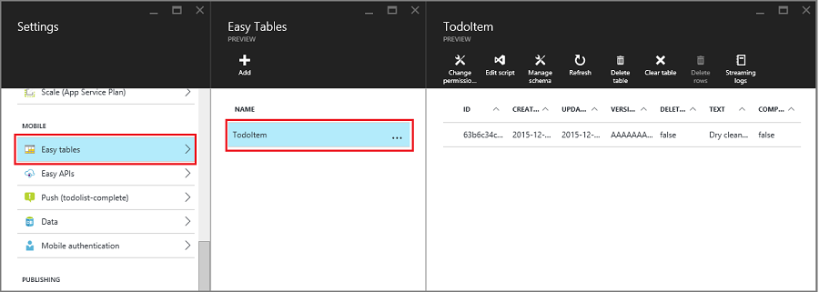
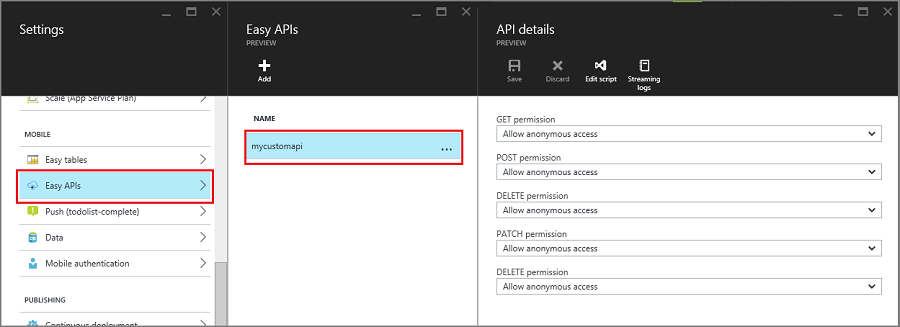
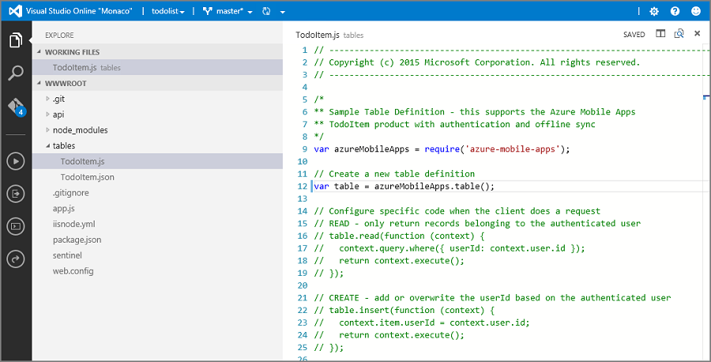

# How to use the Mobile Apps Node.js SDK

[!INCLUDE [app-service-mobile-selector-server-sdk](../../includes/app-service-mobile-selector-server-sdk.md)]

This article provides detailed information and examples that show how to work with a Node.js back end in the Mobile Apps feature of Azure App Service.

## <a name="Introduction"></a>Introduction

Mobile Apps provides the capability to add a mobile-optimized data access Web API to a web
application. The Mobile Apps SDK is provided for ASP.NET and Node.js web applications. The SDK
provides the following operations:

* Table operations (read, insert, update, delete) for data access
* Custom API operations

Both operations provide for authentication across all identity providers that Azure App Service allows. These providers include
social identity providers such as Facebook, Twitter, Google, and Microsoft, as well as Azure Active Directory for
enterprise identity.

You can find samples for each use case in the [samples directory on GitHub].

## Supported platforms

The Mobile Apps Node.js SDK supports the current LTS release of Node and later. Currently, the latest
LTS version is Node v4.5.0. Other versions of Node might work but are not supported.

The Mobile Apps Node.js SDK supports two database drivers: 

* The node-mssql driver supports Azure SQL Database and local SQL Server instances.  
* The sqlite3 driver supports SQLite databases on a single instance only.

### <a name="howto-cmdline-basicapp"></a>Create a basic Node.js back end by using the command line

Every Mobile Apps Node.js back end starts as an ExpressJS application. ExpressJS is the most popular web service framework
available for Node.js. You can create a basic [Express] application as follows:

1. In a command or PowerShell window, create a directory for your project:

        mkdir basicapp

1. Run `npm init` to initialize the package structure:

        cd basicapp
        npm init

   The `npm init` command asks a set of questions to initialize the project. See the example output:

   ![The npm init output][0]

1. Install the `express` and `azure-mobile-apps` libraries from the npm repository:

        npm install --save express azure-mobile-apps

1. Create an app.js file to implement the basic mobile server:

    ```javascript
    var express = require('express'),
        azureMobileApps = require('azure-mobile-apps');

    var app = express(),
        mobile = azureMobileApps();

    // Define a TodoItem table.
    mobile.tables.add('TodoItem');

    // Add the Mobile API so it is accessible as a Web API.
    app.use(mobile);

    // Start listening on HTTP.
    app.listen(process.env.PORT || 3000);
    ```

This application creates a mobile-optimized Web API with a single endpoint (`/tables/TodoItem`) that provides
unauthenticated access to an underlying SQL data store by using a dynamic schema. It is suitable for following the
client library quickstarts:

* [Android client quickstart]
* [Apache Cordova client quickstart]
* [iOS Client quickstart]
* [Windows Store client quickstart]
* [Xamarin.iOS client quickstart]
* [Xamarin.Android client quickstart]
* [Xamarin.Forms client quickstart]

You can find the code for this basic application in the [basicapp sample on GitHub].

### <a name="howto-vs2015-basicapp"></a>Create a Node.js back end by using Visual Studio 2015

Visual Studio 2015 requires an extension to develop Node.js applications within the IDE. To start, install
the [Node.js Tools 1.1 for Visual Studio]. When you finish the installation, create
an Express 4.x application:

1. Open the **New Project** dialog box (from **File** > **New** > **Project**).
1. Expand **Templates** > **JavaScript** > **Node.js**.
1. Select **Basic Azure Node.js Express 4 Application**.
1. Fill in the project name. Select **OK**.

   ![Visual Studio 2015 new project][1]
1. Right-click the **npm** node and select **Install New npm packages**.
1. You  might need to refresh the npm catalog after you create your first Node.js application. Select **Refresh** if necessary.
1. Enter **azure-mobile-apps** in the search box. Select the **azure-mobile-apps 2.0.0** package, and then select **Install Package**.

   ![Install new npm packages][2]
1. Select **Close**.
1. Open the app.js file to add support for the Mobile Apps SDK. At line 6 at the bottom of the library
  `require` statements, add the following code:

    ```javascript
    var bodyParser = require('body-parser');
    var azureMobileApps = require('azure-mobile-apps');
    ```

    At approximately line 27 after the other `app.use` statements, add the following code:

    ```javascript
    app.use('/users', users);

    // Mobile Apps initialization
    var mobile = azureMobileApps();
    mobile.tables.add('TodoItem');
    app.use(mobile);
    ```

    Save the file.

1. Either run the application locally (the API is served on `http://localhost:3000`) or publish to Azure.

### <a name="create-node-backend-portal"></a>Create a Node.js back end by using the Azure portal

You can create a Mobile Apps back end right in the [Azure portal]. You can either complete the following steps or
create a client and server together by following the [Create a mobile app](app-service-mobile-ios-get-started.md)
tutorial. The tutorial contains a simplified version of these instructions and is best for proof-of-concept projects.

[!INCLUDE [app-service-mobile-dotnet-backend-create-new-service-classic](../../includes/app-service-mobile-dotnet-backend-create-new-service-classic.md)]

Back in the **Get started** pane, under **Create a table API**, choose **Node.js** as your back-end language.
Select the box for **I acknowledge that this will overwrite all site contents**, and then select
**Create TodoItem table**.

### <a name="download-quickstart"></a>Download the Node.js back-end quickstart code project by using Git

When you create a Node.js Mobile Apps back end by using the portal's **Quick start** pane, a Node.js project
is created for you and deployed to your site. In the portal, you can add tables and APIs, and edit code files for the Node.js
back end. You can also use various deployment tools to download the back-end project so that you
can add or modify tables and APIs, and then republish the project. For more information, see the
[Azure App Service deployment guide].

The following procedure uses a Git repository to download the quickstart
project code:

1. Install Git, if you haven't already done so. The steps required to install Git vary between operating systems. For operating system-specific distributions and installation guidance, see [Installing Git](https://git-scm.com/book/en/Getting-Started-Installing-Git).
2. See [Prepare your repository](../app-service/deploy-local-git.md#prepare-your-repository) to enable the Git repository for your back-end site. Make a note of the deployment username and password.
3. In the pane for your Mobile Apps back end, make a note of the **Git clone URL** setting.
4. Execute the `git clone` command by using the Git clone URL. Enter your password when required, as in the
   following example:

        $ git clone https://username@todolist.scm.azurewebsites.net:443/todolist.git

5. Browse to the local directory (`/todolist` in the preceding example), and notice that project files have been
   downloaded. Locate the todoitem.json file in the `/tables` directory. This file defines permissions on the
   table. Also find the todoitem.js file in the same directory. It defines the CRUD operation scripts for
   the table.
6. After you make changes to project files, run the following commands to add, commit, and then upload the
   changes to the site:

        $ git commit -m "updated the table script"
        $ git push origin master

   When you add new files to the project, you first need to run the `git add .` command.

The site is republished every time a new set of commits is pushed to the site.

### <a name="howto-publish-to-azure"></a>Publish your Node.js back end to Azure

Microsoft Azure provides many mechanisms for publishing your Mobile Apps Node.js back end to
the Azure service. These mechanisms include deployment tools integrated into Visual Studio, command-line tools,
and continuous deployment options based on source control. For more information, see the
[Azure App Service deployment guide].

Azure App Service has specific advice for Node.js applications that you should review before you publish the back end:

* How to [specify the Node version]
* How to [use Node modules]

### <a name="howto-enable-homepage"></a>Enable a home page for your application

Many applications are a combination of web and mobile apps. You can use the ExpressJS framework to combine the
two facets. Sometimes, however, you might want to only implement a mobile interface. It's useful to provide a
home page to ensure that the app service is up and running. You can either provide your own home page or enable
a temporary home page. To enable a temporary home page, use the following code to instantiate Mobile Apps:

```javascript
var mobile = azureMobileApps({ homePage: true });
```

If you only want this option available when developing locally, you can add this setting to your azureMobile.js
file.

## <a name="TableOperations"></a>Table operations

The azure-mobile-apps Node.js Server SDK provides mechanisms to expose data tables stored in Azure SQL Database
as a Web API. It provides five operations:

| Operation | Description |
| --- | --- |
| GET /tables/*tablename* |Get all records in the table. |
| GET /tables/*tablename*/:id |Get a specific record in the table. |
| POST /tables/*tablename* |Create a record in the table. |
| PATCH /tables/*tablename*/:id |Update a record in the table. |
| DELETE /tables/*tablename*/:id |Delete a record in the table. |

This Web API supports [OData] and extends the table schema to support [offline data sync].

### <a name="howto-dynamicschema"></a>Define tables by using a dynamic schema

Before you can use a table, you must define it. You can define tables by using a static schema (where you define
the columns in the schema) or dynamically (where the SDK controls the schema based on incoming
requests). In addition, you can control specific aspects of the Web API by adding JavaScript code
to the definition.

As a best practice, you should define each table in a JavaScript file in the `tables` directory, and then use the
`tables.import()` method to import the tables. Extending the basic-app sample, you would adjust the app.js file:

```javascript
var express = require('express'),
    azureMobileApps = require('azure-mobile-apps');

var app = express(),
    mobile = azureMobileApps();

// Define the database schema that is exposed.
mobile.tables.import('./tables');

// Provide initialization of any tables that are statically defined.
mobile.tables.initialize().then(function () {
    // Add the Mobile API so it is accessible as a Web API.
    app.use(mobile);

    // Start listening on HTTP.
    app.listen(process.env.PORT || 3000);
});
```

Define the table in ./tables/TodoItem.js:

```javascript
var azureMobileApps = require('azure-mobile-apps');

var table = azureMobileApps.table();

// Additional configuration for the table goes here.

module.exports = table;
```

Tables use a dynamic schema by default. To turn off the dynamic schema globally, set the `MS_DynamicSchema` app setting to false in the Azure portal.

You can find a complete example in the [todo sample on GitHub].

### <a name="howto-staticschema"></a>Define tables by using a static schema

You can explicitly define the columns to expose via the Web API. The azure-mobile-apps Node.js SDK automatically
adds any extra columns required for offline data sync to the list that you provide. For example, the
quickstart client applications require a table with two columns: `text` (a string) and `complete` (a Boolean).  
The table can be defined in the table definition JavaScript file (located in the `tables` directory) as follows:

```javascript
var azureMobileApps = require('azure-mobile-apps');

var table = azureMobileApps.table();

// Define the columns within the table.
table.columns = {
    "text": "string",
    "complete": "boolean"
};

// Turn off the dynamic schema.
table.dynamicSchema = false;

module.exports = table;
```

If you define tables statically, you must also call the `tables.initialize()` method to create the database
schema on startup. The `tables.initialize()` method returns a [promise] so that the web service does not serve
requests before the database is initialized.

### <a name="howto-sqlexpress-setup"></a>Use SQL Server Express as a development data store on your local machine

The Mobile Apps Node.js SDK provides three options for serving data out of the box:

* Use the **memory** driver to provide a non-persistent example store.
* Use the **mssql** driver to provide a SQL Server Express data store for development.
* Use the **mssql** driver to provide an Azure SQL Database data store for production.

The Mobile Apps Node.js SDK uses the [mssql Node.js package] to establish and use a connection to both SQL Server
Express and SQL Database. This package requires that you enable TCP connections on your SQL Server Express instance.

> [!TIP]
> The memory driver does not provide a complete set of facilities for testing. If you want to test
> your back end locally, we recommend the use of a SQL Server Express data store and the mssql driver.

1. Download and install [Microsoft SQL Server 2014 Express]. Ensure that you install the SQL Server 2014 Express
   with Tools edition. Unless you explicitly require 64-bit support, the 32-bit version consumes less memory
   when running.
1. Run SQL Server 2014 Configuration Manager:

   a. Expand the **SQL Server Network Configuration** node in the tree menu.

   b. Select **Protocols for SQLEXPRESS**.

   c. Right-click **TCP/IP** and select **Enable**. Select **OK** in the pop-up dialog box.

   d. Right-click **TCP/IP** and select **Properties**.

   e. Select the **IP Addresses** tab.

   f. Find the **IPAll** node. In the **TCP Port** field, enter **1433**.

      ![Configure SQL Server Express for TCP/IP][3]

   g. Select **OK**. Select **OK** in the pop-up dialog box.

   h. Select **SQL Server Services** in the tree menu.

   i. Right-click **SQL Server (SQLEXPRESS)** and select **Restart**.

   j. Close SQL Server 2014 Configuration Manager.

1. Run SQL Server 2014 Management Studio and connect to your local SQL Server Express instance:

   1. Right-click your instance in Object Explorer and select **Properties**.
   1. Select the **Security** page.
   1. Ensure that **SQL Server and Windows Authentication mode** is selected.
   1. Select **OK**.

      ![Configure SQL Server Express authentication][4]
   1. Expand **Security** > **Logins** in Object Explorer.
   1. Right-click **Logins** and select **New Login**.
   1. Enter a login name. Select **SQL Server authentication**. Enter a password, and then enter the same password
      in **Confirm password**. The password must meet Windows complexity requirements.
   1. Select **OK**.

      ![Add a new user to SQL Server Express][5]
   1. Right-click your new login and select **Properties**.
   1. Select the **Server Roles** page.
   1. Select the check box for the **dbcreator** server role.
   1. Select **OK**.
   1. Close SQL Server 2015 Management Studio.

Be sure to record the username and password that you selected. You  might need to assign additional server roles or
permissions, depending on your database requirements.

The Node.js application reads the `SQLCONNSTR_MS_TableConnectionString` environment variable for
the connection string for this database. You can set this variable in your environment. For example,
you can use PowerShell to set this environment variable:

    $env:SQLCONNSTR_MS_TableConnectionString = "Server=127.0.0.1; Database=mytestdatabase; User Id=azuremobile; Password=T3stPa55word;"

Access the database through a TCP/IP connection. Provide a username and password for the connection.

### <a name="howto-config-localdev"></a>Configure your project for local development

Mobile Apps reads a JavaScript file called *azureMobile.js* from the local file system. Do not use this
file to configure the Mobile Apps SDK in production. Instead, use **App settings** in the [Azure portal].

The azureMobile.js file should export a configuration object. The most common settings are:

* Database settings
* Diagnostic logging settings
* Alternate CORS settings

This example **azureMobile.js** file implements the preceding database settings:

```javascript
module.exports = {
    cors: {
        origins: [ 'localhost' ]
    },
    data: {
        provider: 'mssql',
        server: '127.0.0.1',
        database: 'mytestdatabase',
        user: 'azuremobile',
        password: 'T3stPa55word'
    },
    logging: {
        level: 'verbose'
    }
};
```

We recommend that you add **azureMobile.js** to your **.gitignore** file (or other source code control ignore file)
to prevent passwords from being stored in the cloud. Always configure production settings in **App settings** within
the [Azure portal].

### <a name="howto-appsettings"></a>Configure app settings for your mobile app

Most settings in the azureMobile.js file have an equivalent app setting in the [Azure portal]. Use the following
list to configure your app in **App settings**:

| App setting | azureMobile.js setting | Description | Valid values |
|:--- |:--- |:--- |:--- |
| **MS_MobileAppName** |name |Name of the app |string |
| **MS_MobileLoggingLevel** |logging.level |Minimum log level of messages to log |error, warning, info, verbose, debug, silly |
| **MS_DebugMode** |debug |Enables or disables debug mode |true, false |
| **MS_TableSchema** |data.schema |Default schema name for SQL tables |string (default: dbo) |
| **MS_DynamicSchema** |data.dynamicSchema |Enables or disables debug mode |true, false |
| **MS_DisableVersionHeader** |version (set to undefined) |Disables the X-ZUMO-Server-Version header |true, false |
| **MS_SkipVersionCheck** |skipversioncheck |Disables the client API version check |true, false |

To set an app setting:

1. Sign in to the [Azure portal].
1. Select **All resources** or **App Services**, and then select the name of your mobile app.
1. The **Settings** pane opens by default. If it doesn't, select **Settings**.
1. On the **GENERAL** menu, select **Application settings**.
1. Scroll to the **App settings** section.
1. If your app setting already exists, select the value of the app setting to edit the value.
   If your app setting does not exist, enter the app setting in the **Key** box and the value in the **Value** box.
1. Select **Save**.

Changing most app settings requires a service restart.

### <a name="howto-use-sqlazure"></a>Use SQL Database as your production data store

<!--- ALTERNATE INCLUDE - we can't use ../includes/app-service-mobile-dotnet-backend-create-new-service.md - slightly different semantics -->

Using Azure SQL Database as a data store is identical across all Azure App Service application types. If you have
not done so already, follow these steps to create a Mobile Apps back end:

1. Sign in to the [Azure portal].
1. In the upper left of the window, select the **+NEW** button > **Web + Mobile** > **Mobile App**, and then provide a
   name for your Mobile Apps back end.
1. In the **Resource Group** box, enter the same name as your app.
1. The default App Service plan is selected. If you want to change your App Service plan:

   a. Select **App Service Plan** > **+Create New**.

   b. Provide a name of the new App Service plan and select an
   appropriate location.

   c. Select an appropriate pricing tier for the service. Select
   **View all** to view more pricing options, such as **Free** and **Shared**.

   d. Click the **Select** button.

   e. Back in the **App Service plan** pane, select **OK**.
1. Select **Create**.

Provisioning a Mobile Apps back end can take a couple of minutes. After the Mobile Apps
back end is provisioned, the portal opens the **Settings** pane for the Mobile Apps back end.

You can choose to either connect an existing SQL database to your
Mobile Apps back end or create a new SQL database. In this section, we create a SQL database.

> [!NOTE]
> If you already have a database in the same location as the Mobile Apps back end, you can
> instead select **Use an existing database** and then select that database. We don't recommend the use of a database in a different location because of higher latencies.

1. In the new Mobile Apps back end, select **Settings** > **Mobile App** > **Data** > **+Add**.
1. In the **Add data connection** pane, select **SQL Database - Configure required settings** > **Create a new database**. Enter the name of the new database in the **Name** box.
1. Select **Server**. In the **New server** pane, enter a unique server name in the **Server name** box,
   and provide a suitable server admin login and password. Ensure that **Allow azure services to access server**
   is selected. Select **OK**.

   ![Create an Azure SQL database][6]
1. In the **New database** pane, select **OK**.
1. Back in the **Add data connection** pane, select **Connection string**, and enter the login and password that
   you provided when you created the database. If you use an existing database, provide the login credentials
   for that database. Select **OK**.
1. Back in the **Add data connection** pane again, select **OK** to create the database.

<!--- END OF ALTERNATE INCLUDE -->

Creation of the database can take a few minutes. Use the **Notifications** area to monitor the progress of
the deployment. Do not progress until the database is deployed successfully. After the database is deployed,
a connection string is created for the SQL Database instance in your Mobile Apps back-end app settings. You can
see this app setting in **Settings** > **Application settings** > **Connection strings**.

### <a name="howto-tables-auth"></a>Require authentication for access to tables

If you want to use App Service Authentication with the `tables` endpoint, you must configure App Service
Authentication in the [Azure portal] first. For more information, see the configuration guide for the identity provider that you intend to use:

* [Configure Azure Active Directory authentication]
* [Configure Facebook authentication]
* [Configure Google authentication]
* [Configure Microsoft authentication]
* [Configure Twitter authentication]

Each table has an access property that you can use to control access to the table. The following sample shows
a statically defined table with authentication required.

```javascript
var azureMobileApps = require('azure-mobile-apps');

var table = azureMobileApps.table();

// Define the columns within the table.
table.columns = {
    "text": "string",
    "complete": "boolean"
};

// Turn off the dynamic schema.
table.dynamicSchema = false;

// Require authentication to access the table.
table.access = 'authenticated';

module.exports = table;
```

The access property can take one of three values:

* *anonymous* indicates that the client application is allowed to read data without authentication.
* *authenticated* indicates that the client application must send a valid authentication token with the request.
* *disabled* indicates that this table is currently disabled.

If the access property is undefined, unauthenticated access is allowed.

### <a name="howto-tables-getidentity"></a>Use authentication claims with your tables
You can set up various claims that are requested when authentication is set up. These claims are not normally
available through the `context.user` object. However, you can retrieve them by using the `context.user.getIdentity()`
method. The `getIdentity()` method returns a promise that resolves to an object. The object is keyed by the
authentication method (`facebook`, `google`, `twitter`, `microsoftaccount`, or `aad`).

For example, if you set up Microsoft account authentication and request the email addresses claim, you can add
the email address to the record with the following table controller:

```javascript
var azureMobileApps = require('azure-mobile-apps');

// Create a new table definition.
var table = azureMobileApps.table();

table.columns = {
    "emailAddress": "string",
    "text": "string",
    "complete": "boolean"
};
table.dynamicSchema = false;
table.access = 'authenticated';

/**
* Limit the context query to those records with the authenticated user email address
* @param {Context} context the operation context
* @returns {Promise} context execution Promise
*/
function queryContextForEmail(context) {
    return context.user.getIdentity().then((data) => {
        context.query.where({ emailAddress: data.microsoftaccount.claims.emailaddress });
        return context.execute();
    });
}

/**
* Adds the email address from the claims to the context item - used for
* insert operations
* @param {Context} context the operation context
* @returns {Promise} context execution Promise
*/
function addEmailToContext(context) {
    return context.user.getIdentity().then((data) => {
        context.item.emailAddress = data.microsoftaccount.claims.emailaddress;
        return context.execute();
    });
}

// Configure specific code when the client does a request.
// READ: only return records that belong to the authenticated user.
table.read(queryContextForEmail);

// CREATE: add or overwrite the userId based on the authenticated user.
table.insert(addEmailToContext);

// UPDATE: only allow updating of records that belong to the authenticated user.
table.update(queryContextForEmail);

// DELETE: only allow deletion of records that belong to the authenticated user.
table.delete(queryContextForEmail);

module.exports = table;
```

To see what claims are available, use a web browser to view the `/.auth/me` endpoint of your site.

### <a name="howto-tables-disabled"></a>Disable access to specific table operations

In addition to appearing on the table, the access property can be used to control individual operations. There
are four operations:

* `read` is the RESTful GET operation on the table.
* `insert` is the RESTful POST operation on the table.
* `update` is the RESTful PATCH operation on the table.
* `delete` is the RESTful DELETE operation on the table.

For example, you might want to provide a read-only unauthenticated table:

```javascript
var azureMobileApps = require('azure-mobile-apps');

var table = azureMobileApps.table();

// Read-only table. Only allow READ operations.
table.read.access = 'anonymous';
table.insert.access = 'disabled';
table.update.access = 'disabled';
table.delete.access = 'disabled';

module.exports = table;
```

### <a name="howto-tables-query"></a>Adjust the query that is used with table operations

A common requirement for table operations is to provide a restricted view of the data. For example, you can
provide a table that is tagged with the authenticated user ID such that you can only read or update your
own records. The following table definition provides this functionality:

```javascript
var azureMobileApps = require('azure-mobile-apps');

var table = azureMobileApps.table();

// Define a static schema for the table.
table.columns = {
    "userId": "string",
    "text": "string",
    "complete": "boolean"
};
table.dynamicSchema = false;

// Require authentication for this table.
table.access = 'authenticated';

// Ensure that only records for the authenticated user are retrieved.
table.read(function (context) {
    context.query.where({ userId: context.user.id });
    return context.execute();
});

// When adding records, add or overwrite the userId with the authenticated user.
table.insert(function (context) {
    context.item.userId = context.user.id;
    return context.execute();
});

module.exports = table;
```

Operations that normally run a query have a query property that you can adjust by using a `where` clause. The query
property is a [QueryJS] object that is used to convert an OData query to something that the data back end can
process. For simple equality cases (like the preceding one), you can use a map. You can also add specific SQL
clauses:

```javascript
context.query.where('myfield eq ?', 'value');
```

### <a name="howto-tables-softdelete"></a>Configure a soft delete on a table

A soft delete does not actually delete records. Instead it marks them as deleted within the database by setting
the deleted column to true. The Mobile Apps SDK automatically removes soft-deleted records from results
unless the Mobile Client SDK uses `IncludeDeleted()`. To configure a table for a soft delete, set the `softDelete`
property in the table definition file:

```javascript
var azureMobileApps = require('azure-mobile-apps');

var table = azureMobileApps.table();

// Define the columns within the table.
table.columns = {
    "text": "string",
    "complete": "boolean"
};

// Turn off the dynamic schema.
table.dynamicSchema = false;

// Turn on soft delete.
table.softDelete = true;

// Require authentication to access the table.
table.access = 'authenticated';

module.exports = table;
```

You should establish a mechanism for deleting records: a client application, a WebJob, an Azure
function, or a custom API.

### <a name="howto-tables-seeding"></a>Seed your database with data

When you're creating a new application, you might want to seed a table with data. You can do this within the table
definition JavaScript file as follows:

```javascript
var azureMobileApps = require('azure-mobile-apps');

var table = azureMobileApps.table();

// Define the columns within the table.
table.columns = {
    "text": "string",
    "complete": "boolean"
};
table.seed = [
    { text: 'Example 1', complete: false },
    { text: 'Example 2', complete: true }
];

// Turn off the dynamic schema.
table.dynamicSchema = false;

// Require authentication to access the table.
table.access = 'authenticated';

module.exports = table;
```

Seeding of data happens only when you've used the Mobile Apps SDK to create the table. If the table already
exists in the database, no data is injected into the table. If the dynamic schema is turned on, the
schema is inferred from the seeded data.

We recommend that you explicitly call the `tables.initialize()` method to create the table when the service starts
running.

### <a name="Swagger"></a>Enable Swagger support
Mobile Apps comes with built-in [Swagger] support. To enable Swagger support, first install
swagger-ui as a dependency:

    npm install --save swagger-ui

You can then enable Swagger support in the Mobile Apps constructor:

```javascript
var mobile = azureMobileApps({ swagger: true });
```

You probably only want to enable Swagger support in development editions. You can do this by using the
`NODE_ENV` app setting:

```javascript
var mobile = azureMobileApps({ swagger: process.env.NODE_ENV !== 'production' });
```

The `swagger` endpoint is located at http://*yoursite*.azurewebsites.net/swagger. You can access the Swagger
UI via the `/swagger/ui` endpoint. If you choose to require authentication across your entire application,
Swagger produces an error. For best results, choose to allow unauthenticated requests in the Azure
App Service Authentication/Authorization settings, and then control authentication by using the `table.access`
property.

You can also add the Swagger option to your azureMobile.js file if you only want Swagger support for
developing locally.

## <a name="push"/>Push notifications

Mobile Apps integrates with Azure Notification Hubs so you can send targeted push notifications to millions
of devices across all major platforms. By using Notification Hubs, you can send push notifications to iOS, Android,
and Windows devices. To learn more about all that you can do with Notification Hubs, see the
[Notification Hubs overview](../notification-hubs/notification-hubs-push-notification-overview.md).

### <a name="send-push"></a>Send push notifications

The following code shows how to use the `push` object to send a broadcast push notification to registered iOS
devices:

```javascript
// Create an APNS payload.
var payload = '{"aps": {"alert": "This is an APNS payload."}}';

// Only do the push if configured.
if (context.push) {
    // Send a push notification by using APNS.
    context.push.apns.send(null, payload, function (error) {
        if (error) {
            // Do something or log the error.
        }
    });
}
```

By creating a template push registration from the client, you can instead send a template push message to devices on all supported platforms. The following code shows how to send a template notification:

```javascript
// Define the template payload.
var payload = '{"messageParam": "This is a template payload."}';

// Only do the push if configured.
if (context.push) {
    // Send a template notification.
    context.push.send(null, payload, function (error) {
        if (error) {
            // Do something or log the error.
        }
    });
}
```

### <a name="push-user"></a>Send push notifications to an authenticated user by using tags
When an authenticated user registers for push notifications, a user ID tag is automatically added to the registration. By using this tag, you can send push notifications to all devices registered by a specific user. The following code gets the SID of user who's making the request and sends a template push notification to every device registration for that user:

```javascript
// Only do the push if configured.
if (context.push) {
    // Send a notification to the current user.
    context.push.send(context.user.id, payload, function (error) {
        if (error) {
            // Do something or log the error.
        }
    });
}
```

When you're registering for push notifications from an authenticated client, make sure that authentication is complete before you attempt registration.

## <a name="CustomAPI"></a> Custom APIs

### <a name="howto-customapi-basic"></a>Define a custom API

In addition to the Data Access API via the `/tables` endpoint, Mobile Apps can provide custom API coverage. Custom
APIs are defined in a similar way to the table definitions and can access all the same facilities, including authentication.

If you want to use App Service Authentication with a custom API, you must configure App Service Authentication
in the [Azure portal] first. For more information, see
the configuration guide for the identity provider that you intend to use:

* [Configure Azure Active Directory authentication]
* [Configure Facebook authentication]
* [Configure Google authentication]
* [Configure Microsoft authentication]
* [Configure Twitter authentication]

Custom APIs are defined in much the same way as the Tables API:

1. Create an `api` directory.
1. Create an API definition JavaScript file in the `api` directory.
1. Use the import method to import the `api` directory.

Here is the prototype API definition based on the basic-app sample that we used earlier:

```javascript
var express = require('express'),
    azureMobileApps = require('azure-mobile-apps');

var app = express(),
    mobile = azureMobileApps();

// Import the custom API.
mobile.api.import('./api');

// Add the Mobile API so it is accessible as a Web API.
app.use(mobile);

// Start listening on HTTP
app.listen(process.env.PORT || 3000);
```

Let's take an example API that returns the server date by using the `Date.now()` method. Here is the api/date.js
file:

```javascript
var api = {
    get: function (req, res, next) {
        var date = { currentTime: Date.now() };
        res.status(200).type('application/json').send(date);
    });
};

module.exports = api;
```

Each parameter is one of the standard RESTful verbs: GET, POST, PATCH, or DELETE. The method is a standard
[ExpressJS middleware] function that sends the required output.

### <a name="howto-customapi-auth"></a>Require authentication for access to a custom API

The Mobile Apps SDK implements authentication in the same way for both the `tables` endpoint and custom APIs. To
add authentication to the API developed in the previous section, add an `access` property:

```javascript
var api = {
    get: function (req, res, next) {
        var date = { currentTime: Date.now() };
        res.status(200).type('application/json').send(date);
    });
};
// All methods must be authenticated.
api.access = 'authenticated';

module.exports = api;
```

You can also specify authentication on specific operations:

```javascript
var api = {
    get: function (req, res, next) {
        var date = { currentTime: Date.now() };
        res.status(200).type('application/json').send(date);
    }
};
// The GET methods must be authenticated.
api.get.access = 'authenticated';

module.exports = api;
```

The same token that is used for the `tables` endpoint must be used for custom APIs that require authentication.

### <a name="howto-customapi-auth"></a>Handle large file uploads

The Mobile Apps SDK uses the [body-parser middleware](https://github.com/expressjs/body-parser) to accept and decode body content in your submission. You can preconfigure
body-parser to accept larger file uploads:

```javascript
var express = require('express'),
    bodyParser = require('body-parser'),
    azureMobileApps = require('azure-mobile-apps');

var app = express(),
    mobile = azureMobileApps();

// Set up large body content handling.
app.use(bodyParser.json({ limit: '50mb' }));
app.use(bodyParser.urlencoded({ limit: '50mb', extended: true }));

// Import the custom API.
mobile.api.import('./api');

// Add the Mobile API so it is accessible as a Web API.
app.use(mobile);

// Start listening on HTTP.
app.listen(process.env.PORT || 3000);
```

The file is base-64 encoded before transmission. This encoding increases the size of the actual upload (and 
the size that you must account for).

### <a name="howto-customapi-sql"></a>Execute custom SQL statements

The Mobile Apps SDK allows access to the entire context through the request object. You can easily execute
parameterized SQL statements to the defined data provider:

```javascript
var api = {
    get: function (request, response, next) {
        // Check for parameters. If not there, pass on to a later API call.
        if (typeof request.params.completed === 'undefined')
            return next();

        // Define the query. Anything that the mssql
        // driver can handle is allowed.
        var query = {
            sql: 'UPDATE TodoItem SET complete=@completed',
            parameters: [{
                completed: request.params.completed
            }]
        };

        // Execute the query. The context for Mobile Apps is available through
        // request.azureMobile. The data object contains the configured data provider.
        request.azureMobile.data.execute(query)
        .then(function (results) {
            response.json(results);
        });
    }
};

api.get.access = 'authenticated';
module.exports = api;
```

## <a name="Debugging"></a>Debugging, Easy Tables, and Easy APIs

### <a name="howto-diagnostic-logs"></a>Debug, diagnose, and troubleshoot Mobile Apps

Azure App Service provides several debugging and troubleshooting techniques for Node.js applications.
To get started in troubleshooting your Node.js Mobile Apps back end, see the following articles:

* [Monitoring Azure App Service]
* [Enable diagnostic logging in Azure App Service]
* [Troubleshoot Azure App Service in Visual Studio]

Node.js applications have access to a wide range of diagnostic log tools. Internally, the Mobile Apps
Node.js SDK uses [Winston] for diagnostic logging. Logging is automatically enabled when you enable debug mode or set the `MS_DebugMode` app setting to true in the [Azure portal]. Generated logs appear in the diagnostic
logs in the [Azure portal].

### <a name="in-portal-editing"></a><a name="work-easy-tables"></a>Work with Easy Tables in the Azure portal

You can use Easy Tables to create and work with tables right in the portal. You can upload dataset to Easy Tables
in CSV format. Note that you cannot use property names (in your CSV dataset) that conflict with system property names
of the Mobile Apps back end. The system property names are:
* createdAt
* updatedAt
* deleted
* version

You can even edit table operations by using App Service Editor. When you select **Easy tables** in your back-end site
settings, you can add, modify, or delete a table. You can also see data in the table.



The following commands are available on the command bar for a table:

* **Change permissions**: Modify the permission for read, insert, update, and delete operations on the table.
 Options are to allow anonymous access, to require authentication, or to disable all access to the operation.
* **Edit script**: The script file for the table is opened in App Service Editor.
* **Manage schema**: Add or delete columns, or change the table index.
* **Clear table**: Truncate an existing table by deleting all data rows but leaving the schema unchanged.
* **Delete rows**: Delete individual rows of data.
* **View streaming logs**: Connect to the streaming log service for your site.

### <a name="work-easy-apis"></a>Work with Easy APIs in the Azure portal

You can use Easy APIs to create and work with custom APIs right in the portal. You can edit API
scripts by using App Service Editor.

When you select **Easy APIs** in your back-end site settings, you can add, modify, or delete a custom API
endpoint.



In the portal, you can change the access permissions for an HTTP action, edit the API script file in
App Service Editor, or view the streaming logs.

### <a name="online-editor"></a>Edit code in App Service Editor

By using the Azure portal, you can edit your Node.js back-end script files in App Service Editor without having to
download the project to your local computer. To edit script files in the online editor:

1. In pane for your Mobile Apps back end, select **All settings** > either **Easy tables** or **Easy APIs**. Select a
 table or API, and then select **Edit script**. The script file opens in App Service Editor.

   
1. Make your changes to the code file in the online editor. Changes are saved automatically as you type.

<!-- Images -->
[0]: ./media/app-service-mobile-node-backend-how-to-use-server-sdk/npm-init.png
[1]: ./media/app-service-mobile-node-backend-how-to-use-server-sdk/vs2015-new-project.png
[2]: ./media/app-service-mobile-node-backend-how-to-use-server-sdk/vs2015-install-npm.png
[3]: ./media/app-service-mobile-node-backend-how-to-use-server-sdk/sqlexpress-config.png
[4]: ./media/app-service-mobile-node-backend-how-to-use-server-sdk/sqlexpress-authconfig.png
[5]: ./media/app-service-mobile-node-backend-how-to-use-server-sdk/sqlexpress-newuser-1.png
[6]: ./media/app-service-mobile-node-backend-how-to-use-server-sdk/dotnet-backend-create-db.png

<!-- URLs -->
[Android client quickstart]: app-service-mobile-android-get-started.md
[Apache Cordova Client quickstart]: app-service-mobile-cordova-get-started.md
[iOS Client quickstart]: app-service-mobile-ios-get-started.md
[Xamarin.iOS Client quickstart]: app-service-mobile-xamarin-ios-get-started.md
[Xamarin.Android Client quickstart]: app-service-mobile-xamarin-android-get-started.md
[Xamarin.Forms Client quickstart]: app-service-mobile-xamarin-forms-get-started.md
[Windows Store Client quickstart]: app-service-mobile-windows-store-dotnet-get-started.md
[offline data sync]: app-service-mobile-offline-data-sync.md
[Configure Azure Active Directory authentication]: ../app-service/configure-authentication-provider-aad.md
[Configure Facebook authentication]: ../app-service/configure-authentication-provider-facebook.md
[Configure Google authentication]: ../app-service/configure-authentication-provider-google.md
[Configure Microsoft authentication]: ../app-service/configure-authentication-provider-microsoft.md
[Configure Twitter authentication]: ../app-service/configure-authentication-provider-twitter.md
[Azure App Service deployment guide]: ../app-service/deploy-local-git.md
[Monitoring Azure App Service]: ../app-service/web-sites-monitor.md
[Enable diagnostic logging in Azure App Service]: ../app-service/troubleshoot-diagnostic-logs.md
[Troubleshoot Azure App Service in Visual Studio]: ../app-service/troubleshoot-dotnet-visual-studio.md
[specify the Node version]: ../nodejs-specify-node-version-azure-apps.md
[use Node modules]: ../nodejs-use-node-modules-azure-apps.md
[Create a new Azure App Service]: ../app-service/
[azure-mobile-apps]: https://www.npmjs.com/package/azure-mobile-apps
[Express]: https://expressjs.com/
[Swagger]: https://swagger.io/

[Azure portal]: https://portal.azure.com/
[OData]: https://www.odata.org
[Promise]: https://developer.mozilla.org/en-US/docs/Web/JavaScript/Reference/Global_Objects/Promise
[basicapp sample on GitHub]: https://github.com/azure/azure-mobile-apps-node/tree/master/samples/basic-app
[todo sample on GitHub]: https://github.com/azure/azure-mobile-apps-node/tree/master/samples/todo
[samples directory on GitHub]: https://github.com/azure/azure-mobile-apps-node/tree/master/samples
[static-schema sample on GitHub]: https://github.com/azure/azure-mobile-apps-node/tree/master/samples/static-schema
[QueryJS]: https://github.com/Azure/queryjs
[Node.js Tools 1.1 for Visual Studio]: https://github.com/Microsoft/nodejstools/releases/tag/v1.1-RC.2.1
[mssql Node.js package]: https://www.npmjs.com/package/mssql
[Microsoft SQL Server 2014 Express]: https://www.microsoft.com/en-us/server-cloud/Products/sql-server-editions/sql-server-express.aspx
[ExpressJS middleware]: https://expressjs.com/guide/using-middleware.html
[Winston]: https://github.com/winstonjs/winston
