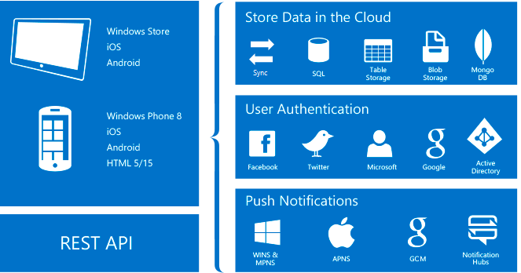

# About Mobile Apps in Azure App Service

> [!NOTE]
> Visual Studio App Center is investing in new and integrated services central to mobile app development. Developers can use **Build**, **Test** and **Distribute** services to set up Continuous Integration and Delivery pipeline. Once the app is deployed, developers can monitor the status and usage of their app using the **Analytics** and **Diagnostics** services, and engage with users using the **Push** service. Developers can also leverage **Auth** to authenticate their users and **Data** service to persist and sync app data in the cloud. Check out [App Center](https://appcenter.ms/?utm_source=zumo&utm_campaign=app-service-mobile-value-prop) today.
>

Azure App Service is a fully managed [platform as a service](https://azure.microsoft.com/overview/what-is-paas/) (PaaS) offering for professional developers. The service brings a rich set of capabilities to web, mobile, and integration scenarios. 

The Mobile Apps feature of Azure App Service gives enterprise developers and system integrators a mobile-application development platform that's highly scalable and globally available.

## Why Mobile Apps?
With the Mobile Apps feature, you can:

* **Build native and cross-platform apps**: Whether you're building native iOS, Android, and Windows apps or cross-platform Xamarin or Cordova (PhoneGap) apps, you can take advantage of App Service by using native SDKs.
* **Connect to your enterprise systems**: With the Mobile Apps feature, you can add corporate sign-in in minutes, and connect to your enterprise on-premises or cloud resources.
* **Build offline-ready apps with data sync**: Make your mobile workforce more productive by building apps that work offline, and use Mobile Apps to sync data in the background when connectivity is present with any of your enterprise data sources or software as a service (SaaS) APIs.
* **Push notifications to millions in seconds**: Engage your customers with instant push notifications on any device, personalized to their needs, and sent when the time is right.

## Mobile Apps features
The following features are important to cloud-enabled mobile development:

* **Authentication and authorization**: Support for identity providers, including Azure Active Directory for enterprise authentication, plus social providers such as Facebook, Google, Twitter, and Microsoft accounts. Mobile Apps offers an OAuth 2.0 service for each provider. You can also integrate the SDK for the identity provider for provider-specific functionality.

    Discover more about the [authentication features].

* **Data access**: Mobile Apps provides a mobile-friendly OData v3 data source that's linked to Azure SQL Database or an on-premises SQL server. Because this service can be based on Entity Framework, you can easily integrate with other NoSQL and SQL data providers, including [Azure Table storage], MongoDB, [Azure Cosmos DB], and SaaS API providers such as Office 365 and Salesforce.com.

* **Offline sync**: The client SDKs make it easy to build robust and responsive mobile applications that operate with an offline dataset. You can sync this dataset automatically with the back-end data, including conflict-resolution support.

  Discover more about the [data features].

* **Push notifications**: The client SDKs integrate seamlessly with the registration capabilities of Azure Notification Hubs, so you can send push notifications to millions of users simultaneously.

  Discover more about the [push notification features].

* **Client SDKs**: There is a complete set of client SDKs that cover native development ([iOS], [Android], and [Windows]), cross-platform development ([Xamarin.iOS and Xamarin.Android], [Xamarin.Forms]), and hybrid application development ([Apache Cordova]). Each client SDK is available with an MIT license and is open-source.

## Azure App Service features
The following platform features are useful for mobile production sites:

* **Autoscaling**: With App Service, you can quickly scale up or scale out to handle any incoming customer load. Manually select the number and size of VMs, or set up autoscaling to scale your mobile-app back end based on load or schedule.

  Discover more about [autoscaling].

* **Staging environments**: App Service can run multiple versions of your site, so you can perform A/B testing, test in production as part of a larger DevOps plan, and do in-place staging of a new back end.

  Discover more about [staging environments].

* **Continuous deployment**: App Service can integrate with common _source control management_ (SCM) systems, allowing you to easily deploy a new version of your back end.

  Discover more about [deployment options](../app-service/deploy-local-git.md).

* **Virtual networking**: App Service can connect to on-premises resources by using virtual network, Azure ExpressRoute, or hybrid connections.

  Discover more about [hybrid connections], [virtual networks], and [ExpressRoute].

* **Isolated and dedicated environments**: For securely running Azure App Service apps, you can run App Service in a fully isolated and dedicated environment. This environment is ideal for application workloads that require high scale, isolation, or secure network access.

  Discover more about [App Service environments].

## Next steps

To get started with Mobile Apps in Azure App Service, complete the [getting started] tutorial. The tutorial covers the basics
of producing a mobile back end and client of your choice. It also covers integrating authentication, offline sync, and push notifications. You can complete the tutorial multiple times, once for each client application.

For more information about Mobile Apps, review our [learning map].
For more information about the Azure App Service platform, see [Azure App Service].

<!-- URLs. -->
[Migrate your mobile service to App Service]: app-service-mobile-migrating-from-mobile-services.md
[getting started]: app-service-mobile-ios-get-started.md
[Azure Table storage]:../cosmos-db/table-storage-how-to-use-dotnet.md
[Azure Cosmos DB]: ../cosmos-db/sql-api-get-started.md
[authentication features]: ./app-service-mobile-auth.md
[data features]: ./app-service-mobile-offline-data-sync.md
[push notification features]: ../notification-hubs/notification-hubs-push-notification-overview.md
[iOS]: ./app-service-mobile-ios-how-to-use-client-library.md
[Android]: ./app-service-mobile-android-how-to-use-client-library.md
[Windows]: ./app-service-mobile-dotnet-how-to-use-client-library.md
[Xamarin.iOS and Xamarin.Android]: ./app-service-mobile-dotnet-how-to-use-client-library.md
[Xamarin.Forms]: ./app-service-mobile-xamarin-forms-get-started.md
[Apache Cordova]: ./app-service-mobile-cordova-how-to-use-client-library.md
[autoscaling]: ../app-service/web-sites-scale.md
[staging environments]: ../app-service/deploy-staging-slots.md
[hybrid connections]: ../biztalk-services/integration-hybrid-connection-overview.md
[virtual networks]: ../app-service/web-sites-integrate-with-vnet.md
[ExpressRoute]: ../app-service/environment/app-service-app-service-environment-network-configuration-expressroute.md
[App Service environments]: ../app-service/environment/intro.md
[learning map]: https://azure.microsoft.com/documentation/learning-paths/appservice-mobileapps/
