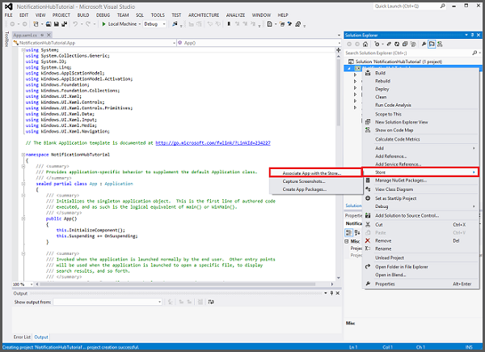
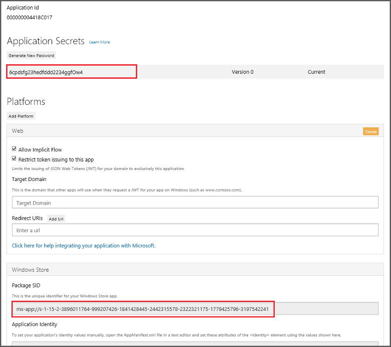

<properties
	pageTitle="Add push notifications to your Universal Windows Platform (UWP) app | Azure Mobile Apps"
	description="Learn how to use Azure App Service Mobile Apps and Azure Notification Hubs to send push notifications to your Universal Windows Platform (UWP) app."
	services="app-service\mobile,notification-hubs"
	documentationCenter="windows"
	authors="ggailey777"
	manager="dwrede"
	editor=""/>

<tags
	ms.service="app-service-mobile"
	ms.workload="mobile"
	ms.tgt_pltfrm="mobile-windows"
	ms.devlang="dotnet"
	ms.topic="article"
	ms.date="05/15/2016"
	ms.author="glenga"/>

# Add push notifications to your Windows app

[AZURE.INCLUDE [app-service-mobile-selector-get-started-push](../../includes/app-service-mobile-selector-get-started-push.md)]

##Overview

This topic shows you how to send push notifications to a Universal Windows Platform (UWP) app by using Mobile Apps in Azure App Service with Azure Notification Hubs. In this scenario, when a new item is added, your Mobile App backend sends a push notification to all Windows apps registered with the Windows Notification Service (WNS).

This tutorial is based on the Mobile Apps quickstart. Before you start this tutorial, you must first complete the quickstart tutorial [Create a Windows app](app-service-mobile-windows-store-dotnet-get-started.md). If you do not use the downloaded quick start server project, you must add the push notification extension package to your project. For more information about server extension packages, see [Work with the .NET backend server SDK for Azure Mobile Apps](app-service-mobile-dotnet-backend-how-to-use-server-sdk.md).

##Create a Notification Hub

[AZURE.INCLUDE [app-service-mobile-create-notification-hub](../../includes/app-service-mobile-create-notification-hub.md)]

##Register your app for push notifications

Before you can send push notifications to your Windows apps from Azure, you must submit your app to the Windows Store. You can then configure your server project to integrate with WNS.

1. In Visual Studio Solution Explorer, right-click the UWP app project, click **Store** > **Associate App with the Store...**. 

    
    
2. In the wizard, click **Next**, sign in with your Microsoft account, type a name for your app in **Reserve a new app name**, then click **Reserve**.

3. After the app registration is successfully created, select the new app name, click **Next**, and then click **Associate**. This adds the required Windows Store registration information to the application manifest.  

7. Navigate to the [Windows Dev Center](https://dev.windows.com/en-us/overview), sign-in with your Microsoft account, click the new app registration in **My apps**, then expand **Services** > **Push notifications**. 

8. In the **Push notifications** page, click **Live Services site** under **Microsoft Azure Mobile Services**.

9. In the registration page, make a note of the value under **Application secrets** and the **Package SID**, which you will next use to configure your mobile app backend. 

	

    > [AZURE.IMPORTANT] The client secret and package SID are important security credentials. Do not share these values with anyone or distribute them with your app. The **Application Id** is used with the secret to configure Microsoft Account authentication.

##Configure the backend to send push notifications

[AZURE.INCLUDE [app-service-mobile-configure-wns](../../includes/app-service-mobile-configure-wns.md)]

##Update the server to send push notifications

Now that push notifications are enabled in the app, you must update your app backend to send push notifications. Use the procedure below that matches your backend project type&mdash;either [.NET backend](#dotnet) or [Node.js backend](#nodejs).

### .NET backend project

1. In Visual Studio, right-click the server project and click **Manage NuGet Packages**, search for Microsoft.Azure.NotificationHubs, then click **Install**. This installs the Notification Hubs client library.

2. Expand **Controllers**, open TodoItemController.cs, and add the following using statements:

		using System.Collections.Generic;
		using Microsoft.Azure.NotificationHubs;
		using Microsoft.Azure.Mobile.Server.Config;

3. In the **PostTodoItem** method, add the following code after the call to **InsertAsync**:

	    // Get the settings for the server project.
	    HttpConfiguration config = this.Configuration;
	    MobileAppSettingsDictionary settings =
	        this.Configuration.GetMobileAppSettingsProvider().GetMobileAppSettings();

	    // Get the Notification Hubs credentials for the Mobile App.
	    string notificationHubName = settings.NotificationHubName;
	    string notificationHubConnection = settings
	        .Connections[MobileAppSettingsKeys.NotificationHubConnectionString].ConnectionString;

	    // Create the notification hub client.
	    NotificationHubClient hub = NotificationHubClient
	        .CreateClientFromConnectionString(notificationHubConnection, notificationHubName);

	    // Define a WNS payload
	    var windowsToastPayload = @"<toast><visual><binding template=""ToastText01""><text id=""1"">"
	                            + item.Text + @"</text></binding></visual></toast>";
	    try
	    {
	        // Send the push notification.
	        var result = await hub.SendWindowsNativeNotificationAsync(windowsToastPayload);

	        // Write the success result to the logs.
	        config.Services.GetTraceWriter().Info(result.State.ToString());
	    }
	    catch (System.Exception ex)
	    {
	        // Write the failure result to the logs.
	        config.Services.GetTraceWriter()
	            .Error(ex.Message, null, "Push.SendAsync Error");
	    }

	This code tells the notification hub to send a push notification after a new item is insertion.

4. Republish the server project.

### Node.js backend project

1. If you haven't already done so, [download the quickstart project](app-service-mobile-node-backend-how-to-use-server-sdk.md#download-quickstart) or else use the [online editor in the Azure portal](app-service-mobile-node-backend-how-to-use-server-sdk.md#online-editor).

2. Replace the existing code in the todoitem.js file with the following:

		var azureMobileApps = require('azure-mobile-apps'),
	    promises = require('azure-mobile-apps/src/utilities/promises'),
	    logger = require('azure-mobile-apps/src/logger');

		var table = azureMobileApps.table();

		table.insert(function (context) {
	    // For more information about the Notification Hubs JavaScript SDK,
	    // see http://aka.ms/nodejshubs
	    logger.info('Running TodoItem.insert');

	    // Define the WNS payload that contains the new item Text.
	    var payload = "<toast><visual><binding template=\ToastText01\><text id=\"1\">"
		                            + context.item.text + "</text></binding></visual></toast>";

	    // Execute the insert.  The insert returns the results as a Promise,
	    // Do the push as a post-execute action within the promise flow.
	    return context.execute()
	        .then(function (results) {
	            // Only do the push if configured
	            if (context.push) {
					// Send a WNS native toast notification.
	                context.push.wns.sendToast(null, payload, function (error) {
	                    if (error) {
	                        logger.error('Error while sending push notification: ', error);
	                    } else {
	                        logger.info('Push notification sent successfully!');
	                    }
	                });
	            }
	            // Don't forget to return the results from the context.execute()
	            return results;
	        })
	        .catch(function (error) {
	            logger.error('Error while running context.execute: ', error);
	        });
		});

		module.exports = table;

	This sends a WNS toast notification that contains the item.text when a new todo item is inserted.

2. When editing the file on your local computer, republish the server project.

##Add push notifications to your app

Next, your app must register for push notifications on start-up. When you have already enabled authentication, make sure that the user signs-in before trying to register for push notifications. For more information, see [Authenticate first](https://github.com/Azure-Samples/app-service-mobile-windows-quickstart/blob/master/README.md#authenticate-first) in the quick start complete sample.

1. Open the **App.xaml.cs** project file and add the following `using` statements:

		using System.Threading.Tasks;
        using Windows.Networking.PushNotifications;

2. In the same file, add the following **InitNotificationsAsync** method definition to the **App** class:

        private async Task InitNotificationsAsync()
        {
            // Get a channel URI from WNS.
            var channel = await PushNotificationChannelManager
                .CreatePushNotificationChannelForApplicationAsync();

            // Register the channel URI with Notification Hubs.
            await App.MobileService.GetPush().RegisterAsync(channel.Uri);
        }

    This code retrieves the ChannelURI for the app from WNS, and then registers that ChannelURI with your App Service Mobile App.

3. At the top of the **OnLaunched** event handler in **App.xaml.cs**, add the **async** modifier to the method definition and add the following call to the new **InitNotificationsAsync** method, as in the following example:

        protected async override void OnLaunched(LaunchActivatedEventArgs e)
        {
            await InitNotificationsAsync();

			// ...
		}

    This guarantees that the short-lived ChannelURI is registered each time the application is launched.

4. Rebuild your UWP app project. Your app is now ready to receive toast notifications.

##Test push notifications in your app

[AZURE.INCLUDE [app-service-mobile-windows-universal-test-push](../../includes/app-service-mobile-windows-universal-test-push.md)]

##Next steps

Learn more about push notifications:

* [How to use the managed client for Azure Mobile Apps](app-service-mobile-dotnet-how-to-use-client-library.md#how-to-register-push-templates-to-send-cross-platform-notifications)  
Templates give you flexibility to send cross-platform pushes and localized pushes. Learn how to register templates.

* [Work with the .NET backend server SDK for Azure Mobile Apps](app-service-mobile-dotnet-backend-how-to-use-server-sdk.md#how-to-add-tags-to-a-device-installation-to-enable-push-to-tags)  
Tags allow you to target segmented customers with pushes.  Learn how to add tags to a device installation.

* [Diagnose push notification issues](../notification-hubs/notification-hubs-push-notification-fixer.md)  
There are various reasons why notifications may get dropped or do not end up on devices. This topic shows you how to analyze and figure out the root cause of push notification failures. 

Consider continuing on to one of the following tutorials:

+ [Add authentication to your app](app-service-mobile-windows-store-dotnet-get-started-users.md)  
  Learn how to authenticate users of your app with an identity provider.

+ [Enable offline sync for your app](app-service-mobile-windows-store-dotnet-get-started-offline-data.md)  
  Learn how to add offline support your app using an Mobile App backend. Offline sync allows end-users to interact with a mobile app&mdash;viewing, adding, or modifying data&mdash;even when there is no network connection.

<!-- Anchors. -->

<!-- URLs. -->
[Azure Portal]: https://portal.azure.com/

<!-- Images. -->

