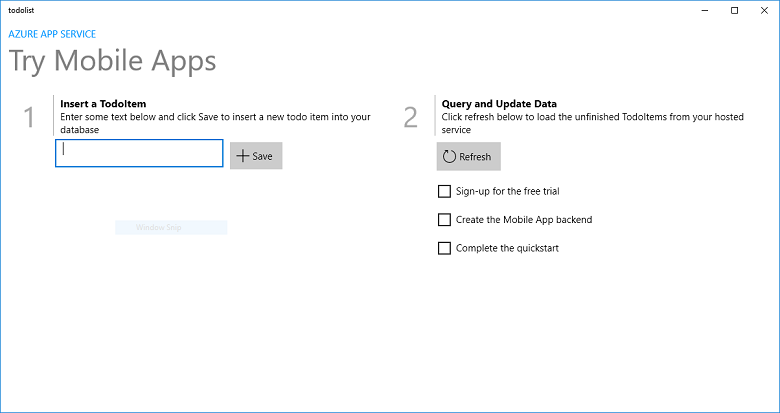
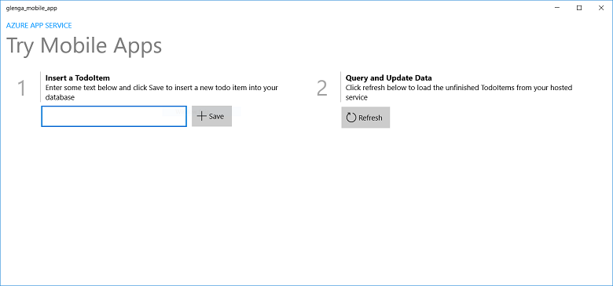

# Create a Windows app with an Azure backend

[!INCLUDE [app-service-mobile-selector-get-started](../../includes/app-service-mobile-selector-get-started.md)]

> [!NOTE]
> Visual Studio App Center is investing in new and integrated services central to mobile app development. Developers can use **Build**, **Test** and **Distribute** services to set up Continuous Integration and Delivery pipeline. Once the app is deployed, developers can monitor the status and usage of their app using the **Analytics** and **Diagnostics** services, and engage with users using the **Push** service. Developers can also leverage **Auth** to authenticate their users and **Data** service to persist and sync app data in the cloud. Check out [App Center](https://appcenter.ms/?utm_source=zumo&utm_campaign=app-service-mobile-windows-store-dotnet-get-started) today.
>

## Overview

This tutorial shows you how to add a cloud-based backend service to a Universal Windows Platform (UWP) app. For more information, see [What are Mobile Apps](app-service-mobile-value-prop.md). The following are screen captures from the completed app:

Completing this tutorial is a prerequisite for all other Mobile App tutorials for UWP apps.

## Prerequisites

To complete this tutorial, you need the following:

* An active Azure account. If you don't have an account, you can sign up for an Azure trial and get up to 10 free mobile apps that you can keep using even after your trial ends. For details, see [Azure Free Trial](https://azure.microsoft.com/pricing/free-trial/).
* Windows 10.
* Visual Studio Community 2017.
* Familiarity with UWP app development. Visit the [UWP documentation](https://docs.microsoft.com/windows/uwp/) to learn how to [get set up](https://docs.microsoft.com/windows/uwp/get-started/get-set-up) to build UWP apps.

## Create a new Azure Mobile App backend

Follow these steps to create a new Mobile App backend.

[!INCLUDE [app-service-mobile-dotnet-backend-create-new-service](../../includes/app-service-mobile-dotnet-backend-create-new-service.md)]

## Create a database connection and configure the client and server project
[!INCLUDE [app-service-mobile-configure-new-backend.md](../../includes/app-service-mobile-configure-new-backend.md)]

## Run the client project

1. Open the UWP project.

2. Go to the [Azure portal](https://portal.azure.com/) and navigate to the mobile app that you created. On the `Overview` blade, look for the URL which is the public endpoint for your mobile app. Example - the sitename for my app name "test123" will be https://test123.azurewebsites.net.

3. Open the file `App.xaml.cs` in this folder - windows-uwp-cs/ZUMOAPPNAME/. The application name is `ZUMOAPPNAME`.

4. In `App` class, replace `ZUMOAPPURL` parameter with public endpoint above.

    `public static MobileServiceClient MobileService = new MobileServiceClient("ZUMOAPPURL");`

    becomes
    
    `public static MobileServiceClient MobileService = new MobileServiceClient("https://test123.azurewebsites.net");`

5. Press the F5 key to deploy and run the app.

6. In the app, type meaningful text, such as *Complete the tutorial*, in the **Insert a TodoItem** text box, and then click **Save**.

    

    This sends a POST request to the new mobile app backend that's hosted in Azure.
