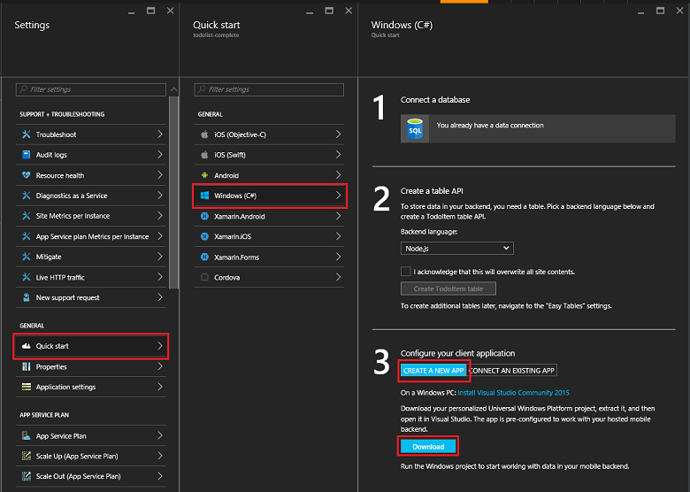

# Create a Windows app

[!INCLUDE [app-service-mobile-selector-get-started](../../includes/app-service-mobile-selector-get-started.md)]

## Overview

This tutorial shows you how to add a cloud-based backend service to a Universal Windows Platform (UWP) app. For more information, see [What are Mobile Apps](app-service-mobile-value-prop.md). The following are screen captures from the completed app:

Completing this tutorial is a prerequisite for all other Mobile App tutorials for UWP apps.

## Prerequisites

To complete this tutorial, you need the following:

* An active Azure account. If you don't have an account, you can sign up for an Azure trial and get up to 10 free mobile apps that you can keep using even after your trial ends. For details, see [Azure Free Trial](https://azure.microsoft.com/pricing/free-trial/).
* [Visual Studio Community 2017].

## Create a new Azure Mobile App backend

Follow these steps to create a new Mobile App backend.

[!INCLUDE [app-service-mobile-dotnet-backend-create-new-service](../../includes/app-service-mobile-dotnet-backend-create-new-service.md)]

You have now provisioned an Azure Mobile App backend that can be used by your mobile client applications. Next, you will download a server project for a simple "todo list" backend and publish it to Azure.

## Configure the server project

[!INCLUDE [app-service-mobile-configure-new-backend.md](../../includes/app-service-mobile-configure-new-backend.md)]

## Download and run the client project

Once you have configured your Mobile App backend, you can either create a new client app or modify an existing app to connect to Azure. In this section, you download a UWP sample app project that is customized to connect to your Mobile App backend.

1. Back in the **Quick start** blade for your Mobile App backend, click **Create a new app** > **Download**, then extract the compressed project files to your local computer.

    

2. Open the UWP project and press the F5 key to deploy and run the app.
3. In the app, type meaningful text, such as *Complete the tutorial*, in the **Insert a TodoItem** text box, and then click **Save**.

    

    This sends a POST request to the new mobile app backend that's hosted in Azure.

> [!TIP]
> You can add the UWP app project to the same solution as the server project if you are using the .NET backend. This makes it easier to debug and test both the app and the backend in the same Visual Studio solution. To add a UWP app project to the backend solution, you must be using Visual Studio 2017.

## Next steps

* [Add authentication to your app](app-service-mobile-windows-store-dotnet-get-started-users.md)  
  Learn how to authenticate users of your app with an identity provider.
* [Add push notifications to your app](app-service-mobile-windows-store-dotnet-get-started-push.md)  
  Learn how to add push notifications support to your app and configure your Mobile App backend to use Azure Notification Hubs to send push notifications.
* [Enable offline sync for your app](app-service-mobile-windows-store-dotnet-get-started-offline-data.md)  
  Learn how to add offline support your app using a Mobile App backend. Offline sync allows end-users to interact with a mobile app&mdash;viewing, adding, or modifying data&mdash;even when there is no network connection.

<!-- Anchors. -->
<!-- Images. -->
<!-- URLs. -->
[Mobile App SDK]: http://go.microsoft.com/fwlink/?LinkId=257545
[Azure portal]: https://portal.azure.com/
[Visual Studio Community 2017]: https://go.microsoft.com/fwLink/p/?LinkID=534203
