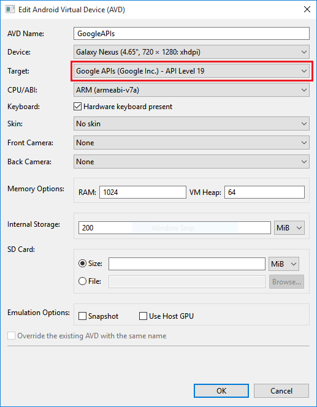
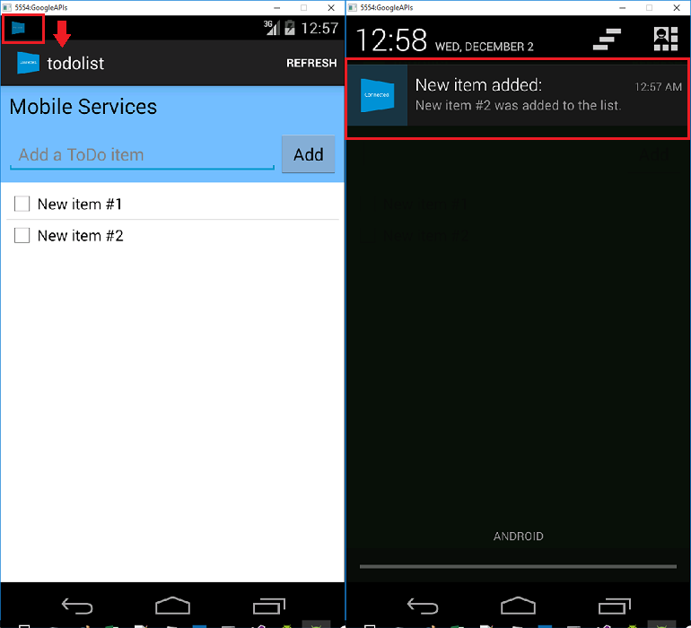

# Add push notifications to your Xamarin.Android app

[!INCLUDE [app-service-mobile-selector-get-started-push](../../includes/app-service-mobile-selector-get-started-push.md)]

## Overview

In this tutorial, you add push notifications to the [Xamarin.Android quickstart](app-service-mobile-windows-store-dotnet-get-started.md) project so that a push notification is sent to the device every time a record is inserted.

If you do not use the downloaded quickstart server project, you will need the push notification extension package. For more information, see the [Work with the .NET backend server SDK for Azure Mobile Apps](app-service-mobile-dotnet-backend-how-to-use-server-sdk.md) guide.

## Prerequisites

This tutorial requires the  setup:

* An active Google account. You can sign up for a Google account at [accounts.google.com](http://go.microsoft.com/fwlink/p/?LinkId=268302).
* [Google Cloud Messaging Client Component](http://components.xamarin.com/view/GCMClient/).

## Configure a Notification Hub

[!INCLUDE [app-service-mobile-configure-notification-hub](../../includes/app-service-mobile-configure-notification-hub.md)]

## Enable Firebase Cloud Messaging

[!INCLUDE [notification-hubs-enable-firebase-cloud-messaging](../../includes/notification-hubs-enable-firebase-cloud-messaging.md)]

## Configure Azure to send push requests

[!INCLUDE [app-service-mobile-android-configure-push](../../includes/app-service-mobile-android-configure-push-for-firebase.md)]

## Update the server project to send push notifications

[!INCLUDE [app-service-mobile-update-server-project-for-push-template](../../includes/app-service-mobile-update-server-project-for-push-template.md)]

## Configure the client project for push notifications

[!INCLUDE [mobile-services-xamarin-android-push-configure-project](../../includes/mobile-services-xamarin-android-push-configure-project.md)]

## Add push notifications code to your app

[!INCLUDE [app-service-mobile-xamarin-android-push-add-to-app](../../includes/app-service-mobile-xamarin-android-push-add-to-app.md)]

## Test push notifications in your app

You can test the app by using a virtual device in the emulator. There are additional configuration steps required when running on an emulator.

1. The virtual device must have Google APIs set as the target in the Android Virtual Device (AVD) manager.

    

2. Add a Google account to the Android device by clicking **Apps** > **Settings** > **Add account**, then follow the prompts.

    

3. Run the todolist app as before and insert a new todo item. This time, a notification icon is displayed in the notification area. You can open the notification drawer to view the full text of the notification.

    

<!-- URLs. -->
[Xamarin.Android quick start]: app-service-mobile-xamarin-android-get-started.md
[Google Cloud Messaging Client Component]: http://components.xamarin.com/view/GCMClient/
[Azure Mobile Services Component]: http://components.xamarin.com/view/azure-mobile-services/
