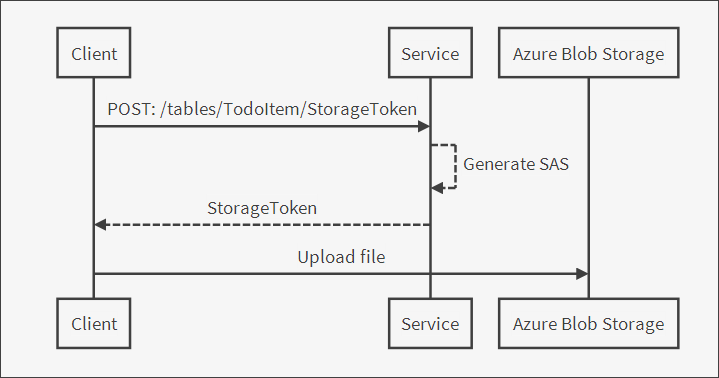

<properties
    pageTitle="Connect to Azure Storage in your Xamarin.Forms app"
    description="Add images to the todo list Xamarin.Forms mobile app by connecting to Azure blob storage"
    documentationCenter="xamarin"
    authors="lindydonna"
    manager="erikre"
    editor=""
    services="app-service\mobile"/>

<tags
    ms.service="app-service-mobile"
    ms.workload="mobile"
    ms.tgt_pltfrm="mobile-xamarin-ios"
    ms.devlang="dotnet"
    ms.topic="article"
    ms.date="05/10/2016"
    ms.author="donnam"/>

#Connect to Azure Storage in your Xamarin.Forms app

## Overview

The Azure Mobile Apps client and server SDK support offline sync of structured data with CRUD operations against the /tables endpoint. Generally this data is stored in a database or similar store, and generally these data stores cannot store large binary data efficiently. Also, some applications have related data that is stored elsewhere (e.g., blob storage, files shares), and it is useful to be able to create associations between records in the /tables endpoint and other data.

This topic shows you how to add support for images to the Mobile Apps todo list quickstart. You must first complete the tutorial [Create a Xamarin.Forms app].

In this tutorial, you will create a storage account and add a connection string to your Mobile App backend. You will then add a new inheriting from the new Mobile Apps type `StorageController<T>` to your server project.

>[AZURE.TIP] This tutorial has a [companion sample](https://azure.microsoft.com/documentation/samples/app-service-mobile-dotnet-todo-list-files/) available, which can be deployed to your own Azure account. 

## Prerequisites

* Complete the [Create a Xamarin.Forms app] tutorial, which lists other prerequisites. This article uses the completed app from that tutorial.

>[AZURE.NOTE] If you want to get started with Azure App Service before you sign up for an Azure account, go to [Try App Service](https://tryappservice.azure.com/?appServiceName=mobile). There, you can immediately create a short-lived starter mobile app in App Service—no credit card required, and no commitments.

## Create a storage account

1. Create a storage account by following the tutorial [Create an Azure Storage Account]. 

2. In the Azure Portal, navigate to your newly created storage account and click the **Keys** icon. Copy the **Primary Connection String**.

3. Navigate to your mobile app backend. Under **All Settings** -> **Application Settings** -> **Connection Strings**, create a new key named `MS_AzureStorageAccountConnectionString` and use the value copied from your storage account. Use **Custom** as the key type.

## Add a storage controller to the server

You need to add a new controller to your server project that will respond to requests for a SAS token for Azure Storage, as well as return a list of files that correspond to a record:

- [Add a storage controller to your server project](#add-controller-code)
- [Routes registered by the storage controller](#routes-registered)
- [Client and server communication](#client-communication)

###Add a storage controller to your server project

1. In Visual Studio, open your .NET server project. Add the NuGet package [Microsoft.Azure.Mobile.Server.Files]. Be sure to select **Include prerelease**.

2. In Visual Studio, open your .NET server project. Right-click the **Controllers** folder and select **Add** -> **Controller** -> **Web API 2 Controller - Empty**. Name the controller `TodoItemStorageController`.

3. Add the following using statements:

        using Microsoft.Azure.Mobile.Server.Files;
        using Microsoft.Azure.Mobile.Server.Files.Controllers;

4. Change the base class to `StorageController`:
    
        public class TodoItemStorageController : StorageController<TodoItem>

5. Add the following methods to the class:

        [HttpPost]
        [Route("tables/TodoItem/{id}/StorageToken")]
        public async Task<HttpResponseMessage> PostStorageTokenRequest(string id, StorageTokenRequest value)
        {
            StorageToken token = await GetStorageTokenAsync(id, value);

            return Request.CreateResponse(token);
        }

        // Get the files associated with this record
        [HttpGet]
        [Route("tables/TodoItem/{id}/MobileServiceFiles")]
        public async Task<HttpResponseMessage> GetFiles(string id)
        {
            IEnumerable<MobileServiceFile> files = await GetRecordFilesAsync(id);

            return Request.CreateResponse(files);
        }

        [HttpDelete]
        [Route("tables/TodoItem/{id}/MobileServiceFiles/{name}")]
        public Task Delete(string id, string name)
        {
            return base.DeleteFileAsync(id, name);
        }

6. Update the Web API configuration to set up attribute routing. In **Startup.MobileApp.cs**, add the following line to the `ConfigureMobileApp()` method, after the definition of the `config` variable:

        config.MapHttpAttributeRoutes();

7. Publish your server project to your mobile app backend.

###Routes registered by the storage controller

The new `TodoItemStorageController` exposes two sub-resources under the record it manages:

- StorageToken

    + HTTP POST : Creates a storage token
    
        `/tables/TodoItem/{id}/MobileServiceFiles`
    
- MobileServiceFiles

    + HTTP GET: Retrieves a list of files associated with the record
    
        `/tables/TodoItem/{id}/MobileServiceFiles`

    + HTTP DELETE: Deletes the file specified in the file resource identifier
    
        `/tables/TodoItem/{id}/MobileServiceFiles/{fileid}`

###Client and server communication

Note that `TodoItemStorageController` does *not* have a route for uploading or downloading a blob. That is because a mobile client interacts with blob storage *directly* in order to perform these operations, after first getting a SAS token (Shared Access Signature) to securely access a particular blob or container. This is an important architectural design, as otherwise access to storage would be limited by the scalability and availability of the mobile backend. Instead, by connecting directly to Azure Storage, the mobile client can take advantage of its features such as auto-partitioning and geo-distribution.

A shared access signature provides delegated access to resources in your storage account. This means that you can grant a client limited permissions to objects in your storage account for a specified period of time and with a specified set of permissions, without having to share your account access keys. To learn more, see [Understanding Shared Access Signatures].

The diagram below shows the client and server interactions. Before uploading a file, the client requests a SAS token from the service. The service uses the storage connection string to generate a new SAS, which it then returns to the client. The SAS is time-limited and restricts permissions to just a particular file or container. The mobile client then uses this SAS and the Azure Storage client SDK to upload the file to blob storage.

## Update your client app to add image support

Open the Xamarin.Forms quickstart project in either Visual Studio or Xamarin Studio. You will install NuGet packages and update the portable library project and the iOS, Android, and Windows client projects:

- [Add NuGet packages](#add-nuget)
- [Add IPlatform interface](#add-iplatform)
- [Add FileHelper class](#add-filehelper)
- [Add a file sync handler](#file-sync-handler)
- [Update TodoItemManager](#update-todoitemmanager)
- [Add a details view](#add-details-view)
- [Update the main view ](#update-main-view)
- [Update the Android project](#update-android), [iOS project](#update-ios), [Windows project](#update-windows)

>[AZURE.NOTE] This tutorial only contains instructions for the Android, iOS, and Windows Store platforms, not Windows Phone.

###Add NuGet packages

Right-click the solution and select **Manage NuGet packages for solution**. Add the following NuGet packages to **all** projects in the solution. Be sure to check **Include prerelease**.

  - [Microsoft.Azure.Mobile.Client.Files]

  - [Microsoft.Azure.Mobile.Client.SQLiteStore]

  - [PCLStorage]

For convenience, this sample uses the [PCLStorage] library, but it is not required by the Azure Mobile Apps client SDK.

[PCLStorage]: https://www.nuget.org/packages/PCLStorage/

###Add IPlatform interface

Create a new interface `IPlatform` in the main portable library project. This follows the [Xamarin.Forms DependencyService] pattern to load the right platform-specific class at runtime. You will later add platform specific implementations in each of the client projects.

1. Add the following using statements:

        using Microsoft.WindowsAzure.MobileServices.Files;
        using Microsoft.WindowsAzure.MobileServices.Files.Metadata;
        using Microsoft.WindowsAzure.MobileServices.Sync;

2. Replace the implementation with the following:

        public interface IPlatform
        {
            Task <string> GetTodoFilesPathAsync();

            Task<IMobileServiceFileDataSource> GetFileDataSource(MobileServiceFileMetadata metadata);

            Task<string> TakePhotoAsync(object context);

            Task DownloadFileAsync<T>(IMobileServiceSyncTable<T> table, MobileServiceFile file, string filename);
        }

###Add FileHelper class

1. Create a new class `FileHelper` in the main portable library project. Add the following using statements:

        using System.IO;
        using PCLStorage;
        using System.Threading.Tasks;
        using Xamarin.Forms;

2. Add the class definition:

        public class FileHelper
        {
            public static async Task<string> CopyTodoItemFileAsync(string itemId, string filePath)
            {
                IFolder localStorage = FileSystem.Current.LocalStorage;

                string fileName = Path.GetFileName(filePath);
                string targetPath = await GetLocalFilePathAsync(itemId, fileName);

                var sourceFile = await localStorage.GetFileAsync(filePath);
                var sourceStream = await sourceFile.OpenAsync(FileAccess.Read);

                var targetFile = await localStorage.CreateFileAsync(targetPath, CreationCollisionOption.ReplaceExisting);

                using (var targetStream = await targetFile.OpenAsync(FileAccess.ReadAndWrite)) {
                    await sourceStream.CopyToAsync(targetStream);
                }

                return targetPath;
            }

            public static async Task<string> GetLocalFilePathAsync(string itemId, string fileName)
            {
                IPlatform platform = DependencyService.Get<IPlatform>();

                string recordFilesPath = Path.Combine(await platform.GetTodoFilesPathAsync(), itemId);

                    var checkExists = await FileSystem.Current.LocalStorage.CheckExistsAsync(recordFilesPath);
                    if (checkExists == ExistenceCheckResult.NotFound) {
                        await FileSystem.Current.LocalStorage.CreateFolderAsync(recordFilesPath, CreationCollisionOption.ReplaceExisting);
                    }

                return Path.Combine(recordFilesPath, fileName);
            }

            public static async Task DeleteLocalFileAsync(Microsoft.WindowsAzure.MobileServices.Files.MobileServiceFile fileName)
            {
                string localPath = await GetLocalFilePathAsync(fileName.ParentId, fileName.Name);
                var checkExists = await FileSystem.Current.LocalStorage.CheckExistsAsync(localPath);

                if (checkExists == ExistenceCheckResult.FileExists) {
                    var file = await FileSystem.Current.LocalStorage.GetFileAsync(localPath);
                    await file.DeleteAsync();
                }
            }
        }

### Add a file sync handler

Create a new class `TodoItemFileSyncHandler` in the main portable library project. This class contains callbacks from the Azure SDK to notify your code when a file is added or removed.

The Azure Mobile Client SDK does not store actually store any file data: the client SDK invokes your implementation of `IFileSyncHandler` which in turn determines whether and how files are stored on the local device.

1. Add the following using statements:

        using System.Threading.Tasks;
        using Microsoft.WindowsAzure.MobileServices.Files.Sync;
        using Microsoft.WindowsAzure.MobileServices.Files;
        using Microsoft.WindowsAzure.MobileServices.Files.Metadata;
        using Xamarin.Forms;

2. Replace the class definition with the following: 

        public class TodoItemFileSyncHandler : IFileSyncHandler
        {
            private readonly TodoItemManager todoItemManager;

            public TodoItemFileSyncHandler(TodoItemManager itemManager)
            {
                this.todoItemManager = itemManager;
            }

            public Task<IMobileServiceFileDataSource> GetDataSource(MobileServiceFileMetadata metadata)
            {
                IPlatform platform = DependencyService.Get<IPlatform>();
                return platform.GetFileDataSource(metadata);
            }

            public async Task ProcessFileSynchronizationAction(MobileServiceFile file, FileSynchronizationAction action)
            {
                if (action == FileSynchronizationAction.Delete) {
                    await FileHelper.DeleteLocalFileAsync(file);
                }
                else { // Create or update. We're aggressively downloading all files.
                    await this.todoItemManager.DownloadFileAsync(file);
                }
            }
        }

###Update TodoItemManager

1. In **TodoItemManager.cs**, uncomment the line `#define OFFLINE_SYNC_ENABLED`.

2. In **TodoItemManager.cs**, add the following using statements:

        using System.IO;
        using Xamarin.Forms;
        using Microsoft.WindowsAzure.MobileServices.Files;
        using Microsoft.WindowsAzure.MobileServices.Files.Sync;
        using Microsoft.WindowsAzure.MobileServices.Eventing;

3. In the constructor of `TodoItemManager`, add the following after the call to `DefineTable()`:

        // Initialize file sync
        this.client.InitializeFileSyncContext(new TodoItemFileSyncHandler(this), store);

4. In the constructor, replace the call to `InitializeAsync` with the following. This will ensure that there are callbacks when records are modified in the local store. The file sync feature uses these callbacks to trigger your file sync handler.

        this.client.SyncContext.InitializeAsync(store, StoreTrackingOptions.NotifyLocalAndServerOperations);

5. In `SyncAsync()`, add the following after the call to `PushAsync()`:

        await this.todoTable.PushFileChangesAsync();

6. Add the following methods to `TodoItemManager`:

        internal async Task DownloadFileAsync(MobileServiceFile file)
        {
            var todoItem = await todoTable.LookupAsync(file.ParentId);
            IPlatform platform = DependencyService.Get<IPlatform>();

            string filePath = await FileHelper.GetLocalFilePathAsync(file.ParentId, file.Name); 
            await platform.DownloadFileAsync(this.todoTable, file, filePath);
        }

        internal async Task<MobileServiceFile> AddImage(TodoItem todoItem, string imagePath)
        {
            string targetPath = await FileHelper.CopyTodoItemFileAsync(todoItem.Id, imagePath);
            return await this.todoTable.AddFileAsync(todoItem, Path.GetFileName(targetPath));
        }

        internal async Task DeleteImage(TodoItem todoItem, MobileServiceFile file)
        {
            await this.todoTable.DeleteFileAsync(file);
        }

        internal async Task<IEnumerable<MobileServiceFile>> GetImageFilesAsync(TodoItem todoItem)
        {
            return await this.todoTable.GetFilesAsync(todoItem);
        }

###Add a details view

In this section, you will add a new details view for a todo item. The view is created when the user selects a todo item and it allows new images to be added to an item.

1. Add a new class **TodoItemImage** to the portable library project with the following implementation:

        public class TodoItemImage : INotifyPropertyChanged
        {
            private string name;
            private string uri;

            public MobileServiceFile File { get; private set; }

            public string Name
            {
                get { return name; }
                set
                {
                    name = value;
                    OnPropertyChanged(nameof(Name));
                }
            }

            public string Uri
            {
                get { return uri; }      
                set
                {
                    uri = value;
                    OnPropertyChanged(nameof(Uri));
                }
            }

            public TodoItemImage(MobileServiceFile file, TodoItem todoItem)
            {
                Name = file.Name;
                File = file;

                FileHelper.GetLocalFilePathAsync(todoItem.Id, file.Name).ContinueWith(x => this.Uri = x.Result);
            }

            public event PropertyChangedEventHandler PropertyChanged;

            private void OnPropertyChanged(string propertyName)
            {
                PropertyChanged?.Invoke(this, new PropertyChangedEventArgs(propertyName));
            }
        }

2. Edit **App.cs**. Replace the initialization of `MainPage` with the following:
    
        MainPage = new NavigationPage(new TodoList());

3. In **App.cs**, add the following property:

        public static object UIContext { get; set; }

4. Right-click the portable library project and select **Add** -> **New Item** -> **Cross-platform** -> **Forms Xaml Page**. Name the view `TodoItemDetailsView`.

5. Open **TodoItemDetailsView.xaml** and replace the body of the ContentPage with the following:

          <Grid>
            <Grid.RowDefinitions>
              <RowDefinition Height="Auto"/>
              <RowDefinition Height="Auto"/>
              <RowDefinition Height="*"/>
            </Grid.RowDefinitions>
            <Button Clicked="OnAdd" Text="Add image"></Button>
            <ListView x:Name="imagesList"
                      ItemsSource="{Binding Images}"
                      IsPullToRefreshEnabled="false"
                      Grid.Row="2">
              <ListView.ItemTemplate>
                <DataTemplate>
                  <ImageCell ImageSource="{Binding Uri}"
                             Text="{Binding Name}">
                  </ImageCell>
                </DataTemplate>
              </ListView.ItemTemplate>
            </ListView>
          </Grid>

6. Edit **TodoItemDetailsView.xaml.cs** and add the following using statements:

        using System.Collections.ObjectModel;
        using Microsoft.WindowsAzure.MobileServices.Files;

7. Replace the implementation of `TodoItemDetailsView` with the following:

        public partial class TodoItemDetailsView : ContentPage
        {
            private TodoItemManager manager;

            public TodoItem TodoItem { get; set; }        
            public ObservableCollection<TodoItemImage> Images { get; set; }

            public TodoItemDetailsView(TodoItem todoItem, TodoItemManager manager)
            {
                InitializeComponent();
                this.Title = todoItem.Name;

                this.TodoItem = todoItem;
                this.manager = manager;

                this.Images = new ObservableCollection<TodoItemImage>();
                this.BindingContext = this;
            }

            public async Task LoadImagesAsync()
            {
                IEnumerable<MobileServiceFile> files = await this.manager.GetImageFilesAsync(TodoItem);
                this.Images.Clear();

                foreach (var f in files) {
                    var todoImage = new TodoItemImage(f, this.TodoItem);
                    this.Images.Add(todoImage);
                }
            }

            public async void OnAdd(object sender, EventArgs e)
            {
                IPlatform mediaProvider = DependencyService.Get<IPlatform>();
                string sourceImagePath = await mediaProvider.TakePhotoAsync(App.UIContext);

                if (sourceImagePath != null) {
                    MobileServiceFile file = await this.manager.AddImage(this.TodoItem, sourceImagePath);

                    var image = new TodoItemImage(file, this.TodoItem);
                    this.Images.Add(image);
                }
            }
        }

###Update the main view 

Update the main view to open the details view when a todo item is selected.

In **TodoList.xaml.cs**, replace the implementation of `OnSelected` with the following:

    public async void OnSelected(object sender, SelectedItemChangedEventArgs e)
    {
        var todo = e.SelectedItem as TodoItem;

        if (todo != null) {
            var detailsView = new TodoItemDetailsView(todo, manager);
            await detailsView.LoadImagesAsync();
            await Navigation.PushAsync(detailsView);
        }

        todoList.SelectedItem = null;
    }

###Update the Android project

Add platform-specific code to the Android project, including code for downloading a file and using the camera to capture a new image. 

This code uses the Xamarin.Forms [DependencyService](https://developer.xamarin.com/guides/xamarin-forms/dependency-service/) to load the right platform-specific class at runtime.

1. Add the component **Xamarin.Mobile** to the Android project.

2. Add a new class `DroidPlatform` with the following implementation. Replace "YourNamespace" with the main namespace of your project.

        using System;
        using System.IO;
        using System.Threading.Tasks;
        using Android.Content;
        using Microsoft.WindowsAzure.MobileServices.Files;
        using Microsoft.WindowsAzure.MobileServices.Files.Metadata;
        using Microsoft.WindowsAzure.MobileServices.Files.Sync;
        using Microsoft.WindowsAzure.MobileServices.Sync;
        using Xamarin.Media;

        [assembly: Xamarin.Forms.Dependency(typeof(YourNamespace.Droid.DroidPlatform))]
        namespace YourNamespace.Droid
        {
            public class DroidPlatform : IPlatform
            {
                public async Task DownloadFileAsync<T>(IMobileServiceSyncTable<T> table, MobileServiceFile file, string filename)
                {
                    var path = await FileHelper.GetLocalFilePathAsync(file.ParentId, file.Name);
                    await table.DownloadFileAsync(file, path);
                }

                public async Task<IMobileServiceFileDataSource> GetFileDataSource(MobileServiceFileMetadata metadata)
                {
                    var filePath = await FileHelper.GetLocalFilePathAsync(metadata.ParentDataItemId, metadata.FileName);
                    return new PathMobileServiceFileDataSource(filePath);
                }

                public async Task<string> TakePhotoAsync(object context)
                {
                    try {
                        var uiContext = context as Context;
                        if (uiContext != null) {
                            var mediaPicker = new MediaPicker(uiContext);
                            var photo = await mediaPicker.TakePhotoAsync(new StoreCameraMediaOptions());

                            return photo.Path;
                        }
                    }
                    catch (TaskCanceledException) {
                    }

                    return null;
                }

                public Task<string> GetTodoFilesPathAsync()
                {
                    string appData = Environment.GetFolderPath(Environment.SpecialFolder.MyDocuments);
                    string filesPath = Path.Combine(appData, "TodoItemFiles");

                    if (!Directory.Exists(filesPath)) {
                        Directory.CreateDirectory(filesPath);
                    }

                    return Task.FromResult(filesPath);
                }
            }
        }

3. Edit **MainActivity.cs**. In `OnCreate`, add the following before the call to `LoadApplication()`:

        App.UIContext = this;

###Update the iOS project

Add platform-specific code to the iOS project.

1. Add the component **Xamarin.Mobile** to the iOS project.

2. Add a new class `TouchPlatform` with the following implementation. Replace "YourNamespace" with the main namespace of your project.

        using System;
        using System.Collections.Generic;
        using System.IO;
        using System.Text;
        using System.Threading.Tasks;
        using Microsoft.WindowsAzure.MobileServices.Files;
        using Microsoft.WindowsAzure.MobileServices.Files.Metadata;
        using Microsoft.WindowsAzure.MobileServices.Files.Sync;
        using Microsoft.WindowsAzure.MobileServices.Sync;
        using Xamarin.Media;

        [assembly: Xamarin.Forms.Dependency(typeof(YourNamespace.iOS.TouchPlatform))]
        namespace YourNamespace.iOS
        {
            class TouchPlatform : IPlatform
            {
                public async Task DownloadFileAsync<T>(IMobileServiceSyncTable<T> table, MobileServiceFile file, string filename)
                {
                    var path = await FileHelper.GetLocalFilePathAsync(file.ParentId, file.Name);
                    await table.DownloadFileAsync(file, path);
                }

                public async Task<IMobileServiceFileDataSource> GetFileDataSource(MobileServiceFileMetadata metadata)
                {
                    var filePath = await FileHelper.GetLocalFilePathAsync(metadata.ParentDataItemId, metadata.FileName);
                    return new PathMobileServiceFileDataSource(filePath);
                }

                public async Task<string> TakePhotoAsync(object context)
                {
                    try {
                        var mediaPicker = new MediaPicker();
                        var mediaFile = await mediaPicker.PickPhotoAsync();
                        return mediaFile.Path;
                    }
                    catch (TaskCanceledException) {
                        return null;
                    }
                }

                public Task<string> GetTodoFilesPathAsync()
                {
                    string filesPath = Path.Combine(Environment.GetFolderPath(Environment.SpecialFolder.MyDocuments), "TodoItemFiles");

                    if (!Directory.Exists(filesPath)) {
                        Directory.CreateDirectory(filesPath);
                    }

                    return Task.FromResult(filesPath);
                }
            }
        }

3. Edit **AppDelegate.cs** and uncomment the call to `SQLitePCL.CurrentPlatform.Init()`.

###Update the Windows project

1. Install the Visual Studio extension [SQLite for Windows 8.1](http://go.microsoft.com/fwlink/?LinkID=716919). 
For more information, see the tutorial [Enable offline sync for your Windows app](app-service-mobile-windows-store-dotnet-get-started-offline-data.md). 

2. Edit **Package.appxmanifest** and check the **Webcam** capability.

3. Add a new class `WindowsStorePlatform` with the following implementation. Replace "YourNamespace" with the main namespace of your project.

        using System;
        using System.Threading.Tasks;
        using Microsoft.WindowsAzure.MobileServices.Files;
        using Microsoft.WindowsAzure.MobileServices.Files.Metadata;
        using Microsoft.WindowsAzure.MobileServices.Files.Sync;
        using Microsoft.WindowsAzure.MobileServices.Sync;
        using Windows.Foundation;
        using Windows.Media.Capture;
        using Windows.Storage;
        using YourNamespace;

        [assembly: Xamarin.Forms.Dependency(typeof(WinApp.WindowsStorePlatform))]
        namespace WinApp
        {
            public class WindowsStorePlatform : IPlatform
            {
                public async Task DownloadFileAsync<T>(IMobileServiceSyncTable<T> table, MobileServiceFile file, string filename)
                {
                    var path = await FileHelper.GetLocalFilePathAsync(file.ParentId, file.Name);
                    await table.DownloadFileAsync(file, path);
                }

                public async Task<IMobileServiceFileDataSource> GetFileDataSource(MobileServiceFileMetadata metadata)
                {
                    var filePath = await FileHelper.GetLocalFilePathAsync(metadata.ParentDataItemId, metadata.FileName);
                    return new PathMobileServiceFileDataSource(filePath);
                }

                public async Task<string> GetTodoFilesPathAsync()
                {
                    var storageFolder = ApplicationData.Current.LocalFolder;
                    var filePath = "TodoItemFiles";

                    var result = await storageFolder.TryGetItemAsync(filePath);

                    if (result == null) {
                        result = await storageFolder.CreateFolderAsync(filePath);
                    }

                    return result.Name; // later operations will use relative paths
                }

                public async Task<string> TakePhotoAsync(object context)
                {
                    try {
                        CameraCaptureUI dialog = new CameraCaptureUI();
                        Size aspectRatio = new Size(16, 9);
                        dialog.PhotoSettings.CroppedAspectRatio = aspectRatio;

                        StorageFile file = await dialog.CaptureFileAsync(CameraCaptureUIMode.Photo);
                        return file.Path;
                    }
                    catch (TaskCanceledException) {
                        return null;
                    }
                }
            }
        }

##Summary

This article described how to use the new file support in the Azure Mobile client and server SDK to work with Azure Storage. 

- Create a storage account and add the connection string to your mobile app backend. Only the backend has the key to Azure Storage: the mobile client requests a SAS token (Shared Access Signature) whenever it needs to access Azure Storage. To learn more about SAS tokens in Azure Storage, see [Understanding Shared Access Signatures].

- Create a controller that subclasses `StorageController` in order to handle the SAS token requests and to get the files that are associated with a record. By default, files are associated with a record by using the record ID as part of the container name; the behavior can be customized by specifying an implementation of `IContainerNameResolver`. The SAS token policy can also be customized.

- The Azure Mobile Client SDK does not store actually store any file data. Rather, the client SDK invokes your `IFileSyncHandler`, which then decides how (and if) files are stored on the local device. The sync handler is registered as follows:

        client.InitializeFileSync(new MyFileSyncHandler(), store);

      + `IFileSyncHandler.GetDataSource` is called when the Azure Mobile Client SDK needs the file data (e.g., as part of the upload process). This gives you the ability manage how (and if) files are stored on the local device and return that information when needed.

      + `IFileSyncHandler.ProcessFileSynchronizationAction` is invoked as part of the file synchronization flow. A file reference and a FileSynchronizationAction enumeration value are provided so you can decide how your application should handle that event (e.g. automatically downloading a file when it is created or updated, deleting a file from the local device when that file is deleted on the server).

- A `MobileServiceFile` can be used either in online or offline mode, by using a `IMobileServiceTable` or `IMobileServiceSyncTable`, respectively. In the offline scenario, the upload will occur when the app calls `PushFileChangesAsync`. This causes the offline operation queue to be processed; for each file operation, the Azure Mobile client SDK will invoke the `GetDataSource` method on the `IFileSyncHandler` instance to retrieve the file contents for the upload.

- In order to retrieve an item's files, call the ``GetFilesAsync` method on the  `IMobileServiceTable<T>` or IMobileServiceSyncTable<T>` instance. This method returns a list of files associated with the data item provided. (Note: this is a *local* operation and will return the files based on the state of the object when it was last synchronized. To get an updated list of files from the server, you should initiate a sync operation first.)

        IEnumerable<MobileServiceFile> files = await myTable.GetFilesAsync(myItem);

- The file sync feature uses record change notifications on the local store in order to retrieve the records that the client received as part of a push or pull operation. This is achieved by turning on local and server notifications for the sync context using the `StoreTrackingOptions` parameter. 

        this.client.SyncContext.InitializeAsync(store, StoreTrackingOptions.NotifyLocalAndServerOperations);

      + Other store tracking options are available, such as local-only or server-only notifications. You can add or own custom callback using the `EventManager` property of `IMobileServiceClient`:

            jobService.MobileService.EventManager.Subscribe<StoreOperationCompletedEvent>(StoreOperationEventHandler);

- It is possible to add or remove files from a record by modifying blob storage directly, since the association is achieved through a naming convention. However, in this case you should always **update the record timestamp when the associated blobs are modified**. The Azure Mobile client SDK always updates a record when adding or removing a file. 

    The reason for this requirement is that some mobile clients will already have the record in local storage. When these clients perform an incremental pull, this record will not be returned and the client will not query for the new associated files. To avoid this problem, it is recommended that you update the record timestamp when performing any blob storage change that does not use the Azure Mobile client SDK.

- The client project uses the [Xamarin.Forms DependencyService] pattern to load the right platform-specific class at run time. In this sample, we defined an interface `IPlatform` with implementations in each of the platform-specific projects.

<!-- URLs. -->

[Visual Studio Community 2013]: https://go.microsoft.com/fwLink/p/?LinkID=534203
[Create a Xamarin.Forms app]: app-service-mobile-xamarin-forms-get-started.md
[Xamarin.Forms DependencyService]: https://developer.xamarin.com/guides/xamarin-forms/dependency-service/
[Microsoft.Azure.Mobile.Client.Files]: https://www.nuget.org/packages/Microsoft.Azure.Mobile.Client.Files/
[Microsoft.Azure.Mobile.Client.SQLiteStore]: https://www.nuget.org/packages/Microsoft.Azure.Mobile.Client.SQLiteStore/
[Microsoft.Azure.Mobile.Server.Files]: https://www.nuget.org/packages/Microsoft.Azure.Mobile.Server.Files/
[Understanding Shared Access Signatures]: ../storage/storage-dotnet-shared-access-signature-part-1.md
[Create an Azure Storage Account]:  ../storage/storage-create-storage-account.md#create-a-storage-account
