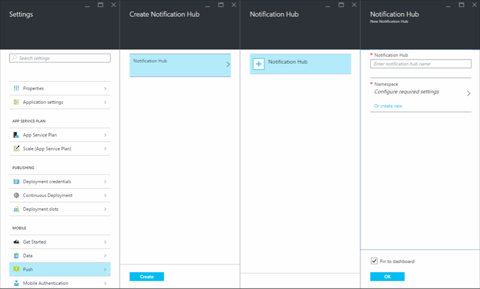
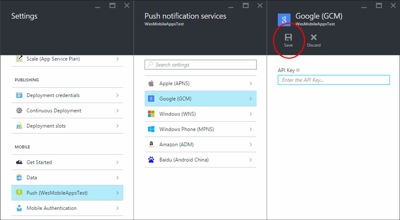

<properties
	pageTitle="Add push notifications to your Xamarin.Forms app with Azure App Service"
	description="Learn how to use Azure App Service to send push notifications to your Xamarin.Forms app"
	services="app-service\mobile"
	documentationCenter="xamarin"
	authors="wesmc7777"
	manager="dwrede"
	editor=""/>

<tags
	ms.service="app-service-mobile"
	ms.workload="mobile"
	ms.tgt_pltfrm="mobile-xamarin"
	ms.devlang="dotnet"
	ms.topic="article"
	ms.date="02/04/2016"
	ms.author="wesmc"/>

# Add push notifications to your Xamarin.Forms app

[AZURE.INCLUDE [app-service-mobile-selector-get-started-push](../../includes/app-service-mobile-selector-get-started-push.md)]

##Overview

This tutorial is based on the [Xamarin.Forms quickstart tutorial](app-service-mobile-xamarin-forms-get-started.md), which you must complete first. You will add push notifications support for each project that your want to support in the the Xamarin.Forms quick start project. Every time a record is inserted, a push notification will be sent.

If you do not use the downloaded quick start server project, you must add the push notification extension package to your project. For more information about server extension packages, see [Work with the .NET backend server SDK for Azure Mobile Apps](app-service-mobile-dotnet-backend-how-to-use-server-sdk.md).

The [iOS simulator does not support push notifications](https://developer.apple.com/library/ios/documentation/IDEs/Conceptual/iOS_Simulator_Guide/TestingontheiOSSimulator.html), so you must use a physical iOS device. You'll also need to sign up for an [Apple Developer Program membership](https://developer.apple.com/programs/ios/).

##Prerequisites

* Complete the [Create a Xamarin.Forms app](app-service-mobile-xamarin-forms-get-started.md) tutorial, which lists other prerequisites. This article uses the completed app from that tutorial.

* A physical iOS device. Push notifications are not supported by the iOS simulator.

##Create a Notification Hub for your Mobile App

To configure your app to send notifications, create a new notification hub and configure it for the platform notification services that you will use.

These steps walk you through creating a new notification hub. If you already have one created, you can just select it.

1. Log into the [Azure portal](https://portal.azure.com/). Click **Browse** > **Mobile Apps** > your backend > **Settings** > **Mobile** > **Push** > **Notification Hub** > **+ Notification Hub**, and provide a name and namespace for a new notification hub, and then click the **OK** button.

	

2. In the Create Notification Hub blade, click **Create**.

##Update the server project to send push notifications

[AZURE.INCLUDE [app-service-mobile-update-server-project-for-push-template](../../includes/app-service-mobile-update-server-project-for-push-template.md)]

##(Optional) Configure and run the Android project

This section is for running the Xamarin droid project for Android. You can skip this section if you are not working with Android devices.

####Enable Google Cloud Messaging (GCM)

[AZURE.INCLUDE [mobile-services-enable-google-cloud-messaging](../../includes/mobile-services-enable-google-cloud-messaging.md)]

####Configure the notification hub for GCM

1. Log into the [Azure portal](https://portal.azure.com/). Click **Browse** > **Mobile Apps** > your Mobile App > **Settings** > **Push** > **Google (GCM)**. Paste in the server api key you created earlier and click **Save**. Your service is now configured to work with push notifications for Android.

	

####Add push notifications to the droid project

1. Right-click the Components folder, click Get More Components..., search for the **Google Cloud Messaging Client** component and add it to the project. This component helps simplify working with push notifications with a Xamarrin Android project.

2. Open the MainActivity.cs project file and add the following using statement at the top of the file:

		using Gcm.Client;

3. Add the following code to the `OnCreate` method after the call to `LoadApplication`.

	    try
	    {
	        // Check to ensure everything's setup right
	        GcmClient.CheckDevice(this);
	        GcmClient.CheckManifest(this);

	        // Register for push notifications
	        System.Diagnostics.Debug.WriteLine("Registering...");
	        GcmClient.Register(this, PushHandlerBroadcastReceiver.SENDER_IDS);
	    }
	    catch (Java.Net.MalformedURLException)
	    {
	        CreateAndShowDialog("There was an error creating the Mobile Service. Verify the URL", "Error");
	    }
	    catch (Exception e)
	    {
	        CreateAndShowDialog(e.Message, "Error");
	    }

4. Add the following code for the `CreateAndShowDialog` helper method.

		private void CreateAndShowDialog(String message, String title)
		{
			AlertDialog.Builder builder = new AlertDialog.Builder(this);

			builder.SetMessage (message);
			builder.SetTitle (title);
			builder.Create().Show ();
		}

5. In the `MainActivity` class, add the following code to expose the current `MainActivity` so we can execute some UI on the main UI thread:

		// Create a new instance field for this activity.
		static MainActivity instance = null;

		// Return the current activity instance.
		public static MainActivity CurrentActivity
		{
		    get
		    {
		        return instance;
		    }
		}

6. Initialize the `instance`, variable at the beginning of the `MainActivity.OnCreate` method.

		// Set the current instance of MainActivity.
		instance = this;

7. Add a new class file to the **Droid** project.  Name the new class file **GcmService**.

8. Make sure the following `using` statements are included at the top of the file.

		using Gcm.Client;
		using Microsoft.WindowsAzure.MobileServices;
		using Android.App;
		using Android.Content;
		using System.Collections.Generic;
		using System.Diagnostics;
		using Android.Util;
		using Newtonsoft.Json.Linq;
		using System.Text;
		using System.Linq;

9. Add the following permission requests at the top of the file, after the `using` statments and before the `namespace` declaration.

		[assembly: Permission(Name = "@PACKAGE_NAME@.permission.C2D_MESSAGE")]
		[assembly: UsesPermission(Name = "@PACKAGE_NAME@.permission.C2D_MESSAGE")]
		[assembly: UsesPermission(Name = "com.google.android.c2dm.permission.RECEIVE")]

		//GET_ACCOUNTS is only needed for android versions 4.0.3 and below
		[assembly: UsesPermission(Name = "android.permission.GET_ACCOUNTS")]
		[assembly: UsesPermission(Name = "android.permission.INTERNET")]
		[assembly: UsesPermission(Name = "android.permission.WAKE_LOCK")]

10. Add the following class definition to the namespace. Replace **<PROJECT_NUMBER>** with your project number you noted earlier.

		[BroadcastReceiver(Permission = Gcm.Client.Constants.PERMISSION_GCM_INTENTS)]
		[IntentFilter(new string[] { Gcm.Client.Constants.INTENT_FROM_GCM_MESSAGE }, Categories = new string[] { "@PACKAGE_NAME@" })]
		[IntentFilter(new string[] { Gcm.Client.Constants.INTENT_FROM_GCM_REGISTRATION_CALLBACK }, Categories = new string[] { "@PACKAGE_NAME@" })]
		[IntentFilter(new string[] { Gcm.Client.Constants.INTENT_FROM_GCM_LIBRARY_RETRY }, Categories = new string[] { "@PACKAGE_NAME@" })]
		public class PushHandlerBroadcastReceiver : GcmBroadcastReceiverBase<GcmService>
		{
		    public static string[] SENDER_IDS = new string[] { "<PROJECT_NUMBER>" };
		}

11. Update your `GcmService` class to use the new broadcast receiver.

		 [Service]
		 public class GcmService : GcmServiceBase
		 {
		     public static string RegistrationID { get; private set; }

		     public GcmService()
		         : base(PushHandlerBroadcastReceiver.SENDER_IDS){}
		 }

12. Add the following code to the GcmService class that overrides the OnRegistered event handler and implements a `Register` method.

	This code will register a template body to receive template notifications using the `messageParam` parameter. Template notifications allow you to send notifications cross platform. For more information see, [Templates](https://msdn.microsoft.com/library/azure/dn530748.aspx).

		protected override void OnRegistered(Context context, string registrationId)
		{
		    Log.Verbose("PushHandlerBroadcastReceiver", "GCM Registered: " + registrationId);
		    RegistrationID = registrationId;

		    createNotification("GcmService Registered...", "The device has been Registered, Tap to View!");

            var push = TodoItemManager.DefaultManager.CurrentClient.GetPush();

		    MainActivity.CurrentActivity.RunOnUiThread(() => Register(push, null));

		}

        public async void Register(Microsoft.WindowsAzure.MobileServices.Push push, IEnumerable<string> tags)
        {
            try
            {
                const string templateBodyGCM = "{\"data\":{\"message\":\"$(messageParam)\"}}";

                JObject templates = new JObject();
                templates["genericMessage"] = new JObject
                {
                  {"body", templateBodyGCM}
                };

                await push.RegisterAsync(RegistrationID, templates);
                Log.Info("Push Installation Id", push.InstallationId.ToString());
            }
            catch (Exception ex)
            {
                System.Diagnostics.Debug.WriteLine(ex.Message);
                Debugger.Break();
            }
        }

13. You must implement `OnMessage` to handle an incoming push notification. In this code we will handle the notification and send it to the notification manager.

		protected override void OnMessage(Context context, Intent intent)
		{
		    Log.Info("PushHandlerBroadcastReceiver", "GCM Message Received!");

		    var msg = new StringBuilder();

		    if (intent != null && intent.Extras != null)
		    {
		        foreach (var key in intent.Extras.KeySet())
		            msg.AppendLine(key + "=" + intent.Extras.Get(key).ToString());
		    }

		    //Store the message
		    var prefs = GetSharedPreferences(context.PackageName, FileCreationMode.Private);
		    var edit = prefs.Edit();
		    edit.PutString("last_msg", msg.ToString());
		    edit.Commit();

		    string message = intent.Extras.GetString("message");
		    if (!string.IsNullOrEmpty(message))
		    {
		        createNotification("New todo item!", "Todo item: " + message);
		        return;
		    }

		    string msg2 = intent.Extras.GetString("msg");
		    if (!string.IsNullOrEmpty(msg2))
		    {
		        createNotification("New hub message!", msg2);
		        return;
		    }

		    createNotification("Unknown message details", msg.ToString());
		}

		void createNotification(string title, string desc)
		{
		    //Create notification
		    var notificationManager = GetSystemService(Context.NotificationService) as NotificationManager;

		    //Create an intent to show ui
		    var uiIntent = new Intent(this, typeof(MainActivity));

		    //Create the notification
		    var notification = new Notification(Android.Resource.Drawable.SymActionEmail, title);

		    //Auto cancel will remove the notification once the user touches it
		    notification.Flags = NotificationFlags.AutoCancel;

		    //Set the notification info
		    //we use the pending intent, passing our ui intent over which will get called
		    //when the notification is tapped.
		    notification.SetLatestEventInfo(this, title, desc, PendingIntent.GetActivity(this, 0, uiIntent, 0));

		    //Show the notification
		    notificationManager.Notify(1, notification);
		}

14. You must also implement `OnUnRegistered` and `OnError` handlers for the receiver.

		protected override void OnUnRegistered(Context context, string registrationId)
		{
			Log.Error("PushHandlerBroadcastReceiver", "Unregistered RegisterationId : " + registrationId);
		}

		protected override void OnError(Context context, string errorId)
		{
			Log.Error("PushHandlerBroadcastReceiver", "GCM Error: " + errorId);
		}

####Test push notifications in your Android app

1. In Visual Studio or Xamarin Studio, right click the **droid** project and click **Set as startup project**.

2. Press the **Run** button to build the project and start the app in an iOS capable device, then click **OK** to accept push notifications.

	> [AZURE.NOTE] You must explicitly accept push notifications from your app. This request only occurs the first time that the app runs.

2. In the app, type a task, and then click the plus (**+**) icon.

3. Verify that a notification is received, then click **OK** to dismiss the notification.

##(Optional) Configure and run the iOS project

This section is for running the Xamarin iOS project for iOS devices. You can skip this section if you are not working with iOS devices.

[AZURE.INCLUDE [Notification Hubs Xamarin Enable Apple Push Notifications](../../includes/notification-hubs-xamarin-enable-apple-push-notifications.md)]

####Configure the notification hub for APNS

1. Log into the [Azure portal](https://portal.azure.com/). Click **Browse** > **Mobile Apps** > your Mobile App > **Settings** > **Push** > **Apple (APNS)** > **Upload Certificate**. Upload the .p12 push certificate file you exported earlier.  Make sure to select **Sandbox** if you created a development push certificate for development and testing.  Otherwise, choose **Production**. Your service is now configured to work with push notifications for iOS.

	

	Next you will configure the iOS project setting in Xamarin Studio or Visual Studio.

[AZURE.INCLUDE [app-service-mobile-xamarin-ios-configure-project](../../includes/app-service-mobile-xamarin-ios-configure-project.md)]

####Add push notifications to your iOS app

1. Add the following `using` statement to the top of the **AppDelegate.cs** file.

        using Microsoft.WindowsAzure.MobileServices;
		using Newtonsoft.Json.Linq;

2. In the iOS project, open AppDelegate.cs and update`FinishedLaunching` to support remote notifications as follows.

		public override bool FinishedLaunching (UIApplication app, NSDictionary options)
		{
			global::Xamarin.Forms.Forms.Init ();

			Microsoft.WindowsAzure.MobileServices.CurrentPlatform.Init();

            // IMPORTANT: uncomment this code to enable sync on Xamarin.iOS
            // For more information, see: http://go.microsoft.com/fwlink/?LinkId=620342
            //SQLitePCL.CurrentPlatform.Init();

            // registers for push for iOS8
            var settings = UIUserNotificationSettings.GetSettingsForTypes(
                UIUserNotificationType.Alert
                | UIUserNotificationType.Badge
                | UIUserNotificationType.Sound,
                new NSSet());

            UIApplication.SharedApplication.RegisterUserNotificationSettings(settings);
            UIApplication.SharedApplication.RegisterForRemoteNotifications();

			LoadApplication (new App ());

			return base.FinishedLaunching (app, options);
		}

4. In AppDelegate.cs, also add an override for the **RegisteredForRemoteNotifications** event to register for notifications:

        public override void RegisteredForRemoteNotifications(UIApplication application, NSData deviceToken)
        {
            const string templateBodyAPNS = "{\"aps\":{\"alert\":\"$(messageParam)\"}}";

            JObject templates = new JObject();
            templates["genericMessage"] = new JObject
                {
                  {"body", templateBodyAPNS}
                };

            // Register for push with your mobile app
            Push push = TodoItemManager.DefaultManager.CurrentClient.GetPush();
            push.RegisterAsync(deviceToken, templates);
        }

5. In AppDelegate.cs also add an override for the **DidReceivedRemoteNotification** event to handle incoming notifications while the app is running:

        public override void DidReceiveRemoteNotification(UIApplication application, NSDictionary userInfo, Action<UIBackgroundFetchResult> completionHandler)
        {
            NSDictionary aps = userInfo.ObjectForKey(new NSString("aps")) as NSDictionary;

            string alert = string.Empty;
            if (aps.ContainsKey(new NSString("alert")))
                alert = (aps[new NSString("alert")] as NSString).ToString();

            //show alert
            if (!string.IsNullOrEmpty(alert))
            {
                UIAlertView avAlert = new UIAlertView("Notification", alert, null, "OK", null);
                avAlert.Show();
            }
        }

Your app is now updated to support push notifications.

####Test push notifications in your iOS app

1. Right click the iOS project, and click **Set as StartPp Project**.

2. Press the **Run** button or **F5** in Visual Studio to build the project and start the app in an iOS capable device, then click **OK** to accept push notifications.

	> [AZURE.NOTE] You must explicitly accept push notifications from your app. This request only occurs the first time that the app runs.

3. In the app, type a task, and then click the plus (**+**) icon.

4. Verify that a notification is received, then click **OK** to dismiss the notification.

##(Optional) Configure and run the Windows project

This section is for running the Xamarin WinApp project for Windows devices. You can skip this section if you are not working with Windows devices.

####Register your Windows app for push notifications with WNS

[AZURE.INCLUDE [app-service-mobile-register-wns](../../includes/app-service-mobile-register-wns.md)]

####Configure the notification hub for WNS

[AZURE.INCLUDE [app-service-mobile-configure-wns](../../includes/app-service-mobile-configure-wns.md)]

####Add push notifications to your Windows app

1. In Visual Studio, open **App.xaml.cs** in the **WinApp** project.  Add the following `using` statements.

		using System.Threading.Tasks;
		using Windows.Networking.PushNotifications;
		using WesmcMobileAppGaTest;
		using Microsoft.WindowsAzure.MobileServices;
		using Newtonsoft.Json.Linq;

2. In App.xaml.cs add the following `InitNotificationsAsync` method. This method gets the push notification channel and registers a template to receive template notifications from notification hub. A template notification that supports `messageParam` will be delivered to this client.

        private async Task InitNotificationsAsync()
        {
            var channel = await PushNotificationChannelManager
                .CreatePushNotificationChannelForApplicationAsync();

            const string templateBodyWNS = "<toast><visual><binding template=\"ToastText01\"><text id=\"1\">$(messageParam)</text></binding></visual></toast>";

            JObject headers = new JObject();
            headers["X-WNS-Type"] = "wns/toast";

            JObject templates = new JObject();
            templates["genericMessage"] = new JObject
                {
                  {"body", templateBodyWNS},
                  {"headers", headers} // Only needed for WNS & MPNS
                };

            await TodoItemManager.DefaultManager.CurrentClient.GetPush().RegisterAsync(channel.Uri, templates);
        }

3. In App.xaml.cs update the `OnLaunched` event handler with the `async` attribute and call `InitNotificationsAsync`

        protected async override void OnLaunched(LaunchActivatedEventArgs e)
        {
            Frame rootFrame = Window.Current.Content as Frame;

            // Do not repeat app initialization when the Window already has content,
            // just ensure that the window is active
            if (rootFrame == null)
            {
                // Create a Frame to act as the navigation context and navigate to the first page
                rootFrame = new Frame();
                // Set the default language
                rootFrame.Language = Windows.Globalization.ApplicationLanguages.Languages[0];
                rootFrame.NavigationFailed += OnNavigationFailed;
                Xamarin.Forms.Forms.Init(e);
                if (e.PreviousExecutionState == ApplicationExecutionState.Terminated)
                {
                    //TODO: Load state from previously suspended application
                }
                // Place the frame in the current Window
                Window.Current.Content = rootFrame;
            }

            if (rootFrame.Content == null)
            {
                // When the navigation stack isn't restored navigate to the first page,
                // configuring the new page by passing required information as a navigation
                // parameter
                rootFrame.Navigate(typeof(MainPage), e.Arguments);
            }
            // Ensure the current window is active
            Window.Current.Activate();

            await InitNotificationsAsync();
        }

4. In Solution Explorer for Visual Studio, open the **Package.appxmanifest** file and set **Toast Capable** to **Yes** under **Notifications**.

5. Build the app and verify you have no errors.  You client app should now register for the template notifications from the Mobile App backend.

####Test push notifications in your Windows app

1. In Visual Studio, right click the **WinApp** project and click **Set as startup project**.

2. Press the **Run** button to build the project and start the app in an iOS capable device, then click **OK** to accept push notifications.

	> [AZURE.NOTE] You must explicitly accept push notifications from your app. This request only occurs the first time that the app runs.

3. In the app, type a task, and then click the plus (**+**) icon.

4. Verify that a notification is received, then click **OK** to dismiss the notification.

<!-- Images. -->

<!-- URLs. -->
[Install Xcode]: https://go.microsoft.com/fwLink/p/?LinkID=266532
[Xcode]: https://go.microsoft.com/fwLink/?LinkID=266532
[apns object]: http://go.microsoft.com/fwlink/p/?LinkId=272333

