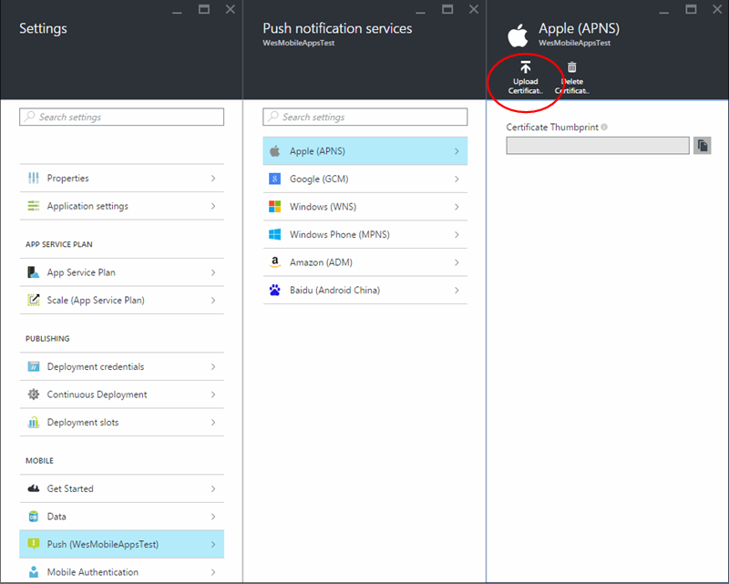

<properties
	pageTitle="Add push notifications to your Xamarin.Forms app | Microsoft Azure"
	description="Learn how to use Azure services to send multi-platform push notifications to your Xamarin.Forms apps."
	services="app-service\mobile"
	documentationCenter="xamarin"
	authors="wesmc7777"
	manager="dwrede"
	editor=""/>

<tags
	ms.service="app-service-mobile"
	ms.workload="mobile"
	ms.tgt_pltfrm="mobile-xamarin"
	ms.devlang="dotnet"
	ms.topic="article"
	ms.date="07/17/2016"
	ms.author="wesmc"/>

# Add push notifications to your Xamarin.Forms app

[AZURE.INCLUDE [app-service-mobile-selector-get-started-push](../../includes/app-service-mobile-selector-get-started-push.md)]

##Overview

This tutorial shows you how to use Azure services to send push notifications to a Xamarin.Forms apps running on the various native device platforms, Android, iOS and Windows. The push notifications are sent from an Azure Mobile Apps backend using Azure Notification Hubs. Template registrations are used so that the same message can be sent to devices running on all platforms using the various push notification services (PNS). For more information about sending cross-platform push notifications, see the [Azure Notification Hubs](../notification-hubs/notification-hubs-templates-cross-platform-push-messages.md) documentation. 

You add push notifications to every project that your Xamarin.Forms app supports. Every time a record is inserted in the backend, a push notification is sent.

##Prerequisites

For the best result with this tutorial, we recommend that you first complete the [Create a Xamarin.Forms app](app-service-mobile-xamarin-forms-get-started.md) tutorial. After you complete this tutorial, you will have a Xamarin.Forms project that is a multi-platform TodoList app. 

If you do not use the downloaded quick start server project, you must add the push notification extension package to your project. For more information about server extension packages, see [Work with the .NET backend server SDK for Azure Mobile Apps](app-service-mobile-dotnet-backend-how-to-use-server-sdk.md).

Sending push notifications to iOS devices requires [Apple Developer Program membership](https://developer.apple.com/programs/ios/). Also, you must use a physical iOS device because the [iOS simulator does not support push notifications](https://developer.apple.com/library/ios/documentation/IDEs/Conceptual/iOS_Simulator_Guide/TestingontheiOSSimulator.html).

##Create a Notification Hub

[AZURE.INCLUDE [app-service-mobile-create-notification-hub](../../includes/app-service-mobile-create-notification-hub.md)]

##Update the server project to send push notifications

[AZURE.INCLUDE [app-service-mobile-update-server-project-for-push-template](../../includes/app-service-mobile-update-server-project-for-push-template.md)]

##(Optional) Configure and run the Android project

Complete this section to enable push notifications for the Xamarin.Forms Droid project for Android.

###Enable Google Cloud Messaging (GCM)

[AZURE.INCLUDE [mobile-services-enable-google-cloud-messaging](../../includes/mobile-services-enable-google-cloud-messaging.md)]

###Configure the Mobile App backend to send push requests using GCM

[AZURE.INCLUDE [app-service-mobile-android-configure-push](../../includes/app-service-mobile-android-configure-push.md)]

###Add push notifications to the Android project

With the backend configured to use Google Cloud Messaging (GCM), we can add the components and the code to the client that enables the app to register with GCM, register for push notifications with Azure Notification Hubs through the mobile app backend, and receive notifications.

1. In the **Droid** project, right-click the **Components** folder, click **Get More Components...**, search for the **Google Cloud Messaging Client** component and add it to the project. This component supports push notifications for a Xamarin Android project.

2. Open the MainActivity.cs project file and add the following using statement at the top of the file:

		using Gcm.Client;

3. Add the following code to the **OnCreate** method after the call to **LoadApplication**:

	    try
	    {
	        // Check to ensure everything's setup right
	        GcmClient.CheckDevice(this);
	        GcmClient.CheckManifest(this);

	        // Register for push notifications
	        System.Diagnostics.Debug.WriteLine("Registering...");
	        GcmClient.Register(this, PushHandlerBroadcastReceiver.SENDER_IDS);
	    }
	    catch (Java.Net.MalformedURLException)
	    {
	        CreateAndShowDialog("There was an error creating the client. Verify the URL.", "Error");
	    }
	    catch (Exception e)
	    {
	        CreateAndShowDialog(e.Message, "Error");
	    }

4. Add a new **CreateAndShowDialog** helper method, as follows:

		private void CreateAndShowDialog(String message, String title)
		{
			AlertDialog.Builder builder = new AlertDialog.Builder(this);

			builder.SetMessage (message);
			builder.SetTitle (title);
			builder.Create().Show ();
		}

5. Add the following code to the **MainActivity** class:

		// Create a new instance field for this activity.
		static MainActivity instance = null;

		// Return the current activity instance.
		public static MainActivity CurrentActivity
		{
		    get
		    {
		        return instance;
		    }
		}

	This exposes the current **MainActivity** instance so we can execute on the main UI thread.

6. Initialize the `instance`, variable at the beginning of the **OnCreate** method, as follows.

		// Set the current instance of MainActivity.
		instance = this;

2. Add a new class file to the **Droid** project named `GcmService.cs`, and make sure the following **using** statements are present at the top of the file:

		using Android.App;
		using Android.Content;
		using Android.Media;
		using Android.Support.V4.App;
		using Android.Util;
		using Gcm.Client;
		using Microsoft.WindowsAzure.MobileServices;
		using Newtonsoft.Json.Linq;
		using System;
		using System.Collections.Generic;
		using System.Diagnostics;
		using System.Text;

9. Add the following permission requests at the top of the file, after the **using** statements and before the **namespace** declaration.

		[assembly: Permission(Name = "@PACKAGE_NAME@.permission.C2D_MESSAGE")]
		[assembly: UsesPermission(Name = "@PACKAGE_NAME@.permission.C2D_MESSAGE")]
		[assembly: UsesPermission(Name = "com.google.android.c2dm.permission.RECEIVE")]
		[assembly: UsesPermission(Name = "android.permission.INTERNET")]
		[assembly: UsesPermission(Name = "android.permission.WAKE_LOCK")]
		//GET_ACCOUNTS is only needed for android versions 4.0.3 and below
		[assembly: UsesPermission(Name = "android.permission.GET_ACCOUNTS")]

10. Add the following class definition to the namespace. 

		[BroadcastReceiver(Permission = Gcm.Client.Constants.PERMISSION_GCM_INTENTS)]
		[IntentFilter(new string[] { Gcm.Client.Constants.INTENT_FROM_GCM_MESSAGE }, Categories = new string[] { "@PACKAGE_NAME@" })]
		[IntentFilter(new string[] { Gcm.Client.Constants.INTENT_FROM_GCM_REGISTRATION_CALLBACK }, Categories = new string[] { "@PACKAGE_NAME@" })]
		[IntentFilter(new string[] { Gcm.Client.Constants.INTENT_FROM_GCM_LIBRARY_RETRY }, Categories = new string[] { "@PACKAGE_NAME@" })]
		public class PushHandlerBroadcastReceiver : GcmBroadcastReceiverBase<GcmService>
		{
		    public static string[] SENDER_IDS = new string[] { "<PROJECT_NUMBER>" };
		}

	>[AZURE.NOTE]Replace **<PROJECT_NUMBER>** with your project number you noted earlier.	

11. Replace the empty **GcmService** class with the following code, which uses the new broadcast receiver:

		 [Service]
		 public class GcmService : GcmServiceBase
		 {
		     public static string RegistrationID { get; private set; }

		     public GcmService()
		         : base(PushHandlerBroadcastReceiver.SENDER_IDS){}
		 }

12. Add the following code to the **GcmService** class that overrides the **OnRegistered** event handler and implements a **Register** method.

		protected override void OnRegistered(Context context, string registrationId)
		{
		    Log.Verbose("PushHandlerBroadcastReceiver", "GCM Registered: " + registrationId);
		    RegistrationID = registrationId;

            var push = TodoItemManager.DefaultManager.CurrentClient.GetPush();

		    MainActivity.CurrentActivity.RunOnUiThread(() => Register(push, null));
		}

        public async void Register(Microsoft.WindowsAzure.MobileServices.Push push, IEnumerable<string> tags)
        {
            try
            {
                const string templateBodyGCM = "{\"data\":{\"message\":\"$(messageParam)\"}}";

                JObject templates = new JObject();
                templates["genericMessage"] = new JObject
                {
                	{"body", templateBodyGCM}
                };

                await push.RegisterAsync(RegistrationID, templates);
                Log.Info("Push Installation Id", push.InstallationId.ToString());
            }
            catch (Exception ex)
            {
                System.Diagnostics.Debug.WriteLine(ex.Message);
                Debugger.Break();
            }
        }

		Note that this code uses the `messageParam` parameter in the template registration. 

13. Add the following code that implements **OnMessage**: 

		protected override void OnMessage(Context context, Intent intent)
		{
		    Log.Info("PushHandlerBroadcastReceiver", "GCM Message Received!");

		    var msg = new StringBuilder();

		    if (intent != null && intent.Extras != null)
		    {
		        foreach (var key in intent.Extras.KeySet())
		            msg.AppendLine(key + "=" + intent.Extras.Get(key).ToString());
		    }

		    //Store the message
		    var prefs = GetSharedPreferences(context.PackageName, FileCreationMode.Private);
		    var edit = prefs.Edit();
		    edit.PutString("last_msg", msg.ToString());
		    edit.Commit();

		    string message = intent.Extras.GetString("message");
		    if (!string.IsNullOrEmpty(message))
		    {
		        createNotification("New todo item!", "Todo item: " + message);
		        return;
		    }

		    string msg2 = intent.Extras.GetString("msg");
		    if (!string.IsNullOrEmpty(msg2))
		    {
		        createNotification("New hub message!", msg2);
		        return;
		    }

		    createNotification("Unknown message details", msg.ToString());
		}

        void createNotification(string title, string desc)
        {
            //Create notification
            var notificationManager = GetSystemService(Context.NotificationService) as NotificationManager;

            //Create an intent to show ui
            var uiIntent = new Intent(this, typeof(MainActivity));

            //Use Notification Builder
            NotificationCompat.Builder builder = new NotificationCompat.Builder(this);

            //Create the notification
            //we use the pending intent, passing our ui intent over which will get called
            //when the notification is tapped.
            var notification = builder.SetContentIntent(PendingIntent.GetActivity(this, 0, uiIntent, 0))
                    .SetSmallIcon(Android.Resource.Drawable.SymActionEmail)
                    .SetTicker(title)
                    .SetContentTitle(title)
                    .SetContentText(desc)

                    //Set the notification sound
                    .SetSound(RingtoneManager.GetDefaultUri(RingtoneType.Notification))

                    //Auto cancel will remove the notification once the user touches it
                    .SetAutoCancel(true).Build();

            //Show the notification
            notificationManager.Notify(1, notification);
        }

	This handles incoming notifications and send them to the notification manager to be displayed.

14. **GcmServiceBase** also requires you to implement the **OnUnRegistered** and **OnError** handler methods, which you can do as follows:

		protected override void OnUnRegistered(Context context, string registrationId)
		{
			Log.Error("PushHandlerBroadcastReceiver", "Unregistered RegisterationId : " + registrationId);
		}

		protected override void OnError(Context context, string errorId)
		{
			Log.Error("PushHandlerBroadcastReceiver", "GCM Error: " + errorId);
		}

Now, you are ready test push notifications in the app running on an Android device or the emulator.

###Test push notifications in your Android app

The first two steps are required only when testing on an emulator.

1. Make sure that you are deploying to or debugging on a virtual device that has Google APIs set as the target, as shown below in the Android Virtual Device (AVD) manager.

2. Add a Google account to the Android device by clicking **Apps** > **Settings** > **Add account**, then follow the prompts to use add an existing Google account to the device to create a new one.

1. In Visual Studio or Xamarin Studio, right click the **Droid** project and click **Set as startup project**.

2. Press the **Run** button to build the project and start the app on your Android device or emulator.

3. In the app, type a task, and then click the plus (**+**) icon.

4. Verify that a notification is received when an item is added.

##(Optional) Configure and run the iOS project

This section is for running the Xamarin iOS project for iOS devices. You can skip this section if you are not working with iOS devices.

[AZURE.INCLUDE [notification-hubs-xamarin-enable-apple-push-notifications](../../includes/notification-hubs-xamarin-enable-apple-push-notifications.md)]

####Configure the notification hub for APNS

1. Log into the [Azure portal](https://portal.azure.com/). Click **Browse** > **Mobile Apps** > your Mobile App > **Settings** > **Push** > **Apple (APNS)** > **Upload Certificate**. Upload the .p12 push certificate file you exported earlier.  Make sure to select **Sandbox** if you created a development push certificate for development and testing.  Otherwise, choose **Production**. Your service is now configured to work with push notifications for iOS.

	

	Next you will configure the iOS project setting in Xamarin Studio or Visual Studio.

[AZURE.INCLUDE [app-service-mobile-xamarin-ios-configure-project](../../includes/app-service-mobile-xamarin-ios-configure-project.md)]

####Add push notifications to your iOS app

1. In the **iOS** project, open AppDelegate.cs add the following **using** statement to the top of the code file.

        using Newtonsoft.Json.Linq;

4. In the **AppDelegate** class, add an override for the **RegisteredForRemoteNotifications** event to register for notifications:

        public override void RegisteredForRemoteNotifications(UIApplication application, 
			NSData deviceToken)
        {
            const string templateBodyAPNS = "{\"aps\":{\"alert\":\"$(messageParam)\"}}";

            JObject templates = new JObject();
            templates["genericMessage"] = new JObject
                {
                  {"body", templateBodyAPNS}
                };

            // Register for push with your mobile app
            Push push = TodoItemManager.DefaultManager.CurrentClient.GetPush();
            push.RegisterAsync(deviceToken, templates);
        }

5. In **AppDelegate**, also add the following override for the **DidReceivedRemoteNotification** event handler:

        public override void DidReceiveRemoteNotification(UIApplication application, 
			NSDictionary userInfo, Action<UIBackgroundFetchResult> completionHandler)
        {
            NSDictionary aps = userInfo.ObjectForKey(new NSString("aps")) as NSDictionary;

            string alert = string.Empty;
            if (aps.ContainsKey(new NSString("alert")))
                alert = (aps[new NSString("alert")] as NSString).ToString();

            //show alert
            if (!string.IsNullOrEmpty(alert))
            {
                UIAlertView avAlert = new UIAlertView("Notification", alert, null, "OK", null);
                avAlert.Show();
            }
        }

	This method handles incoming notifications while the app is running.

2. In the **AppDelegate** class, add the following code to the **FinishedLaunching** method: 

        // Register for push notifications.
        var settings = UIUserNotificationSettings.GetSettingsForTypes(
            UIUserNotificationType.Alert
            | UIUserNotificationType.Badge
            | UIUserNotificationType.Sound,
            new NSSet());

        UIApplication.SharedApplication.RegisterUserNotificationSettings(settings);
        UIApplication.SharedApplication.RegisterForRemoteNotifications();

	This enables support for remote notifications and requests push registration.

Your app is now updated to support push notifications.

####Test push notifications in your iOS app

1. Right click the iOS project, and click **Set as StartPp Project**.

2. Press the **Run** button or **F5** in Visual Studio to build the project and start the app in an iOS device, then click **OK** to accept push notifications.

	> [AZURE.NOTE] You must explicitly accept push notifications from your app. This request only occurs the first time that the app runs.

3. In the app, type a task, and then click the plus (**+**) icon.

4. Verify that a notification is received, then click **OK** to dismiss the notification.

##(Optional) Configure and run the Windows projects

This section is for running the Xamarin.Forms WinApp and WinPhone81 projects for Windows devices. These steps also support Universal Windows Platform (UWP) projects. You can skip this section if you are not working with Windows devices.

####Register your Windows app for push notifications with WNS

[AZURE.INCLUDE [app-service-mobile-register-wns](../../includes/app-service-mobile-register-wns.md)]

####Configure the notification hub for WNS

[AZURE.INCLUDE [app-service-mobile-configure-wns](../../includes/app-service-mobile-configure-wns.md)]

####Add push notifications to your Windows app

1. In Visual Studio, open **App.xaml.cs** in a Windows project and add the following **using** statements.

		using Newtonsoft.Json.Linq;
		using Microsoft.WindowsAzure.MobileServices;
		using System.Threading.Tasks;
		using Windows.Networking.PushNotifications;
		using <your_TodoItemManager_portable_class_namespace>;

	Replace `<your_TodoItemManager_portable_class_namespace>` with namespace of your portable project that contains the `TodoItemManager` class.
 

2. In App.xaml.cs add the following **InitNotificationsAsync** method: 

        private async Task InitNotificationsAsync()
        {
            var channel = await PushNotificationChannelManager
                .CreatePushNotificationChannelForApplicationAsync();

            const string templateBodyWNS = 
				"<toast><visual><binding template=\"ToastText01\"><text id=\"1\">$(messageParam)</text></binding></visual></toast>";

            JObject headers = new JObject();
            headers["X-WNS-Type"] = "wns/toast";

            JObject templates = new JObject();
            templates["genericMessage"] = new JObject
			{
				{"body", templateBodyWNS},
				{"headers", headers} // Needed for WNS.
			};

            await TodoItemManager.DefaultManager.CurrentClient.GetPush()
				.RegisterAsync(channel.Uri, templates);
        }

	This method gets the push notification channel and registers a template to receive template notifications from your notification hub. A template notification that supports *messageParam* will be delivered to this client.

3. In App.xaml.cs, update the **OnLaunched** event handler method definition by adding the `async` modifier, then add the following line of code at the end of the method: 

        await InitNotificationsAsync();

	This makes sure that the push notification registration is created or refreshed every time the app is launched. It's important to do this to guarantee that the WNS push channel is always active.  

4. In Solution Explorer for Visual Studio, open the **Package.appxmanifest** file and set **Toast Capable** to **Yes** under **Notifications**.

5. Build the app and verify you have no errors.  You client app should now register for the template notifications from the Mobile App backend. Repeat this section for every Windows project in your solution.

####Test push notifications in your Windows app

1. In Visual Studio, right click a Windows project and click **Set as startup project**.

2. Press the **Run** button to build the project and start the app.

3. In the app, type a name for a new todoitem, and then click the plus (**+**) icon to add it.

4. Verify that a notification is received when the item is added.

##Next steps

Learn more about push notifications:

* [Work with the .NET backend server SDK for Azure Mobile Apps](app-service-mobile-dotnet-backend-how-to-use-server-sdk.md#how-to-add-tags-to-a-device-installation-to-enable-push-to-tags)  
Tags allow you to target segmented customers with pushes.  Learn how to add tags to a device installation.

* [Diagnose push notification issues](../notification-hubs/notification-hubs-push-notification-fixer.md)  
There are various reasons why notifications may get dropped or do not end up on devices. This topic shows you how to analyze and figure out the root cause of push notification failures. 

Consider continuing on to one of the following tutorials:

* [Add authentication to your app ](app-service-mobile-xamarin-forms-get-started-users.md)  
Learn how to authenticate users of your app with an identity provider.

* [Enable offline sync for your app](app-service-mobile-xamarin-forms-get-started-offline-data.md)  
  Learn how to add offline support your app using an Mobile App backend. Offline sync allows end-users to interact with a mobile app&mdash;viewing, adding, or modifying data&mdash;even when there is no network connection.

<!-- Images. -->

<!-- URLs. -->
[Install Xcode]: https://go.microsoft.com/fwLink/p/?LinkID=266532
[Xcode]: https://go.microsoft.com/fwLink/?LinkID=266532
[apns object]: http://go.microsoft.com/fwlink/p/?LinkId=272333

