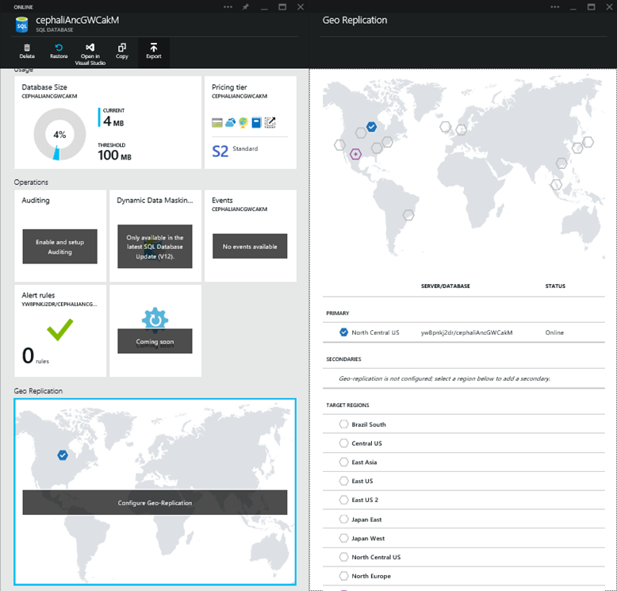

<properties 
	pageTitle="Scale pricing tier in Azure App Service" 
	description="Learn how to scale web, mobile, api and logic apps in Azure App Service, including autoscaling." 
	services="app-service" 
	documentationCenter="" 
	authors="stepsic-microsoft-com" 
	manager="wpickett" 
	editor="mollybos"/>

<tags 
	ms.service="app-service" 
	ms.workload="web" 
	ms.tgt_pltfrm="na" 
	ms.devlang="na" 
	ms.topic="article" 
	ms.date="04/25/2015" 
	ms.author="stepsic"/>

# Scale pricing tier in Azure App Service

For increased performance and throughput for your apps on Microsoft Azure, you can use the [Azure Portal](https://portal.azure.com/) to scale up your App Service plan from **Free** to **Shared**, **Basic**, **Standard**, or **Premium**. 

The level of service your App Service plan has is based on the [*Pricing tier* for the plan](/pricing/details/app-service/). Higher pricing tiers, like **Standard** and **Premium**, offer greater robustness and flexibility in determining how your resources on Azure are used. Changing the pricing tier affects the number of cores and amount of memory your service has, and this is referred to as *Scaling up* (or *Scaling down*).

In addition to scaling up the pricing tier, you can increase the number of instances that you service has. This is referred to as *Scaling out* or *Scaling in*. See the article on [Scale instance count manually or automatically](insights-how-to-scale.md) to learn more about *Scale out* and *Scale in*.

For information about App Service plans, see [What is an App Service Plan?](web-sites-web-hosting-plan-overview.md) and [Azure App Service Plans In-Depth Overview](azure-web-sites-web-hosting-plans-in-depth-overview.md). For information the pricing and features of individual App Service plans, see [App Service Pricing Details](/pricing/details/app-service/).  

> [AZURE.NOTE] Before switching a from the **Free** mode to **Basic**, **Standard**, or **Premium** mode, you must first remove the spending caps in place for your Azure App Service subscription. To view or change options for your Microsoft Azure App Service subscription, see [Microsoft Azure Subscriptions][azuresubscriptions].

## Scaling your pricing tier

1. In your browser, open the [Azure Portal][portal] and browse to the app you want to scale.
	
2. In the **Essentials** for your app, click the **App Service plan/pricing tier** link.

3. Click **Pricing tier**, then you will see the list of possible service levels for your plan. Each tier is accompanied by an estimated price, to give you a sense of the average cost for that tier. 
	
	
	
4. Once you choose your tier, click **Select**.
	
	The **Notifications** tab will flash a green **SUCCESS** once the operation is complete. 
		

##Scaling related resources
If your app depends on other services, such as SQL or Storage, you can also scale those based on your needs.

1. In the **Essentials**, click the **Resource group** link.

2. Then, in the **Summary** part of the resource group blade, clicked one of the databases (or any other resource you want to scale).

	
	
3. On that linked resource blade, click the **Pricing tier** part, select one of the tiers based on your performance requirements, and click **Select**. 
	
	
	
4. If your app uses Storage, geo replication is automatically set up when you choose a pricing tier that supports it. For SQL, on the other hand, you need to manually configure geo-replication to increase the high availability and disaster recovery capabilities of your SQL Database. To do this, click the **Geo Replication** part.
	
	
	

## Developer Features
Depending on the pricing tier, the following developer-oriented features are available:

### Bitness ###

- The **Basic**, **Standard**, and **Premium** tiers support 64-bit and 32-bit applications.
- The **Free** and **Shared** plan tier support 32-bit applications only.

### Debugger Support ###

- Debugger support is available for the **Free**, **Shared**, and **Basic** modes at 1 concurrent connection per App Service plan.
- Debugger support is available for the **Standard** and **Premium** modes at 5 concurrent connections per App Service plan.

## Other Features

- For detailed information about all of the remaining features in the App Service plans, including pricing and features of interest to all users (including developers), see [App Service Pricing Details](/pricing/details/web-sites/).

>[AZURE.NOTE] If you want to get started with Azure App Service before signing up for an Azure account, go to [Try App Service](http://go.microsoft.com/fwlink/?LinkId=523751), where you can immediately create a short-lived starter web app in App Service. No credit cards required; no commitments.

	
## Next Steps

- To get started with Azure, see [Microsoft Azure Free Trial](/pricing/free-trial/).
- For information on pricing, support, and SLA, visit the following links.
	
	[Data Transfers Pricing Details](/pricing/details/data-transfers/)
	
	[Microsoft Azure Support Plans](/support/plans/)
	
	[Service Level Agreements](/support/legal/sla/)
	
	[SQL Database Pricing Details](/pricing/details/sql-database/)
	
	[Virtual Machine and Cloud Service Sizes for Microsoft Azure][vmsizes]
	
	[App Service Pricing Details](/pricing/details/app-service/)
	
	[App Service Pricing Details - SSL Connections](/pricing/details/web-sites/#ssl-connections)

- For information on Azure App Service best practices, including building a scalable and resilient architecture, see [Best Practices: Azure App Service Web Apps](http://blogs.msdn.com/b/windowsazure/archive/2014/02/10/best-practices-windows-azure-websites-waws.aspx).

- Videos on scaling Web Apps:
	
	- [When to Scale Azure Websites - with Stefan Schackow](/documentation/videos/azure-web-sites-free-vs-standard-scaling/)
	- [Auto Scaling Azure Websites, CPU or Scheduled - with Stefan Schackow](/documentation/videos/auto-scaling-azure-web-sites/)
	- [How Azure Websites Scale - with Stefan Schackow](/documentation/videos/how-azure-web-sites-scale/)

## What's changed
* For a guide to the change from Websites to App Service see: [Azure App Service and Its Impact on Existing Azure Services](http://go.microsoft.com/fwlink/?LinkId=529714)
* For a guide to the change of the old portal to the new portal see: [Reference for navigating the preview portal](http://go.microsoft.com/fwlink/?LinkId=529715)

<!-- LINKS -->
[vmsizes]:http://go.microsoft.com/fwlink/?LinkId=309169
[SQLaccountsbilling]:http://go.microsoft.com/fwlink/?LinkId=234930
[azuresubscriptions]:http://go.microsoft.com/fwlink/?LinkID=235288
[portal]: https://portal.azure.com/

<!-- IMAGES -->
[ResourceGroup]: ./media/web-sites-scale/scale10ResourceGroup.png
[ScaleDatabase]: ./media/web-sites-scale/scale11SQLScale.png
[GeoReplication]: ./media/web-sites-scale/scale12SQLGeoReplication.png
