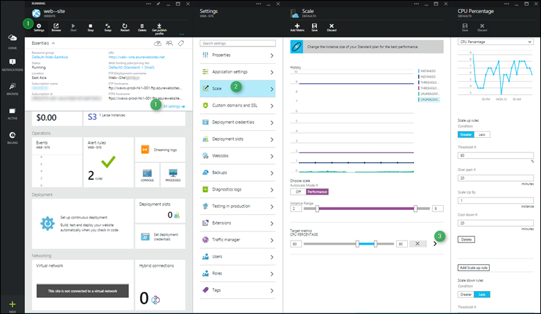
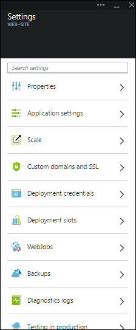
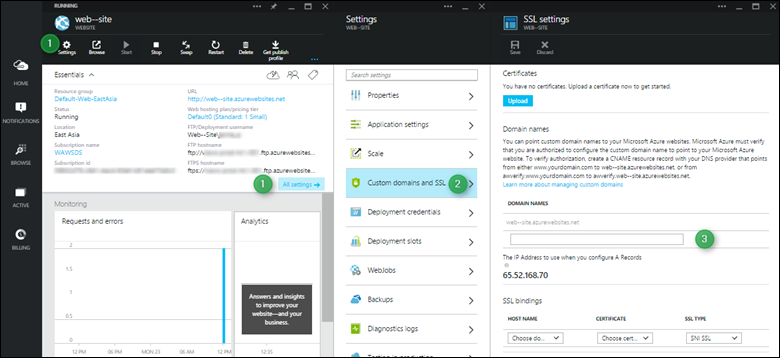
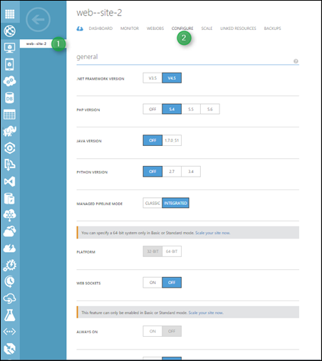

<properties
	pageTitle="Reference for navigating the Azure portal"
	description="Learn the different user experiences for App Service Web between the management portal and the Azure Portal"
	services="app-service\web"
	documentationCenter=""
	authors="jaime-espinosa"
	manager="wpickett"
	editor="jimbe"/>

<tags
	ms.service="app-service-web"
	ms.workload="web"
	ms.tgt_pltfrm="na"
	ms.devlang="na"
	ms.topic="article"
	ms.date="03/24/2015"
	ms.author="jaime-espinosa"/>

# Reference for navigating the Azure portal

Azure Websites is now called [App Service Web Apps](http://go.microsoft.com/fwlink/?LinkId=529714). We're updating all of our documentation to reflect this name change and to provide instructions for the New Azure Portal. Until that process is done, you can use this document as a guide for working with Web Apps in the new Azure portal.
 
## The future of the old portal

While you will notice the branding changes on the old portal, that portal is in the process of being replaced by the new Azure portal. As the old portal is being phased out, the focus for new development is shifting to the new portal. All upcoming new features for Web Apps will come in the new portal. Start using the new portal to take advantage of the latest and greatest that Web Apps have to offer.

## Layout differences between the old portal and Azure Portal

In the old portal, all the Azure services are listed on the left hand side. Navigation in the old portal follows a tree structure, where you start from the service and navigate into each element. This structure works well when managing independent components. However, applications built on Azure are a collection of interconnected services, and this tree structure isn't ideal for working with collections of services. 

The new portal makes it easy to build applications end-to-end with components from multiple services. The new Azure Portal is organized as *journeys*. A *journey* is a series of *blades*, which are containers for the different components. For example, setting up auto-scaling for a web app is a *journey* which takes you several blades as shown in the following example: the **web-site** blade (that blade title has not yet been updated to use the new terminology), the **Settings** blade, and the **Scale** blade. In the example, auto scaling is being set up to depend on CPU usage, so there is also a **CPU Percentage** blade. The components within the *blades* are called *parts*, which look like tiles. 

## Navigation example: create a web app

Creating new web apps is still as easy as 1-2-3. The following image shows the old portal and the new portal side-by-side to demonstrate that not much has changed in the number of steps needed to get a web app up and running. 

In the new portal you can choose from the most common types of web apps, including popular gallery applications like WordPress. For a full list of available applications, visit the [Azure Marketplace].

When you create a web app, you specify URL, App Service plan, and location in the new portal just as you do in the old portal. 

In addition, the new portal lets you define other common settings. For example, [resource groups](resource-group-overview.md) make it simple to see and manage related Azure resources. 

## Navigation example: settings and features

All the settings and features are now logically grouped in a single blade, from which you can navigate.

For example, you can create custom domains by clicking **Custom domains and SSL** in the **Settings** blade.

To set up a monitoring alert, click **Requests and errors** and then **Add Alert**.

To enable diagnostics, click **Diagnostics logs** in the **Settings** blade.

 
To configure application settings, click **Application settings** in the **Settings** blade. 

Other than the brand name, a few things in the portal have been renamed or grouped differently to make it easier to find them. For example, below is a screenshot of the corresponding page for app settings (**Configure**) in the old portal.

## More Resources

[The Azure cloud application platform](app-service-cloud-app-platform.md)

[New portal]: https://portal.azure.com
[Azure Marketplace]: /marketplace/

>[AZURE.NOTE] If you want to get started with Azure App Service before signing up for an Azure account, go to [Try App Service](http://go.microsoft.com/fwlink/?LinkId=523751), where you can immediately create a short-lived starter web app in App Service. No credit cards required; no commitments.

## What's changed
* For a guide to the change from Websites to App Service see: [Azure App Service and Its Impact on Existing Azure Services](http://go.microsoft.com/fwlink/?LinkId=529714)
* For a guide to the change of the old portal to the new portal see: [Reference for navigating the new portal](http://go.microsoft.com/fwlink/?LinkId=529715)
