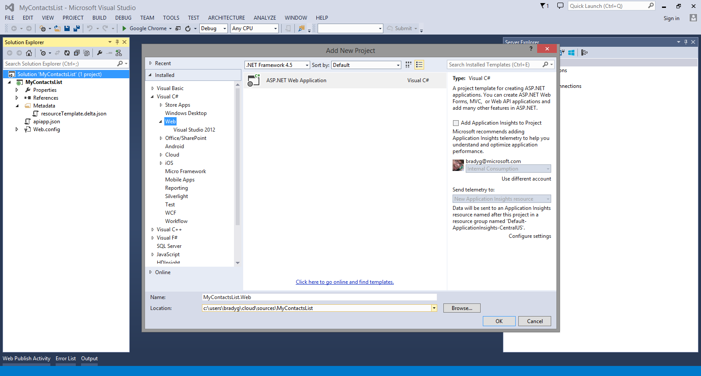
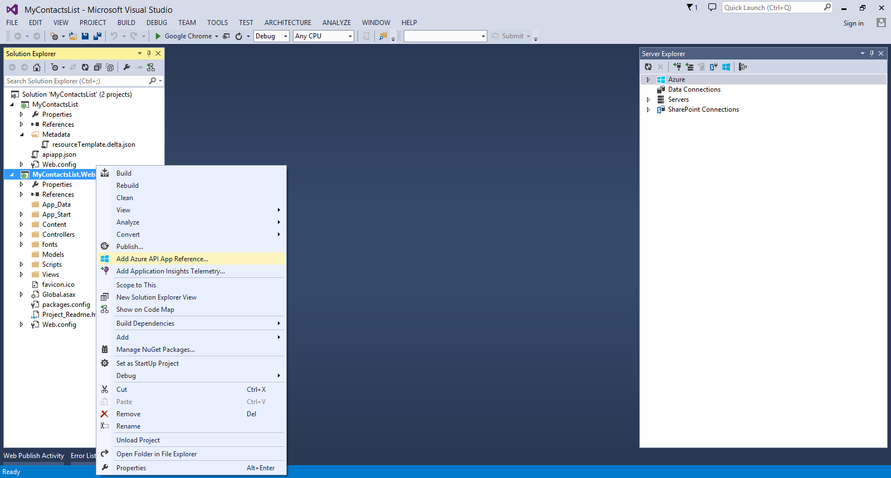
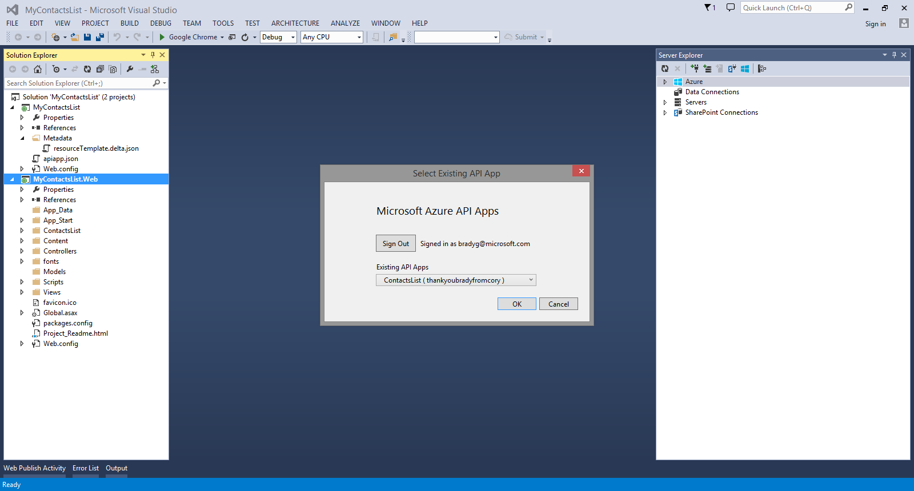
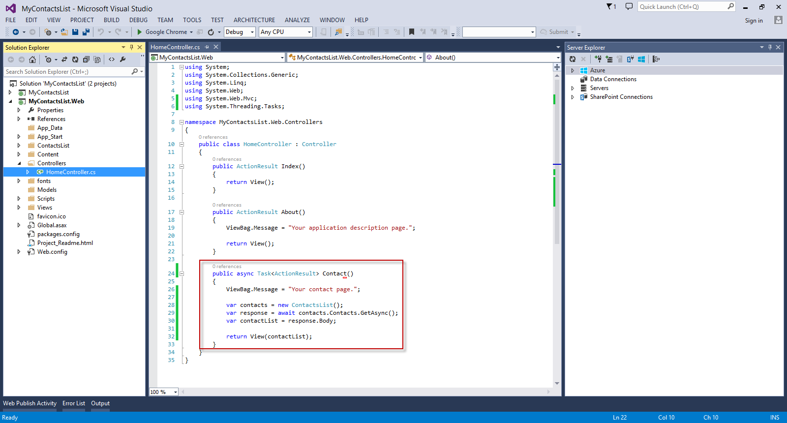

<properties 
   pageTitle="Connect a web app to an API app in Azure App Service" 
   description="This tutorial shows you how to consume an API app from an ASP.NET web app hosted in Azure App Service." 
   services="app-service\web" 
   documentationCenter=".net" 
   authors="syntaxc4" 
   manager="yochayk" 
   editor="jimbe"/>

<tags
   ms.service="app-service-web"
   ms.devlang="dotnet"
   ms.topic="article"
   ms.tgt_pltfrm="na"
   ms.workload="web" 
   ms.date="03/24/2015"
   ms.author="cfowler"/>

# Connect a web app to an API app in Azure App Service

This tutorial shows how to consume an API app from an ASP.NET web app hosted in [App Service](app-service.md).

## Prerequisites

This tutorial builds upon the series from the API App tutorials:

1. [Create an Azure API App](../app-service-dotnet-create-api-app)
3. [Deploy an Azure API App](../app-service-dotnet-deploy-api-app)
4. [Debug an Azure API App](../app-service-dotnet-remotely-debug-api-app)

## Make the API app publicly accessible

In the [Azure preview portal](http://go.microsoft.com/fwlink/?LinkId=529715), select the API app. Click on the **Settings** button in the command bar. In the **Application Settings** blade, change the **Access Level** to **Public (anonymous)**.

## Create an ASP.NET MVC Application in Visual Studio

1. Open Visual Studio. Use the **New Project** dialogue to add a new **ASP.NET Web Application**. Click **OK**.

	

1. Select the **MVC** template. Click **Change Authentication**, then select **No Authentication**, and then click **OK** twice.

	

1. In Solution Explorer, right-click the newly created Web Application project and select **Add Azure App Reference**.

	

1. In the **Existing API Apps** dropdown list, select the API App you would like to connect to.

	

	>[AZURE.NOTE] The client code for connecting to the API app will be automatically generated from a Swagger API endpoint.

1. To leverage the generated API code, open the HomeController.cs file and replace the `Contact` action with the following:

	    public async Task<ActionResult> Contact()
	    {
	        ViewBag.Message = "Your contact page.";
	
	        var contacts = new ContactsList();
	        var response = await contacts.Contacts.GetAsync();
	        var contactList = response.Body;
	
	        return View(contactList);
	    }

	

1. Update the `Contact` view to reflect the dynamic list of contacts with the code below:  
	<pre>// Add to the very top of the view file
	@model IList&lt;MyContactsList.Web.Models.Contact&gt;
	
	// Replace the default email addresses with the following
    &lt;h3&gt;Public Contacts&lt;/h3&gt;
    &lt;ul&gt;
        @foreach (var contact in Model)
        {
            &lt;li&gt;&lt;a href=&quot;mailto:@contact.EmailAddress&quot;&gt;@contact.Name &amp;lt;@contact.EmailAddress&amp;gt;&lt;/a&gt;&lt;/li&gt;
        }
    &lt;/ul&gt; 
	</pre>

	

## Deploy the web application to Web Apps in App Service

Follow the instructions available at [How to Deploy an Azure web app](web-sites-deploy.md).

>[AZURE.NOTE] If you want to get started with Azure App Service before signing up for an Azure account, go to [Try App Service](http://go.microsoft.com/fwlink/?LinkId=523751), where you can immediately create a short-lived starter web app in App Service. No credit cards required; no commitments.

## What's changed
* For a guide to the change from Websites to App Service see: [Azure App Service and Its Impact on Existing Azure Services](http://go.microsoft.com/fwlink/?LinkId=529714)
* For a guide to the change of the old portal to the new portal see: [Reference for navigating the preview portal](http://go.microsoft.com/fwlink/?LinkId=529715)
