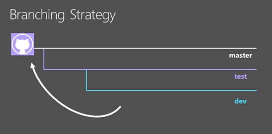
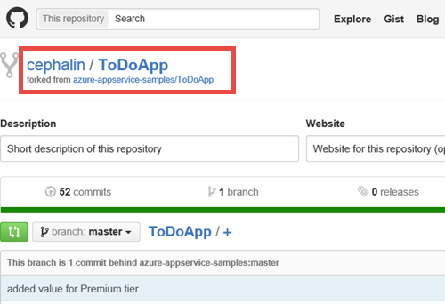
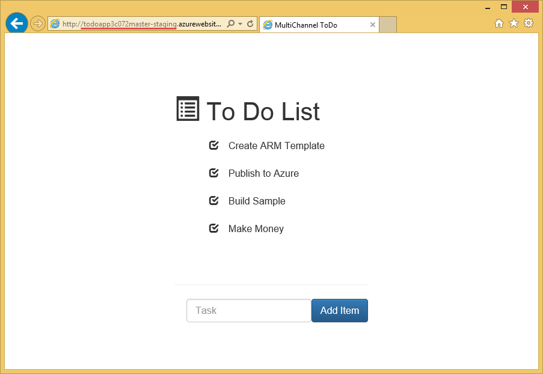
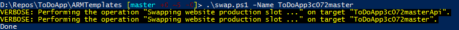
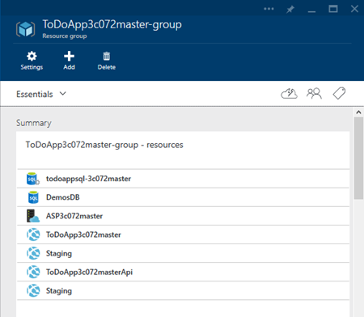
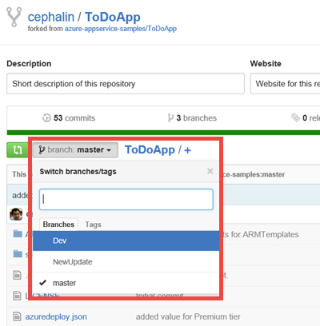
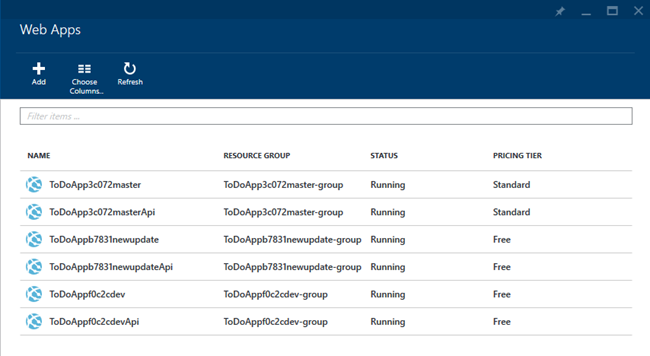
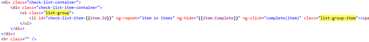
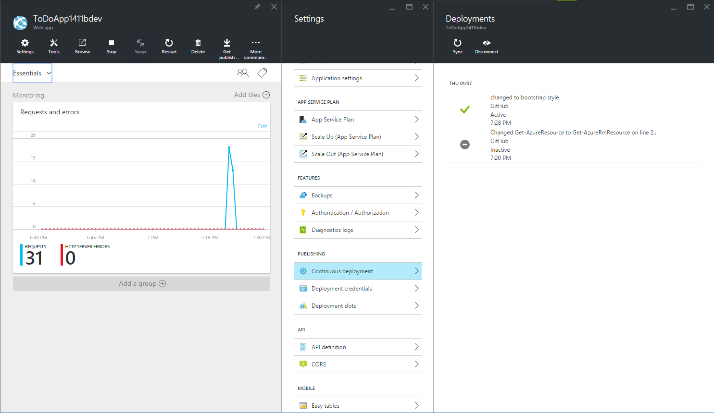
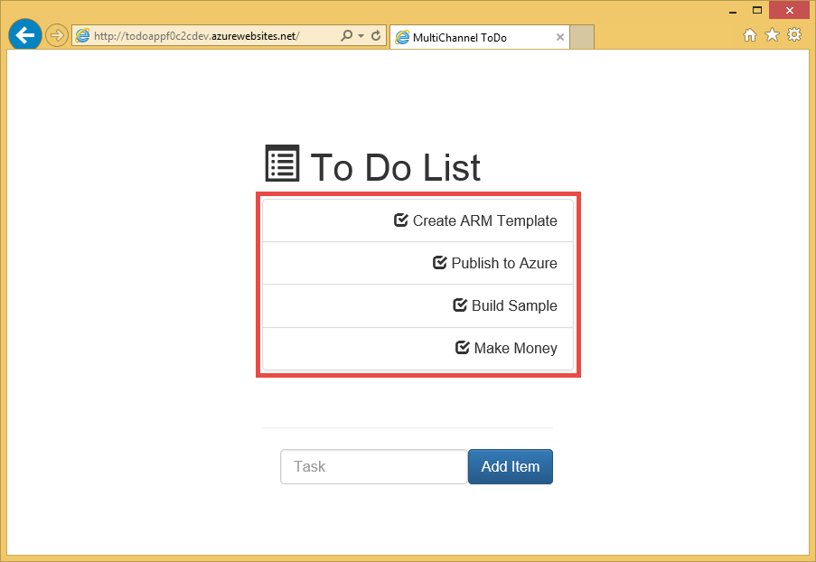

<properties
	pageTitle="Agile software development with Azure App Service"
	description="Learn how to create high-scale complex applications with Azure App Service in a way that supports agile software development."
	services="app-service"
	documentationCenter=""
	authors="cephalin"
	manager="wpickett"
	editor=""/>

<tags
	ms.service="app-service"
	ms.workload="na"
	ms.tgt_pltfrm="na"
	ms.devlang="na"
	ms.topic="article"
	ms.date="07/01/2016"
	ms.author="cephalin"/>

# Agile software development with Azure App Service #

In this tutorial, you will learn how to create high-scale complex applications with [Azure App Service](/services/app-service/) in a way that supports [agile software development](https://en.wikipedia.org/wiki/Agile_software_development). It assumes that you already know how to [deploy complex applications predictably in Azure](app-service-deploy-complex-application-predictably.md).

Limitations in technical processes can often stand in the way of successful implementation of agile methodologies. Azure App Service with features such as [continuous publishing](app-service-continuous-deployment.md), [staging environments](web-sites-staged-publishing.md) (slots), and [monitoring](web-sites-monitor.md), when coupled wisely with the orchestration and management of deployment in [Azure Resource Manager](../resource-group-overview.md), can be part of a great solution for developers who embrace agile software development.

The following table is a short list of requirements associated with agile development, and how Azure services enables each of them.

| Requirement | How Azure enables |
|---------------------------------------------------------------|--------------------------------------------------------------------------------------------------------------------------------------------------------------------------------------------------------------------------|
| - Build with every commit - Build automatically and fast | When configured with continuous deployment, Azure App Service can function as live-running builds based on a dev branch. Every time code is pushed to the branch, it is automatically built and running live in Azure.|
| - Make builds self-testing | Load tests, web tests, etc., can be deployed with the Azure Resource Manager template.|
| - Perform tests in a clone of production environment | Azure Resource Manager templates can be used to create clones of the Azure production environment (including app settings, connection string templates, scaling, etc.) for testing quickly and predictably.|
| - View result of latest build easily | Continuous deployment to Azure from a repository means that you can test new code in a live application immediately after you commit your changes. |
| - Commit to the main branch every day - Automate deployment | Continuous integration of a production application with a repository’s main branch automatically deploys every commit/merge to the main branch to production. |

[AZURE.INCLUDE [app-service-web-to-api-and-mobile](../../includes/app-service-web-to-api-and-mobile.md)]

## What you will do ##

You will walk through a typical dev-test-stage-production workflow in order to publish new changes to the [ToDoApp](https://github.com/azure-appservice-samples/ToDoApp) sample application, which consists of two [web apps](/services/app-service/web/), one being a frontend (FE) and the other being a Web API backend (BE), and a [SQL database](/services/sql-database/). You will work with the deployment architecture shown below:

To put the picture into words :

-	The deployment architecture is separated into three distinct environments (or [resource groups](../resource-group-overview.md) in Azure), each with its own [App Service plan](../app-service/azure-web-sites-web-hosting-plans-in-depth-overview.md), [scaling](web-sites-scale.md) settings, and SQL database. 
-	Each environment can be managed separately. They can even exist in different subscriptions.
-	Staging and production are implemented as two slots of the same App Service app. The master branch is setup for continuous integration with the staging slot.
-	When a commit to master branch is verified on the staging slot (with production data), the verified staging app is swapped into the production slot [with no downtime](web-sites-staged-publishing.md).

The production and staging environment is defined by the template at [*&lt;repository_root>*/ARMTemplates/ProdandStage.json](https://github.com/azure-appservice-samples/ToDoApp/blob/master/ARMTemplates/ProdAndStage.json).

The dev and test environments are defined by the template at [*&lt;repository_root>*/ARMTemplates/Dev.json](https://github.com/azure-appservice-samples/ToDoApp/blob/master/ARMTemplates/Dev.json).

You will also use the typical branching strategy, with code moving from the dev branch up to the test branch, then to the master branch (moving up in quality, so to speak).

 

## What you will need ##

-	An Azure account
-	A [GitHub](https://github.com/) account
-	Git Shell (installed with [GitHub for Windows](https://windows.github.com/)) - this enables you to run both the Git and PowerShell commands in the same session 
-	Latest [Azure PowerShell](https://github.com/Azure/azure-powershell/releases/download/0.9.4-June2015/azure-powershell.0.9.4.msi) bits
-	Basic understanding of the following:
	-	[Azure Resource Manager](../resource-group-overview.md) template deployment (also see [Deploy a complex application predictably in Azure](app-service-deploy-complex-application-predictably.md))
	-	[Git](http://git-scm.com/documentation)
	-	[PowerShell](https://technet.microsoft.com/library/bb978526.aspx)

> [AZURE.NOTE] You need an Azure account to complete this tutorial:
> + You can [open an Azure account for free](/pricing/free-trial/) - You get credits you can use to try out paid Azure services, and even after they're used up you can keep the account and use free Azure services, such as Web Apps.
> + You can [activate Visual Studio subscriber benefits](/pricing/member-offers/msdn-benefits-details/) - Your Visual Studio subscription gives you credits every month that you can use for paid Azure services.
>
> If you want to get started with Azure App Service before signing up for an Azure account, go to [Try App Service](http://go.microsoft.com/fwlink/?LinkId=523751), where you can immediately create a short-lived starter web app in App Service. No credit cards required; no commitments.

## Set up your production environment ##

>[AZURE.NOTE] The script used in this tutorial will automatically configure continuous publishing from your GitHub repository. This requires that your GitHub credentials are already stored in Azure, otherwise the scripted deployment will fail when attempting to configure source control settings for the web apps. 
>
>To store your GitHub credentials in Azure, create a web app in the [Azure Portal](https://portal.azure.com/) and [configure GitHub deployment](app-service-continuous-deployment.md). You only need to do this once. 

In a typical DevOps scenario, you have an application that’s running live in Azure, and you want to make changes to it through continuous publishing. In this scenario, you have a template that you developed, tested, and used to deploy the production environment. You will set it up in this section.

1.	Create your own fork of the [ToDoApp](https://github.com/azure-appservice-samples/ToDoApp) repository. For information on creating your fork, see [Fork a Repo](https://help.github.com/articles/fork-a-repo/). Once your fork is created, you can see it in your browser.
 
	

2.	Open a Git Shell session. If you don't have Git Shell yet, install [GitHub for Windows](https://windows.github.com/) now.

3.	Create a local clone of your fork by executing the following command:

		git clone https://github.com/<your_fork>/ToDoApp.git 

4.	Once you have your local clone, navigate to *&lt;repository_root>*\ARMTemplates, and run the deploy.ps1 script as follows:

		.\deploy.ps1 –RepoUrl https://github.com/<your_fork>/todoapp.git

4.	When prompted, type in the desired username and password for database access.

	You should see the provisioning progress of various Azure resources. When deployment completes, the script will launch the application in the browser and give you a friendly beep.

	
 
	>[AZURE.TIP] Take a look at *&lt;repository_root>*\ARMTemplates\Deploy.ps1, to see how it generates resources with unique IDs. You can use the same approach to create clones of the same deployment without worrying about conflicting resource names.
 
6.	Back in your Git Shell session, run:

		.\swap –Name ToDoApp<unique_string>master

	

7.	When the script finishes, go back to browse to the frontend’s address (http://ToDoApp*&lt;unique_string>*master.azurewebsites.net/) to see the application running in production.
 
5.	Log into the [Azure Portal](https://portal.azure.com/) and take a look at what’s created.

	You should be able to see two web apps in the same resource group, one with the `Api` suffix in the name. If you look at the resource group view, you will also see the SQL Database and server, the App Service plan, and the staging slots for the web apps. Browse through the different resources and compare them with *&lt;repository_root>*\ARMTemplates\ProdAndStage.json to see how they are configured in the template.

	

You have now set up the production environment. Next, you will kick off a new update to the application.

## Create dev and test branches ##

Now that you have a complex application running in production in Azure, you will make an update to your application in accordance with agile methodology. In this section, you will create the dev and test branches that you will need to make the required updates.

1.	Create the test environment first. In your Git Shell session, run the following commands to create the environment for a new branch called **NewUpdate**. 

		git checkout -b NewUpdate
		git push origin NewUpdate 
		.\deploy.ps1 -TemplateFile .\Dev.json -RepoUrl https://github.com/<your_fork>/ToDoApp.git -Branch NewUpdate

1.	When prompted, type in the desired username and password for database access. 

	When deployment completes, the script will launch the application in the browser and give you a friendly beep. And just like that, you now have a new branch with its own test environment. Take a moment to review a few things about this test environment:

	-	You can create it in any Azure subscription. That means the production environment can be managed separately from your test environment.
	-	Your test environment is running live in Azure.
	-	Your test environment is identical to the production environment, except for the staging slots and the scaling settings. You can know this because these are the only differences between ProdandStage.json and Dev.json.
	-	You can manage your test environment in its own App Service plan, with a different price tier (such as **Free**).
	-	Deleting this test environment will be as simple as deleting the resource group. You will find out how to do this [later](#delete).

2.	Go on to create a dev branch by running the following commands:

		git checkout -b Dev
		git push origin Dev
		.\deploy.ps1 -TemplateFile .\Dev.json -RepoUrl https://github.com/<your_fork>/ToDoApp.git -Branch Dev

3.	When prompted, type in the desired username and password for database access. 

	Take a moment to review a few things about this dev environment: 

	-	Your dev environment has a configuration identical to the test environment because it’s deployed using the same template.
	-	Each dev environment can be created in the developer’s own Azure subscription, leaving the test environment to be separately managed.
	-	Your dev environment is running live in Azure.
	-	Deleting the dev environment is as simple as deleting the resource group. You will find out how to do this [later](#delete).

>[AZURE.NOTE] When you have multiple developers working on the new update, each of them can easily create a branch and dedicated dev environment by doing the following:
>
>1.	Create their own fork of the repository in GitHub (see [Fork a Repo](https://help.github.com/articles/fork-a-repo/)).
>2.	Clone the fork on their local machine
>3.	Run the same commands to create their own dev branch and environment.

When you’re done, your GitHub fork should have three branches:

And you should have six web apps (three sets of two) in three separate resource groups:

 
>[AZURE.NOTE] Note that ProdandStage.json specifies the production environment to use the **Standard** pricing tier, which is appropriate for scalability of the production application.

## Build and test every commit ##

The template files ProdAndStage.json and Dev.json already specify the source control parameters, which by default sets up continuous publishing for the web app. Therefore, every commit to the GitHub branch triggers an automatic deployment to Azure from that branch. Let’s see how your setup works now.

1.	Make sure that you’re in the Dev branch of the local repository. To do this, run the following command in Git Shell:

		git checkout Dev

2.	Make a simple change to the app’s UI layer by changing the code to use [Bootstrap](http://getbootstrap.com/components/) lists. Open *&lt;repository_root>*\src\MultiChannelToDo.Web\index.cshtml and make the highlighted change below:

	

	>[AZURE.NOTE] If you can't read the image above: 
	>
	>- In line 18, change `check-list` to `list-group`.
	>- In line 19, change `class="check-list-item"` to `class="list-group-item"`.

3.	Save the change. Back in Git Shell, run the following commands:

		cd <repository_root>
		git add .
		git commit -m "changed to bootstrap style"
		git push origin Dev
 
	These git commands are similar to "checking in your code" in another source control system like TFS. When you run `git push`, the new commit triggers an automatic code push to Azure, which then rebuilds the application to reflect the change in the dev environment.

4.	To verify that this code push to your dev environment has occurred, go to your dev environment’s web app blade and look at the **Deployment** part. You should be able to see your latest commit message there.

	

5.	From there, click **Browse** to see the new change in the live application in Azure.

	

	This is a pretty minor change to the application. However, many times new changes to a complex web application has unintended and undesirable side effects. Being able to easily test every commit in live builds enables you to catch these issues before your customers see them.

By now, you should be comfortable with the realization that, as a developer on the **NewUpdate** project, you will be able to easily create a dev environment for yourself, then build every commit and test every build.

## Merge code into test environment ##

When you’re ready to push your code from Dev branch up to NewUpdate branch, it’s the standard git process:

1.	Merge any new commits to NewUpdate into the Dev branch in GitHub, such as commits created by other developers. Any new commit on GitHub will trigger a code push and build in the dev environment. You can then make sure your code in Dev branch still works with the latest bits from NewUpdate branch.

2.	Merge all your new commits from Dev branch into NewUpdate branch on GitHub. This action triggers a code push and build in the test environment. 

Note again that because continuous deployment is already setup with these git branches, you don’t need to take any other action like running integration builds. You simply need to perform standard source control practices using git, and Azure will perform all the build processes for you.

Now, let’s push your code to **NewUpdate** branch. In Git Shell, run the following commands:

	git checkout NewUpdate
	git pull origin NewUpdate
	git merge Dev
	git push origin NewUpdate

That’s it! 

Go to the web app blade for your test environment to see your new commit (merged into NewUpdate branch) now pushed to the test environment. Then, click **Browse** to see that the style change is now running live in Azure.

## Deploy update to production ##

Pushing code to the staging and production environment should feel no different than what you’ve already done when you pushed code to the test environment. It's really that simple. 

In Git Shell, run the following commands:

	git checkout master
	git pull origin master
	git merge NewUpdate
	git push origin master

Remember that based on the way the staging and production environment is setup in ProdandStage.json, your new code is pushed to the **Staging** slot and is running there. So if you navigate to the staging slot’s URL, you’ll see the new code running there. To do this, run the `Show-AzureWebsite` cmdlet in Git Shell.

	Show-AzureWebsite -Name ToDoApp<unique_string>master -Slot Staging
 
And now, after you’ve verified the update in the staging slot, the only thing left to do is to swap it into production. In Git Shell, just run the following commands:

	cd <repository_root>\ARMTemplates
	.\swap.ps1 -Name ToDoApp<unique_string>master

Congratulations! You’ve successfully published a new update to your production web application. What’s more is that you’ve just done it by easily creating dev and test environments, and building and testing every commit. These are crucial building blocks for agile software development.

## Delete dev and test enviroments ##

Because you have purposely architected your dev and test environments to be self-contained resource groups, it is very easy to delete them. To delete the ones you created in this tutorial, both the GitHub branches and Azure artifacts, just run the following commands in Git Shell:

	git branch -d Dev
	git push origin :Dev
	git branch -d NewUpdate
	git push origin :NewUpdate
	Remove-AzureRmResourceGroup -Name ToDoApp<unique_string>dev-group -Force -Verbose
	Remove-AzureRmResourceGroup -Name ToDoApp<unique_string>newupdate-group -Force -Verbose

## Summary ##

Agile software development is a must-have for many companies who want to adopt Azure as their application platform. In this tutorial, you have learned how to create and tear down exact replicas or near replicas of the production environment with ease, even for complex applications. You have also learned how to leverage this ability to create a development process that can build and test every single commit in Azure. This tutorial has hopefully shown you how you can best use Azure App Service and Azure Resource Manager together to create a DevOps solution that caters to agile methodologies. Next, you can build on this scenario by performing advanced DevOps techniques such as [testing in production](app-service-web-test-in-production-get-start.md). For a common testing-in-production scenario, see [Flighting deployment (beta testing) in Azure App Service](app-service-web-test-in-production-controlled-test-flight.md).

## More resources ##

-	[Deploy a complex application predictably in Azure](app-service-deploy-complex-application-predictably.md)
-	[Agile Development in Practice: Tips and Tricks for Modernized Development Cycle](http://channel9.msdn.com/Events/Ignite/2015/BRK3707)
-	[Advanced deployment strategies for Azure Web Apps using Resource Manager templates](http://channel9.msdn.com/Events/Build/2015/2-620)
-	[Authoring Azure Resource Manager Templates](../resource-group-authoring-templates.md)
-	[JSONLint - The JSON Validator](http://jsonlint.com/)
-	[ARMClient – Set up GitHub publishing to site](https://github.com/projectKudu/ARMClient/wiki/Setup-GitHub-publishing-to-Site)
-	[Git Branching – Basic Branching and Merging](http://www.git-scm.com/book/en/v2/Git-Branching-Basic-Branching-and-Merging)
-	[David Ebbo’s Blog](http://blog.davidebbo.com/)
-	[Azure PowerShell](../powershell-install-configure.md)
-	[Azure Cross-Platform Command-Line Tools](../xplat-cli-install.md)
-	[Create or edit users in Azure AD](https://msdn.microsoft.com/library/azure/hh967632.aspx#BKMK_1)
-	[Project Kudu Wiki](https://github.com/projectkudu/kudu/wiki)
