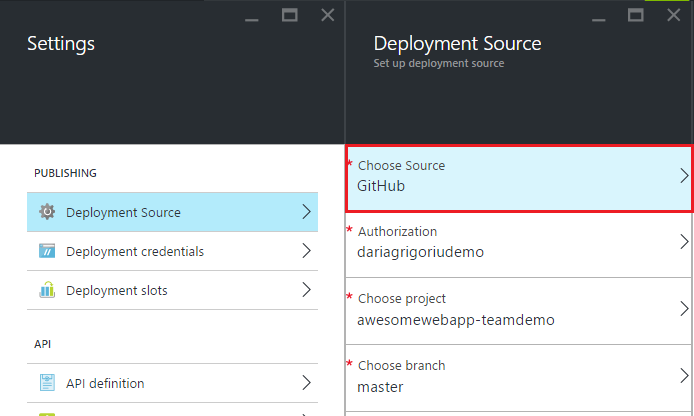

<properties
	pageTitle="Continuous Deployment to Azure App Service"
	description="Learn how to enable continuous deployment to Azure App Service."
	services="app-service"
	documentationCenter=""
	authors="dariagrigoriu"
	manager="wpickett"
	editor="mollybos"/>

<tags
	ms.service="app-service"
	ms.workload="na"
	ms.tgt_pltfrm="na"
	ms.devlang="na"
	ms.topic="article"
	ms.date="07/23/2016"
	ms.author="dariagrigoriu"/>
    
# Continuous Deployment to Azure App Service

This tutorial shows you how to configure a continous deployment workflow for your [Azure App Service] app. App Service integration with BitBucket, GitHub, and Visual Studio Team Services (VSTS) enables a continuous deployment workflow where Azure pulls in the most recent updates from your project published to one of these services. Continuous deployment is a great option for projects where multiple and frequent contributions are being integrated.

## Enable continuous deployment

To enable continuous deployment, 

1. Publish your app content to the repository that will be used for continuous deployment.  
    For more information on publishing your project to these services, see [Create a repo (GitHub)], [Create a repo (BitBucket)], and [Get started with VSTS].

2. In your app's blade in the [Azure Portal], click **Settings > Deployment Source**. Click **Choose Source**, then click **GitHub**, for example.  

	
	
    > [AZURE.NOTE] To configure a VSTS account for App Service deployment please see this [tutorial](https://github.com/projectkudu/kudu/wiki/Setting-up-a-VSTS-account-so-it-can-deploy-to-a-Web-App).
    
3. Complete the authorization workflow. 

4. In the **Deployment Source** blade, choose the project and branch to deploy from. When you're done, click **OK**.
  
	

	> [AZURE.NOTE] When enabling continuous deployment with GitHub or BitBucket, both public and private projects will be displayed.

    App Service creates an association with the selected repository, pulls in the files from the specified branch, and maintains a clone of your repository for your App Service app. When you configure VSTS continous deployment from the Azure Portal, the integration uses the App Service [Kudu deployment engine](https://github.com/projectkudu/kudu/wiki), which already automates build and deployment tasks with every `git push`. You do not need to separately set up continuous deployment in VSTS. After this process completes, the **Deployment** section of your app's blade will show an **Active Deployment** message that indicates deployment has succeeded.

5. To verify the app is successfully deployed, click the **URL** at the top of the app's blade in the Azure Portal. 

6. To verify that continuous deployment is occurring from the repository of your choice, push a change to the repository. Your app should update to reflect the changes shortly after the push to the repository completes. You can verify that it has pulled in the update in the **Deployments** blade of your app.

## Continuous deployment of a Visual Studio solution 

Pushing a Visual Studio solution to Azure App Service is just as easy as pushing a simple index.html file. The App Service deployment process streamlines all the details, including restoring NuGet dependencies and building the application binaries. You can follow the source control best practices of maintaining code only in your Git repository, and let App Service deployment take care of the rest.

The steps for pushing your Visual Studio solution to App Service are the same as in the [previous section](#overview), provided that you configure your solution and repository as follows:

-	Use the Visual Studio source control option to generate a `.gitignore` file such as the image below or manually add a `.gitignore` file in your repository root with content similar to this [.gitignore sample](https://github.com/github/gitignore/blob/master/VisualStudio.gitignore). 

    
 
-	Add the entire solution's directory tree to your repository, with the .sln file in the repository root.

Once you have set up your repository as described, and configured your app in Azure for continuous publishing from one of the online Git repositories, you can develop your ASP.NET application locally in Visual Studio and continuously deploy your code simply by pushing your changes to your online Git repository.

## Disable continuous deployment

To disable continuous deployment, 

1. In your app's blade in the [Azure Portal], click **Settings > Deployment Source**. Then click **Disconnect** in the **Deployments** blade.

    	

2. After answering **Yes** to the confirmation message, you can return to your app's blade and click **Settings > Deployment Source** if you would like to set up publishing from another source.

## Additional Resources

* [How to investigate common issues with continuous deployment](https://github.com/projectkudu/kudu/wiki/Investigating-continuous-deployment)
* [How to use PowerShell for Azure]
* [How to use the Azure Command-Line Tools for Mac and Linux]
* [Git documentation]
* [Project Kudu](https://github.com/projectkudu/kudu/wiki)

>[AZURE.NOTE] If you want to get started with Azure App Service before signing up for an Azure account, go to [Try App Service](http://go.microsoft.com/fwlink/?LinkId=523751), where you can immediately create a short-lived starter web app in App Service. No credit cards required; no commitments.

[Azure App Service]: https://azure.microsoft.com/en-us/documentation/articles/app-service-changes-existing-services/ 
[Azure Portal]: https://portal.azure.com
[VSTS Portal]: https://www.visualstudio.com/en-us/products/visual-studio-team-services-vs.aspx
[Installing Git]: http://git-scm.com/book/en/Getting-Started-Installing-Git
[How to use PowerShell for Azure]: ../articles/powershell-install-configure.md
[How to use the Azure Command-Line Tools for Mac and Linux]: ../articles/xplat-cli-install.md
[Git Documentation]: http://git-scm.com/documentation

[Create a repo (GitHub)]: https://help.github.com/articles/create-a-repo
[Create a repo (BitBucket)]: https://confluence.atlassian.com/display/BITBUCKET/Create+an+Account+and+a+Git+Repo
[Get started with VSTS]: https://www.visualstudio.com/get-started/overview-of-get-started-tasks-vs
[Continuous delivery to Azure using Visual Studio Team Services]: ../articles/cloud-services/cloud-services-continuous-delivery-use-vso.md
