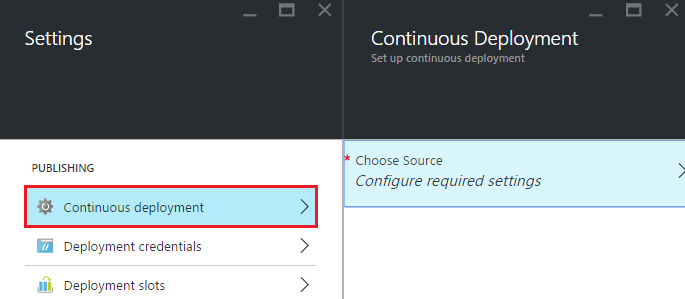
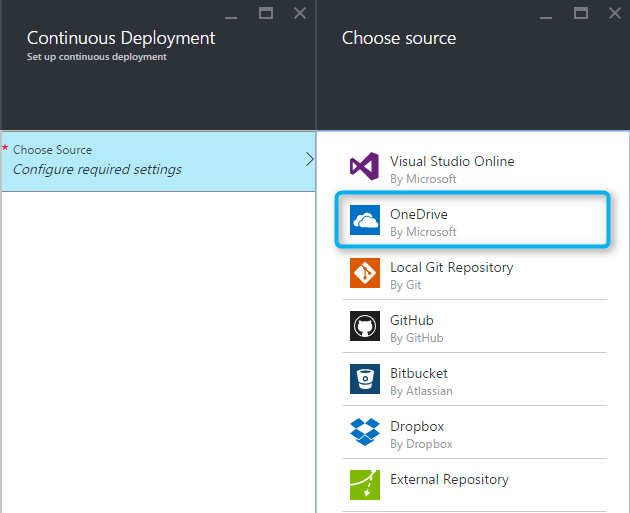
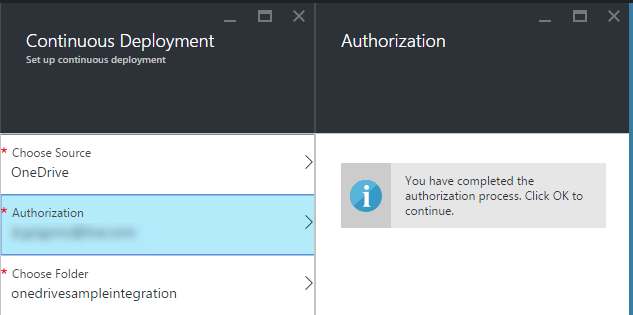
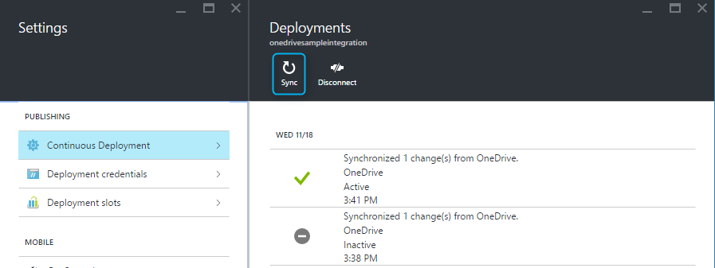

<properties
	pageTitle="Azure App Service Content Sync Deployment"
	description="Learn how to deploy your app to Azure App Service via content sync."
	services="app-service"
	documentationCenter=""
	authors="dariac"
	manager="yochayk"
	editor="mollybos"/>

<tags
	ms.service="app-service"
	ms.workload="na"
	ms.tgt_pltfrm="na"
	ms.devlang="na"
	ms.topic="article"
	ms.date="03/03/2016"
	ms.author="dariac"/>
    
# Deploy your app to Azure App Service via content sync

One of the options for deployment to [Azure App Service](http://go.microsoft.com/fwlink/?LinkId=529714) is on-demand content sync from popular cloud storage services like Dropbox and OneDrive. 

## Overview of content sync deployment

The on-demand content sync deployment is powered by the [Kudu deployment engine](https://github.com/projectkudu/kudu/wiki) 
integrated with App Service. In the [Azure Portal](https://portal.azure.com), you can designate a folder in your cloud storage, 
work with your app code and content in that folder, and sync to App Service with the click of a button. Content sync utilizes the Kudu process for build and deployment. 
    
## How to enable content sync
To access the feature from the Azure Portal navigate to the Settings blade in the context of the app and select the Continuous Deployment option.

Select OneDrive or Dropbox as the source for continuous deployment.

Complete the authorization workflow to enable OneDrive or Dropbox to access a specific pre-defined designated path where all of your App Service content will be stored.

After authorization the App Service platform will give you the option to create a content folder under the designated content path, or to choose an existing content folder under this designated content path. The designated content paths under your cloud storage accounts used for App Service sync are the following:
* **OneDrive**: `Apps\Azure Web Apps` 
* **Dropbox**: `Dropbox\Apps\Azure`

After the initial content sync the content sync can be initiated on demand from the Azure portal. Deployment history is available with the Deployments blade.

 
More information for Dropbox deployment is available under [Deploy from Dropbox](http://blogs.msdn.com/b/windowsazure/archive/2013/03/19/new-deploy-to-windows-azure-web-sites-from-dropbox.aspx). 

