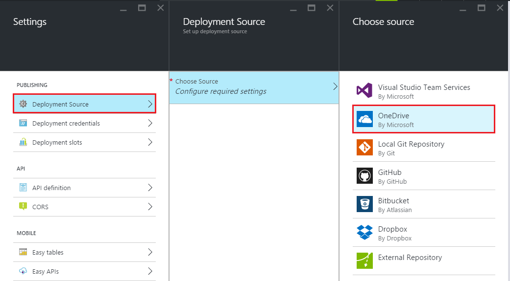
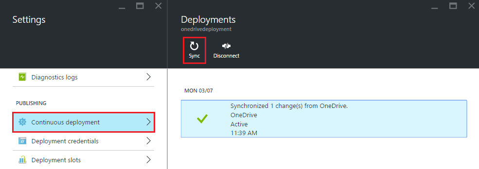

<properties
	pageTitle="Sync content from a cloud folder to Azure App Service"
	description="Learn how to deploy your app to Azure App Service via content sync from a cloud folder."
	services="app-service"
	documentationCenter=""
	authors="dariagrigoriu"
	manager="wpickett"
	editor="mollybos"/>

<tags
	ms.service="app-service"
	ms.workload="na"
	ms.tgt_pltfrm="na"
	ms.devlang="na"
	ms.topic="article"
	ms.date="06/13/2016"
	ms.author="dariagrigoriu"/>
    
# Sync content from a cloud folder to Azure App Service

This tutorial shows you how to deploy to [Azure App Service](http://go.microsoft.com/fwlink/?LinkId=529714) by syncing your content from popular cloud storage services like Dropbox and OneDrive. 

## Overview of content sync deployment

The on-demand content sync deployment is powered by the [Kudu deployment engine](https://github.com/projectkudu/kudu/wiki) 
integrated with App Service. In the [Azure Portal](https://portal.azure.com), you can designate a folder in your cloud storage, 
work with your app code and content in that folder, and sync to App Service with the click of a button. Content sync utilizes the Kudu process for build and deployment. 
    
## How to enable content sync deployment
To enable content sync from the [Azure Portal](https://portal.azure.com), follow these steps:

1. In your app's blade in the Azure Portal, click **Settings** > **Deployment Source**. Click **Choose Source**, then select **OneDrive** or **Dropbox** as the source for deployment. 

    

2. Complete the authorization workflow to enable App Service to access a specific pre-defined designated path for OneDrive or Dropbox where all of your App Service content will be stored.  
    After authorization the App Service platform will give you the option to create a content folder under the designated content path, or to choose an existing content folder under this designated content path. The designated content paths under your cloud storage accounts used for App Service sync are the following:  
    * **OneDrive**: `Apps\Azure Web Apps` 
    * **Dropbox**: `Dropbox\Apps\Azure`

3. After the initial content sync the content sync can be initiated on demand from the Azure portal. Deployment history is available with the **Deployments** blade.

    
 
More information for Dropbox deployment is available under [Deploy from Dropbox](http://blogs.msdn.com/b/windowsazure/archive/2013/03/19/new-deploy-to-windows-azure-web-sites-from-dropbox.aspx). 

