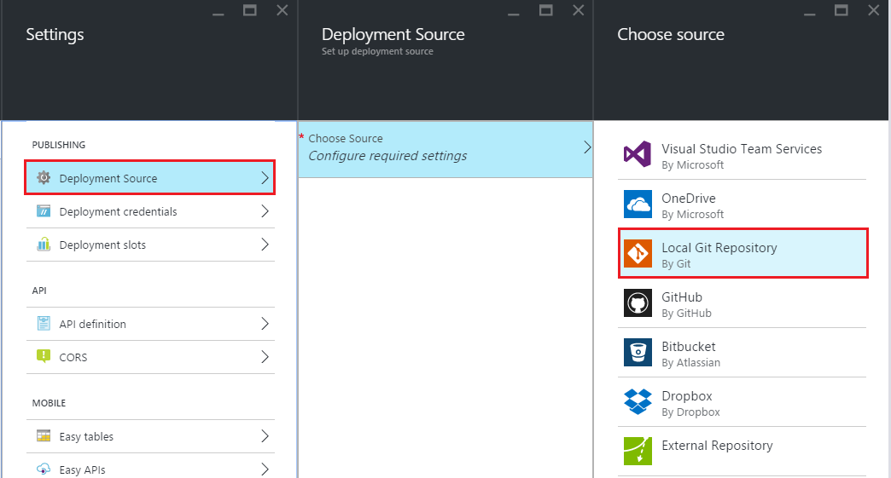
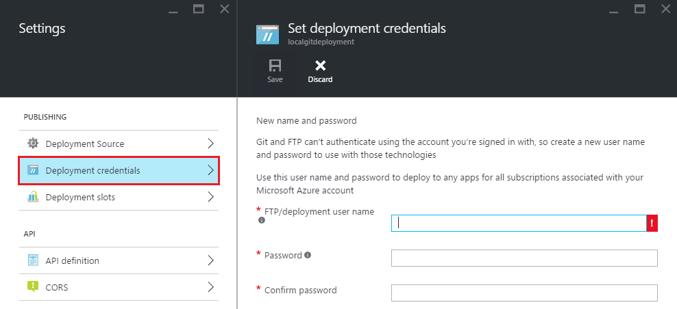
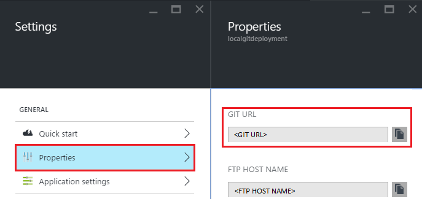
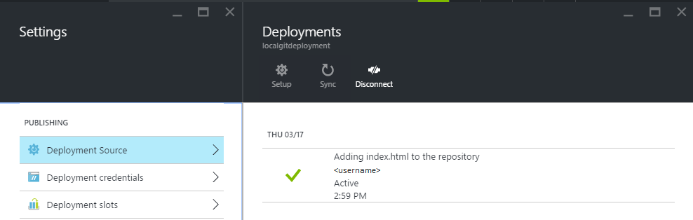

<properties
	pageTitle="Local Git Deployment to Azure App Service"
	description="Learn how to enable local Git deployment to Azure App Service."
	services="app-service"
	documentationCenter=""
	authors="dariagrigoriu"
	manager="wpickett"
	editor="mollybos"/>

<tags
	ms.service="app-service"
	ms.workload="na"
	ms.tgt_pltfrm="na"
	ms.devlang="na"
	ms.topic="article"
	ms.date="06/13/2016"
	ms.author="dariagrigoriu"/>
    
# Local Git Deployment to Azure App Service

This tutorial shows you how to deploy your app to [Azure App Service] from a Git repository on your local computer. App Service supports this approach with the **Local Git** deployment option in the [Azure Portal].  
Many of the Git commands described in this article are performed automatically when creating an App Service app using the [Azure Command-Line Interface] as described [here](app-service-web-get-started.md).

## Prerequisites

To complete this tutorial, you need:

- Git. You can download the installation binary [here](http://www.git-scm.com/downloads).  
- Basic knowledge of Git.
- A Microsoft Azure account. If you don't have an account, you can 
[sign up for a free trial](https://azure.microsoft.com/pricing/free-trial) or 
[activate your Visual Studio subscriber benefits](https://azure.microsoft.com/pricing/member-offers/msdn-benefits-details).

>[AZURE.NOTE] If you want to get started with Azure App Service before signing up for an Azure account, go to [Try App Service](http://go.microsoft.com/fwlink/?LinkId=523751), where you can immediately create a short-lived starter app in App Service. No credit cards required; no commitments.  

## Step 1: Create a local repository

Perform the following tasks to create a new Git repository.

1. Start a command-line tool, such as **GitBash** (Windows) or **Bash** (Unix Shell). On OS X systems you can access the command-line through the **Terminal** application.

2. Navigate to the directory where the content to deploy would be located.

3. Use the following command to initialize a new Git repository:

		git init

## Step 2: Commit your content

App Service supports applications created in a variety of programming languages. 

1. If your repository already includes content skip this point and move to point 2 below. If your repository does not already include content simply populate with a static .html file as follows: 

    - Using a text editor, create a new file named **index.html** at the root of the Git repository
    - Add the following text as the contents for the index.html file and save it: *Hello Git!*
        
2. From the command-line, verify that you are under the root of your Git repository. Then use the following command to add files to your repository:

		git add -A 

4. Next, commit the changes to the repository by using the following command:

		git commit -m "Hello Azure App Service"

## Step 3: Enable the App Service app repository

Perform the following steps to enable a Git repository for your App Service app.

1. Log in to the [Azure Portal].

2. In your App Service app's blade, click **Settings > Deployment source**. Click **Choose source**, then click **Local Git Repository**, and then click **OK**.  

	

3. If this is your first time setting up a repository in Azure, you need to create login credentials for it. You will use them to log into the Azure repository and push changes from your local Git repository. From your app's blade, click **Settings > Deployment credentials**, then configure your deployment username and password. When you're done, click **Save**.

	

## Step 4: Deploy your project

Use the following steps to publish your app to App Service using Local Git.

1. In your app's blade in the Azure Portal, click **Settings > Properties** for the **Git URL**.

	

	**Git URL** is the remote reference to deploy to from your local repository. You'll use this URL in the following steps.

2. Using the command-line, verify that you are in the root of your local Git repository.

3. Use `git remote` to add the remote reference listed in **Git URL** from step 1. Your command will look similar to the following:

		git remote add azure https://<username>@localgitdeployment.scm.azurewebsites.net:443/localgitdeployment.git         
    > [AZURE.NOTE] The **remote** command adds a named reference to a remote repository. In this example, it creates a reference named 'azure' for your web app's repository.

4. Push your content to App Service using the new **azure** remote you just created.

		git push azure master

	You will be prompted for the password you created earlier when you reset your deployment credentials in the Azure Portal. Enter the password (note that Gitbash does not echo asterisks to the console as you type your password). 
       
5. Go back to your app in the Azure Portal. A log entry of your most recent push should be displayed in the **Deployments** blade. 

	

6. Click the **Browse** button at the top of the app's blade to verify the content has been deployed. 
    
## Troubleshooting

The following are errors or problems commonly encountered when using Git to publish to an App Service app in Azure:

****

**Symptom**: Unable to access '[siteURL]': Failed to connect to [scmAddress]

**Cause**: This error can occur if the app is not up and running.

**Resolution**: Start the app in the Azure Portal. Git deployment will not work unless the app is running. 

****

**Symptom**: Couldn't resolve host 'hostname'

**Cause**: This error can occur if the address information entered when creating the 'azure' remote was incorrect.

**Resolution**: Use the `git remote -v` command to list all remotes, along with the associated URL. Verify that the URL for the 'azure' remote is correct. If needed, remove and recreate this remote using the correct URL.

****

**Symptom**: No refs in common and none specified; doing nothing. Perhaps you should specify a branch such as 'master'.

**Cause**: This error can occur if you do not specify a branch when performing a git push operation, and have not set the push.default value used by Git.

**Resolution**: Perform the push operation again, specifying the master branch. For example:

	git push azure master

****

**Symptom**: src refspec [branchname] does not match any.

**Cause**: This error can occur if you attempt to push to a branch other than master on the 'azure' remote.

**Resolution**: Perform the push operation again, specifying the master branch. For example:

	git push azure master

****

**Symptom**: Error - Changes committed to remote repository but your web app not updated.

**Cause**: This error can occur if you are deploying a Node.js app containing a package.json file that specifies additional required modules.

**Resolution**: Additional messages containing 'npm ERR!' should be logged prior to this error, and can provide additional context on the failure. The following are known causes of this error and the corresponding 'npm ERR!' message:

* **Malformed package.json file**: npm ERR! Couldn't read dependencies.

* **Native module that does not have a binary distribution for Windows**:

	* npm ERR! \`cmd "/c" "node-gyp rebuild"\` failed with 1

		OR

	* npm ERR! [modulename@version] preinstall: \`make || gmake\`

## Additional Resources

* [Git documentation](http://git-scm.com/documentation)
* [Project Kudu documentation](https://github.com/projectkudu/kudu/wiki)
* [Continous Deployment to Azure App Service](app-service-continuous-deployment.md)
* [How to use PowerShell for Azure](../powershell-install-configure.md)
* [How to use the Azure Command-Line Interface](../xplat-cli-install.md)

[Azure App Service]: https://azure.microsoft.com/documentation/articles/app-service-changes-existing-services/
[Azure Developer Center]: http://www.windowsazure.com/en-us/develop/overview/
[Azure Portal]: https://portal.azure.com
[Git website]: http://git-scm.com
[Installing Git]: http://git-scm.com/book/en/Getting-Started-Installing-Git
[Azure Command-Line Interface]: https://azure.microsoft.com/en-us/documentation/articles/xplat-cli-azure-resource-manager/

[Using Git with CodePlex]: http://codeplex.codeplex.com/wikipage?title=Using%20Git%20with%20CodePlex&referringTitle=Source%20control%20clients&ProjectName=codeplex
[Quick Start - Mercurial]: http://mercurial.selenic.com/wiki/QuickStart
