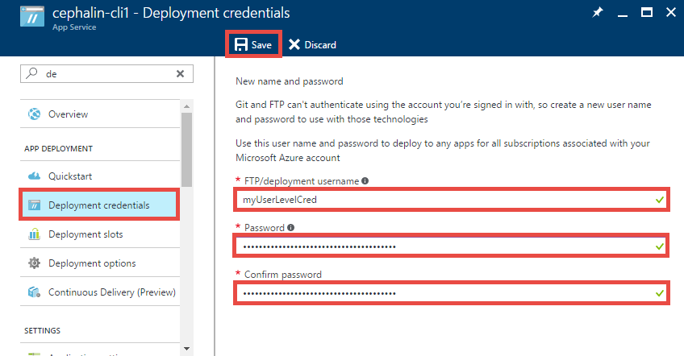
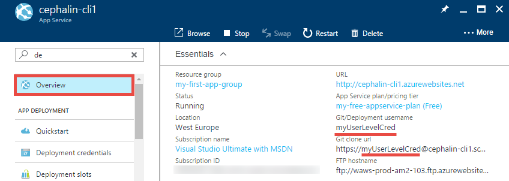
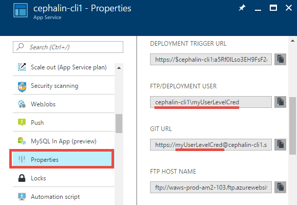
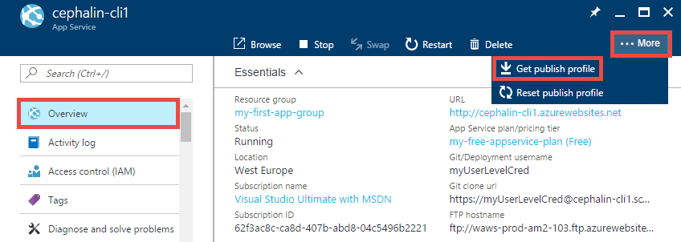
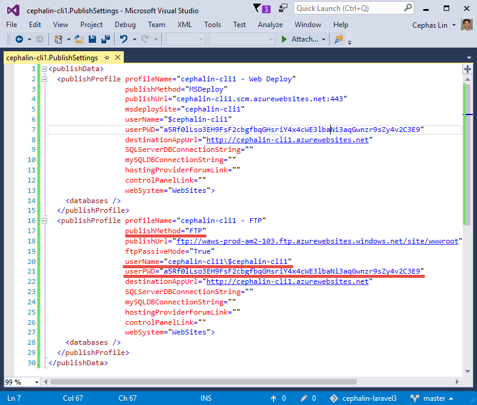

# Configure deployment credentials for Azure App Service
[Azure App Service](http://go.microsoft.com/fwlink/?LinkId=529714) supports two types of credentials for [local Git deployment](app-service-deploy-local-git.md) 
and [FTP/S deployment](app-service-deploy-ftp.md). These are not the same as your Azure Active Directory credentials.

* **User-level credentials**: one set of credentials for the entire Azure account. It can be used to deploy to App Service for any app, in any subscription, that the Azure account has permission to access. These are the default
credentials set that you configure in **App Services** > **&lt;app_name>** > **Deployment credentials**. This is also the default set that's surfaced in the portal GUI (such as the **Overview** and **Properties**
of your app's [resource blade](../azure-resource-manager/resource-group-portal.md#manage-resources)).

    > [!NOTE]
    > When you delegate access to Azure resources via Role Based Access Control (RBAC) or co-admin permissions, each Azure user that receives access to an app can use his/her personal user-level credentials until access is revoked. These deployment credentials should not be shared with other Azure users.
    >
    >

* **App-level credentials**: one set of credentials for each app. It can be used to deploy to that app only. The credentials
for each app is generated automatically at app creation, and is found in the app's publish profile. You cannot manually configure the credentials, but you can reset them for an app anytime.

    > [!NOTE]
    > In order to give someone access to these credentials via Role Based Access Control (RBAC), you need to make them contributor or higher on the Web App. Readers are not allowed to publish, and hence can't access those credentials.
    >
    >

## Set and reset user-level credentials

You can configure your user-level credentials in any app's [resource blade](../azure-resource-manager/resource-group-portal.md#manage-resources). Regardless in which app you configure
these credentials, it applies to all apps and for all subscriptions in your Azure account. 

To configure your user-level credentials:

1. In the [Azure portal](https://portal.azure.com), click App Service > **&lt;any_app>** > **Deployment credentials**.

    > [!NOTE]
    > In the portal, you must have at least one app before you can access the deployment credentials blade. However, with the [Azure CLI](app-service-web-app-azure-resource-manager-xplat-cli.md), 
    > you can configure user-level credentials without an existing app.

2. Configure the user name and password, and then click **Save**.

    

Once you have set your deployment credentials, you can find the *Git* deployment username in your app's **Overview**,

and and *FTP* deployment username in your app's **Properties**.

> [!NOTE]
> Azure does not show your user-level deployment password. If you forget the password, you can't retrieve it. However, you can reset your credentials by following the steps in this section.
>
>  

## Get and reset app-level credentials
For each app in App Service, its app-level credentials are stored in the XML publish profile.

To get the app-level credentials:

1. In the [Azure portal](https://portal.azure.com), click App Service > **&lt;any_app>** > **Overview**.

2. Click **...More** > **Get publish profile**, and download starts for a .PublishSettings file.

    

3. Open the .PublishSettings file and find the `<publishProfile>` tag with the attribute `publishMethod="FTP"`. Then, get its `userName` and `password` attributes.
These are the app-level credentials.

    

    Similar to the user-level credentials, the FTP deployment username is in the format of `<app_name>\<username>`, and the Git deployment username is just `<username>` without the preceding `<app_name>\`.

To reset the app-level credentials:

1. In the [Azure portal](https://portal.azure.com), click App Service > **&lt;any_app>** > **Overview**.

2. Click **...More** > **Reset publish profile**. Click **Yes** to confirm the reset.

    The reset action invalidates any previously-downloaded .PublishSettings files.

## Next steps

Find out how to use these credentials to deploy your app from [local Git](app-service-deploy-local-git.md) or using [FTP/S](app-service-deploy-ftp.md).
