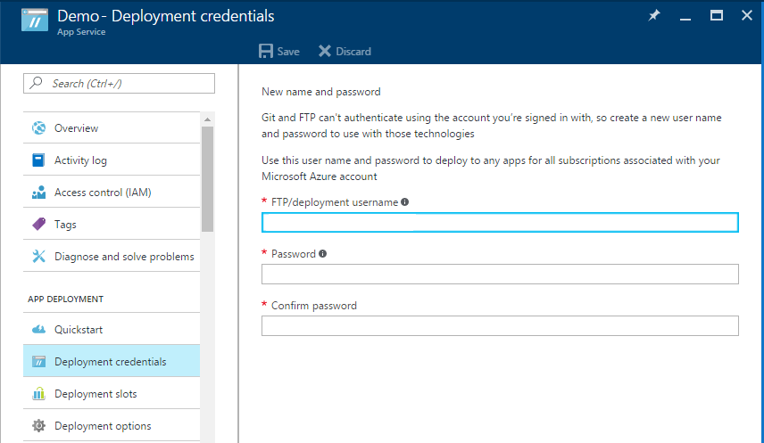
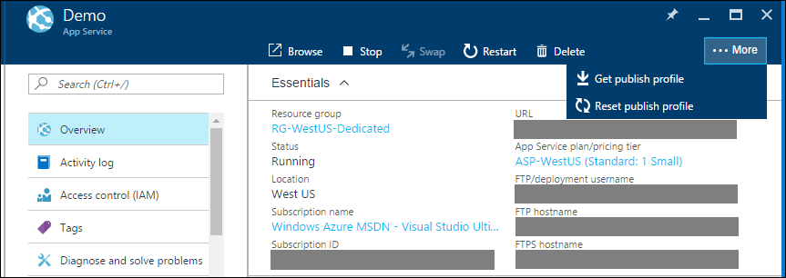

# Azure App Service Deployment Credentials
The [Azure App Service](http://go.microsoft.com/fwlink/?LinkId=529714) platform supports two types of credentials for content deployment.
* Deployment credentials: user-scoped credentials
* Publish profile: app-scoped credentials 

## User-scoped credentials
The user-scoped credentials are created by the Azure user and directly map to a Microsoft account rather than any specific App Service app. The user-scoped deployment credentials can be set or reset from the [Azure portal](https://portal.azure.com) where each App Service app has an editing entry point under **APP DEPLOYMENT > Deployment credentials**. Regardless of the entry point, edits to these user-scoped credentials apply across the entire Microsoft account. These credentials are frequently used for FTP and Git deployment.

 
When delegating access to Azure resources via Role Based Access Control (RBAC) or co-admin permissions each Azure user receiving access can use their own user-scoped credentials until access is revoked. These deployment credentials should not be shared with other Azure users.

## App-scoped credentials
The app-scoped credentials are automatically created by the App Service platform. They are stored in the XML publish profile for each App Service app. The publish profile is available in the [Azure portal](https://portal.azure.com) via the **Get publish profile** action in the app’s **Overview** blade. These credentials are frequently used for WebDeploy-based deployment. They can also be used for FTP or Git deployment. Visual Studio, which is an entry point for WebDeploy-based deployment is able to parse the publish profile for authentication.

When delegating access to Azure resources via Role Based Access Control (RBAC) or co-admin permissions each Azure user receiving access can download the same app-specific publish profile. The publish profile can be reset at any time from the Azure portal app **Overview** blade. Resetting the app-scoped credentials can be a good idea after revoking delegated access.
