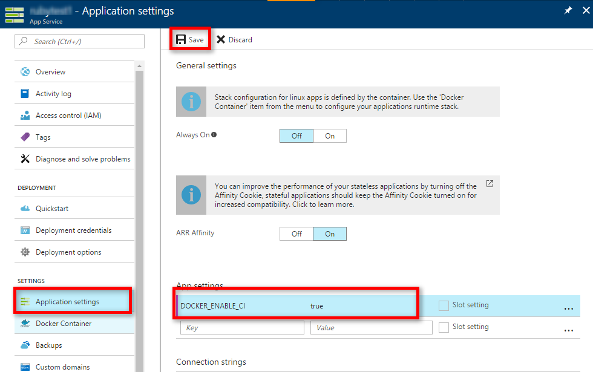

# Docker Hub Continuous Deployment with Azure Web App on Linux

[!INCLUDE [app-service-linux-preview](../../includes/app-service-linux-preview.md)]

In this tutorial, you configure continuous deployment for a custom container image from [Docker Hub](https://hub.docker.com).

## Step 1 - Log in to Azure

Log in to the Azure portal at http://portal.azure.com

## Step 2 - Enable Docker Hub continuous deployment

In the **[Azure portal](https://portal.azure.com/)**, click the **App Service** option on the left of the page.

Click on the name of your app that you want to configure Docker Hub continuous deployment for.

In the **App settings**, add an app setting called `DOCKER_ENABLE_CI` with the value `true`.

## Step 3 - Add a web hook to Docker Hub

In your Docker Hub page, click **Webhooks**, then **CREATE A WEBHOOK**.

For the Webhook URL, you need to have the following endpoint:
`https://<publishingusername>:<publishingpwd>@<sitename>.scm.azurewebsites.net/docker/hook`.

You can obtain your `publishingusername` and `publishingpwd` by downloading the web app publish profile using the Azure portal.

When the image gets updated, the web app get updated automatically with the new image.

## Next steps
* [What is Azure Web App on Linux?](./app-service-linux-intro.md)
* [Creating Apps in Azure Web App on Linux](./app-service-linux-how-to-create-web-app.md)
* [Using PM2 Configuration for Node.js in Azure Web App on Linux](app-service-linux-using-nodejs-pm2.md)
* [Using .NET Core in Azure Web App on Linux](app-service-linux-using-dotnetcore.md)
* [Using Ruby in Azure Web App on Linux](app-service-linux-ruby-get-started.md)
* [How to use a custom Docker image for Azure Web App on Linux](./app-service-linux-using-custom-docker-image.md)
* [Azure App Service Web App on Linux FAQ](./app-service-linux-faq.md) 

