# Create a Ruby App with Azure Web App on Linux - Preview

[!INCLUDE [app-service-linux-preview](../../includes/app-service-linux-preview.md)]

## Overview

This tutorial shows you how to create a basic ruby on rails application locally and deploy it to Azure Web App on Linux.

## Prerequisites

* [Ruby 2.3.3 or higher](https://www.ruby-lang.org/en/documentation/installation/#rubyinstaller)  installed on your development machine.
* [Git](https://git-scm.com/downloads) is installed on your development machine
* An [active Azure subscription](https://azure.microsoft.com/pricing/free-trial/)
* This tutorial is written in the context of an Ubuntu environment. All system commands are bash specific.

## Create a new local rails application

1. Create a directory for the new app and change to that directory.

		mkdir ~/workspace
		cd ~/workspace

2. Initialize Ruby and check the version using the `ruby -v` command.

    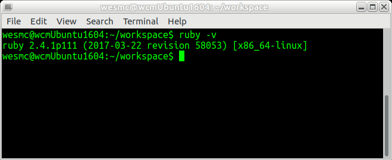

3. Install rails using the `gem install rails` command.

    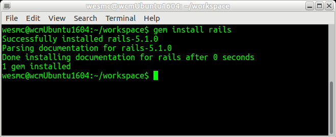

4. Create a rails application called **hello-world** using the following command:

	If you are using Rails 5.1.0 or later, include the `--skip-yarn` option as shown in the following command:

		rails new hello-world --skip-yarn

	For Rails versions prior to 5.1.0, use the following command:

		rails new hello-world 

    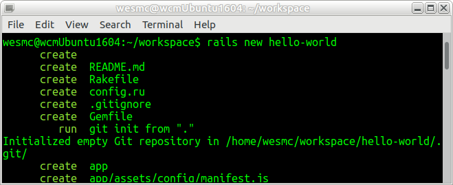

    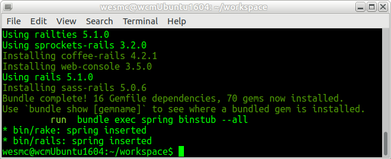

	If you are using Rails 5.1+, a package.json is created if the `--skip-yarn` option is not used. We don't want it included with our deployment. As an alternative, you can delete the package.json file or add it to the *.git-ignore* file in the directory as follows: 

		# Ignore package.json
		/package.json

5. Change to the *hello-world* directory, and start the server.

		cd hello-world
		rails server

    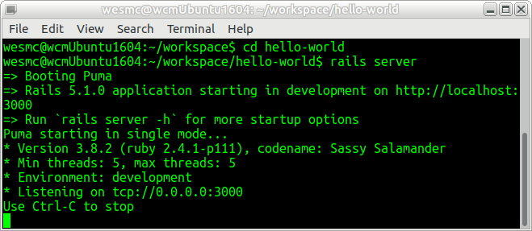
	
6. Using your web browser, navigate to `http://localhost:3000` to test the app locally.	

    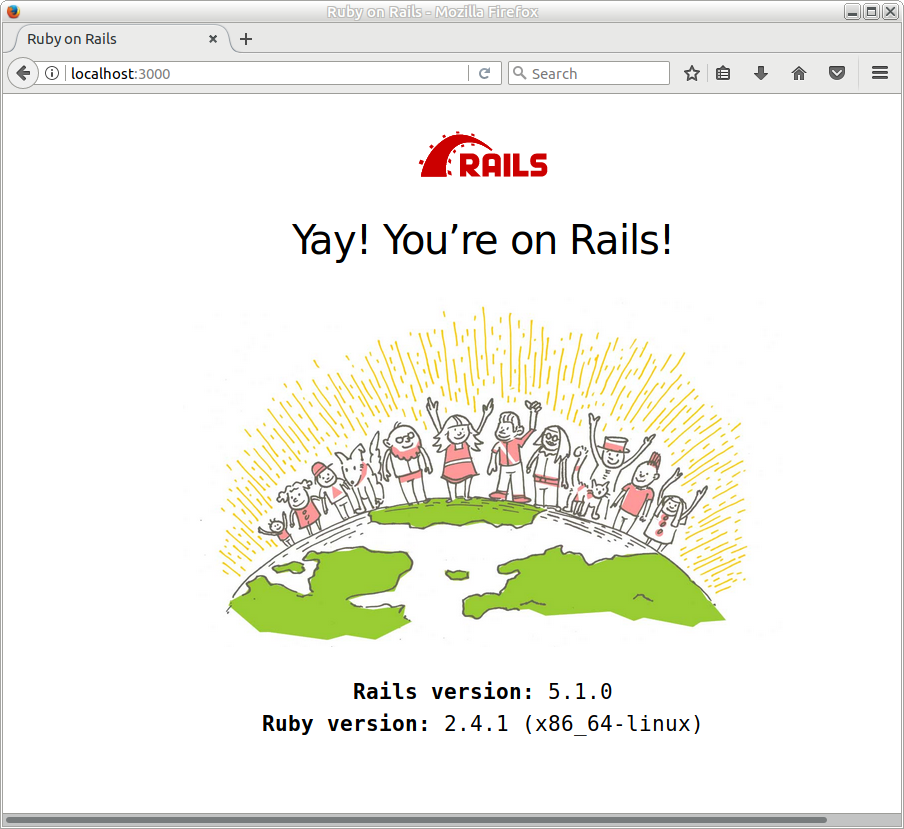

## Prepare the app for Azure

By default, the ruby image runs the server with the `-e production` flag. This environment requires some setup for Azure Web App on Linux. The container takes care of some of that setup (such as setting a `SECRET_KEY_BASE`). A default route must be configured. Otherwise you receive a 404 error browsing the site.

To configure a default route:

1. Open *~/workspace/hello-world/config/routes.rb* for editing. Add the following line as shown in the screenshot. 

		root 'application#hello'

	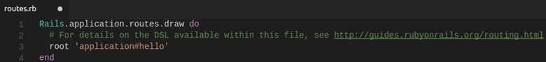

2. Open *~/workspace/hello-world/app/controllers/application_controller.rb* for editing. Add the following lines as shown in the screenshot.

		def hello
			render html: "Hello, world from Azure Web App on Linux!"
		end

	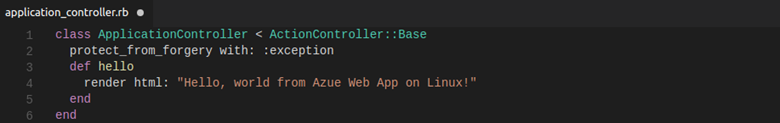

3. Your app is now configured. Using your web browser, navigate to `http://localhost:3000` to confirm the root landing page.

	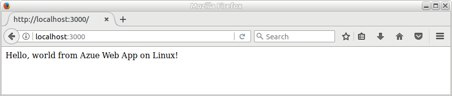

## Create a ruby website on Azure

1. Navigate to the [Azure portal](http://portal.azure.com) and login in with your subscription. Add a **Web App on Linux** as shown in the following screenshot:

	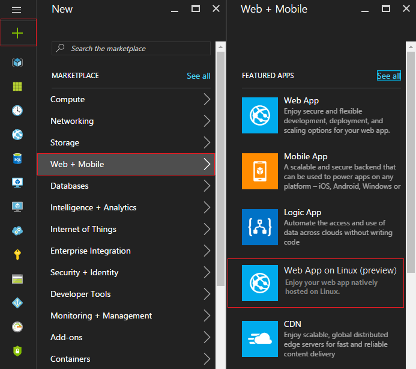

2. The **Create blade** opens as shown in the following screenshot:

	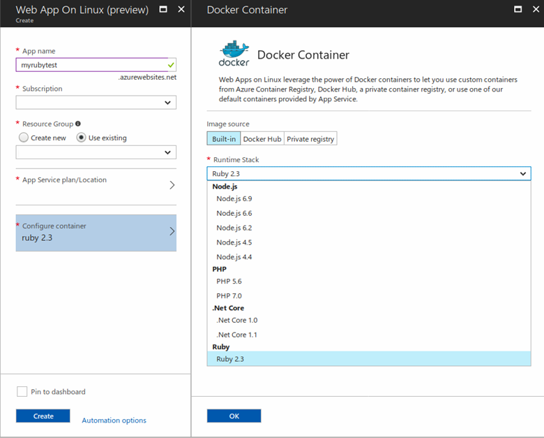

	1. Give your web app a name.
	2. Choose an existing resource group or create a new one. (See available regions in the [limitations section](app-service-linux-intro.md).)
	3. Choose an existing Azure App Service plan or create a new one. (See App Service plan notes in the [limitations section](app-service-linux-intro.md).)
	4. Choose the **Ruby 2.3** built-in runtime stack for your container configuration.
	5. Click **Pin to dashboard** for the web app.
	6. Click **Create**.

3. Once the web app is created, the **Overview** blade is displayed. Copy the **URL** for the new web app and open it in your browser. The following splash page is displayed.

	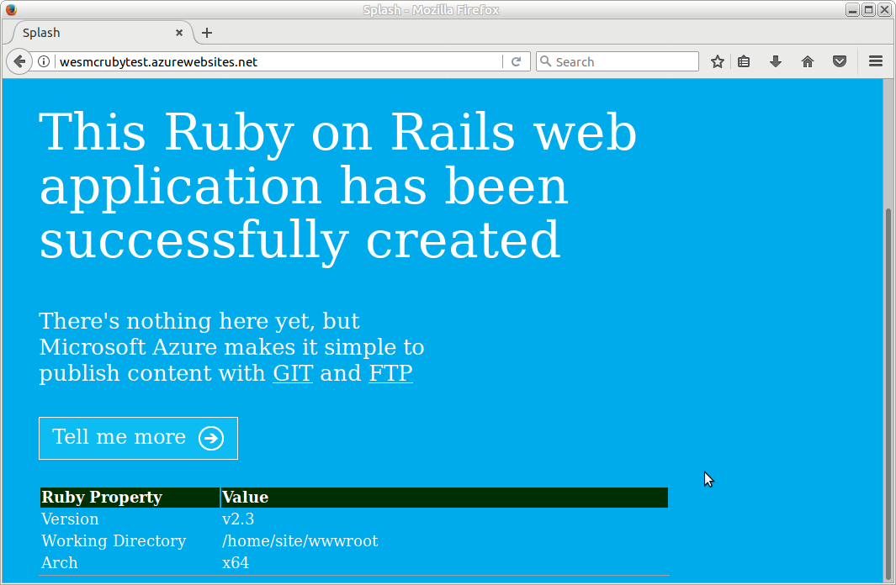

## Deploy your application

In this tutorial, we use Git to deploy the local Ruby application to Azure.

1. The new Azure website already has a Git deployment configured. You will find the Git deployment URL by navigating to the following URL after inserting your web app name:

		https://{your web app name}.scm.azurewebsites.net/api/scm/info

	The Git URL has the following form based on your web app name:

		https://{your web app name}.scm.azurewebsites.net/{your web app name}.git

2. Run the following commands to deploy the local application to your Azure website.

		cd ~/workspace/hello-world
		git init
		git remote add azure <Git deployment URL from above>
		git add -A
		git commit -m "Initial deployment commit"
		git push master

	Confirm that the remote deployment operations report success.

	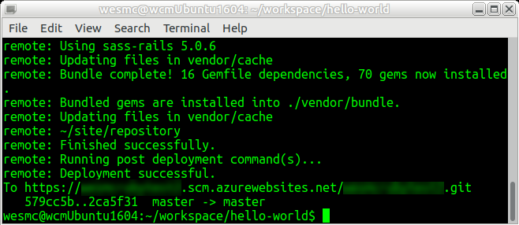

	If you see an error stating that the remote has hung up, the deployment is likely still in progress. In this case, navigate to the following URL in your browser:

		https://{your web app name}.scm.azurewebsites.net/api/deployments

3. Once the deployment has completed, restart your web app for the deployment to take effect. In the [Azure portal](http://portal.azure.com), navigate to the **Overview** blade of your web app.

	Click **Restart** on the toolbar.

	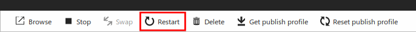

4. Navigate to your site and confirm your updates are live. 

	While the app is restarting, attempting to browse the site results in an HTTP status code error 503 (Server Unavailable). It may take a couple minutes to fully restart.

		http://{your web app name}.azurewebsites.net

	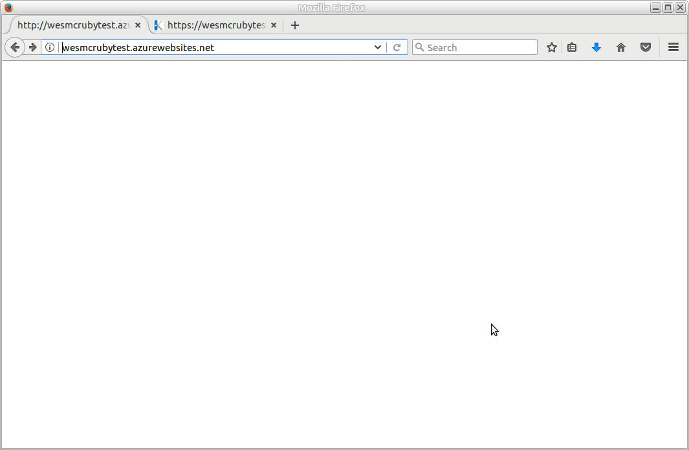
	

## Next steps
For more information regarding Azure App Service Web App on Linux, see the following links. You can also post questions and concerns on [our forum](https://social.msdn.microsoft.com/forums/azure/home?forum=windowsazurewebsitespreview).

* [Creating Web Apps in App Service on Linux](app-service-linux-how-to-create-web-app.md)
* [How to use a custom Docker image for App Service on Linux](app-service-linux-using-custom-docker-image.md)
* [Using PM2 Configuration for Node.js in Web Apps on Linux](app-service-linux-using-nodejs-pm2.md)
* [Using .NET Core in Azure App Service Web Apps on Linux](app-service-linux-using-dotnetcore.md)
* [Azure App Service Web Apps on Linux FAQ](app-service-linux-faq.md)

