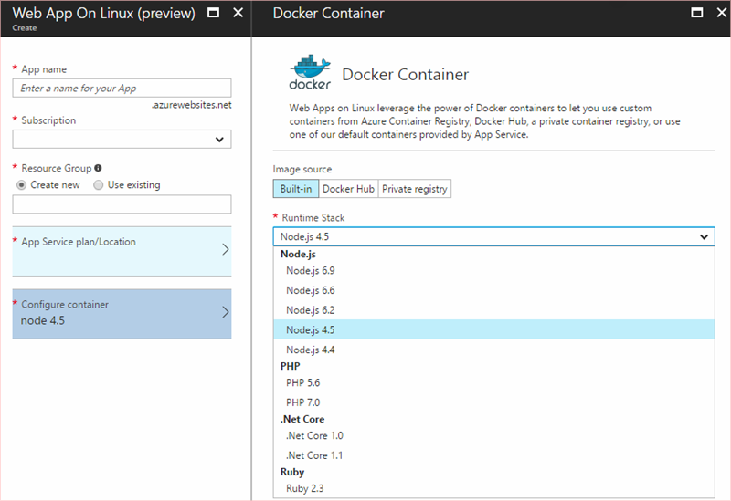

# SSH support for Azure Web App on Linux

[!INCLUDE [app-service-linux-preview](../../includes/app-service-linux-preview.md)]

## Overview

[Secure Shell (SSH)](https://en.wikipedia.org/wiki/Secure_Shell) is a cryptographic network protocol for using network services securely. It is most commonly used to log into a system remotely securely from a command-line and execute administrative commands remotely.

Web App on Linux provides SSH support into the app container with each of the built-in Docker images used for the Runtime Stack of new web apps. 



You can also use SSH with your custom Docker images by including the SSH server as part of the image and configuring it as described in this topic.


## Making a client connection

To make an SSH client connection, the main site must be started. 

Paste the Source Control Management (SCM) endpoint for your web app into your browser using the following form:

		https://<your sitename>.scm.azurewebsites.net/webssh/host

If you are not already authenticated, you are required to authenticate with your Azure subscription to connect.


## SSH support with custom Docker images

In order for a custom Docker image to support SSH communication between the container and the client in the Azure portal, perform the following steps for your Docker image. 

These steps are are shown in the Azure App Service repository as an example [here](https://github.com/Azure-App-Service/node/tree/master/4.4.7-1).

1. Include the `openssh-server` installation in [`RUN` instruction](https://docs.docker.com/engine/reference/builder/#run) in the Dockerfile for your image and set the password for the root account to `"Docker!"`. 

	> [!NOTE] 
	> This configuration does not allow external connections to the container. SSH can only
	> be accessed via the Kudu / SCM Site, which is authenticated using the publishing
	> credentials.

	```docker
	# ------------------------
	# SSH Server support
	# ------------------------
	RUN apt-get update \ 
	  && apt-get install -y --no-install-recommends openssh-server \
	  && echo "root:Docker!" | chpasswd
	``` 

2. Add a [`COPY` instruction](https://docs.docker.com/engine/reference/builder/#copy) to the Dockerfile to copy a [sshd_config](http://man.openbsd.org/sshd_config) file to the */etc/ssh/* directory. Your configuration file should be based on our sshd_config file in the Azure-App-Service GitHub repository [here](https://github.com/Azure-App-Service/node/blob/master/6.11/sshd_config).

	> [!NOTE] 
	> The *sshd_config* file must include the following or the connection fails: 
	> * `Ciphers` must include at least one of the following: `aes128-cbc,3des-cbc,aes256-cbc`.
	> * `MACs` must include at least one of the following: `hmac-sha1,hmac-sha1-96`.

	```docker
	COPY sshd_config /etc/ssh/
	```


3. Include port 2222 in the [`EXPOSE` instruction](https://docs.docker.com/engine/reference/builder/#expose) for the Dockerfile. Although the root password is known, port 2222 cannot be accessed from the internet. It is an internal only port accessible only by containers within the bridge network of a private virtual network.

	```docker
	EXPOSE 2222 80
	```

4. Make sure to start the ssh service. The example [here](https://github.com/Azure-App-Service/node/blob/master/6.9.3-1/init_container.sh) uses a shell script in */bin* directory.

	```bash
	#!/bin/bash
	service ssh start
	```

	The Dockerfile uses the [`CMD` instruction](https://docs.docker.com/engine/reference/builder/#cmd) to run the script.

	```docker
	COPY init_container.sh /bin/
	  ...
	RUN chmod 755 /bin/init_container.sh 
	  ...		
	CMD ["/bin/init_container.sh"]
	```


## Next steps
See the following links for more information regarding Web App on Linux. You can post questions and concerns on [our forum](https://social.msdn.microsoft.com/forums/azure/home?forum=windowsazurewebsitespreview).

* [Creating Apps in Azure Web App on Linux](app-service-linux-how-to-create-web-app.md)
* [How to use a custom Docker image for Azure Web App on Linux](app-service-linux-using-custom-docker-image.md)
* [Using PM2 Configuration for Node.js in Azure Web App on Linux](app-service-linux-using-nodejs-pm2.md)
* [Using .NET Core in Azure Web App on Linux](app-service-linux-using-dotnetcore.md)
* [Using Ruby in Azure Web App on Linux](app-service-linux-ruby-get-started.md)
* [Azure App Service Web App on Linux FAQ](app-service-linux-faq.md)

