<properties
   pageTitle="Test your Azure web app's performance | Microsoft Azure"
   description="Run Azure web app performance tests to check how your app handles user load. Measure response time and find failures that might indicate problems."
   services="app-service\web"
   documentationCenter=""
   authors="ecfan"
   manager="douge"
   editor="jimbe"/>

<tags
   ms.service="app-service-web"
   ms.workload="web"
   ms.tgt_pltfrm="na"
   ms.devlang="na"
   ms.topic="article"
   ms.date="05/25/2016"
   ms.author="estfan; manasma; ahomer"/>

# Performance test your Azure web app under load

Check your web app's performance before you launch it or deploy updates to production. 
That way, you can better assess whether your app is ready for release. Feel more
confident that your app can handle the traffic during peak use or at your next marketing push.

During public preview, you can performance test your app for free in the Azure Portal.
These tests simulate user load on your app over a specific time period and measure your app's response. 
For example, your test results show how fast your app responds to a specific number 
of users. They also show how many requests failed, which might indicate problems with your app.      

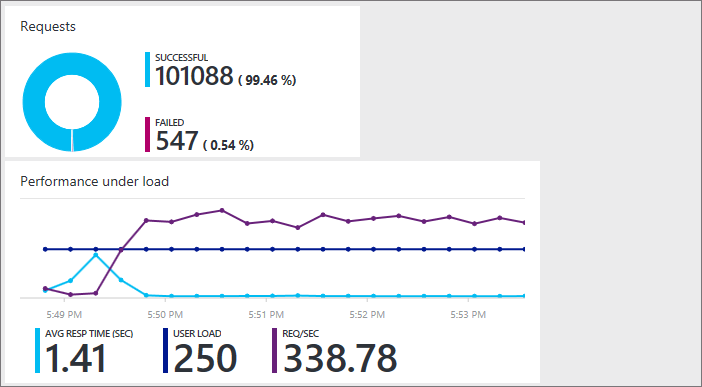

## Before you start

* You'll need an [Azure subscription](https://account.windowsazure.com/subscriptions), 
if you don't have one already. Learn how you can 
[open an Azure account for free](https://azure.microsoft.com/pricing/free-trial/?WT.mc_id=A261C142F).

* You'll need a [Visual Studio Team Services](https://www.visualstudio.com/products/what-is-visual-studio-online-vs) 
account to keep your performance test history. A suitable account will be created 
automatically when you set up your performance test. Or you can create a new account 
or use an existing account if you're the account owner. 

* Deploy your app for testing in a non-production environment. 
Have your app use an App Service plan other than the plan used in production. 
That way, you don't affect any existing customers or slow down your app in production. 

## Set up and run your performance test

0.  Sign in to the [Azure Portal](https://portal.azure.com). 
To use a Visual Studio Team Services account that you own, 
sign in as the account owner.

0.  Go to your web app.

    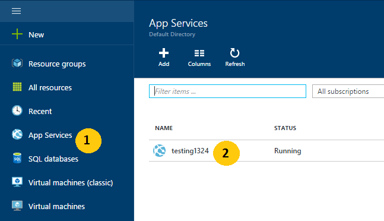

0.  Go to **Performance Test**.

    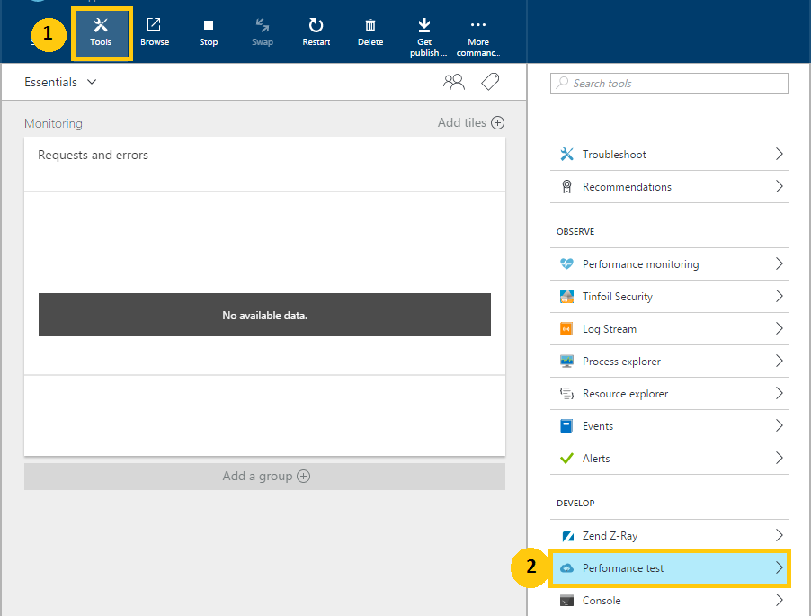
 
0. Now you'll link a [Visual Studio Team Services](https://www.visualstudio.com/products/what-is-visual-studio-online-vs) 
account to keep your performance test history.

    If you have a Team Services account to use, select that account. If you don't, create a new account.

    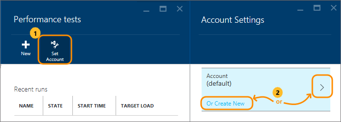

0.  Create your performance test. Set the details and run the test. 

You can watch the results in real time while the test runs.

For example, suppose we have an app that gave out coupons at last year's holiday sale. 
This event lasted 15 minutes with a peak load of 100 concurrent customers. 
We want to double the number of customers this year. We also want to improve customer satisfaction by reducing the page load time from 5 seconds to 2 seconds. 
So, we'll test our updated app's performance with 250 users for 15 minutes.

We'll simulate load on our app by generating virtual users (customers) 
  who visit our web site at the same time. This will show us how many 
  requests are failing or responding slowly.

  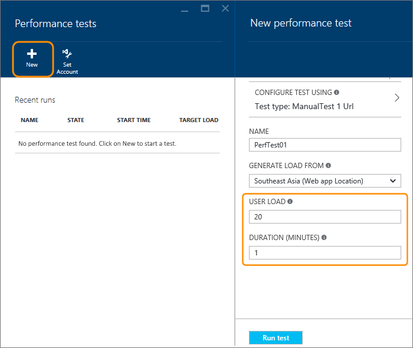

   *  Your web app's default URL is added automatically. 
   You can change the URL to test other pages (HTTP GET requests only).

   *  To simulate local conditions and reduce latency, 
   select a location closest to your users for generating load.

  Here's the test in progress. During the first minute, 
  our page loads slower than we want.

  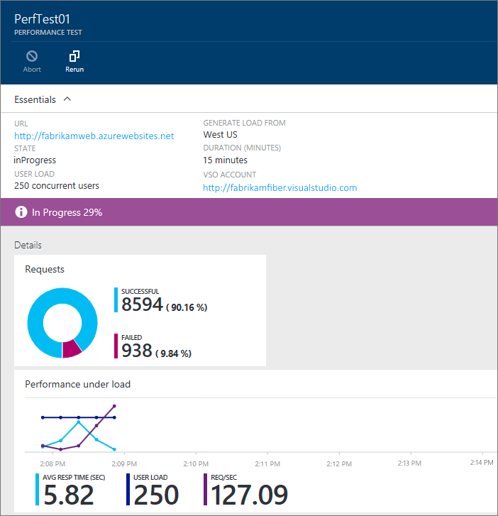

  After the test is done, we learn that the page loads much faster 
  after the first minute. This helps identify where we might want to 
  start troubleshooting the problem.

  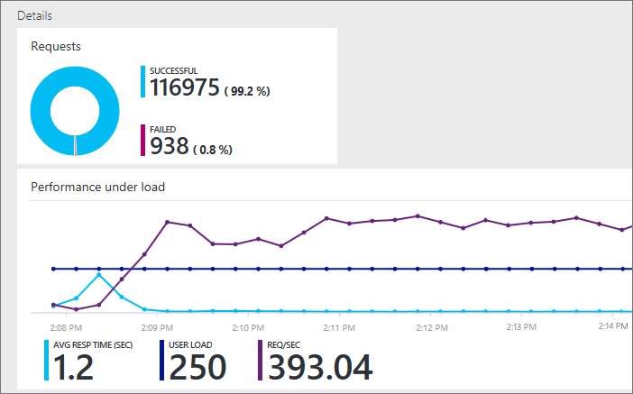

## Test multiple URLs

You can also run performance tests incorporating multiple URLs
that represent an end-to-end user scenario by uploading a Visual
Studio Web Test file. Some of the ways you can create a
Visual Studio Web Test file are:

* [Capture traffic using Fiddler and export as a Visual Studio Web Test file](http://docs.telerik.com/fiddler/Save-And-Load-Traffic/Tasks/VSWebTest)
* [Create a load test file in Visual Studio](https://www.visualstudio.com/docs/test/performance-testing/run-performance-tests-app-before-release)

To upload and run a Visual Studio Web Test file:
 
0. Follow the steps above to open the **New performance test** blade.
   In this blade, choose the CONFIGFURE TEST USING option to open the 
   **Configure test using** blade.  

    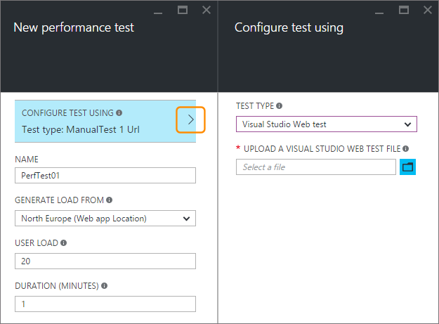

0. Check that the TEST TYPE is set to **Visual Studio Web Test** and select your HTTP Archive file.
    Use the "folder" icon to open the file selector dialog.

    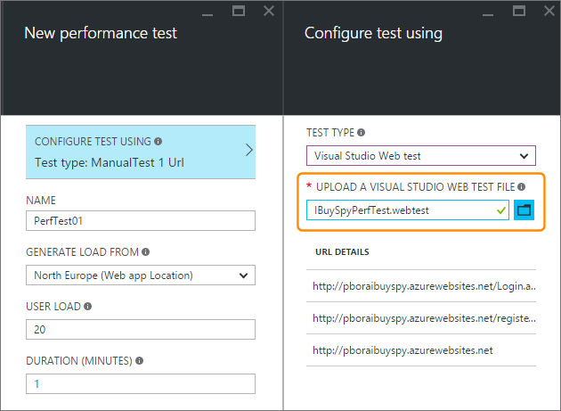

    After the file has been uploaded, you see the list of URLs to be tested in the URL DETAILS section.
 
0. Specify the user load and test duration, then choose **Run test**.

    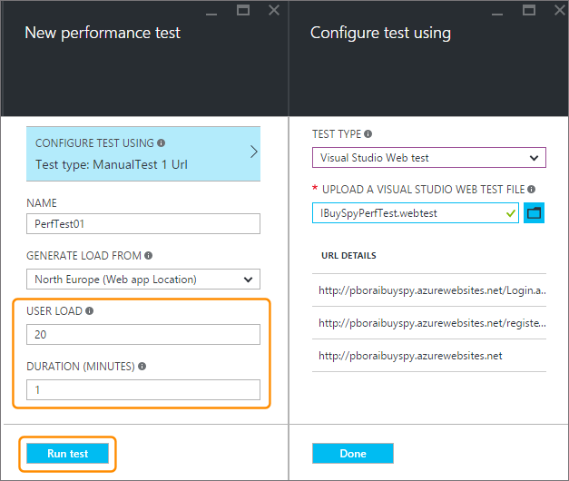

    After the test has finished, you see the results in two panes. The left pane shows the performnace information as a series of charts.

    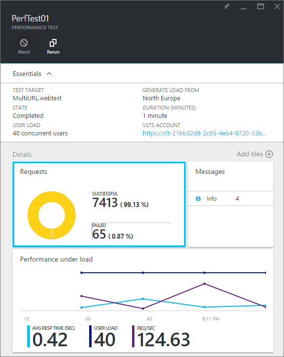

    The right pane shows a list of failed requests, with the type of error and the number of times it occurred.

    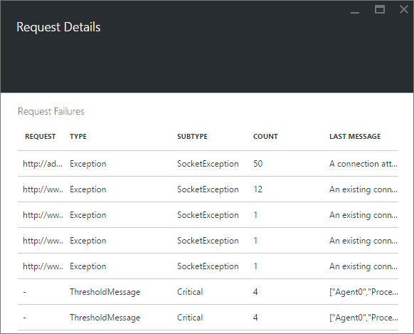

0. Rerun the test by choosing the **Rerun** icon at the top of the right pane.

    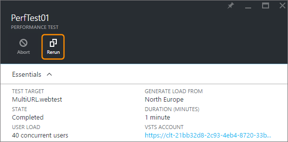

##  Q & A

#### Q: Is there a limit on how long I can run a test? 

**A**: Yes, you can run your test up to an hour in the Azure Portal.

#### Q: How much time do I get to run performance tests? 

**A**: After public preview, you get 20,000 virtual user minutes (VUMs) 
free each month with your Visual Studio Team Services account. 
A VUM is the number of virtual users multipled by the number 
of minutes in your test. If your needs exceed the free limit, 
you can purchase more time and pay only for what you use.

#### Q: Where can I check how many VUMs I've used so far?

**A**: You can check this amount in the Azure Portal.

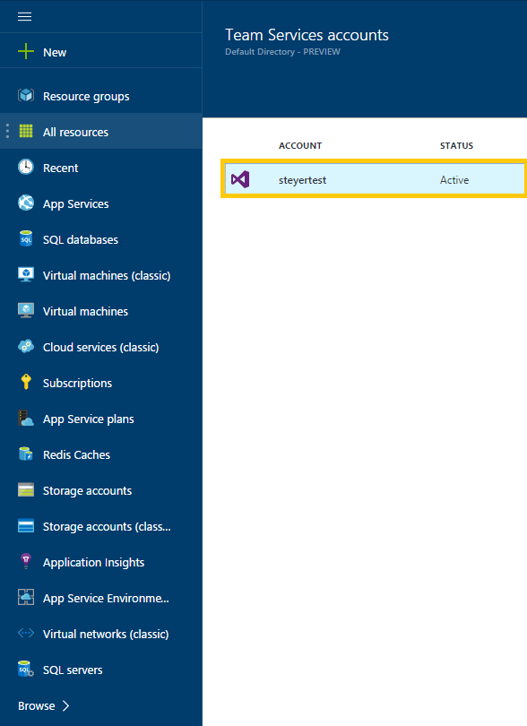

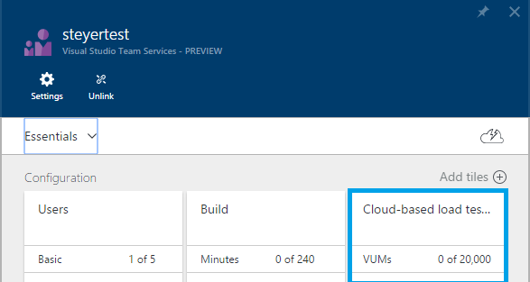

#### Q: What is the default option and are my existing tests impacted?

**A**: The default option for performance load tests is a manual test -
the same as before the multiple URL test option was added to the portal.
Your existing tests continue to use the configured URL and will work as before.

#### Q: What features not supported in the Visual Studio Web Test file?

**A**: At present this feature does not support Web Test plug-ins, data 
sources, and extraction rules. You must edit your Web Test file to remove 
these. We hope to add support for these features in future updates.

#### Q: Does it support any other Web Test file formats?
  
**A**: At present only Visual Studio Web Test format files are supported.
We'd be pleased to hear from you if you need support for other file formats. 
Email us at [vsoloadtest@microsoft.com](mailto:vsoloadtest@microsoft.com).

#### Q: What else can I do with a Visual Studio Team Services account?

**A**: To find your new account, go to ```https://{accountname}.visualstudio.com```. 
Share your code, build, test, track work, and ship software – all in the cloud 
using any tool or language. Learn more about how [Visual Studio Team Services](https://www.visualstudio.com/products/what-is-visual-studio-online-vs) 
features and services help your team collaborate more easily and deploy continuously.

## See also

* [Run simple cloud performance tests](https://www.visualstudio.com/docs/test/performance-testing/getting-started/get-started-simple-cloud-load-test)
* [Run Apache Jmeter performance tests](https://www.visualstudio.com/docs/test/performance-testing/getting-started/get-started-jmeter-test)
* [Record and replay cloud-based load tests](https://www.visualstudio.com/docs/test/performance-testing/getting-started/record-and-replay-cloud-load-tests)
* [Performance test your app in the cloud](https://www.visualstudio.com/docs/test/performance-testing/getting-started/getting-started-with-performance-testing)
