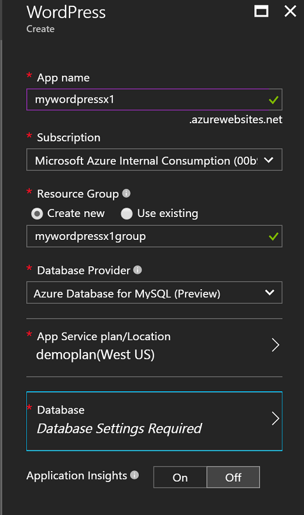
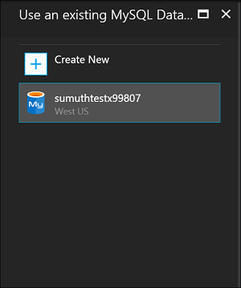
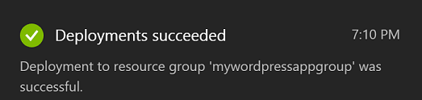
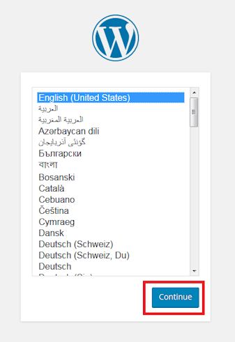

# Create a web app from the Azure Marketplace
<!-- Note: This article replaces web-sites-php-web-site-gallery.md -->

[!INCLUDE [tabs](../../includes/app-service-web-get-started-nav-tabs.md)]

The Azure Marketplace provides a wide range of popular web apps developed by open source software communities, for example WordPress and Umbraco CMS. In this tutorial, you learn how to create WordPress app from Azure marketplace.
which creates an Azure Web App and MySQL database. 

## Before you begin 

If you don't have an Azure subscription, create a [free account](https://azure.microsoft.com/free/?WT.mc_id=A261C142F) before you begin.

## Deploy from Azure Marketplace
Follow the steps below to deploy WordPress from Azure Marketplace.

### Sign in to Azure
Log in to the [Azure portal](https://portal.azure.com).

### Deploy WordPress Template
The Azure Marketplace provides templates for setting up resources, setup the [WordPress](https://portal.azure.com/#create/WordPress.WordPress) Template to get started.
   
Enter the following information to deploy the WordPress app and its resources.

  

| Field         | Suggested Value           | Description  |
| ------------- |-------------------------|-------------|
| App Name      | mywordpressapp          | Enter a unique app name for your **Web App Name**. This name is used as part of the default DNS name for your app `<app_name>.azurewebsites.net`, so it needs to be unique across all apps in Azure. You can later map a custom domain name to your app before you expose it to your users |
| Subscription  | Pay-As-You-Go             | Select a **Subscription**. If you have multiple subscriptions, choose the appropriate subscription. |
| Resource Group| mywordpressappgroup                 |    Enter a **resource group**. A resource group is a logical container into which Azure resources like web apps, databases that is deployed and managed. You can create a resource group or use an existing one |
| App Service Plan | myappplan          | App Service plans represent the collection of physical resources used to host your apps. Select the **Location** and the **Pricing tier**. For more information on pricing, see [App service pricing tier](https://azure.microsoft.com/pricing/details/app-service/) |
| Database      | mywordpressapp          | Select the appropriate database provider for MySQL. Web Apps supports **ClearDB**, **Azure Database for MySQL** and **MySQL in-app**. For more details, see [Database configuration](#database-config) section below. |
| Application Insights | ON or OFF          | This is optional. [Application Insights](https://azure.microsoft.com/en-us/services/application-insights/) provides monitoring services for your web app by clicking **ON**.|

### Database Configuration
Follow the steps below based on your choice of MySQL database provider.  It is recommended that both Web App and MySQL database be in the same location.

#### ClearDB 
[ClearDB](https://azuremarketplace.microsoft.com/en-us/marketplace/apps/SuccessBricksInc.ClearDBMySQLDatabase?tab=Overview) is a third-party solution for a fully integrated MySQL service on Azure. In order to use ClearDB databases, you will need to associate a credit card to your [Azure account](http://account.windowsazure.com/subscriptions). If you selected ClearDB database provider, you can view a list of existing databases to choose from or click **Create new** button to create a database.

#### Azure Database for MySQL (Preview)
[Azure Database for MySQL](https://azure.microsoft.com/en-us/services/mysql) provides a managed database service for app development and deployment that allows you to stand up a MySQL database in minutes and scale on the fly on the cloud you trust most. With inclusive pricing models, you get all the capabilities you want like high-availability, security, and recovery – built in, at no extra cost. Click **Pricing tier** to choose a different [pricing tier](https://azure.microsoft.com/pricing/details/mysql). To use an existing database or existing MySQL server, use an existing resource group in which the server resides. 

> [!NOTE]
>  Azure Database for MySQL (Preview) and Web App on Linux (Preview) are not available in all regions. To learn more about [Azure Database for MySQL (Preview)](https://docs.microsoft.com/en-us/azure/mysql) and [Web App on Linux](./app-service-linux-intro.md) limitations. 

#### MySQL in-app
[MySQL in-app](https://blogs.msdn.microsoft.com/appserviceteam/2017/03/06/announcing-general-availability-for-mysql-in-app) is a feature of App Service which enables running MySql natively on the platform. The core functionality supported with the release of the feature:

- MySQL server running on the same instance side by side with your web server hosting the site. This boosts performance of your application.
- Storage is shared between both MySQL and your web app files. Note with Free and Shared plans you may hit our quota limits when using the site based on the actions you perform. Check out [quota limitations](https://azure.microsoft.com/en-us/pricing/details/app-service/plans/) for Free and Shared plans.
- You can turn on Slow query logging and general logging for MySQL. Note that this can impact the site performance and should NOT always be turned ON. The logging feature helps investigating any application issues. 

For more details, check out this [article](https://blogs.msdn.microsoft.com/appserviceteam/2016/08/18/announcing-mysql-in-app-preview-for-web-apps/ )

You can watch the progress by clicking the bell icon at the top of the portal page while the WordPress app is being deployed.    

## Manage your new Azure web app

Go to the Azure portal to take a look at the web app you just created.

To do this, sign in to [https://portal.azure.com](https://portal.azure.com).

From the left menu, click **App Services**, then click the name of your Azure web app.

You have landed in your web app's _blade_ (a portal page that opens horizontally).

By default, your web app's blade shows the **Overview** page. This page gives you a view of how your app is doing. Here, you can also perform basic management tasks like browse, stop, start, restart, and delete. The tabs on the left side of the blade shows the different configuration pages you can open.

These tabs in the blade show the many great features you can add to your web app. The following list gives you just a few of the possibilities:

* Map a custom DNS name
* Bind a custom SSL certificate
* Configure continuous deployment
* Scale up and out
* Add user authentication

Complete the 5-minute WordPress installation wizard to have WordPress app up and running. Check out [Wordpress documentation](https://codex.WordPress.org/) to develop your web app.

## Configuring your app 
There are multiple steps involved in managing your WordPress app before it is ready for production use. Follow these steps to configure and manage your WordPress app:

| To do this... | Use this... |
| --- | --- |
| **Upload or store large files** |[WordPress plugin for using Blob storage](https://wordpress.org/plugins/windows-azure-storage/)|
| **Send email** |Purchase [SendGrid](https://azuremarketplace.microsoft.com/en-us/marketplace/apps/SendGrid.SendGrid?tab=Overview) email service  and use the [WordPress plugin for using SendGrid](https://wordpress.org/plugins/sendgrid-email-delivery-simplified/)  to configure it|
| **Custom domain names** |[Configure a custom domain name in Azure App Service](app-service-web-tutorial-custom-domain.md) |
| **HTTPS** |[Enable HTTPS for a web app in Azure App Service](app-service-web-tutorial-custom-ssl.md) |
| **Pre-production validation** |[Set up staging and dev environments for web apps in Azure App Service](web-sites-staged-publishing.md)|
| **Monitoring and troubleshooting** |[Enable diagnostics logging for web apps in Azure App Service](web-sites-enable-diagnostic-log.md) and [Monitor Web Apps in Azure App Service](app-service-web-tutorial-monitoring.md) |
| **Deploy your site** |[Deploy a web app in Azure App Service](app-service-deploy-local-git.md) |

## Secure your app 
There are multiple steps involved in managing your WordPress app before it is ready for production use. Follow these steps to configure and manage your WordPress app:

| To do this... | Use this... |
| --- | --- |
| **Strong Username and Password**|  Change password frequently. Do not use commonly used usernames like *admin* or *wordpress* etc. Force all WordPress users to use unique username and strong passwords. |
| **Stay up-to-date** | Keep your WordPress core, themes, plugins up to date. Use the latest PHP runtime available in Azure App service |
| **Update WordPress Security keys** | Update [WordPress security key](https://codex.wordpress.org/Editing_wp-config.php#Security_Keys) to improve encryption stored in cookies|

## Improve Performance
Performance in the cloud is achieved primarily through caching and scale-out. However, the memory, bandwidth, and other attributes of Web Apps hosting should be considered.

| To do this... | Use this... |
| --- | --- |
| **Understand App Service instance capabilities** |[Pricing details, including capabilities of App Service tiers](https://azure.microsoft.com/en-us/pricing/details/app-service/)|
| **Cache resources** |Use [Azure Redis cache](https://azure.microsoft.com/en-us/services/cache/), or one of the other caching offerings in the [Azure Store](https://azuremarketplace.microsoft.com) |
| **Scale your application** |You need to scale [the web app in Azure App Service](web-sites-scale.md) and/or MySQL database. MySQL in-app does not support scale-out, hence choose ClearDB or Azure Database for MySQL (Preview). [Scale Azure database for MySQL (Preview)](https://azure.microsoft.com/en-us/pricing/details/mysql/) or  if using [ClearDB High Availability Routing](http://w2.cleardb.net/faqs/) to scale up your database |

## Availability and disaster recovery
High availability includes the aspect of disaster recovery to maintain business continuity. Planning for failures and disasters in the cloud requires you to recognize the failures quickly. These solutions help implement a strategy for high availability.

| To do this... | Use this... |
| --- | --- |
| **Load balance sites** or **geo-distribute sites** |[Route traffic with Azure Traffic Manager](https://azure.microsoft.com/en-us/services/traffic-manager/) |
| **Back up and restore** |[Back up a web app in Azure App Service](web-sites-backup.md) and [Restore a web app in Azure App Service](web-sites-restore.md) |

## Next steps
Learn about various features of [App Service to develop and scale](/app-service-web/).