<properties 
	pageTitle="Add functionality to your first web app" 
	description="Add cool features to your first web app in a few minutes." 
	services="app-service\web"
	documentationCenter=""
	authors="cephalin" 
	manager="wpickett" 
	editor="" 
/>

<tags 
	ms.service="app-service-web" 
	ms.workload="web" 
	ms.tgt_pltfrm="na" 
	ms.devlang="na" 
	ms.topic="hero-article"
	ms.date="05/12/2016" 
	ms.author="cephalin"
/>

# Add functionality to your first web app

In [Deploy a web app to Azure in 5 minutes](app-service-web-get-started.md), you deployed a sample web app to 
[Azure App Service](../app-service/app-service-value-prop-what-is.md). In this article, you'll quickly add some 
great functionalities to your deployed web app. In a few minutes, you will:

- enforce authentication for your users
- scale your app automatically
- receive alerts on the performance of your app

Regardless of which sample app you deployed in the previous article, you can follow along in the tutorial.

The three activities in this tutorial are only a few examples of the many useful features you get when you put your web app in App Service. Many of the features are 
available in the **Free** tier (which is what your first web app is running on), and you can use your trial credits to try out features
that require higher pricing tiers. Rest assured that your web app remains in **Free** tier unless you explicitly changes it to a different
pricing tier.

>[AZURE.NOTE] The web app you created with Azure CLI runs in **Free** tier, which only allows one shared VM instance with resource quotas. For more
information on what you get with **Free** tier, see [App Service limits](../azure-subscription-service-limits.md#app-service-limits).

## Authenticate your users

Now, let's see how easy it is to add authentication to your app (further reading at 
[App Service Authentication/Authorization](https://azure.microsoft.com/blog/announcing-app-service-authentication-authorization/)).

1. In the portal blade for your app, which you just opened, click **Settings** > **Authentication / Authorization**.  
    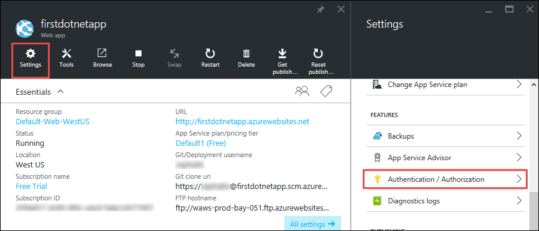
    
2. Click **On** to turn on authentication.  
    
4. In **Authentication Providers**, click **Azure Active Directory**.  
    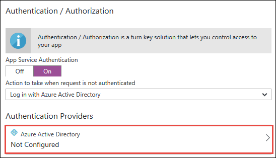

5. In the **Azure Active Directory Settings** blade, click **Express**, then click **OK**. The default settings create a new Azure AD application in
your default directory.  
    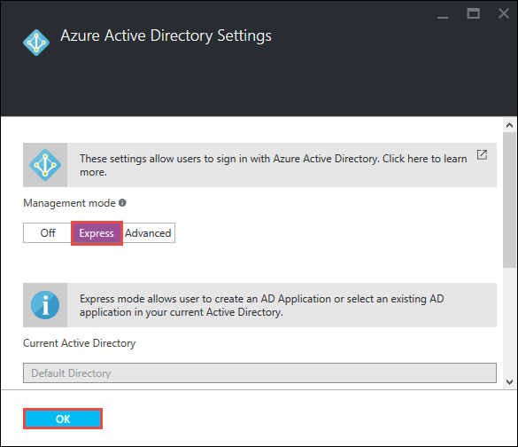

6. Click **Save**.  
    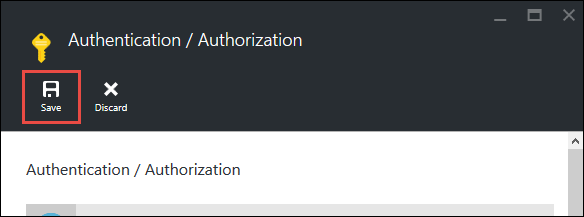

    Once the change is successful, you'll see the notification bell turn green, along with a friendly message.

7. Back in the portal blade of your app, click the **URL** link (or **Browse** in the menu bar). The link is an HTTP address.  
    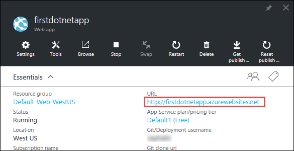  
    But once it opens the app in a new tab, the URL box redirects several times and finishes on your app with an HTTPS address. What you're seeing is that
    you're already logged in to your Azure subscription, and you're automatically authenticated in the app.  
    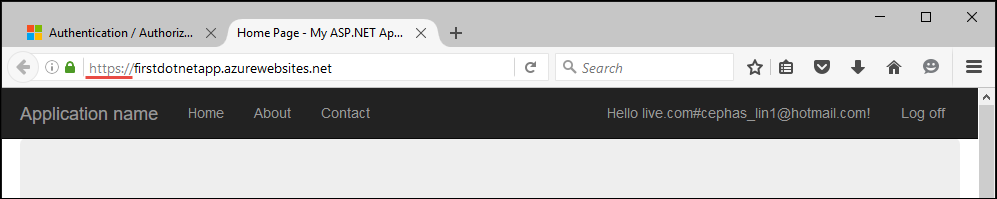  
    So if you now open an unauthenticated session in a different browser, you'll see a login screen when you navigate to the same URL.  
    <!-- 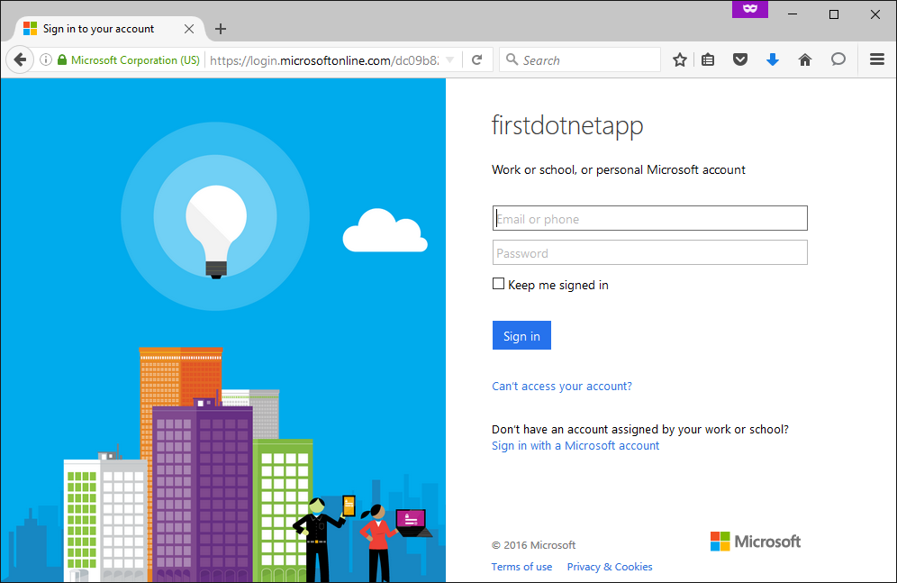  -->
    If you've never done anything with Azure Active Directory, your default directory might not have any Azure AD users. In that case, probably the only account
    in there is the Microsoft account with your Azure subscription. That's why you were automatically logged in to the app in the same browser earlier. 
    You can use that same Microsoft account to log in on this login page as well.

Congratulations, you are authenticating all traffic to your web app.

You may have noticed in the **Authentication / Authorization** blade that you can do a lot more, such as:

- Enable social login
- Enable multiple login options
- Change the default behavior when people first navigate to your app

App Service provides a turn-key solution for some of the common authentication needs so you don't need to provide the authentication logic yourself. 
For more information, see [App Service Authentication/Authorization](https://azure.microsoft.com/blog/announcing-app-service-authentication-authorization/).

## Scale your app automatically based on demand

Next, let's autoscale your app so that it will automatically adjust it capacity to respond to user demand (further reading at 
[Scale up your app in Azure](web-sites-scale.md) and 
[Scale instance count manually or automatically](../azure-portal/insights-how-to-scale.md)). 

Briefly, you scale your web app in two ways:

- [Scale up](https://en.wikipedia.org/wiki/Scalability#Horizontal_and_vertical_scaling): Get more CPU, memory, disk space, and extra features
like dedicated VMs, custom domains and certificates, staging slots, autoscaling, and more. You scale out by changing the pricing tier of the 
App Service plan your app belongs to.
- [Scale out](https://en.wikipedia.org/wiki/Scalability#Horizontal_and_vertical_scaling): Increasing the number VM instances that run your app.
You can scale out to as many as 50 instances, depending on your pricing tier.

Without further ado, let's set up autoscaling.

1. First, let's scale up to enable autoscaling. In the portal blade of your app, click **Settings** > **Scale Up (App Service Plan)**.  
    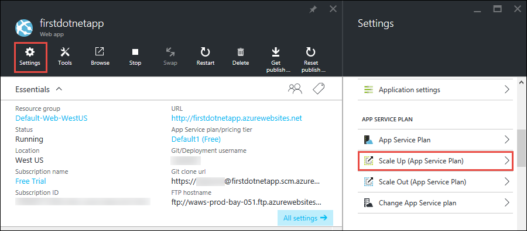

2. Scroll and select the **S1 Standard** tier, the lowest tier that supports autoscaling (circled in screenshot), then click **Select**.  
    

    You're done scaling up.
    
    >[AZURE.IMPORTANT] This tier expends your free trial credits. If you have a pay-per-use account, it incurs charges to your account.
    
3. Next, let's configure autoscaling. In the portal blade of your app, click **Settings** > **Scale Out (App Service Plan)**.  
    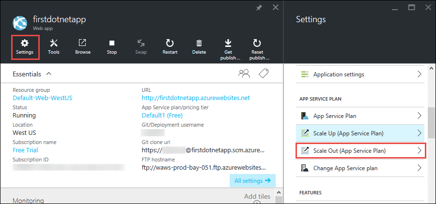

4. Change **Scale by** to **CPU Percentage**. The sliders underneath the dropdown update accordingly. Then, define an **Instances** range between
**1** and **2** and a **Target range** between **40** and **80**. Do it by typing in the boxes or by moving the sliders.  
    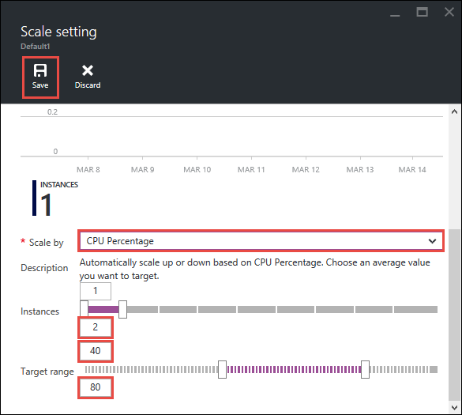
    
    Based on this configuration, your app automatically scales out when CPU utilization is above 80% and scales in when CPU utilization is below 40%. 
    
5. Click **Save** in the menu bar.

Congratulations, your app is autoscaling.

You may have noticed in the **Scale Settings** blade that you can do a lot more, such as:

- Scale to a specific number of instances manually
- Scale by other performance metrics, such as memory percentage or disk queue
- Customize scaling behavior when a performance rule is triggered
- Autoscale on a schedule
- Set autoscaling behavior for a future event

For more information on scaling up your app, see [Scale up your app in Azure](../app-service-web/web-sites-scale.md). For more information on
scaling out, see [Scale instance count manually or automatically](../azure-portal/insights-how-to-scale.md).

## Receive alerts for your app

Now that your app is autoscaling, what happens when it reaches the maximum instance count (2) and CPU is above desired utilization (80%)? 
You can set up an alert (further reading at [Receive alert notifications](../azure-portal/insights-receive-alert-notifications.md)) 
to inform you of this situation so you can further scale up/out your app, for example. Let's quickly set up an alert for this scenario.

1. In the portal blade of your app, click **Tools** > **Alerts**.  
    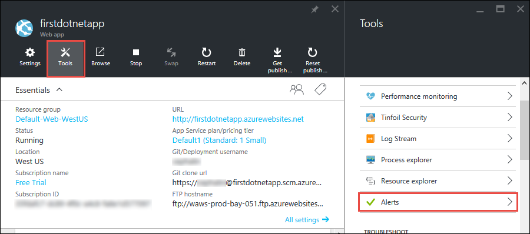

2. Click **Add alert**. Then, in the **Resource** box, select the resource that ends with **(serverfarms)**. That's your App Service plan.  
    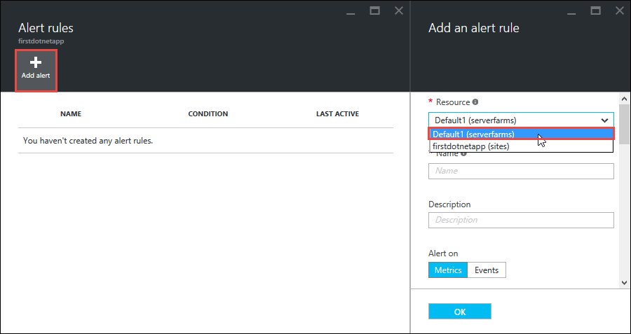

3. Specify **Name** as `CPU Maxed`, **Metric** as **CPU Percentage**, and **Threshold** as `90`, then select **Email owners, contributors, and readers**,
and then click **OK**.   
    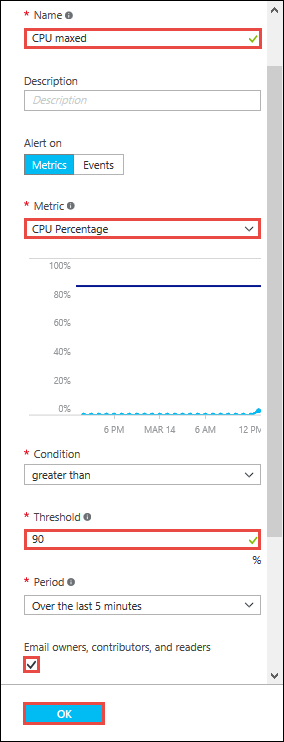
    
    When Azure finishes creating the alert, you'll see it in the **Alerts** blade.  
    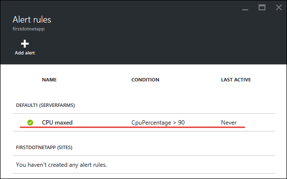

Congratulations, you're now getting alerts. 

This alert setting checks CPU utilization every five minutes. If that number goes above 90%,
you'll receive an email alert, along with anyone who is authorized. To see everyone who is authorized to receive the alerts, go back to the portal blade of
your app and click the **Access** button.  
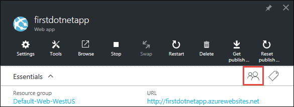

You should see that **Subscription admins** are already the **Owner** of the app. This group would include you if you're the account administrator of your 
Azure subscription (e.g. your trial subscription). For more information on Azure role-based access control, see 
[Azure Role-Based Access Control](../active-directory/role-based-access-control-configure.md).

> [AZURE.NOTE] Alert rules is an Azure feature. For more information, see [Receive alert notifications](../azure-portal/insights-receive-alert-notifications.md). 

## Next Steps

On your way to configure the alert, you may have noticed a rich set of tools in the **Tools** blade. Here, you can troubleshoot issues, 
monitor performance, test for vulnerabilities, manage resources, interact with the VM console, and add useful extensions. We invite you to click on 
each one of these tools to discover the simple yet powerful tools at your finger tips. 

Find out how to do more with your deployed app. Here's only a partial list:

- [Buy and configure a custom domain name](custom-dns-web-site-buydomains-web-app.md) - Buy an attractive domain for your web app instead of the 
*.azurewebsites.net domain. Or use a domain that you already have.
- [Set up staging environments](web-sites-staged-publishing.md) - Deploy your app to a staging URL before putting it into production. Update your live
web app with confidence. Set up an elaborate DevOps solution with multiple deployment slots. 
- [Set up continuous deployment](app-service-continuous-deployment.md) - Integrate app deployment into your source control system. Deploy to 
Azure with every commit.
- [Access on-premises resources](web-sites-hybrid-connection-get-started.md) - Access an existing on-premises database or CRM system.
- [Back up your app](web-sites-backup.md) - Set up back up and restore for your web app. Prepare for unexpected failures and recover from them.
- [Enable diagnostic logs](web-sites-enable-diagnostic-log.md) - Read the IIS logs from Azure or application traces. Read them in a 
stream, download them, or port them into [Application Insights](../application-insights/app-insights-overview.md) for turn-key analysis.
- [Scan your app for vulnerabilities](https://azure.microsoft.com/blog/web-vulnerability-scanning-for-azure-app-service-powered-by-tinfoil-security/) -
Scan your web app against modern threats using service provided by [Tinfoil Security](https://www.tinfoilsecurity.com/).
- [Run background jobs](../azure-functions/functions-overview.md) - Run jobs for data processing, reporting, etc.
- [Learn how App Service works](../app-service/app-service-how-works-readme.md) 