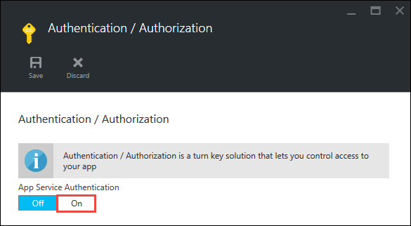

<properties 
	pageTitle="Get started with web apps in Azure App Service - Part 2" 
	description="Add crucial operational capabilities to your web app in App Service in a few clicks." 
	services="app-service\web"
	documentationCenter=""
	authors="cephalin" 
	manager="wpickett" 
	editor="" 
/>

<tags 
	ms.service="app-service-web" 
	ms.workload="web" 
	ms.tgt_pltfrm="na" 
	ms.devlang="na" 
	ms.topic="hero-article"
	ms.date="03/17/2016" 
	ms.author="cephalin"
/>

# Get started with Azure App Service - Part 2

In [Get started with Azure App Service](app-service-web-get-started.md), you deployed a web app to Azure App Service and are all setup for fast and easy updates.
In this article, you'll quickly add some crucial functionality to your deployed app to keep it humming along beautifully. In doing so, you'll find out for yourself that App 
Service is so much more than a website hoster. It brings enterprise-class capabilities to your great app, so you can focus your creative energy on delighting 
your users with your app and not on meeting the real-world demands of security, scalability, performance, management, etc.

In a few clicks, you'll learn how to:

- enforce authentication for your users
- autoscale your app
- receive alerts on your app's performance

Regardless of which sample app you deployed in the previous article, you can follow along in the tutorial.

## Authenticate your users

Now, let's see how easy it is to add authentication to your app.  

1. In the portal blade for your app, which you just opened, click **Settings** > **Authentication / Authorization**.  
    
    
2. Click **On** to turn on authentication.  
    
    
4. In **Authentication Providers**, click **Azure Active Directory**.  
    

5. In the **Azure Active Directory Settings** blade, click **Express**, then click **OK**. The default settings create a new Azure AD application in
your default directory.  
    

6. Click **Save**.  
    

    Once the change is successful, you'll see the notification bell turn green, along with a friendly message.

7. Back in the portal blade of your app, click the **URL** link (or **Browse** in the menu bar). The link is an HTTP address.  
      
    But once it opens the app in a new tab, the URL box redirects several times and finishes on your app with an HTTPS address. What you're seeing is that
    you're already logged in to the Microsoft account with your Azure subscription, and you're automatically logged in to the app using that account.  
      
    So if you now open an unauthenticated session in a different browser, you'll see a login screen when you navigate to the same URL:  
      
    If you've never done anything with Azure Active Directory, your default directory might not have any Azure AD users. In that case, probably the only account
    in there is the Microsoft account with your Azure subscription. That's why you were automatically logged in to the app in the same browser earlier. 
    You can use that same Microsoft account to log in on this login page as well.

Congratulations, you are authenticating all traffic to your site.

You may have noticed in the **Authentication / Authorization** blade that you can do a lot more, such as:

- Enable social login
- Enable multiple login options
- Change the default behavior when users first navigate to your app

App Service provides a turn-key solution for some of the common authentication needs so you don't need to provide the authentication logic yourself. 
For more information, see [App Service Authentication/Authorization](/blog/announcing-app-service-authentication-authorization/).

## Scale your app up and out

Next, let's scale your app. You scale your App Service app in two ways:

- [Scale up](https://en.wikipedia.org/wiki/Scalability#Horizontal_and_vertical_scaling): When you scale up an App Service app, you change the pricing
tier of the App Service plan the app belongs to. Scaling up gives you more CPU, memory, disk space, and extra features like
dedicated VM instances, autoscaling, SLA of 99.95%, custom domains, custom SSL certificates, deployment slots, backup, restore, etc. 
Higher tiers provide more features to your App Service app.  
- [Scale out](https://en.wikipedia.org/wiki/Scalability#Horizontal_and_vertical_scaling): When you scale out an App Service app, you change the number 
of VM instances your app (or apps in the same App Service plan) runs on. With Standard tier or above, you can enable autoscaling of VM instances based
on performance metrics. 

Without further ado, let's set up autoscaling for your app.

1. First, let's scale up to enable autoscaling. In the portal blade of your app, click **Settings** > **Scale Up (App Service Plan)**.  
    

2. Scroll and select the **S1 Standard** tier, the lowest tier that supports autoscaling (circled in screenshot), then click **Select**.  
    

    You're done scaling up.
    
    >[AZURE.IMPORTANT] This tier will burn your free trial credits. If you have a pay-per-use account, it will incur charges to your account.
    
3. Next, let's configure autoscaling. In the portal blade of your app, click **Settings** > **Scale Out (App Service Plan)**.  
    

4. Change **Scale by** to **CPU Percentage**. The sliders underneath the dropdown will change accordingly. Then, define an **Instances** range between
**1** and **2** and a **Target range** between **40** and **80**. Do this by typing in the boxes or by moving the sliders.  
    
    
    Based on this configuration, your app will automatically scale out when CPU utilization is above 80% and scale when CPU utilization is below 40%. 
    
5. Click **Save** in the menu bar.

Congratulations, your app is autoscaling.

You may have noticed in the **Scale Settings** blade that you can do a lot more, such as:

- Scale to a specific number of instances manually
- Scale by other performance metrics, such as memory percentage or disk queue
- Customize scaling behavior when a performance rule is triggered
- Autoscale on a schedule
- Set autoscaling behavior for a future event

For more information on scaling up your app, see [Scale pricing tier in Azure App Service](../app-service/app-service-scale.md). For more information on
scaling out, see [Scale instance count manually or automatically](../azure-portal/insights-how-to-scale.md).

## Receive alerts for your app

Now that your app is autoscaling, what happens when it reaches the maximum instance count (2) and CPU is above desired utilization (80%)? 
You can set up an alert to inform you of this situation so you can further scale up your app, for example. Let's quickly set up an alert for this scenario.

1. In the portal blade of your app, click **Tools** > **Alerts**.  
    

2. Click **Add alert**. Then, in the **Resource** box, select the resource that ends with **(serverfarms)**. That's your App Service plan.  
    

3. Specify **Name** as `CPU Maxed`, **Metric** as **CPU Percentage**, and **Threshold** as `90`, then select **Email owners, contributors, and readers**,
and then click **OK**.   
    
    
    When Azure finishes creating the alert, you'll see it in the **Alerts** blade.  
    

Congratulations, you're now getting alerts. 

This alert setting will now check CPU utilization every five minutes. If that number goes above 90%,
you'll receive an email alert, along with anyone who is authorized. To see everyone who is authorized to receive the alerts, go back to the portal blade of
your app and click the **Access** button.  

You should see that **Subscription admins** are already the **Owner** of the app. This group would include you if you're the account administrator of your 
Azure subscription (e.g. your trial subscription). For more information on Azure role-based access control, see 
[Azure Role-Based Access Control](../active-directory/role-based-access-control-configure.md).

## Next Steps

On your way to configure the alert, you may have noticed a rich set of tools in the **Tools** blade. Here, you can troubleshoot issues, 
monitor performance, test for vulnerabilities, manage resources, interact with the VM console, and add useful extensions. We invite you to click on 
each one of these tools to discover the simple yet powerful tools at your finger tips. 

Find out how to do more with your deployed app. Here's a partial list:

- [Buy and configure a custom domain name](custom-dns-web-site-buydomains-web-app.md)
- [Set up staging environments](web-sites-staged-publishing.md)
- [Set up continuous deployment](web-sites-publish-source-control.md)
- [Back up your app](web-sites-backup.md)
- [Enable diagnostic logs](web-sites-enable-diagnostic-log.md)
- [Access on-premises resources](web-sites-hybrid-connection-get-started.md)
- [Learn how App Service works](../app-service/app-service-how-works-readme.md) 