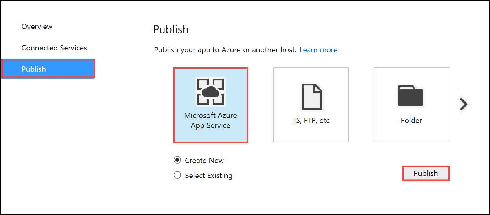
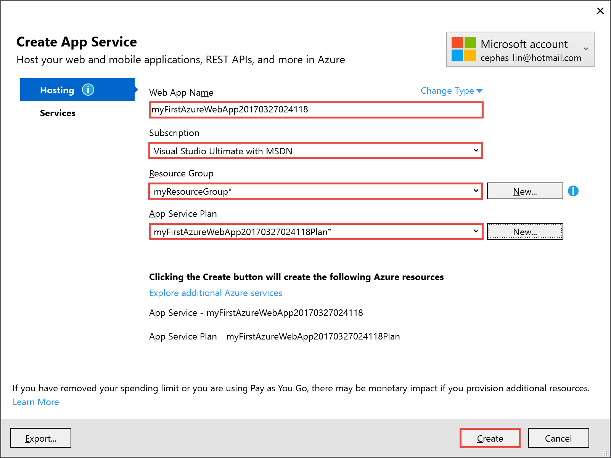

# Create your first ASP.NET web app in Azure in five minutes

[!INCLUDE [app-service-web-selector-get-started](../../includes/app-service-web-selector-get-started.md)] 

This Quickstart helps you deploy your first ASP.NET web app to [Azure App Service](../app-service/app-service-value-prop-what-is.md) in just a few minutes. When you're finished, you'll have a simple web application up and running in the cloud.

## Before you begin

Install [Visual Studio 2017 Community Edition](https://www.visualstudio.com/downloads/) with the Azure workload.

## Create an ASP.NET application

In Visual Studio, create a new project with `Ctrl`+`Shift`+`N`.

In the **New Project** dialog, click **Visual C# > Web > ASP.NET Web Application (.NET Framework)**.

Name the application **myFirstAzureWebApp**, and then click **OK**.
   

Select the **MVC** template, and make sure authentication is set to No Authentication.
      
Click **OK**

Once the project is created, the project overview page is opened.

## Open the Create App Service dialog

In the project overview page, click **Publish > Microsoft Azure App Service > Publish**.

## Sign in to Azure

In the **Create App Service** dialog, click **Add an account**, and then sign in to your Azure subscription.
   

## Configure resources your Azure web app needs

Once signed in, configure the App Service resources with the following settings:

- **Web App Name**: Use the autogenerated name. The SDK makes sure that it is unique.
- **Subscription**: Skip unless you have multiple subscriptions. 
- **Resource Group**: Click **New**, name the new resource group **myResourceGroup**, and click **OK**.
- **App Service Plan**: Click **New**, configure the App Service plan, and click **OK**.
    - **App Service Plan**: Use the autogenerated name. 
    - **Location**: Choose **West Europe** (or any other region you like).
    - **Size**: Choose **Free** (or any other [pricing tier](https://azure.microsoft.com/pricing/details/app-service/) you like).

> [!NOTE]
> A _resource group_ is a logical container into which Azure resources like web apps, databases and storage accounts are deployed and managed.
>
> An _App Service plan_ represents the collection of physical resources used to host your apps. All applications assigned to an App Service plan share the resources defined by it allowing you to save cost when hosting multiple apps.
>
> App Service plans define:
> 
> - Region (North Europe, East US, Southeast Asia)
> - Instance Size (Small, Medium, Large)
> - Scale Count (one, two or three instances, etc.) 
> - SKU (Free, Shared, Basic, Standard, Premium)
>

When you're done, your **Create App Service** dialog show look like the following screenshot:

## Create and publish the web app

Click **Create**. 

Once the wizard finishes creating the Azure resources, it automatically publishes your ASP.NET application to Azure for the first time, and then launches the published Azure web app in your default browser.

Congratulations, your first ASP.NET web app is running live in Azure App Service.

## Next steps

Explore pre-created [Web apps PowerShell scripts](app-service-powershell-samples.md).
