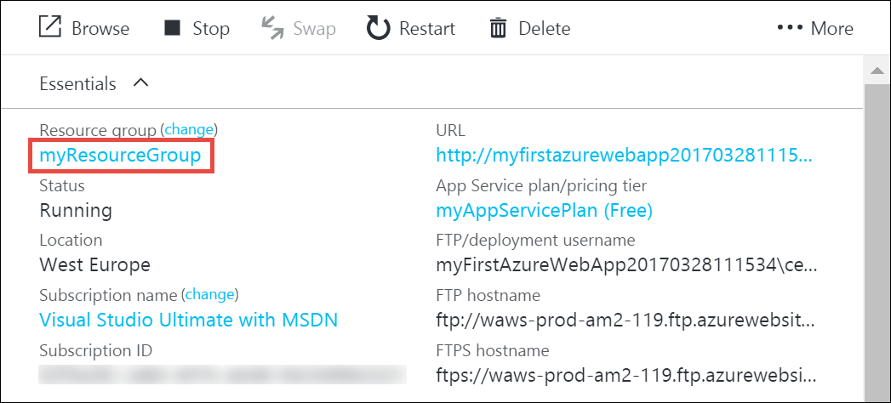
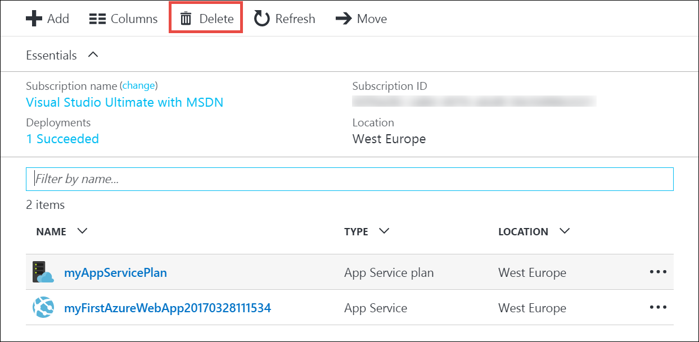

# Create your first ASP.NET web app in Azure in five minutes

[!INCLUDE [app-service-web-selector-get-started](../../includes/app-service-web-selector-get-started.md)] 

This Quickstart helps you deploy your first ASP.NET web app to [Azure App Service](../app-service/app-service-value-prop-what-is.md) in just a few minutes. When you're finished, you'll have a simple web app up and running in the cloud.


## Before you begin

This tutorial demonstrates how to use Visual Studio 2017 to build and deploy an ASP.NET web app to Azure. If you don’t already have Visual Studio 2017 installed, you can download and use the **free** [Visual Studio 2017 Community Edition](https://www.visualstudio.com/downloads/). Make sure that you enable **Azure development** during the Visual Studio setup.

[!INCLUDE [quickstarts-free-trial-note](../../includes/quickstarts-free-trial-note.md)]

## Create an ASP.NET web app

In Visual Studio, create a new project with `Ctrl`+`Shift`+`N`.

In the **New Project** dialog, click **Visual C# > Web > ASP.NET Web Application (.NET Framework)**.

Name the application **myFirstAzureWebApp**, and then click **OK**.
   


You can deploy any type of ASP.NET web app to Azure. For this tutorial, select the **MVC** template, and make sure authentication is set to **No Authentication**.
      
Click **OK**.


## Publish to Azure

In the **Solution Explorer**, right-click your **myFirstAzureWebApp** project and select **Publish**.


Make sure that **Microsoft Azure App Service** is selected and click **Publish**.


This opens the **Create App Service** dialog, which helps you create all the Azure resources you need to run your ASP.NET web app in Azure.

## Sign in to Azure

In the **Create App Service** dialog, click **Add an account**, and then sign in to your Azure subscription. If you're already signed into a Microsoft account, make sure that account holds your Azure subscription. If the signed-in Microsoft account doesn't have your Azure subscription, click it to add the correct account.
   


Once signed in, you're ready to create all the resources you need for your Azure web app in this dialog.

## Create a resource group

First, you need a _resource group_. 

> [!NOTE] 
> A resource group is a logical container into which Azure resources like web apps, databases and storage accounts are deployed and managed.
>
>

Next to **Resource Group**, click **New**.

Name your resource group **myResourceGroup** and click **OK**.

## Create an App Service plan

Your Azure web app also needs an _App Service plan_. 

> [!NOTE]
> An App Service plan represents the collection of physical resources used to host your apps. All apps assigned to an App Service plan share the resources defined by it, which enables you to save cost when hosting multiple apps. 
>
> App Service plans define:
>
> - Region (North Europe, East US, Southeast Asia)
> - Instance Size (Small, Medium, Large)
> - Scale Count (one, two or three instances, etc.) 
> - SKU (Free, Shared, Basic, Standard, Premium)
>
>

Next to **App Service Plan**, click **New**. 

In the **Configure App Service Plan** dialog, configure the new App Service plan with the following settings:

- **App Service Plan**: Type **myAppServicePlan**. 
- **Location**: Choose **West Europe**, or any other region you like.
- **Size**: Choose **Free**, or any other [pricing tier](https://azure.microsoft.com/pricing/details/app-service/) you like.

Click **OK**.


## Create and publish the web app

The only thing left to do now is to name your web app. In **Web App Name**, type a unique app name. This name will be used as part of the default DNS name for your app (`<app_name>.azurewebsites.net`), so it needs to be unique across all apps in Azure. You can later map a custom domain name to your app before you expose it to your users.

You can also accept the automatically generated name, which is already unique.

Click **Create** to start creating the Azure resources.


Once the wizard finishes creating the Azure resources, it automatically publishes your ASP.NET web app to Azure for the first time, and then launches the published Azure web app in your default browser.


The URL uses the web app name that you specified earlier, with the format `http://<app_name>.azurewebsites.net`. 

Congratulations, your first ASP.NET web app is running live in Azure App Service.

## Update the app and redeploy

It's very easy to update and redeploy to Azure. Let's make an update to the homepage.

From the **Solution Explorer**, open **Views\Home\Index.cshtml**.

Find the `<div class="jumbotron">` HTML tag near the top, and replace the entire tag with the following code:

```HTML
<div class="jumbotron">
    <h1>ASP.NET in Azure!</h1>
    <p class="lead">This is a simple app that we’ve built that demonstrates how to deploy a .NET app to Azure App Service.</p>
</div>
```

To redeploy to Azure, right-click youre **myFirstAzureWebApp** project in **Solution Explorer** and select **Publish**.

In the publish page, click **Publish**.

When Visual Studio is finished, it launches the updated Azure web app in your browser.


## Manage your new Azure web app

Go to the Azure portal to take a look at the web app you just created. 

To do this, sign in to [https://portal.azure.com](https://portal.azure.com).

From the left menu, click **App Services**, then click the name of your Azure web app.


You have landed in your web app's _blade_ (a portal page that opens horizontally). 

By default, your web app's blade shows the **Overview** page. This page gives you a view of how your app is doing. Here, you can also perform basic management tasks like browse, stop, start, restart, and delete. The tabs on the left side of the blade shows the different configuration pages you can open. 


These tabs in the blade show the many great features you can add to your web app. The following list gives you just a few of the possibilities:

- Map a custom DNS name
- Bind a custom SSL certificate
- Configure continuous deployment
- Scale up and out
- Add user authentication

## Clean up resources

To delete your first Azure web app, you can click **Delete** in the **Overview** page. However, there's a better way to delete everything that you created in this quick start. From your web app's **Overview** page, click the resource group to open its blade. 



In the resource group blade, you can see both the App Service plan and the App Service app that Visual Studio created for you. 

At the top of the blade, click **Delete**. 

<!---->

In the confirmation blade, confirm by typing the resource group name **myResourceGroup** into the text box and click **Delete**.

## Next steps

Explore pre-created [Web apps PowerShell scripts](app-service-powershell-samples.md).
