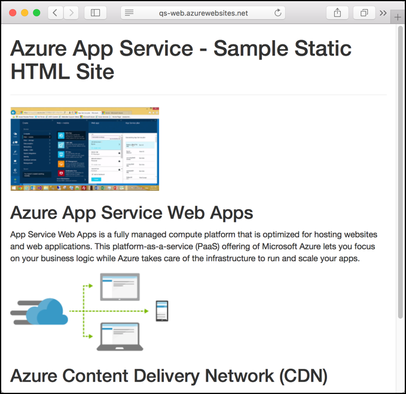
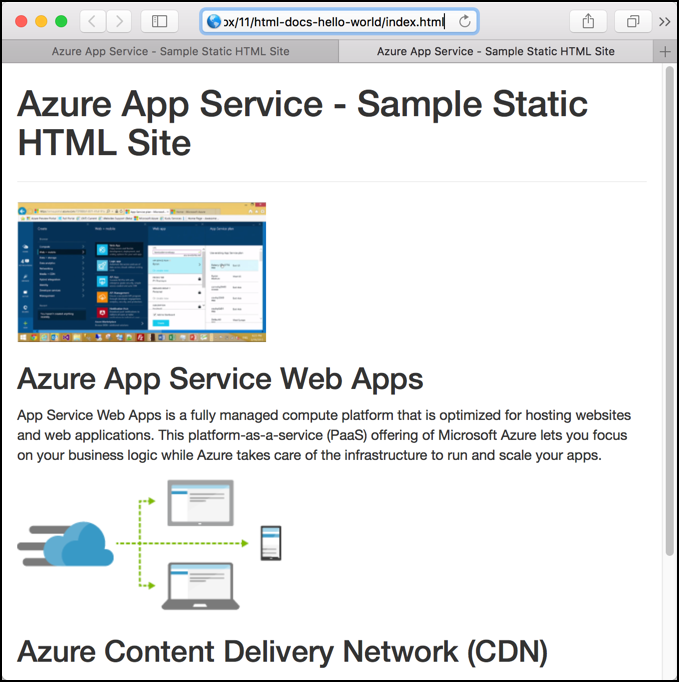
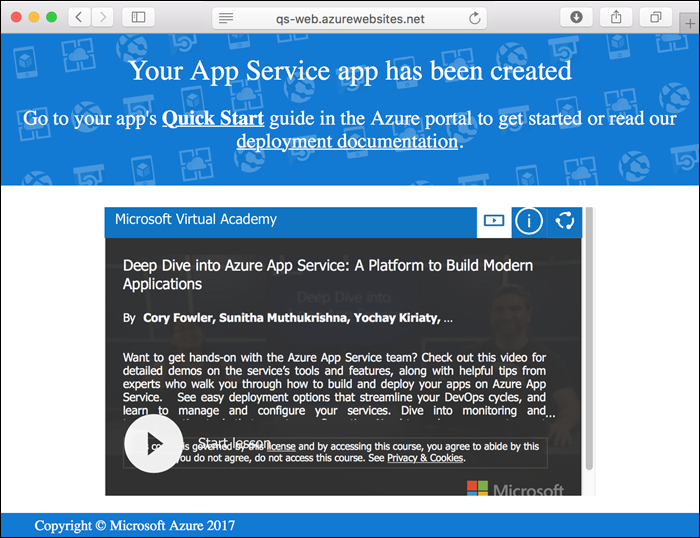

# Create a static HTML web app in Azure

[Azure Web Apps](https://docs.microsoft.com/azure/app-service-web/app-service-web-overview) provides a highly scalable, self-patching web hosting service.  This quickstart shows how to deploy a basic HTML+CSS site to Azure Web Apps. You create the web app using the [Azure CLI](https://docs.microsoft.com/cli/azure/get-started-with-azure-cli), and you use Git to deploy sample HTML content to the web app.



You can follow the steps below using a Mac, Windows, or Linux machine. Once the prerequisites are installed, it takes about five minutes to complete the steps.

## Prerequisites

To complete this quickstart:

- [Install Git](https://git-scm.com/)
[!INCLUDE [quickstarts-free-trial-note](../../includes/quickstarts-free-trial-note.md)]


[!INCLUDE [cloud-shell-try-it.md](../../includes/cloud-shell-try-it.md)]

If you choose to install and use the CLI locally, this topic requires that you are running the Azure CLI version 2.0 or later. Run `az --version` to find the version. If you need to install or upgrade, see [Install Azure CLI 2.0]( /cli/azure/install-azure-cli). 

## Download the sample

In a terminal window, run the following command to clone the sample app repository to your local machine.

```bash
git clone https://github.com/Azure-Samples/html-docs-hello-world.git
```

## View the HTML

Navigate to the directory that contains the sample HTML. Open the *index.html* file in your browser.



[!INCLUDE [Log in to Azure](../../includes/login-to-azure.md)] 

[!INCLUDE [Configure deployment user](../../includes/configure-deployment-user.md)] 

[!INCLUDE [Create resource group](../../includes/app-service-web-create-resource-group.md)] 

[!INCLUDE [Create app service plan](../../includes/app-service-web-create-app-service-plan.md)] 

[!INCLUDE [Create web app](../../includes/app-service-web-create-web-app.md)] 



You’ve created an empty new web app in Azure.

[!INCLUDE [Configure local git](../../includes/app-service-web-configure-local-git.md)] 

[!INCLUDE [Push to Azure](../../includes/app-service-web-git-push-to-azure.md)] 

```bash
Counting objects: 13, done.
Delta compression using up to 4 threads.
Compressing objects: 100% (11/11), done.
Writing objects: 100% (13/13), 2.07 KiB | 0 bytes/s, done.
Total 13 (delta 2), reused 0 (delta 0)
remote: Updating branch 'master'.
remote: Updating submodules.
remote: Preparing deployment for commit id 'cc39b1e4cb'.
remote: Generating deployment script.
remote: Generating deployment script for Web Site
remote: Generated deployment script files
remote: Running deployment command...
remote: Handling Basic Web Site deployment.
remote: KuduSync.NET from: 'D:\home\site\repository' to: 'D:\home\site\wwwroot'
remote: Deleting file: 'hostingstart.html'
remote: Copying file: '.gitignore'
remote: Copying file: 'LICENSE'
remote: Copying file: 'README.md'
remote: Finished successfully.
remote: Running post deployment command(s)...
remote: Deployment successful.
To https://<app_name>.scm.azurewebsites.net/<app_name>.git
 * [new branch]      master -> master
```

## Browse to the app

In a browser, go to the Azure web app URL:

```
http://<app_name>.azurewebsites.net
```

The page is running as an Azure App Service web app.


**Congratulations!** You've deployed your first HTML app to App Service.

## Update and redeploy the app

Open the *index.html* file in a text editor, and make a change to the markup. For example, change the H1 heading from "Azure App Service - Sample Static HTML Site" to just "Azure App Service`.

Commit your changes in Git, and then push the code changes to Azure.

```bash
git commit -am "updated HTML"
git push azure master
```

Once deployment has completed, refresh your browser to see the changes.


## Manage your new Azure web app

Go to the [Azure portal](https://portal.azure.com) to manage the web app you created.

From the left menu, click **App Services**, and then click the name of your Azure web app.


You see your web app's Overview page. Here, you can perform basic management tasks like browse, stop, start, restart, and delete. 


The left menu provides different pages for configuring your app. 

[!INCLUDE [cli-samples-clean-up](../../includes/cli-samples-clean-up.md)]

## Next steps

> [!div class="nextstepaction"]
> [Map custom domain](app-service-web-tutorial-custom-domain.md)
