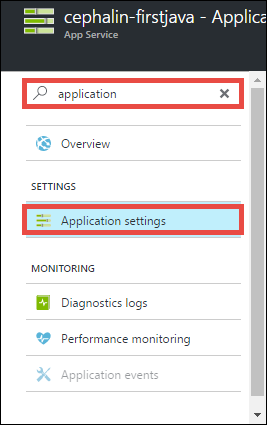
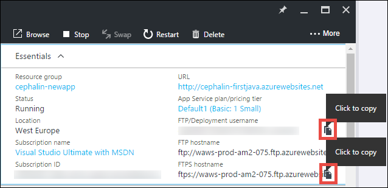
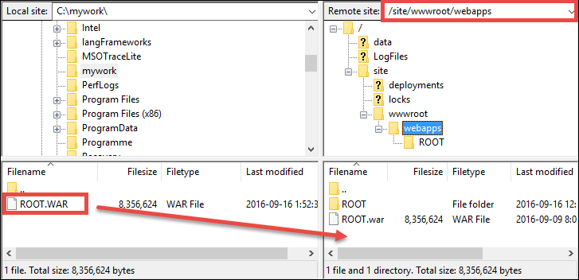

<properties 
	pageTitle="Deploy your first Java web app to Azure in five minutes | Microsoft Azure" 
	description="Learn how easy it is to run web apps in App Service by deploying a sample app. Start doing real development quickly and see results immediately." 
	services="app-service\web"
	documentationCenter=""
	authors="cephalin"
	manager="wpickett"
	editor=""
/>

<tags
	ms.service="app-service-web"
	ms.workload="web"
	ms.tgt_pltfrm="na"
	ms.devlang="na"
	ms.topic="hero-article"
	ms.date="09/16/2016" 
	ms.author="cephalin"
/>
	
# Deploy your first Java web app to Azure in five minutes

This tutorial helps you deploy a simple Java web app to [Azure App Service](../app-service/app-service-value-prop-what-is.md).
You can use App Service to create web apps, [mobile app back ends](/documentation/learning-paths/appservice-mobileapps/),
and [API apps](../app-service-api/app-service-api-apps-why-best-platform.md).

You will: 

- Create a web app in Azure App Service.
- Deploy a sample Java app.
- See your code running live in production.

## Prerequisites

- Get an FTP/FTPS client, such as [FileZilla](https://filezilla-project.org/).
- Get a Microsoft Azure account. If you don't have an account, you can 
[sign up for a free trial](/pricing/free-trial/?WT.mc_id=A261C142F) or 
[activate your Visual Studio subscriber benefits](/pricing/member-offers/msdn-benefits-details/?WT.mc_id=A261C142F).

>[AZURE.NOTE] You can [Try App Service](http://go.microsoft.com/fwlink/?LinkId=523751) without an Azure account. Create a starter app and play with
it for up to an hour--no credit card required, no commitments.

## Create a web app

1. Sign in to the [Azure portal](https://portal.azure.com) with your Azure account.

2. From the left menu, click **New** > **Web + Mobile** > **Web App**.

    

3. In the app creation blade, use the following settings for your new app:

    - **App name**: Type a unique name.
    - **Resource group**: Select **Create new** and give the resource group a name.
    - **App Service plan/Location**: Click it to configure, then click **Create New** to set the name, location, and 
    pricing tier of the App Service plan. Feel free to use the **Free** pricing tier.

    When you're done, your app creation blade should look like this:

    

3. Click **Create** at the bottom. You can click the **Notification** icon at the top to see the progress.

    

4. When deployment is finished, you should see this notification message. Click the message to open your deployment's blade.

    

5. In the **Deployment succeeded** blade, click the **Resource** link to open your new web app's blade.

    

## Deploy a Java app to your web app

Now, let's deploy a Java app to Azure using FTPS.

5. In the web app blade, scroll down to **Application settings** or search for it, then click it. 

    

6. In **Java version**, select **Java 8** and click **Save**.

    

    When you get the notificiation **Successfully updated web app settings**, navigate to http://*&lt;appname>*.azurewebsites.net 
    to see the default JSP servlet in action.

7. Back in the web app blade, scroll down to **Deployment credentials** or search for it, then click it.

8. Set your deployment credentials and click **Save**.

7. Back in the web app blade, click **Overview**. Next to **FTP/Deployment username** and **FTPS hostname**, click the **Copy** button
to copy these values.

    

    You're now ready to deploy your Java app with FTPS.

8. In your FTP/FTPS client, log in to your Azure web app's FTP server using the values you copied in the last step. Use the deployment
password that you created earlier.

    The following screenshot shows logging in using FileZilla.

    

    You may see security warnings for the unrecognized SSL certificate from Azure. Go ahead and continue.

9. Click [this link](https://github.com/Azure-Samples/app-service-web-java-get-started/raw/master/webapps/ROOT.war) to download the WAR
file to your local machine.

9. In your FTP/FTPS client, navigate to **/site/wwwroot/webapps** in the remote site, and drag the downloaded WAR file on your local machine into 
that remote directory.

    

    Click **OK** to override the file in Azure.

    >[AZURE.NOTE] In accordance with Tomcat's default behavior, filename **ROOT.war** in /site/wwwroot/webapps gives you the root web app 
    (http://*&lt;appname>*.azurewebsites.net), and filename ***&lt;anyname>*.war** gives you a named web app (http://*&lt;appname>*.azurewebsites.net/*&lt;anyname>*).

That's it! Your Java app is now running live in Azure. In your browser, navigate to http://*&lt;appname>*.azurewebsites.net to see it in action. 

## Make updates to your app

Whenever you need to make an update, just upload the new WAR file to the same remote directory with your FTP/FTPS client.

## Next steps

[Create a Java web app from a template in the Azure Marketplace](app-service-web-java-get-started.md#marketplace). You can get your own fully-customizable Tomcat 
container and get the familiar Manager UI. 

Debug your Azure web app, directly in [IntelliJ](app-service-web-debug-java-web-app-in-intellij.md) or [Eclipse](app-service-web-debug-java-web-app-in-eclipse.md).

Or, do more with your first web app. For example:

- Try out [other ways to deploy your code to Azure](../app-service-web/web-sites-deploy.md). For example, to deploy from one of your GitHub repositories, simply select
**GitHub** instead of **Local Git Repository** in **Deployment options**.
- Take your Azure app to the next level. Authenticate your users. Scale it based on demand. Set up some performance alerts. All with a few clicks. See 
[Add functionality to your first web app](app-service-web-get-started-2.md).

