# Create your first Java web app in Azure

The [Web Apps](https://docs.microsoft.com/azure/app-service-web/app-service-web-overview) feature of [Azure App Service](../app-service/app-service-value-prop-what-is.md) provides a highly scalable, self-patching web hosting service. This quickstart shows how to deploy a Java web app to App Service by using the [Eclipse IDE for Java EE Developers](http://www.eclipse.org/).

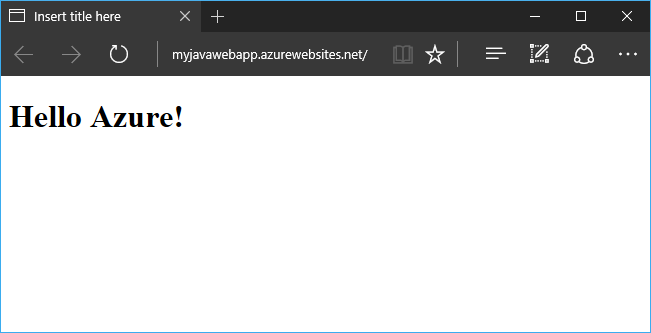

## Prerequisites

To complete this quickstart, install:

* The free [Eclipse IDE for Java EE Developers](http://www.eclipse.org/downloads/). This quickstart uses Eclipse Neon.
* The [Azure Toolkit for Eclipse](/azure/azure-toolkit-for-eclipse-installation).

[!INCLUDE [quickstarts-free-trial-note](../../includes/quickstarts-free-trial-note.md)]

## Create a dynamic web project in Eclipse

In Eclipse, select **File** > **New** > **Dynamic Web Project**.

In the **New Dynamic Web Project** dialog box, name the project **MyFirstJavaOnAzureWebApp**, and select **Finish**.
   
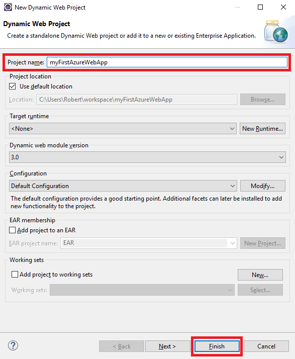

### Add a JSP page

If Project Explorer is not displayed, restore it.


In Project Explorer, expand the **MyFirstJavaOnAzureWebApp** project.
Right-click **WebContent**, and then select **New** > **JSP File**.

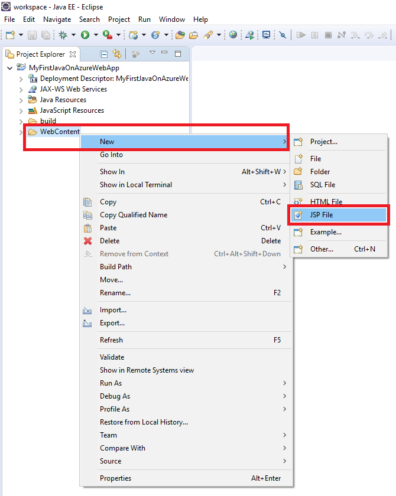

In the **New JSP File** dialog box:

* Name the file **index.jsp**.
* Select **Finish**.

  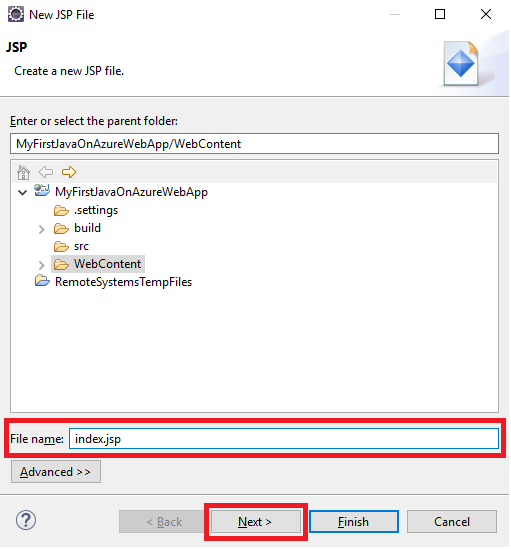

In the index.jsp file, replace the `<body></body>` element with the following markup:

```jsp
<body>
<h1><% out.println("Hello Azure!"); %></h1>
</body>
```

Save the changes.

## Publish the web app to Azure

In Project Explorer, right-click the project, and then select **Azure** > **Publish as Azure Web App**.

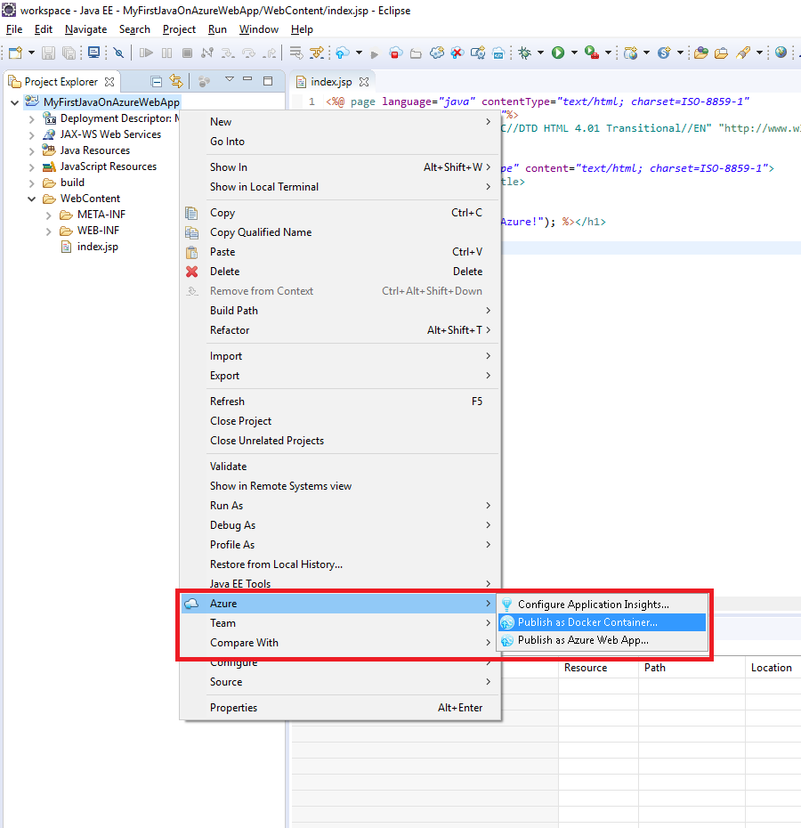

In the **Azure Sign In** dialog box, keep the **Interactive** option, and then select **Sign in**.

Follow the sign-in instructions.

### Deploy Web App dialog box

After you have signed in to your Azure account, the **Deploy Web App** dialog box appears.

Select **Create**.

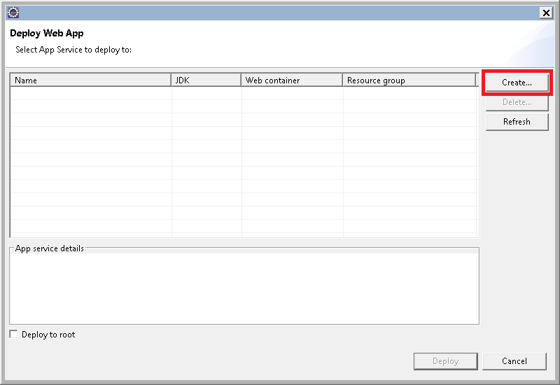

### Create App Service dialog box

The **Create App Service** dialog box appears with default values. The number **170602185241** shown in the following image is different in your dialog box.


In the **Create App Service** dialog box:

* Keep the generated name for the web app. This name must be unique across Azure. The name is part of the URL address for the web app. For example: if the web app name is **MyJavaWebApp**, the URL is *myjavawebapp.azurewebsites.net*.
* Keep the default web container.
* Select an Azure subscription.
* On the **App service plan** tab:

  * **Create new**: Keep the default, which is the name of the App Service plan.
  * **Location**: Select **West Europe** or a location near you.
  * **Pricing tier**: Select the free option. For features, see [App Service pricing](https://azure.microsoft.com/pricing/details/app-service/).

   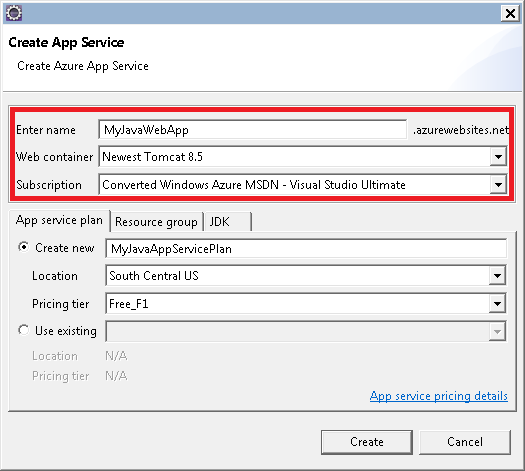

[!INCLUDE [app-service-plan](../../includes/app-service-plan.md)]

### Resource group tab

Select the **Resource group** tab. Keep the default generated value for the resource group.

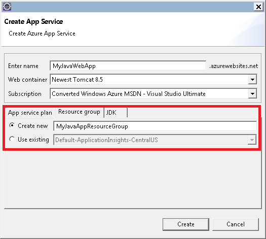

[!INCLUDE [resource-group](../../includes/resource-group.md)]

Select **Create**.

<!--
### The JDK tab

Select the **JDK** tab. Keep the default, and then select **Create**.

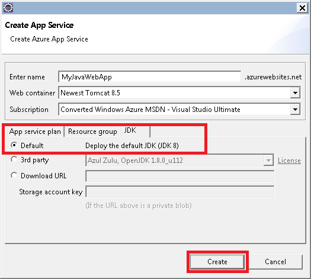
-->

The Azure Toolkit creates the web app and displays a progress dialog box.

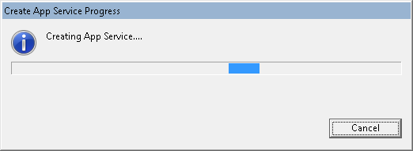

### Deploy Web App dialog box

In the **Deploy Web App** dialog box, select **Deploy to root**. If you have an app service at *wingtiptoys.azurewebsites.net* and you do not deploy to the root, the web app named **MyFirstJavaOnAzureWebApp** is deployed to *wingtiptoys.azurewebsites.net/MyFirstJavaOnAzureWebApp*.

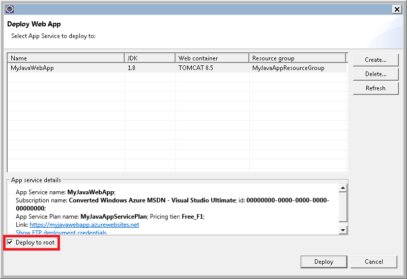

The dialog box shows the Azure, JDK, and web container selections.

Select **Deploy** to publish the web app to Azure.

When the publishing finishes, select the **Published** link in the **Azure Activity Log** dialog box.

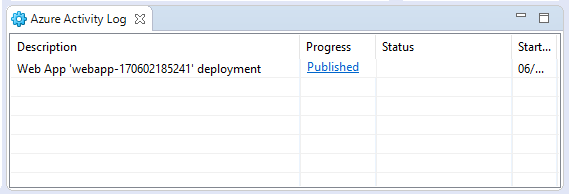

Congratulations! You have successfully deployed your web app to Azure. 


## Update the web app

Change the sample JSP code to a different message.

```jsp
<body>
<h1><% out.println("Hello again Azure!"); %></h1>
</body>
```

Save the changes.

In Project Explorer, right-click the project, and then select **Azure** > **Publish as Azure Web App**.

The **Deploy Web App** dialog box appears and shows the app service that you previously created. 

> [!NOTE]
> Select **Deploy to root** each time you publish.
>

Select the web app and select **Deploy**, which publishes the changes.

When the **Publishing** link appears, select it to browse to the web app and see the changes.

## Manage the web app

Go to the [Azure portal](https://portal.azure.com) to see the web app that you created.

From the left menu, select **Resource Groups**.


Select the resource group. The page shows the resources that you created in this quickstart.


Select the web app (**webapp-170602193915** in the preceding image).

The **Overview** page appears. This page gives you a view of how the app is doing. Here, you can  perform basic management tasks like browse, stop, start, restart, and delete. The tabs on the left side of the page show the different configurations that you can open. 

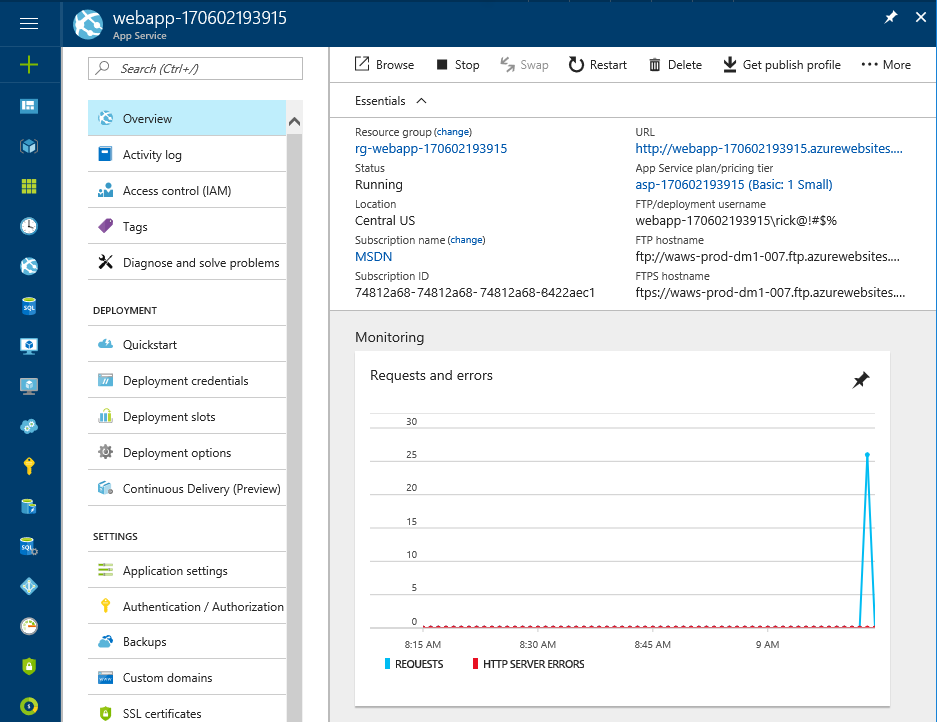

[!INCLUDE [clean-up-section-portal-web-app](../../includes/clean-up-section-portal-web-app.md)]

## Next steps

> [!div class="nextstepaction"]
> [Map custom domain](app-service-web-tutorial-custom-domain.md)
