# Create your first Java web app in Azure in five minutes

[!INCLUDE [app-service-web-selector-get-started](../../includes/app-service-web-selector-get-started.md)] 

This Quickstart helps you deploy your first Java web app to [Azure App Service](../app-service/app-service-value-prop-what-is.md) in just a few minutes. When you are finished with this tutorial, you'll have a simple Java-based web web app up and running in the cloud.


## Before you begin

This tutorial demonstrates how to use Eclipse IDE for Java EE Devlopers to build and deploy a Java web app to Azure. If you don't already have Eclipse installed, you can download it for free from http://www.eclipse.org/.

In order to simplify the process of publishing Java web apps to Azure, the steps in this tutorial will use the [Azure Toolkit for Eclipse](/azure/azure-toolkit-for-eclipse). For instructions on how to install the toolkit, see [Installing the Azure Toolkit for Eclipse](/azure/azure-toolkit-for-eclipse-installation).

> [!NOTE]
>
> You could also use [IntelliJ IDEA](https://www.jetbrains.com/idea/) from JetBrains to complete the steps in this tutorial. A few of the steps might be slightly different for that development environment, although there is also an [Azure Toolkit for IntelliJ](/azure/azure-toolkit-for-intellij) which you can use to simplify your publishing process for that IDE.
>

You will also need an Azure subscription to complete the steps in this tutorial. If you don't already have an Azure subscription, you can activate your [MSDN subscriber benefits](https://azure.microsoft.com/pricing/member-offers/msdn-benefits-details/) or sign up for a [free Azure account](https://azure.microsoft.com/pricing/free-trial/).

## Create a Dynamic Web Project in Eclipse

In the Eclipse IDE, click **File**, then **New**, then **Dynamic Web Project**.

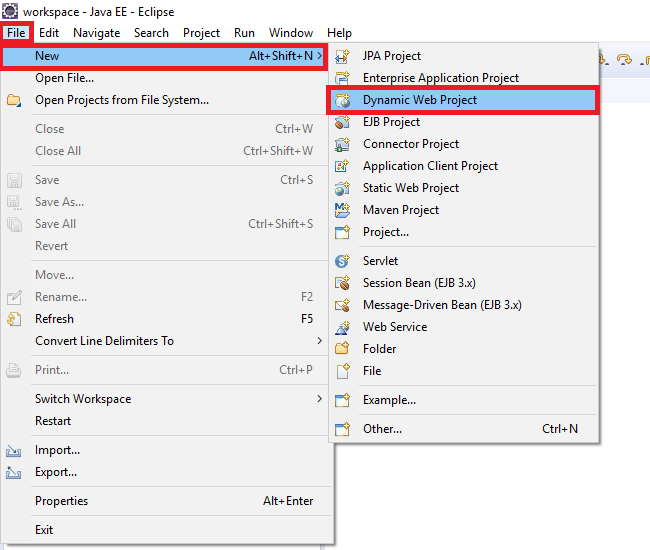

When the Dynamic Web Project dialog box appears, name the application **MyFirstJavaOnAzureWebApp**, and then click **Finish**.
   


> [!NOTE]
>
> If you have a local runtime environment such as [Apache Tomcat](https://tomcat.apache.org/) installed, you can specify that in the **Target runtime** field.
>

After your dynamic web project has been created, add a new JSP page by expanding your project in the Project Explorer, right-clicking the **WebContent** folder, clicking **New**, and then clicking **JSP File**.


When the New JSP File dialog box appears, name the file **index.jsp**, keep the parent folder as **MyFirstJavaOnAzureWebApp/WebContent**, and then click **Next**.


On the second page of the New JSP File dialog box appears, name the file **index.jsp**, keep the parent folder as **MyFirstJavaOnAzureWebApp/WebContent**, and then click **Finish**.

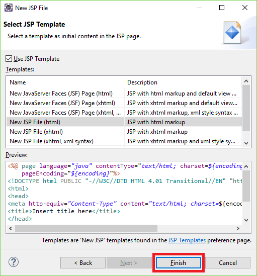

When your new page opens in Eclipse, replace the existing `<body></body>` section with the following code:

```jsp
<body>
<h1><% out.println("Java on Azure!"); %></h1>
</body>
```

Save your changes to the page.

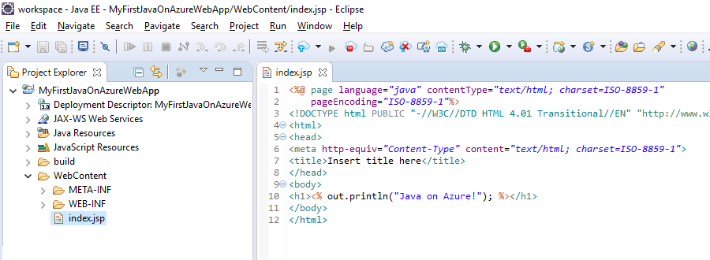

## Publish your web app to Azure

In order to deploy your web app to Azure, you will take advantage of several features provided by the Azure Toolkit for Eclipse.

To being the publishing process, use one of the following methods:

* Right-click your project in the Eclipse **Project Explorer**, then click **Azure**, and then click **Publish as Azure Web App**.

   

* Click the **Publish** icon on the Eclipse toolbar, and then click **Publish as Azure Web App**.

   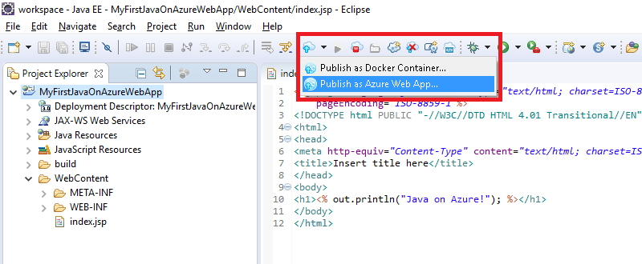

If you have not already signed into your Azure account, you will be prompted to sign in. To do so, use the following steps:

1. There are two different options for signing in to your Azure account; for this tutorial, choose **Interactive**.

   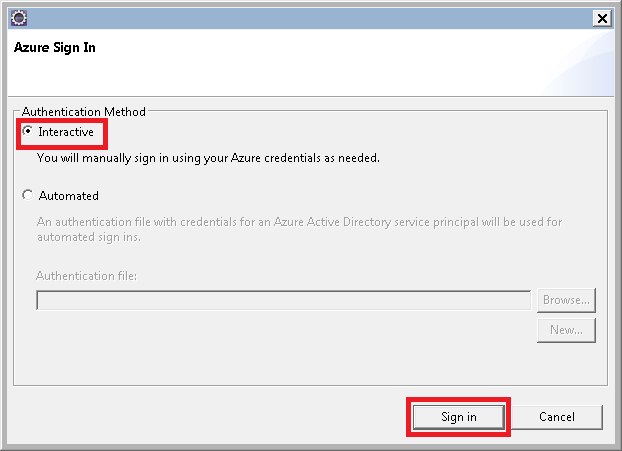

1. Enter your Azure credentials, and then click **Sign in**.

   

1. Choose your Azure subscriptions, and then click **Select**.

   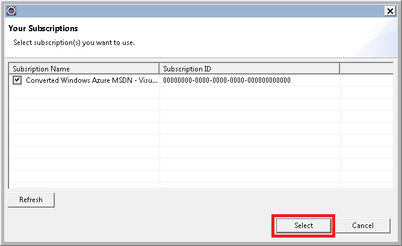

> [!NOTE]
>
> Detailed instructions about **Interactive** and **Automated** sign-ins are available in the [Azure Sign In Instructions for the Azure Toolkit for Eclipse](https://go.microsoft.com/fwlink/?linkid=846174) article.
>

Once you have been signed into your Azure account, the **Deploy Web App** dialog box will be displayed. You should see no App Services listed if this is your first time publishing a web app to Azure. If that is the case, or if you want to create a new App Service, then your next step will be to create a new App Service. To do so, click **Create**.


When the **Create App Service** dialog box is displayed, the initial data which you need to provide is:

* A unique name for your web app, which will become the DNS address for your web app; for example: **MyJavaWebApp** will be *myjavawebapp.azurewebsites.net*.

* Which web container your web app will use; for example: **Newest Tomcat 8.5**.

* Your Azure subscription.

   

If you do not have any existing App Service Plans, or if you would like to create a new service plan, then you will need to provide the following information:

* A unique name for your new service plan; this name will show up when you publish web apps in the future using the Azure Toolkit, and it will be listed in the [Azure Portal](https://portal.azure.com) when you are managing your account.

* The geographic location where you service plan will be created.

* The pricing tier for your service plan.

   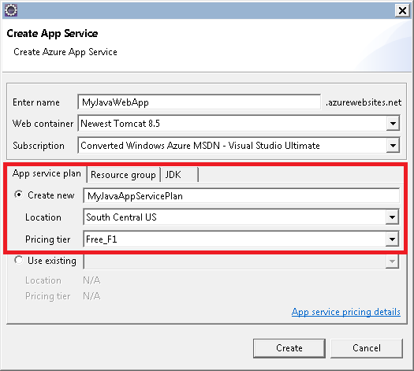

Next, click the **Resource group** tab. If you do not have any existing Resource Groups, or if you would like to create a new one, then you will need to provide a unique name for your new resource group; otherwise, choose an existing resource group from the drop-down menu.


Lastly, click the **JDK** tab. There are several options listed which allow developers to specify third-party or custom Java Developer Kits (JDKs), but for this tutorial you should choose the **Default**, and then click **Create**.


The Azure Toolkit will begin creating your new app service and display a progress dialog box while it is processing.


When your new app service has been created, the last option which you need to choose is whether to deploy your web app to the root of your new website. For example, if you have an app service at *wingtiptoys.azurewebsites.net* and you do not deploy to the root, then your web app named **MyFirstJavaOnAzureWebApp** will be deployed to *wingtiptoys.azurewebsites.net/MyFirstJavaOnAzureWebApp*.


After you have finished all of the preceding steps, click **Deploy** to publish your web app to Azure.

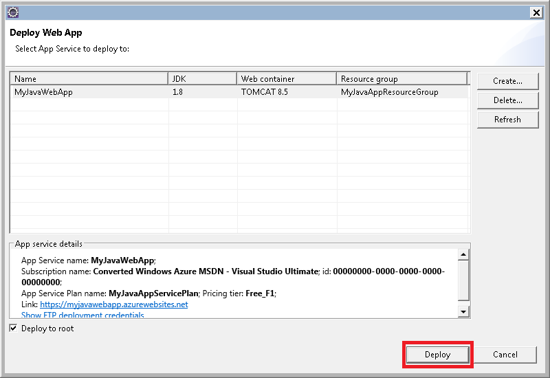

Congratulations! You have successfully deployed your web app to Azure! You can now preview your web app on the Azure website:


## Updating your web app

Once you have successfully published your web app to Azure, updating your web app is a much simpler process, and the following steps will walk you through the process of publishing changes to your web app.

First, change the sample JSP code from earlier so that the title is replaced by today's date:

```jsp
<%@ page
    language="java"
    contentType="text/html; charset=ISO-8859-1"
    pageEncoding="ISO-8859-1"
    import="java.text.SimpleDateFormat"
    import="java.util.Date" %>
<!DOCTYPE html PUBLIC "-//W3C//DTD HTML 4.01 Transitional//EN" "http://www.w3.org/TR/html4/loose.dtd">
<html>
<head>
<meta http-equiv="Content-Type" content="text/html; charset=ISO-8859-1">
<% SimpleDateFormat date = new SimpleDateFormat("yyyy/MM/dd"); %>
<title><% out.println(date.format(new Date())); %></title>
</head>
<body>
<h1><% out.println("Java on Azure!"); %></h1>
</body>
</html>
```

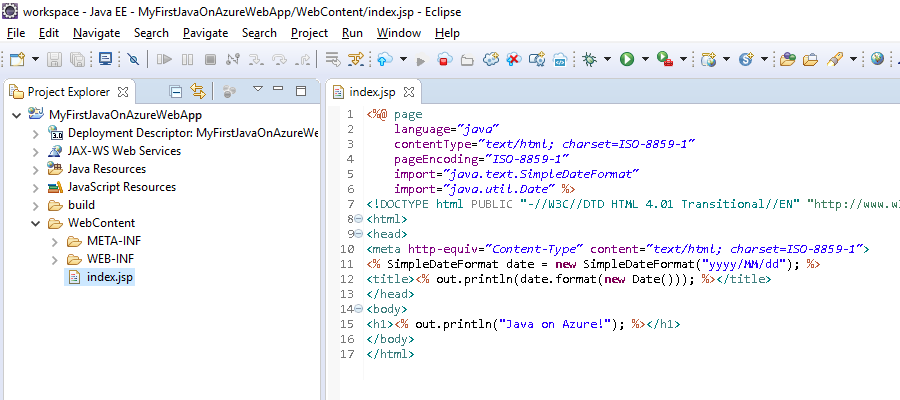

After you have saved your changes to the page, right-click your project in the Eclipse **Project Explorer**, then click **Azure**, and then click **Publish as Azure Web App**.

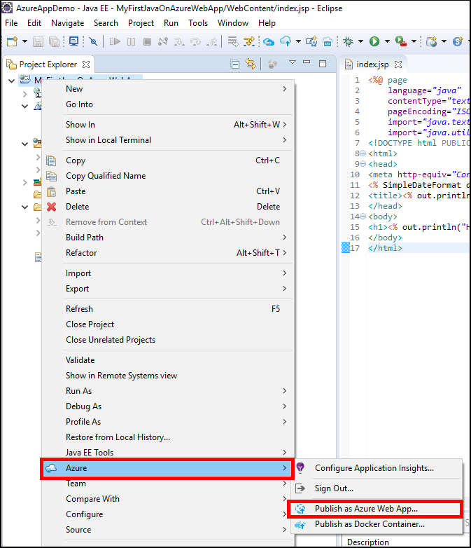

When the **Deploy Web App** dialog box is displayed, your app service from earlier will be listed. To update your web app, all that you need to do is highlight your app service and click **Deploy** to publish your changes.


> [!NOTE]
>
> If you are deploying your web app to the root of your app service, you will need to recheck **Deploy to root** each time that you publish your changes.
>

After you have published your changes, you will notice that the page title has changed to today's date in your browser.

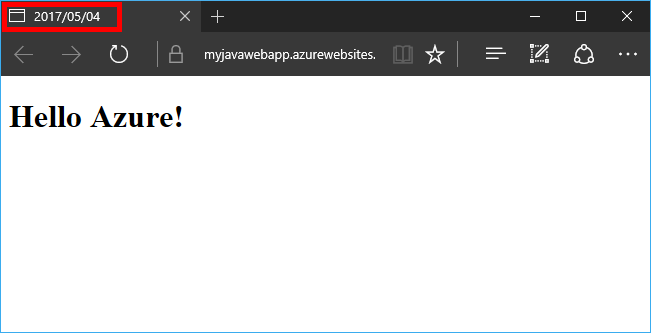

## Deleting your web app

To delete a web app, you can use the **Azure Explorer**, which is part of the Azure Toolkit. If the **Azure Explorer** view is not already visible in Eclipse, use the following steps to display it:

1. Click **Window**, then click **Show View**, and then click **Other**.

   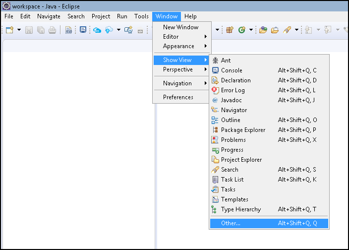

2. When the **Show View** dialog box appears, select **Azure Explorer** and click **OK**.

   

To delete your web app from the Azure Explorer, you need expand the **Web Apps** node, then right-click your web app and select **Delete**.

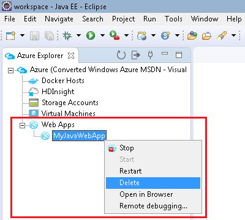

When prompted to delete your web app, click **OK**.

## Next Steps

For more information about the Azure Toolkits for Java IDEs, see the following links:

* [Azure Toolkit for Eclipse (This Article)](../azure-toolkit-for-eclipse.md)
  * [What's New in the Azure Toolkit for Eclipse](../azure-toolkit-for-eclipse-whats-new.md)
  * [Installing the Azure Toolkit for Eclipse](../azure-toolkit-for-eclipse-installation.md)
  * [Sign In Instructions for the Azure Toolkit for Eclipse](https://go.microsoft.com/fwlink/?linkid=846174)
* [Azure Toolkit for IntelliJ](../azure-toolkit-for-intellij.md)
  * [What's New in the Azure Toolkit for IntelliJ](../azure-toolkit-for-intellij-whats-new.md)
  * [Installing the Azure Toolkit for IntelliJ](../azure-toolkit-for-intellij-installation.md)
  * [Sign In Instructions for the Azure Toolkit for IntelliJ](https://go.microsoft.com/fwlink/?linkid=846179)

For more information about using Azure with Java, see the [Azure Java Developer Center](https://azure.microsoft.com/develop/java/) and the [Java Tools for Visual Studio Team Services](https://java.visualstudio.com/).
