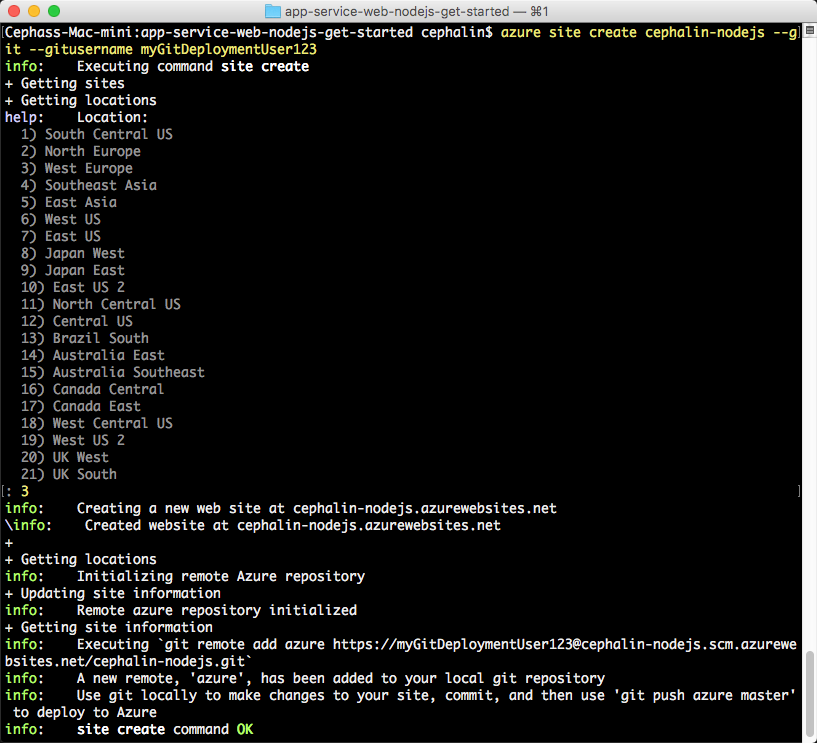

# Deploy your first Node.js web app to Azure in five minutes
[!INCLUDE [app-service-web-selector-get-started-nodejs-cli](../../includes/app-service-web-selector-get-started-nodejs-cli.md)]  

This tutorial helps you deploy your first Node.js web app to [Azure App Service](../app-service/app-service-value-prop-what-is.md).
You can use App Service to create web apps, [mobile app back ends](/documentation/learning-paths/appservice-mobileapps/),
and [API apps](../app-service-api/app-service-api-apps-why-best-platform.md).

You will: 

* Create a web app in Azure App Service.
* Deploy sample Node.js code.
* See your code running live in production.
* Update your web app the same way you would [push Git commits](https://git-scm.com/docs/git-push).

[!INCLUDE [app-service-linux](../../includes/app-service-linux.md)]

## CLI versions to complete the task

You can complete the task using one of the following CLI versions:

- [Azure CLI 1.0](app-service-web-get-started-nodejs-cli-nodejs.md) – our CLI for the classic and resource management deployment models
- [Azure CLI 2.0](app-service-web-get-started-nodejs.md) - our next generation CLI for the resource management deployment model

## Prerequisites
* [Git](http://www.git-scm.com/downloads).
* [Azure CLI](../xplat-cli-install.md).
* A Microsoft Azure account. If you don't have an account, you can 
  [sign up for a free trial](https://azure.microsoft.com/pricing/free-trial/?WT.mc_id=A261C142F) or 
  [activate your Visual Studio subscriber benefits](https://azure.microsoft.com/pricing/member-offers/msdn-benefits-details/?WT.mc_id=A261C142F).

> [!NOTE]
> You can [Try App Service](https://azure.microsoft.com/try/app-service/) without an Azure account. Create a starter app and play with
> it for up to an hour--no credit card required, no commitments.
> 
> 

## Deploy a Node.js web app
1. Open a new Windows command prompt, PowerShell window, Linux shell, or OS X terminal. Run `git --version` and `azure --version` to verify that Git and Azure CLI
   are installed on your machine.
   
    
   
    If you haven't installed the tools, see [Prerequisites](#Prerequisites) for download links.
2. Log in to Azure like this:
   
        azure login
   
    Follow the help message to continue the login process.
   
    
3. Change Azure CLI into ASM mode, then set the deployment user for App Service. You will deploy code using the credentials later.
   
        azure config mode asm
        azure site deployment user set --username <username> --pass <password>
4. Change to a working directory (`CD`) and clone the sample Node.js app like this:
   
        git clone https://github.com/Azure-Samples/app-service-web-nodejs-get-started.git
5. Change to the repository of your sample app.
   
        cd app-service-web-nodejs-get-started
6. Create the App Service app resource in Azure with a unique app name and the deployment user you configured earlier. When you're prompted, specify the number of the desired region.
   
        azure site create <app_name> --git --gitusername <username>
   
    
   
    Your app is created in Azure now. Also, your current directory is Git-initialized and connected to the new App Service app as a Git remote.
    You can browse to the app URL (http://&lt;app_name>.azurewebsites.net) to see the beautiful default HTML page, but let's actually get your code there now.
7. Deploy your sample code to your Azure app like you would push any code with Git. When prompted, use the password you configured earlier.
   
        git push azure master
   
    
   
    `git push` not only puts code in Azure, but also triggers deployment tasks in the deployment engine. 
    If you have a package.json in your project (repository) root, the deployment script restores the required packages for you. 

Congratulations, you have deployed your app to Azure App Service.

## See your app running live
To see your app running live in Azure, run this command from any directory in your repository:

    azure site browse

## Make updates to your app
You can now use Git to push from your project (repository) root anytime to make an update to the live site. You do it the same way as when you deployed your code
the first time. For example, every time you want to push a new change that you've tested locally, just run the following commands from your project 
(repository) root:

    git add .
    git commit -m "<your_message>"
    git push azure master

## Next steps
[Create, configure, and deploy a Node.js Express web app to Azure](app-service-web-nodejs-get-started-cli-nodejs.md). By following this tutorial, you will learn
the basic skills you need to run any Node.js web app in Azure, such as:

* Create and configure apps in Azure from PowerShell/Bash.
* Set Node.js version.
* Use a start file that is not in the root application directory.
* Automate with NPM.
* Get error and output logs.

Or, do more with your first web app. For example:

* Try out [other ways to deploy your code to Azure](web-sites-deploy.md). For example, to deploy from one of your GitHub repositories, simply select
  **GitHub** instead of **Local Git Repository** in **Deployment options**.
* Take your Azure app to the next level. Authenticate your users. Scale it based on demand. Set up some performance alerts. All with a few clicks. See 
  [Add functionality to your first web app](app-service-web-get-started-2.md).

