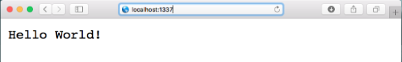
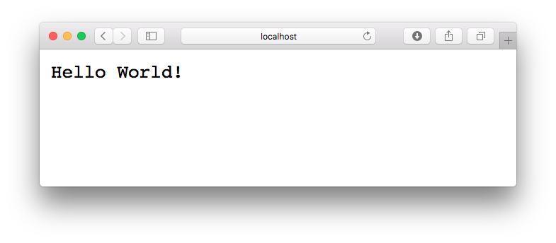
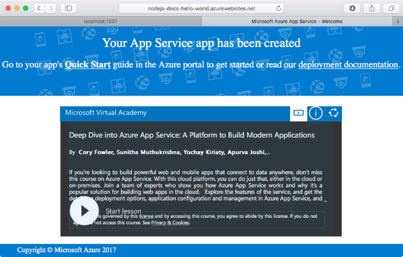

# Create a Node.js Application on Web App

This quickstart tutorial walks through how to develop and deploy a Node.js app to Azure. We’ll run the app using a Linux-based Azure App Service, and create and configure a new Web App within it using the Azure CLI. We’ll then use git to deploy our Node.js app to Azure.



You can follow the steps below using a Mac, Windows or Linux machine. It should take you only about 5 minutes to complete all of the steps below.

## Before you begin

Before running this sample, install the following prerequisites locally:

1. [Download and install git](https://git-scm.com/)
1. [Download and install Node.js and NPM](https://nodejs.org/)
1. Download and install the [Azure CLI 2.0](https://docs.microsoft.com/cli/azure/install-azure-cli)

[!INCLUDE [quickstarts-free-trial-note](../../includes/quickstarts-free-trial-note.md)]

## Download the sample

Clone the Hello World sample app repository to your local machine.

```bash
git clone https://github.com/Azure-Samples/nodejs-docs-hello-world
```

> [!TIP]
> Alternatively, you can [download the sample](https://github.com/Azure-Samples/nodejs-docs-hello-world/archive/master.zip) as a zip file and extract it.

Change to the directory that contains the sample code.

```bash
cd nodejs-docs-hello-world
```

## Run the app locally

Run the application locally by opening a terminal window and using the `npm start` script for the sample to launch the built in Node.js http server.

```bash
npm start
```

Open a web browser, and navigate to the sample.

```bash
http://localhost:1337
```

You can see the **Hello World** message from the sample app displayed in the page.



In your terminal window, press **Ctrl+C** to exit the web server.

## Log in to Azure

We are now going to use the Azure CLI 2.0 in a terminal window to create the resources needed to host our Node.js app in Azure. Log in to your Azure subscription with the [az login](/cli/azure/#login) command and follow the on-screen directions.

```azurecli
az login
```

## Configure a Deployment User

For FTP and local Git it is necessary to have a deployment user configured on the server to authenicate your deployment. Creating a deployment user is a one time configuration, take a note of the username and password as they will be used in a step below.

> [!NOTE]
> A deployment user is required for FTP and Local Git deployment to a Web App.
> The `username` and `password` are account-level, as such, are different from your Azure Subscription credentials. These credentials are only required to be created once.
>

Use the [az appservice web deployment user set](/cli/azure/appservice/web/deployment/user#set) command to create your account-level credentials.

```azurecli
az appservice web deployment user set --user-name <username> --password <password>
```

## Create a resource group

Create a resource group with the [az group create](/cli/azure/group#create). An Azure resource group is a logical container into which Azure resources like web apps, databases and storage accounts are deployed and managed.

```azurecli
az group create --name myResourceGroup --location westeurope
```

## Create an Azure App Service

Create a Linux-based App Service Plan with the [az appservice plan create](/cli/azure/appservice/plan#create) command.

> [!NOTE]
> An App Service plan represents the collection of physical resources used to host your apps. All applications assigned to an App Service plan share the resources defined by it allowing you to save cost when hosting multiple apps.
>
> App Service plans define:
> * Region (North Europe, East US, Southeast Asia)
> * Instance Size (Small, Medium, Large)
> * Scale Count (one, two or three instances, etc.)
> * SKU (Free, Shared, Basic, Standard, Premium)
>

The following example creates an App Service Plan on Linux Workers named `quickStartPlan` using the **Standard** pricing tier.

```azurecli
az appservice plan create --name quickStartPlan --resource-group myResourceGroup --sku S1 --is-linux
```

When the App Service Plan has been created, the Azure CLI shows information similar to the following example.

```json
{
    "id": "/subscriptions/00000000-0000-0000-0000-000000000000/resourceGroups/myResourceGroup/providers/Microsoft.Web/serverfarms/quickStartPlan",
    "kind": "linux",
    "location": "West Europe",
    "sku": {
    "capacity": 1,
    "family": "S",
    "name": "S1",
    "tier": "Standard"
    },
    "status": "Ready",
    "type": "Microsoft.Web/serverfarms"
}
```

## Create a web app

Now that an App Service plan has been created, create a Web App within the `quickStartPlan` App Service plan. The web app gives us a hosting space to deploy our code as well as provides a URL for us to view the deployed application. Use the [az appservice web create](/cli/azure/appservice/web#create) command to create the Web App.

In the command below substitute your own unique app name where you see the `<app_name>` placeholder. The `<app_name>` will be used as the default DNS site for the web app, and so the name needs to be unique across all apps in Azure. You can later map any custom DNS entry to the web app before you expose it to your users.

```azurecli
az appservice web create --name <app_name> --resource-group myResourceGroup --plan quickStartPlan
```

When the Web App has been created, the Azure CLI shows information similar to the following example.

```json
{
    "clientAffinityEnabled": true,
    "defaultHostName": "<app_name>.azurewebsites.net",
    "id": "/subscriptions/00000000-0000-0000-0000-000000000000/resourceGroups/myResourceGroup/providers/Microsoft.Web/sites/<app_name>",
    "isDefaultContainer": null,
    "kind": "app",
    "location": "West Europe",
    "name": "<app_name>",
    "repositorySiteName": "<app_name>",
    "reserved": true,
    "resourceGroup": "myResourceGroup",
    "serverFarmId": "/subscriptions/00000000-0000-0000-0000-000000000000/resourceGroups/myResourceGroup/providers/Microsoft.Web/serverfarms/quickStartPlan",
    "state": "Running",
    "type": "Microsoft.Web/sites",
}
```

Browse to the site to see your newly created Web App.

```bash
http://<app_name>.azurewebsites.net
```



We’ve now created an empty new Web App in Azure. Let’s now configure our Web App to use Node.js and deploy our app to it.

## Configure to use Node.js

Use the [az appservice web config update](/cli/azure/app-service/web/config#update) command to configure the Web App to use Node.js version `6.9.3`.

> [!TIP]
> Setting the node.js version this way uses a default container provided by the platform, if you would like to use your own container refer to the CLI reference for the [az appservice web config container update](/cli/azure/appservice/web/config/container#update) command.

```azurecli
az appservice web config update --linux-fx-version "NODE|6.9.3" --startup-file process.json --name <app_name> --resource-group myResourceGroup
```

## Configure local git deployment

You can deploy to your Web App in a variety of ways including FTP, local Git as well as GitHub, Visual Studio Team Services and Bitbucket.

Use the [az appservice web source-control config-local-git](/cli/azure/appservice/web/source-control#config-local-git) command to configure local git access to the Web App.

```azurecli
az appservice web source-control config-local-git --name <app_name> --resource-group myResourceGroup --query url --output tsv
```

Copy the output from the terminal as it will be used in the next step.

```bash
https://<username>@<app_name>.scm.azurewebsites.net:443/<app_name>.git
```

## Push to Azure from Git

Add an Azure remote to your local Git repository.

```bash
git remote add azure <paste-previous-command-output-here>
```

Push to the Azure remote to deploy your application. You will be prompted for the password you supplied earlier as part of the creation of the deployment user.

```azurecli
git push azure master
```

During deployment, Azure App Service will communicate it's progress with Git.

```bash
Counting objects: 23, done.
Delta compression using up to 4 threads.
Compressing objects: 100% (21/21), done.
Writing objects: 100% (23/23), 3.71 KiB | 0 bytes/s, done.
Total 23 (delta 8), reused 7 (delta 1)
remote: Updating branch 'master'.
remote: Updating submodules.
remote: Preparing deployment for commit id 'bf114df591'.
remote: Generating deployment script.
remote: Generating deployment script for node.js Web Site
remote: Generated deployment script files
remote: Running deployment command...
remote: Handling node.js deployment.
remote: Kudu sync from: '/home/site/repository' to: '/home/site/wwwroot'
remote: Copying file: '.gitignore'
remote: Copying file: 'LICENSE'
remote: Copying file: 'README.md'
remote: Copying file: 'index.js'
remote: Copying file: 'package.json'
remote: Copying file: 'process.json'
remote: Deleting file: 'hostingstart.html'
remote: Ignoring: .git
remote: Using start-up script index.js from package.json.
remote: Node.js versions available on the platform are: 4.4.7, 4.5.0, 6.2.2, 6.6.0, 6.9.1.
remote: Selected node.js version 6.9.1. Use package.json file to choose a different version.
remote: Selected npm version 3.10.8
remote: Finished successfully.
remote: Running post deployment command(s)...
remote: Deployment successful.
To https://<app_name>.scm.azurewebsites.net:443/<app_name>.git
 * [new branch]      master -> master
```

## Browse to the app

Browse to the deployed application using your web browser.

```bash
http://<app_name>.azurewebsites.net
```

This time, the page that displays the Hello World message is running using our Node.js code running as an Azure App Service web app.

## Updating and Deploying the Code

Using a local text editor, open the `index.js` file within the Node.js app, and make a small change to the text within the call to `response.end`:

```nodejs
response.end("Hello Azure!");
```

Commit your changes in git, then push the code changes to Azure.

```bash
git commit -am "updated output"
git push azure master
```

Once deployment has completed, switch back to the browser window that opened in the Browse to the app step, and hit refresh.


## Manage your new Azure web app

Go to the Azure portal to take a look at the web app you just created.

To do this, sign in to [https://portal.azure.com](https://portal.azure.com).

From the left menu, click **App Services**, then click the name of your Azure web app.


You have landed in your web app's _blade_ (a portal page that opens horizontally).

By default, your web app's blade shows the **Overview** page. This page gives you a view of how your app is doing. Here, you can also perform basic management tasks like browse, stop, start, restart, and delete. The tabs on the left side of the blade shows the different configuration pages you can open.


These tabs in the blade show the many great features you can add to your web app. The following list gives you just a few of the possibilities:

* Map a custom DNS name
* Bind a custom SSL certificate
* Configure continuous deployment
* Scale up and out
* Add user authentication

**Congratulations!** You've deployed your first Node.js app to App Service.

[!INCLUDE [cli-samples-clean-up](../../includes/cli-samples-clean-up.md)]

## Next steps

Explore pre-created [Web Apps CLI scripts](app-service-cli-samples.md).
