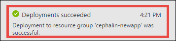
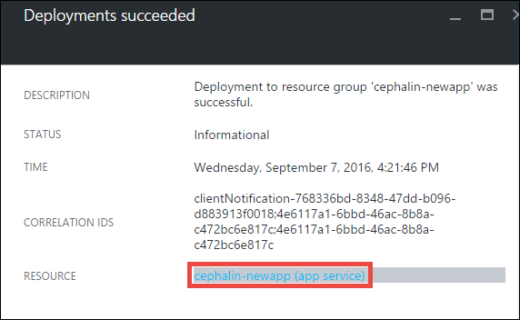
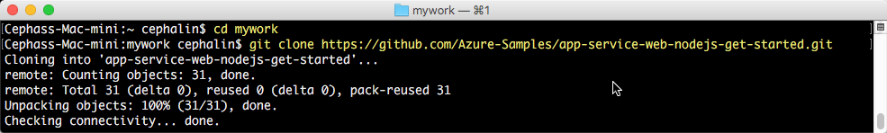
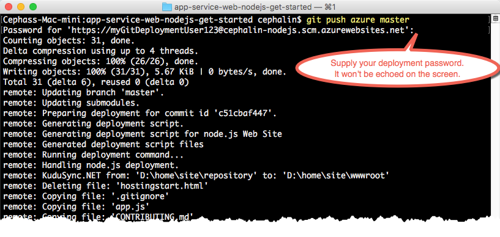

<properties 
	pageTitle="Deploy your Node.js web app to Azure in five minutes | Microsoft Azure" 
	description="Learn how easy it is to run web apps in App Service by deploying a sample app. Start doing real development quickly and see results immediately." 
	services="app-service\web"
	documentationCenter=""
	authors="cephalin"
	manager="wpickett"
	editor=""
/>

<tags
	ms.service="app-service-web"
	ms.workload="web"
	ms.tgt_pltfrm="na"
	ms.devlang="na"
	ms.topic="hero-article"
	ms.date="09/16/2016" 
	ms.author="cephalin"
/>
	
# Deploy your first Node.js web app to Azure in five minutes

This tutorial helps you deploy your first Node.js web app to [Azure App Service](../app-service/app-service-value-prop-what-is.md).
You can use App Service to create web apps, [mobile app back ends](/documentation/learning-paths/appservice-mobileapps/),
and [API apps](../app-service-api/app-service-api-apps-why-best-platform.md).

You will: 

- Create a web app in Azure App Service.
- Deploy sample Node.js code.
- See your code running live in production.
- Update your web app the same way you would [push Git commits](https://git-scm.com/docs/git-push).

## Prerequisites

- [Install Git](http://www.git-scm.com/downloads). Verify that your installation is successful by running `git --version` from a new Windows command prompt, 
PowerShell window, Linux shell, or OS X terminal.
- Get a Microsoft Azure account. If you don't have an account, you can 
[sign up for a free trial](/pricing/free-trial/?WT.mc_id=A261C142F) or 
[activate your Visual Studio subscriber benefits](/pricing/member-offers/msdn-benefits-details/?WT.mc_id=A261C142F).

>[AZURE.NOTE] You can [Try App Service](http://go.microsoft.com/fwlink/?LinkId=523751) without an Azure account. Create a starter app and play with
it for up to an hour--no credit card required, no commitments.

## Create a web app

1. Sign in to the [Azure portal](https://portal.azure.com) with your Azure account.

2. From the left menu, click **New** > **Web + Mobile** > **Web App**.

    

3. In the app creation blade, use the following settings for your new app:

    - **App name**: Type a unique name.
    - **Resource group**: Select **Create new** and give the resource group a name.
    - **App Service plan/Location**: Click it to configure, then click **Create New** to set the name, location, and 
    pricing tier of the App Service plan. Feel free to use the **Free** pricing tier.

    When you're done, your app creation blade should look like this:

    

3. Click **Create** at the bottom. You can click the **Notification** icon at the top to see the progress.

    

4. When deployment is finished, you should see this notification message. Click the message to open your deployment's blade.

    

5. In the **Deployment succeeded** blade, click the **Resource** link to open your new web app's blade.

    

## Deploy code to your web app

Now, let's deploy some code to Azure using Git.

5. In the web app blade, scroll down to **Deployment options** or search for it, then click it. 

    

6. Click **Choose Source** > **Local Git Repository** > **OK**.

7. Back in the web app blade, click **Deployment credentials**.

8. Set your deployment credentials and click **Save**.

7. Back in the web app blade, scroll down to **Properties** or search for it, then click it. Next to **Git URL**, click the **Copy** button.

    

    You're now ready to deploy your code with Git.

1. In your command-line terminal, change to a working directory (`CD`) and clone the sample app like this:

        git clone https://github.com/Azure-Samples/app-service-web-nodejs-get-started.git

    

    For *&lt;github_sample_url>*, use one of the following URLs, depending on the framework that you like:

2. Change to the repository of your sample app. For example, 

        cd app-service-web-nodejs-get-started

3. Configure the Git remote for your Azure app its Git URL, which you copied from the Portal a few steps ago.

        git remote add azure <giturlfromportal>

4. Deploy your sample code to your Azure app like you would push any code with Git:

        git push azure master

        

    If you used one of the language frameworks, you'll see different output. This is because `git push` not only puts code in Azure, but also triggers deployment tasks
    in the deployment engine. If you have any package.json in your project (repository) root, the deployment
    script restores the required packages for you. 

That's it! Your code is now running live in Azure. In your browser, navigate to http://*&lt;appname>*.azurewebsites.net to see it in action. 

## Make updates to your app

You can now use Git to push from your project (repository) root anytime to make an update to the live site. You do it the same way as when you deployed your code
the first time. For example, every time you want to push a new change that you've tested locally, just run the following commands from your project 
(repository) root:

    git add .
    git commit -m "<your_message>"
    git push azure master

## Next steps

[Create, configure, and deploy a Node.js Express web app to Azure](app-service-web-nodejs-get-started.md). By following this tutorial, you will learn
the basic skills you need to run any Node.js web app in Azure, such as:

- Create and configure apps in Azure from PowerShell/Bash.
- Set Node.js version.
- Use a start file that is not in the root application directory.
- Automate with NPM.
- Get error and output logs.

Or, do more with your first web app. For example:

- Try out [other ways to deploy your code to Azure](../app-service-web/web-sites-deploy.md). For example, to deploy from one of your GitHub repositories, simply select
**GitHub** instead of **Local Git Repository** in **Deployment options**.
- Take your Azure app to the next level. Authenticate your users. Scale it based on demand. Set up some performance alerts. All with a few clicks. See 
[Add functionality to your first web app](app-service-web-get-started-2.md).

