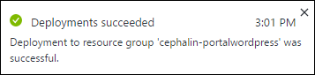
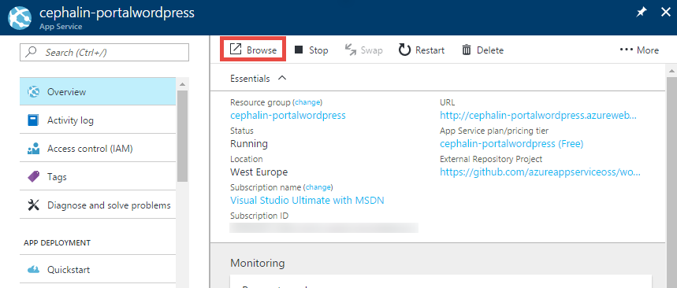
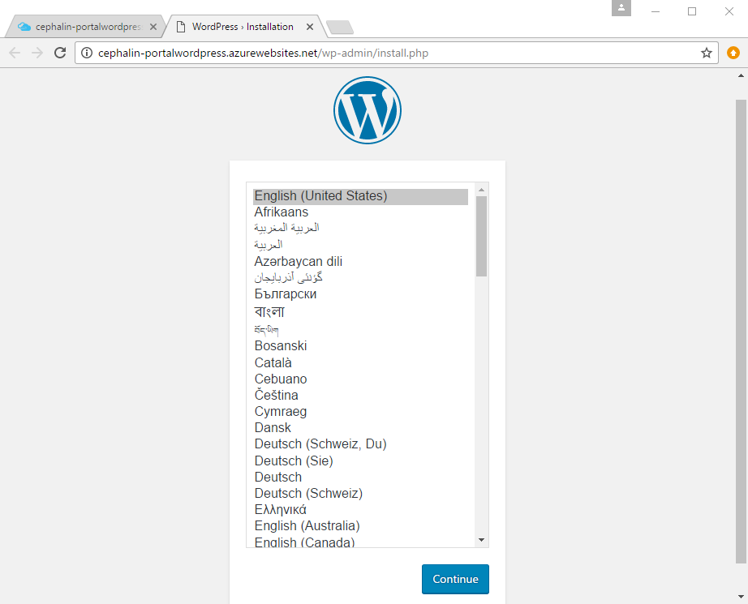

# Deploy a WordPress app in the Azure portal in five minutes

This tutorial shows you how to deploy your first [WordPress](https://wordpress.org/) web app to [Azure App Service](../app-service/app-service-value-prop-what-is.md) 
in minutes.

## Prerequisites
You need a Microsoft Azure account. If you don't have an account, you can 
[sign up for a free trial](https://azure.microsoft.com/pricing/free-trial/?WT.mc_id=A261C142F) or 
[activate your Visual Studio subscriber benefits](https://azure.microsoft.com/pricing/member-offers/msdn-benefits-details/?WT.mc_id=A261C142F).

> [!NOTE]
> You can [Try App Service](https://azure.microsoft.com/try/app-service/) without an Azure account. Create a starter app and play with
> it for up to an hour--no credit card required, no commitments.
> 
> 

## Deploy the WordPress app
1. Sign in to the [Azure portal](https://portal.azure.com).

2. Open [https://portal.azure.com/#create/WordPress.WordPress](https://portal.azure.com/#create/WordPress.WordPress).

    This link is a shortcut to immediately configure a new WordPress app in the Azure portal.

3. In **App name**, type a web app name. You will see a green checkmark in the box if the name is unique in the `azurewebsites.net` domain.
   
5. In **Resource Group**, click **Create new** to create a new [resource group](../azure-resource-manager/resource-group-overview.md), then give it a name.

6. In **Database Provider**, select **CleaDB**.

7. Click **App Service plan/Location** > **Create New**. Configure the [App Service plan](../app-service/azure-web-sites-web-hosting-plans-in-depth-overview.md) as shown:

    - In **App Service plan**, type the desired name.
    - In **Location**, choose a location to host your plan.
    - Click **Pricing tier**, then select **F1 Free** or another tier that suits you, and then click **Select**.
    - Click **OK**.

8. Click **Database** > **Create New**. Configure the SQL Database as shown:

    - In **Database Name**, type a database name. 
    - In **Location**, choose the same location as the App Service plan.
    - Click **Pricing tier**, then select **Mercury** or another tier that suits you, and then click **Select**.
    - Click **Legal Terms** and click **Purchase**.
    - Click **OK**.

9. Click **Create**.

    Azure now creates your WordPress app based on your configuration. You should see a **Deployment started...** notification.

    
   
## Launch and manage your WordPress web app

When Azure completes app deployment you see another notification.

1. Click the notification. If you missed it, you can always access it by clicking the notification bell 
().

    You should now see your web app's management [blade](../azure-resource-manager/resource-group-portal.md#manage-resources) (*blade*: a portal page that opens horizontally).

3. In the top of the Overview page, click **Browse**.
   
    

    Now you see the WordPress **Welcome** page. Configure the WordPress installation and start playing with it!

    
    
## Next steps
* [Create, configure, and deploy a Laravel web app to Azure](app-service-web-php-get-started.md) - Learn the basic skills you need to run any PHP web app 
in Azure, such as:

    * Create and configure apps in Azure from PowerShell/Bash.
    * Set PHP version.
    * Use a start file that is not in the root application directory.
    * Enable Composer automation.
    * Access environment-specific variables.
    * Troubleshoot common errors.

* [Deploy your code to Azure App Service](web-sites-deploy.md)- Learn how to deploy from FTP or from source control repositories.
* [Add functionality to your first web app](app-service-web-get-started-2.md) - Take your Azure app to the next level. Authenticate your users. 
Scale it based on demand. Set up some performance alerts. All with a few clicks.
