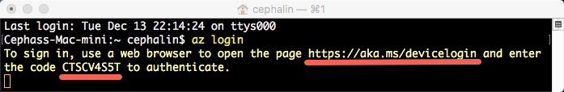

# Deploy your first PHP web app to Azure in five minutes (CLI 2.0 Preview)
[!INCLUDE [app-service-web-selector-get-started](../../includes/app-service-web-selector-get-started.md)]

This tutorial helps you deploy your first PHP web app to [Azure App Service](../app-service/app-service-value-prop-what-is.md).
You can use App Service to create web apps, [mobile app back ends](/documentation/learning-paths/appservice-mobileapps/),
and [API apps](../app-service-api/app-service-api-apps-why-best-platform.md).

You will: 

* Create a web app in Azure App Service.
* Deploy sample PHP code.
* See your code running live in production.
* Update your web app the same way you would [push Git commits](https://git-scm.com/docs/git-push).

[!INCLUDE [app-service-linux](../../includes/app-service-linux.md)]

## CLI versions to complete the task

You can complete the task using one of the following CLI versions:

- [Azure CLI 1.0](app-service-web-get-started-php-cli-nodejs.md) – our CLI for the classic and resource management deployment models
- [Azure CLI 2.0 (Preview)](app-service-web-get-started-php.md) - our next generation CLI for the resource management deployment model

## Prerequisites
* [Git](http://www.git-scm.com/downloads).
* [Azure CLI 2.0 Preview](/cli/azure/install-az-cli2).
* A Microsoft Azure account. If you don't have an account, you can 
  [sign up for a free trial](https://azure.microsoft.com/pricing/free-trial/?WT.mc_id=A261C142F) or 
  [activate your Visual Studio subscriber benefits](https://azure.microsoft.com/pricing/member-offers/msdn-benefits-details/?WT.mc_id=A261C142F).

> [!NOTE]
> You can [Try App Service](https://azure.microsoft.com/try/app-service/) without an Azure account. Create a starter app and play with
> it for up to an hour--no credit card required, no commitments.
> 
> 

## Deploy a PHP web app
1. Open a new Windows command prompt, PowerShell window, Linux shell, or OS X terminal. Run `git --version` and `azure --version` to verify that Git and Azure CLI
   are installed on your machine.
   
    
   
    If you haven't installed the tools, see [Prerequisites](#Prerequisites) for download links.
2. Log in to Azure like this:
   
        az login
   
    Follow the help message to continue the login process.
   
    

3. Set the deployment user for App Service. You will deploy code using these credentials later.
   
        az appservice web deployment user set --user-name <username> --password <password>

3. Create a new [resource group](../azure-resource-manager/resource-group-overview.md). For this first App Service tutorial, you don't really need to know
what it is.

        az group create --location "<location>" --name my-first-app-group

    To see what possible values you can use for `<location>`, use the `az appservice list-locations` CLI command.

3. Create a new "FREE" [App Service plan](../app-service/azure-web-sites-web-hosting-plans-in-depth-overview.md). For this first App Service tutorial, just 
know that you won't be charged for web apps in this plan.

        az appservice plan create --name my-free-appservice-plan --resource-group my-first-app-group --sku FREE

4. Create a new web app with a unique name in `<app_name>`.

        az appservice web create --name <app_name> --resource-group my-first-app-group --plan my-free-appservice-plan

4. Next, you get the sample PHP code you want to deploy. Change to a working directory (`CD`) and clone the sample app like this:
   
        cd <working_directory>
        git clone https://github.com/Azure-Samples/app-service-web-php-get-started.git

5. Change to the repository of your sample app. For example:
   
        cd app-service-web-php-get-started
5. Configure local Git deployment for your App Service web app with the following command:

        az appservice web source-control config-local-git --name <app_name> --resource-group my-first-app-group

    You will get a JSON output like this, which means that the remote Git repository is configured:

        {
        "url": "https://<deployment_user>@<app_name>.scm.azurewebsites.net/<app_name>.git"
        }

6. Add the URL in the JSON as a Git remote for your local repository (called `azure` for simplicity).

        git remote add azure https://<deployment_user>@<app_name>.scm.azurewebsites.net/<app_name>.git
   
7. Deploy your sample code to your Azure app like you would push any code with Git. When prompted, use the password you configured earlier.
   
        git push azure master
   
    
   
    `git push` not only puts code in Azure, but also triggers deployment tasks in the deployment engine. You can also 
    [enable the Composer extension](web-sites-php-mysql-deploy-use-git.md#composer) to automatically process composer.json files
    in your PHP app.

Congratulations, you have deployed your app to Azure App Service.

## See your app running live
To see your app running live in Azure, run this command from any directory in your repository:

    azure site browse

## Make updates to your app
You can now use Git to push from your project (repository) root anytime to make an update to the live site. You do it the same way as when you deployed your code
the first time. For example, every time you want to push a new change that you've tested locally, just run the following commands from your project 
(repository) root:

    git add .
    git commit -m "<your_message>"
    git push azure master

## Next steps
[Create, configure, and deploy a Laravel web app to Azure](app-service-web-php-get-started.md). By following this tutorial, you will learn
the basic skills you need to run any PHP web app in Azure, such as:

* Create and configure apps in Azure from PowerShell/Bash.
* Set PHP version.
* Use a start file that is not in the root application directory.
* Enable Composer automation.
* Access environment-specific variables.
* Troubleshoot common errors.

Or, do more with your first web app. For example:

* Try out [other ways to deploy your code to Azure](web-sites-deploy.md). For example, to deploy from one of your GitHub repositories, simply select
  **GitHub** instead of **Local Git Repository** in **Deployment options**.
* Take your Azure app to the next level. Authenticate your users. Scale it based on demand. Set up some performance alerts. All with a few clicks. See 
  [Add functionality to your first web app](app-service-web-get-started-2.md).

