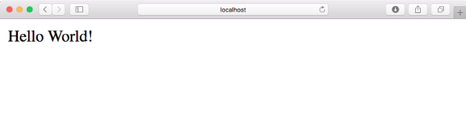
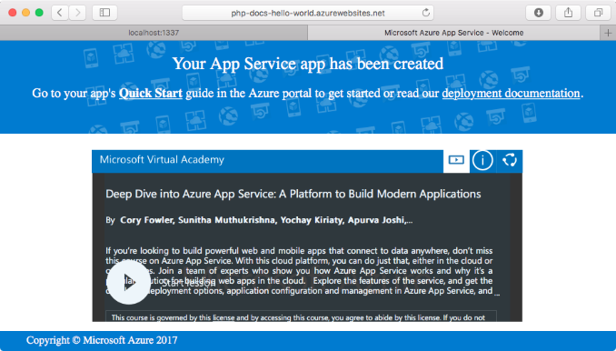
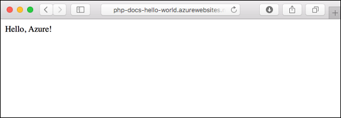
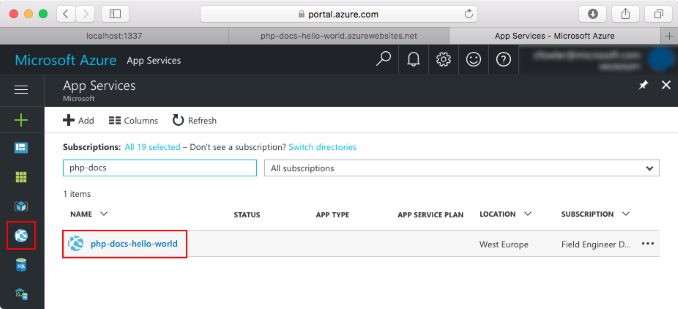
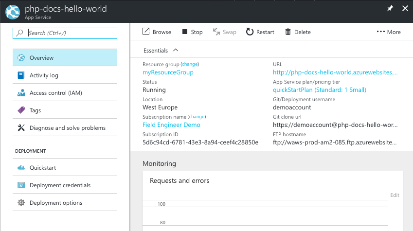

# Create a PHP web app in Azure

[Azure Web Apps](https://docs.microsoft.com/azure/app-service-web/app-service-web-overview) provides a highly scalable, self-patching web hosting service.  This quickstart tutorial shows how to deploy a PHP app to Azure Web Apps. You create the web app using the [Azure CLI](https://docs.microsoft.com/cli/azure/get-started-with-azure-cli), and you use Git to deploy sample PHP code to the web app.

![Sample app running in Azure]](media/app-service-web-get-started-php/hello-world-in-browser.png)

You can follow the steps below using a Mac, Windows, or Linux machine. Once the prerequisites are installed, it takes about five minutes to complete the steps.

## Prerequisites

To complete this quickstart:

* [Install Git](https://git-scm.com/)
* [Install PHP](https://php.net)

[!INCLUDE [quickstarts-free-trial-note](../../includes/quickstarts-free-trial-note.md)]

[!INCLUDE [cloud-shell-try-it.md](../../includes/cloud-shell-try-it.md)]

If you choose to install and use the CLI locally, this topic requires that you are running the Azure CLI version 2.0 or later. Run `az --version` to find the version. If you need to install or upgrade, see [Install Azure CLI 2.0]( /cli/azure/install-azure-cli). 

## Download the sample

In a terminal window, run the following command to clone the sample app repository to your local machine.

```bash
git clone https://github.com/Azure-Samples/php-docs-hello-world
```

Change to the directory that contains the sample code.

```bash
cd php-docs-hello-world
```

## Run the app locally

Run the application locally by opening a terminal window and using the `php` command to launch the built-in PHP web server.

```bash
php -S localhost:8080
```

Open a web browser, and navigate to the sample app at http://localhost:8080.

You see the **Hello World** message from the sample app displayed in the page.



In your terminal window, press **Ctrl+C** to exit the web server.

[!INCLUDE [Log in to Azure](../../includes/login-to-azure.md)] 

[!INCLUDE [Configure deployment user](../../includes/configure-deployment-user.md)] 

[!INCLUDE [Create resource group](../../includes/app-service-web-create-resource-group.md)] 

[!INCLUDE [Create app service plan](../../includes/app-service-web-create-app-service-plan.md)] 

[!INCLUDE [Create web app](../../includes/app-service-web-create-web-app.md)] 



You’ve created an empty new web app in Azure.

[!INCLUDE [Configure local git](../../includes/app-service-web-configure-local-git.md)] 

[!INCLUDE [Push to Azure](../../includes/app-service-web-git-push-to-azure.md)] 

```bash
Counting objects: 2, done.
Delta compression using up to 4 threads.
Compressing objects: 100% (2/2), done.
Writing objects: 100% (2/2), 352 bytes | 0 bytes/s, done.
Total 2 (delta 1), reused 0 (delta 0)
remote: Updating branch 'master'.
remote: Updating submodules.
remote: Preparing deployment for commit id '25f18051e9'.
remote: Generating deployment script.
remote: Running deployment command...
remote: Handling Basic Web Site deployment.
remote: Kudu sync from: '/home/site/repository' to: '/home/site/wwwroot'
remote: Copying file: '.gitignore'
remote: Copying file: 'LICENSE'
remote: Copying file: 'README.md'
remote: Copying file: 'index.php'
remote: Ignoring: .git
remote: Finished successfully.
remote: Running post deployment command(s)...
remote: Deployment successful.
To https://<app_name>.scm.azurewebsites.net/<app_name>.git
   cc39b1e..25f1805  master -> master
```

## Browse to the app

Browse to the deployed application using your web browser.

```bash
http://<app_name>.azurewebsites.net
```

The PHP sample code is running in an Azure App Service web app.


**Congratulations!** You've deployed your first PHP app to App Service.

## Update and redeploy the code

Using a local text editor, open the `index.php` file within the PHP app, and make a small change to the text within the string next to `echo`:

```php
echo "Hello Azure!";
```

Commit your changes in Git, and then push the code changes to Azure.

```bash
git commit -am "updated output"
git push azure master
```

Once deployment has completed, switch back to the browser window that opened in the **Browse to the app** step, and refresh the page.



## Manage your new Azure web app

Go to the [Azure portal](https://portal.azure.com) to manage the web app you created.

From the left menu, click **App Services**, and then click the name of your Azure web app.



You see your web app's Overview page. Here, you can perform basic management tasks like browse, stop, start, restart, and delete. 



The left menu provides different pages for configuring your app. 

[!INCLUDE [cli-samples-clean-up](../../includes/cli-samples-clean-up.md)]

## Next steps

> [!div class="nextstepaction"]
> [PHP with MySQL](app-service-web-tutorial-php-mysql.md)
