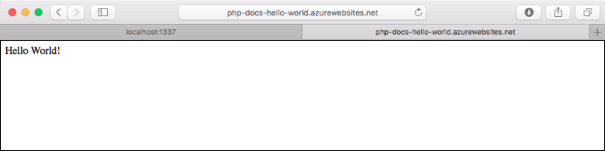
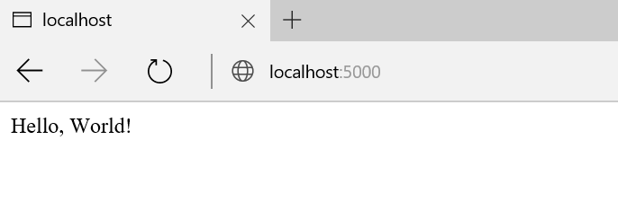
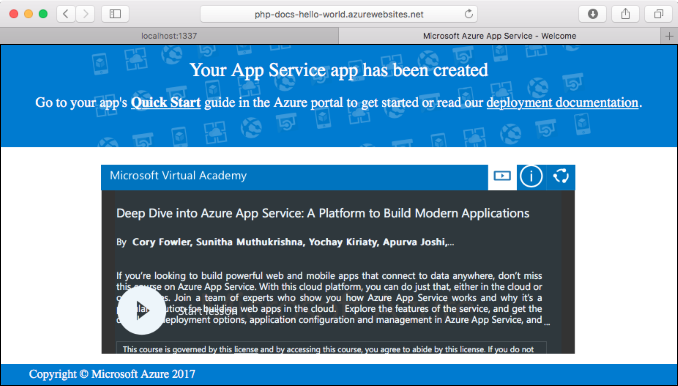
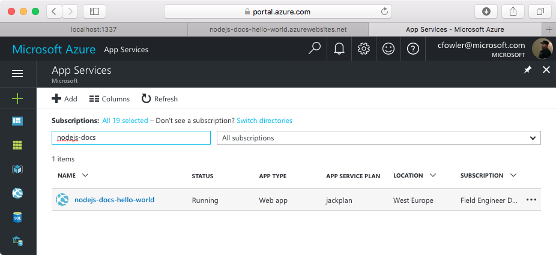
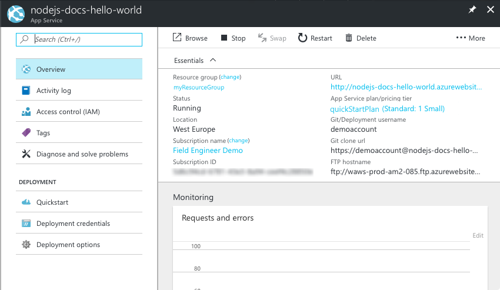

# Create a Python web app in Azure

[Azure Web Apps](https://docs.microsoft.com/azure/app-service-web/app-service-web-overview) provides a highly scalable, self-patching web hosting service.  This quickstart walks through how to develop and deploy a Python app to Azure Web Apps. You create the web app using the [Azure CLI](https://docs.microsoft.com/cli/azure/get-started-with-azure-cli), and you use Git to deploy sample Python code to the web app.



You can follow the steps below using a Mac, Windows, or Linux machine. Once the prerequisites are installed, it takes about five minutes to complete the steps.
## Prerequisites

To complete this tutorial:

1. [Install Git](https://git-scm.com/)
1. [Install Python](https://www.python.org/downloads/)

[!INCLUDE [quickstarts-free-trial-note](../../includes/quickstarts-free-trial-note.md)]

[!INCLUDE [cloud-shell-try-it.md](../../includes/cloud-shell-try-it.md)]

If you choose to install and use the CLI locally, this topic requires that you are running the Azure CLI version 2.0 or later. Run `az --version` to find the version. If you need to install or upgrade, see [Install Azure CLI 2.0]( /cli/azure/install-azure-cli). 

## Download the sample

In a terminal window, run the following command to clone the sample app repository to your local machine.

```bash
git clone https://github.com/Azure-Samples/python-docs-hello-world
```

Change to the directory that contains the sample code.

```bash
cd Python-docs-hello-world
```

## Run the app locally

Run the application locally by opening a terminal window and using the `Python` command to launch the built-in Python web server.

```bash
python main.py
```

Open a web browser, and navigate to the sample app at http://localhost:5000.

You can see the **Hello World** message from the sample app displayed in the page.



In your terminal window, press **Ctrl+C** to exit the web server.

[!INCLUDE [Log in to Azure](../../includes/login-to-azure.md)] 

[!INCLUDE [Configure deployment user](../../includes/configure-deployment-user.md)] 

[!INCLUDE [Create resource group](../../includes/app-service-web-create-resource-group.md)] 

[!INCLUDE [Create app service plan](../../includes/app-service-web-create-app-service-plan.md)] 

[!INCLUDE [Create web app](../../includes/app-service-web-create-web-app.md)] 



You’ve created an empty new web app in Azure.

## Configure to use Python

Use the [az appservice web config update](/cli/azure/app-service/web/config#update) command to configure the web app to use Python version `3.4`.

```azurecli-interactive
az appservice web config update --python-version 3.4 --name <app_name> --resource-group myResourceGroup
```

Setting the Python version this way uses a default container provided by the platform. To use your own container, see the CLI reference for the [az appservice web config container update](https://docs.microsoft.com/cli/azure/appservice/web/config/container#update) command.

[!INCLUDE [Configure local git](../../includes/app-service-web-configure-local-git.md)] 

[!INCLUDE [Push to Azure](../../includes/app-service-web-git-push-to-azure.md)] 

```bash
Counting objects: 18, done.
Delta compression using up to 4 threads.
Compressing objects: 100% (16/16), done.
Writing objects: 100% (18/18), 4.31 KiB | 0 bytes/s, done.
Total 18 (delta 4), reused 0 (delta 0)
remote: Updating branch 'master'.
remote: Updating submodules.
remote: Preparing deployment for commit id '44e74fe7dd'.
remote: Generating deployment script.
remote: Generating deployment script for python Web Site
remote: Generated deployment script files
remote: Running deployment command...
remote: Handling python deployment.
remote: KuduSync.NET from: 'D:\home\site\repository' to: 'D:\home\site\wwwroot'
remote: Deleting file: 'hostingstart.html'
remote: Copying file: '.gitignore'
remote: Copying file: 'LICENSE'
remote: Copying file: 'main.py'
remote: Copying file: 'README.md'
remote: Copying file: 'requirements.txt'
remote: Copying file: 'virtualenv_proxy.py'
remote: Copying file: 'web.2.7.config'
remote: Copying file: 'web.3.4.config'
remote: Detected requirements.txt.  You can skip Python specific steps with a .skipPythonDeployment file.
remote: Detecting Python runtime from site configuration
remote: Detected python-3.4
remote: Creating python-3.4 virtual environment.
remote: .................................
remote: Pip install requirements.
remote: Successfully installed Flask click itsdangerous Jinja2 Werkzeug MarkupSafe
remote: Cleaning up...
remote: .
remote: Overwriting web.config with web.3.4.config
remote:         1 file(s) copied.
remote: Finished successfully.
remote: Running post deployment command(s)...
remote: Deployment successful.
To https://<app_name>.scm.azurewebsites.net/<app_name>.git
 * [new branch]      master -> master
```

## Browse to the app

Browse to the deployed application using your web browser.

```bash
http://<app_name>.azurewebsites.net
```

The Python sample code is running in an Azure App Service web app.


**Congratulations!** You've deployed your first Python app to App Service.

## Update and redeploy the code

Using a local text editor, open the `main.py` file in the Python app, and make a small change to the text next to the `return` statement:

```python
return 'Hello, Azure!'
```

Commit your changes in Git, and then push the code changes to Azure.

```bash
git commit -am "updated output"
git push azure master
```

Once deployment has completed, switch back to the browser window that opened in the [Browse to the app](#browse-to-the-app) step, and refresh the page.


## Manage your new Azure web app

Go to the [Azure portal](https://portal.azure.com) to manage the web app you created.

From the left menu, click **App Services**, and then click the name of your Azure web app.



You see your web app's Overview page. Here, you can perform basic management tasks like browse, stop, start, restart, and delete. 



The left menu provides different pages for configuring your app. 

[!INCLUDE [cli-samples-clean-up](../../includes/cli-samples-clean-up.md)]

## Next steps

> [!div class="nextstepaction"]
> [Python with PostgreSQL](app-service-web-tutorial-docker-python-postgresql-app.md)
