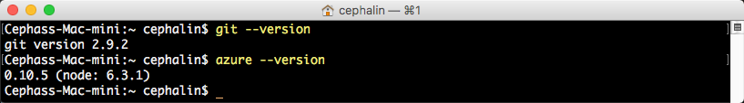
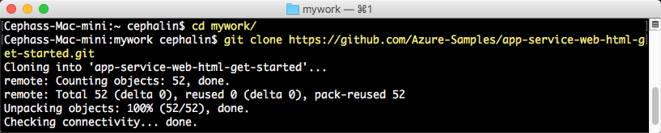
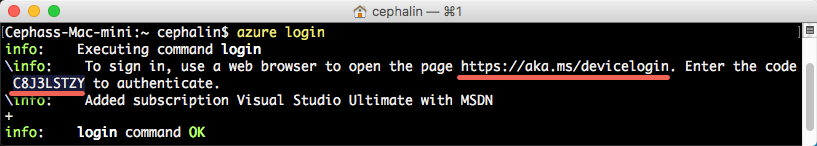
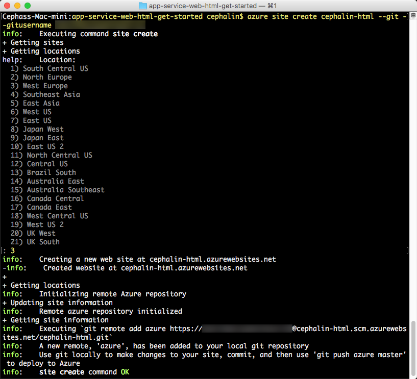
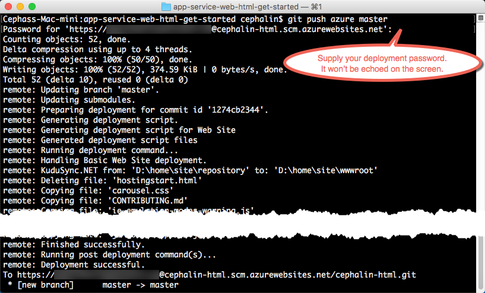
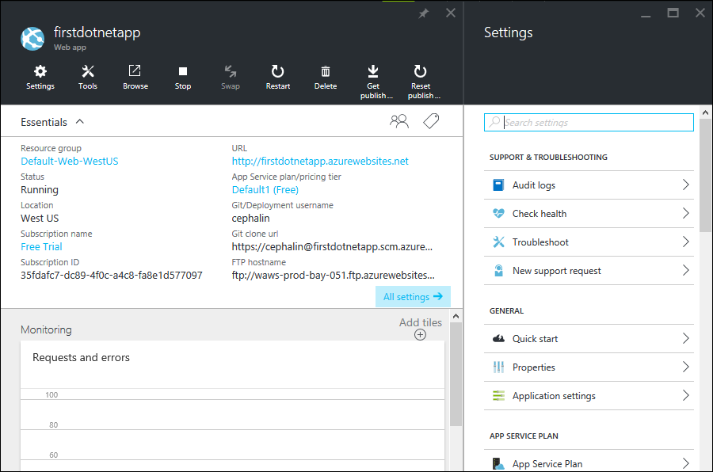

<properties 
	pageTitle="Deploy your first web app to Azure in 5 minutes" 
	description="Learn how easy it is to run web apps in App Service by deploying a sample app with only a few steps. Start doing real development in 5 minutes and see results immediately." 
	services="app-service\web"
	documentationCenter=""
	authors="cephalin" 
	manager="wpickett" 
	editor="" 
/>

<tags 
	ms.service="app-service-web" 
	ms.workload="web" 
	ms.tgt_pltfrm="na" 
	ms.devlang="na" 
	ms.topic="hero-article"
	ms.date="05/12/2016" 
	ms.author="cephalin"
/>
	
# Deploy your first web app to Azure in 5 minutes

[AZURE.INCLUDE [tabs](../../includes/app-service-web-get-started-nav-tabs.md)]

This tutorial helps you deploy your first web app to [Azure App Service](../app-service/app-service-value-prop-what-is.md). 
App Service lets you create web apps, [mobile app backends](/documentation/learning-paths/appservice-mobileapps/) 
and [API apps](../app-service-api/app-service-api-apps-why-best-platform.md).

With little action on your part, you will: 

- Deploy a sample web app (choose between ASP.NET, PHP, Node.js, Java, or Python).
- See your app running live in seconds.
- Update your web app the same way you would [push Git commits](https://git-scm.com/docs/git-push).

You'll also take a first glance at the [Azure portal](https://portal.azure.com) and survey the features available there. 

## Prerequisites

- [Install Git](http://www.git-scm.com/downloads). 
- [Install Azure CLI](../xplat-cli-install.md). 
- Get a Microsoft Azure account. If you don't have an account, you can 
[sign up for a free trial](/pricing/free-trial/?WT.mc_id=A261C142F) or 
[activate your Visual Studio subscriber benefits](/pricing/member-offers/msdn-benefits-details/?WT.mc_id=A261C142F).

>[AZURE.NOTE] See a web app in action. [Try App Service](http://go.microsoft.com/fwlink/?LinkId=523751) immediately and create a short-lived starter app—no credit 
card required, no commitments.

## Deploy a web app

Let's deploy a web app to Azure App Service. 

1. Open a new Windows command prompt, PowerShell window, Linux shell, or OS X terminal. Run `git --version` and `azure --version` to verify that Git and Azure CLI 
are installed on your machine. 

    

    If you haven't installed the tools, see [Prerequisites](#Prerequisites) for download links.

1. `CD` into a working directory and clone the sample app like so:

        git clone <github_sample_url>

    

    For *&lt;github_sample_url>*, use one of the following URLs, depending on the framework you like: 

    - HTML+CSS+JS: [https://github.com/Azure-Samples/app-service-web-html-get-started.git](https://github.com/Azure-Samples/app-service-web-html-get-started.git)
    - ASP.NET: [https://github.com/Azure-Samples/app-service-web-dotnet-get-started.git](https://github.com/Azure-Samples/app-service-web-dotnet-get-started.git)
    - PHP (CodeIgniter): [https://github.com/Azure-Samples/app-service-web-php-get-started.git](https://github.com/Azure-Samples/app-service-web-php-get-started.git)
    - Node.js (Express): [https://github.com/Azure-Samples/app-service-web-nodejs-get-started.git](https://github.com/Azure-Samples/app-service-web-nodejs-get-started.git) 
    - Java: [https://github.com/Azure-Samples/app-service-web-java-get-started.git](https://github.com/Azure-Samples/app-service-web-java-get-started.git)
    - Python (Django): [https://github.com/Azure-Samples/app-service-web-python-get-started.git](https://github.com/Azure-Samples/app-service-web-python-get-started.git)

2. `CD` into the repository of your sample app. For example, 

        cd app-service-web-html-get-started

3. Log in to Azure like so:

        azure login
    
    Follow the help message to continue the login process.
    
    

4. Create the App Service app resource in Azure with a unique app name with the next command. When prompted, specify the number of the desired region.

        azure site create --git <app_name>
    
    
    
    >[AZURE.NOTE] If you've never set up deployment credentials for your Azure subscription, you'll be prompted to create them. These credentials, not your
    Azure account credentials, are used by App Service only for Git deployments and FTP logins. 
    
    Your app is created in Azure now. Also, your current directory is Git-initialized and connected to the new App Service app as a Git remote.
    You can browse to see the app URL (http://&lt;app_name>.azurewebsites.net) to see the beautiful default HTML page, but let's actually get your own code there now.

4. Now, deploy your sample code to the new App Service app like you would push any code with Git:

        git push azure master 

        
    
    If you used one of the language frameworks, you will see different output than shown above. This is because `git push` not only puts code in Azure, but also triggers deployment tasks 
    in the deployment engine. If you have any package.json 
    (Node.js) or requirements.txt (Python) in your project (repository) root, or if you have a packages.config in your ASP.NET project, the deployment 
    scripts restores the required packages for you. You can also [enable the Composer extension](web-sites-php-mysql-deploy-use-git.md#composer) to automatically process composer.json files
    in your PHP app.

Congratulations, you have deployed your app to Azure App Service. 

## See your app running live

To see your app running live in Azure, run this command from any directory in your repository:

    azure site browse

## Make updates to your app

You can now use Git to push from your project (repository) root anytime to make an update to the live site. You do it the same way as when you deployed your app to Azure 
for the first time. For example, every time you want to push a new change that you've tested locally, just run the following commands from your project 
(repository) root:
    
    git add .
    git commit -m "<your_message>"
    git push azure master

## See your app on the Azure portal

Now, let's go to the Azure portal to see what you created:

1. Log in to the [Azure portal](https://portal.azure.com) with a Microsoft account that has your Azure subscription.

2. On the left bar, click **App Services**.

3. Click the app that you just created to open its page in the portal (called a [blade](../azure-portal-overview.md)). The **Settings** blade is also opened by default for your convenience.

     

The portal blade of your App Service app surfaces a rich set of settings and tools for you to configure, monitor, and secure, and troubleshoot your app. Take a moment to 
familiarize yourself with this interface by performing some simple tasks (the number of the task corresponds to the number in the screenshot):

1. stop the app
2. restart the app
3. click the **Resource Group** link to see all the resources deployed in the resource group
4. click **Settings** > **Properties** to see other information about your app
5. click **Tools** to access useful tools for monitoring and troubleshooting  

## Next steps

- Take your Azure app to the next level. Secure it with authentication. Scale it based on demand. Set up some performance alerts. All with a few clicks. See 
[Add functionality to your first web app](app-service-web-get-started-2.md).
- Apart from Git and Azure CLI, there are other ways to deploy web apps to Azure (see [Deploy your app to Azure App Service](../app-service-web/web-sites-deploy.md)).
Find the preferred development and deployment steps for your language framework by selecting your framework at the top of the article.
